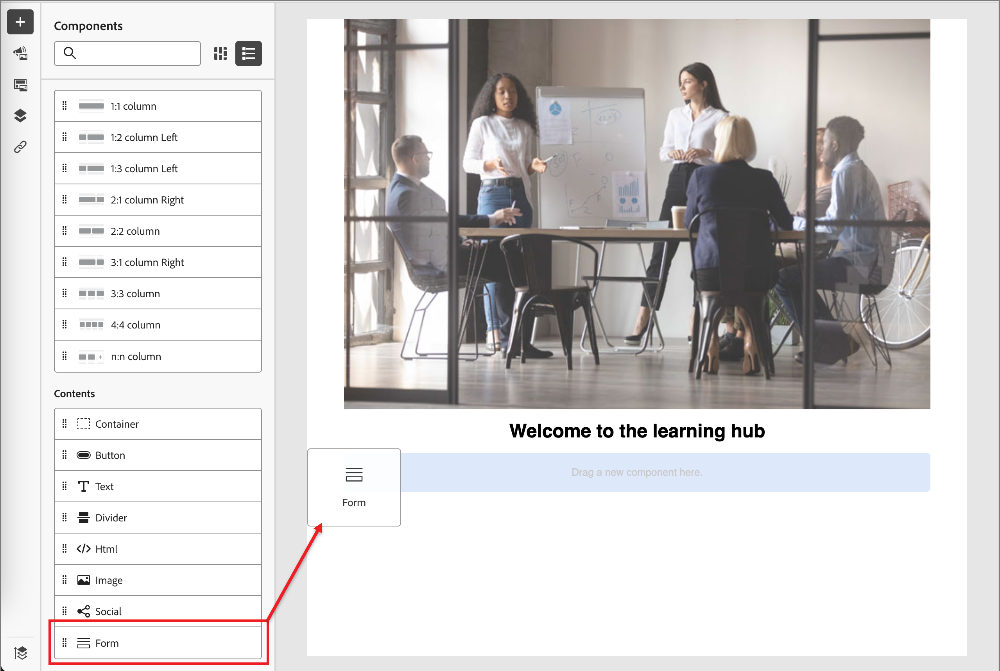

# コンテンツ作成 – フォームの追加

フォームは、Adobe Journey Optimizer B2B edition全体で複数のランディングページとランディングページテンプレートで参照できる、再利用可能なコンポーネントです。 これは、フィールドブロックと送信ボタンで構成され、事前に作成してすばやく挿入することで、ページデザインをより迅速に、より一貫性のあるものにできます。

次の例では、ページをデザインする際にフォームを追加する手順の概要を示します。

1. **[!UICONTROL 目次]** セクションの下で、**[!UICONTROL フォーム]**&#x200B;項目をドラッグして、ページデザインスペースの構造コンポーネントにドロップします。

   {width="600"}

   >[!TIP]
   >
   >フォームを追加してメール内の水平方向のレイアウト全体を占めるには、1:1列構造を追加してから、フォームをドラッグ&amp;ドロップします。

1. コンポーネントツールバーの「_フォーム_」アイコンをクリックするか、右側の「**[!UICONTROL フォームを埋め込む]**」プロパティを使用して、公開したフォームを選択します。

   {width="600"}

1. フォームのデフォルトの&#x200B;**[!UICONTROL フォローアップタイプ]**&#x200B;を上書きする場合は、ページまたはテンプレートの要件に従って設定を変更します。

   これはフォームの&#x200B;_ありがとうページ_&#x200B;としても知られており、この設定により、訪問者がフォームを送信したときに何が起こるかが決まります。

   * **[!UICONTROL ページを維持]** - フォームの送信時に訪問者を同じページに維持するには、このオプションを選択します。

   * **[!UICONTROL ランディングページ]** - フォローアップとして任意のJourney Optimizer B2B editionまたはMarketo Engage ランディングページを選択するには、このオプションを選択します。

   * **[!UICONTROL 外部URL]** – 任意のURLをフォローアップページとして指定するには、このオプションを選択します。 訪問者がフォームを送信すると、ブラウザーは指定されたURLを読み込みます。

     >[!TIP]
     >
     >フォームを使用してファイルをダウンロードする場合は、ホストされているファイルのURLを指定できます。 この設定では、送信ボタンはダウンロードボタンとして機能します。

     {width="280"}

1. デバイスの種類ごとにフォームの表示を制限する場合は、**[!UICONTROL 表示オプション]**&#x200B;設定を変更します。

   * **[!UICONTROL デスクトップデバイスでのみ表示]**
   * **[!UICONTROL モバイルデバイスでのみ表示]**
   * **[!UICONTROL すべてのデバイスに表示]** （既定値）

1. 必要に応じて、右側のパネルの「**[!UICONTROL スタイル]**」タブを選択して、ページ内のフォームマージンを設定します。
