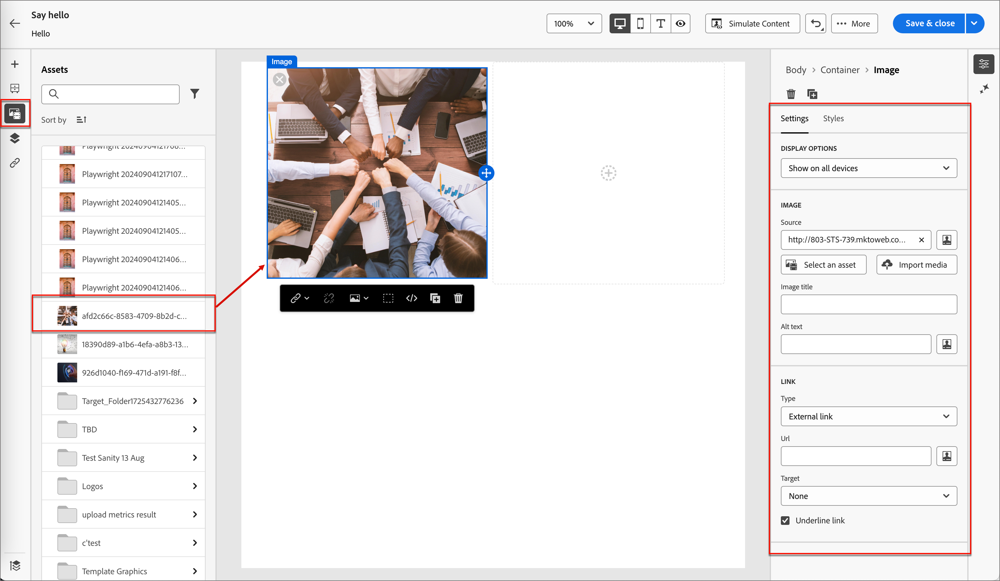
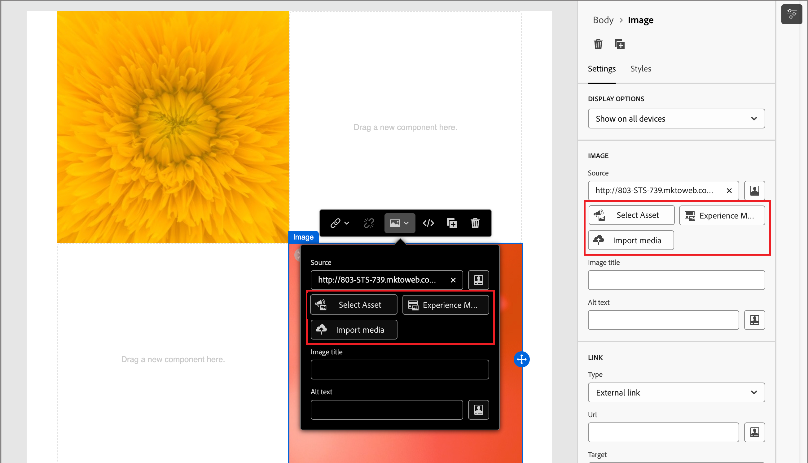

# コンテンツ作成 – アセット

ビジュアルコンテンツエディターで、左側のナビゲーションバーで&#x200B;_Assets_ （）アイコンまたは&#x200B;_Experience Manager Assets_ （）アイコンを選択します。 アセットセレクターから、ソースライブラリに保存されているアセットを直接選択できます。

>[!NOTE]
>
>Adobe Experience Manager as a Cloud Servicesでプロビジョニングされている場合、ユーザーアカウントに必要な権限が付与されている場合は、Journey Optimizer B2B editionとAdobe Experience Manager Assets as a Cloud Serviceの両方のリポジトリにアクセスできます。 これらのリポジトリは個別に存在し、同期していません。 どちらのソースからでも画像アセットを使用できます。

* 画像アセットを構造コンポーネントにドラッグ&amp;ドロップして、新しいアセットを追加します。

  {width="800" zoomable="yes"}

* 既存の画像アセットをキャンバスで選択し、画像ソースツールで「**[!UICONTROL アセットを選択]**」をクリックして置き換えます。

  {width="600" zoomable="yes"}

ソースタイプのアセットの使用について詳しくは、[&#x200B; コンテンツのオーサリングにアセットを使用](https://experienceleague.adobe.com/en/docs/journey-optimizer-b2b/user/content-management/assets/assets-overview#use-assets-for-content-authoring)を参照してください。