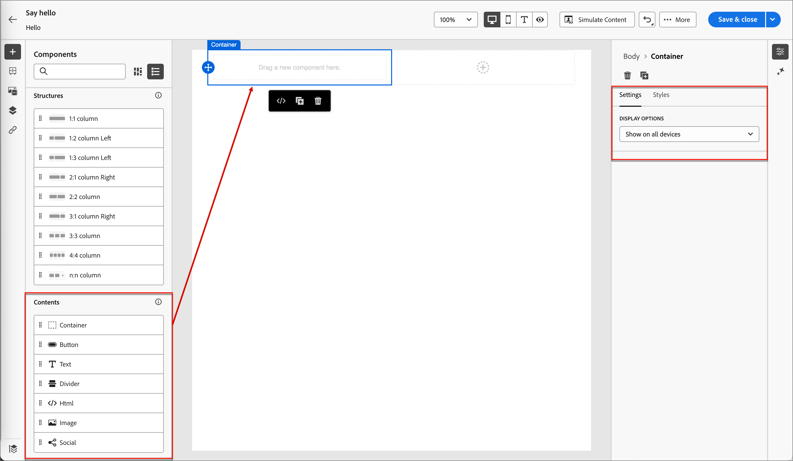

# コンテンツオーサリング – コンポーネント

1. コンテンツデザインを開始するには、**[!UICONTROL 構造]**&#x200B;からアイテムをドラッグして、キャンバスにドロップします。

   必要な数だけ&#x200B;_[!UICONTROL 構造]_&#x200B;の項目を追加し、右側のペインで各項目の設定を編集します。

   >[!TIP]
   >
   >_[!UICONTROL n:n列]_ コンポーネントを選択して、選択した列数（3 ～ 10個）を定義します。 列の下にある矢印を移動して、各列の幅を定義することもできます。

   {width="800" zoomable="yes"}

   各列のサイズは、構造コンポーネントの全幅の10%未満にすることはできません。 削除できるのは空の列のみです。

   これらのコンポーネントの使用と書式設定について詳しくは、_[構造コンポーネント &#x200B;](https://experienceleague.adobe.com/ja/docs/journey-optimizer-b2b/user/content-management/content-design/structure-components)_&#x200B;を参照してください。

1. 「**[!UICONTROL コンテンツ]**」セクションを展開し、必要な数のコンテンツコンポーネントを1つ以上の構造コンポーネントに追加します。

   {width="800" zoomable="yes"}

   * [コンテナ](https://experienceleague.adobe.com/ja/docs/journey-optimizer-b2b/user/content-management/content-design/content-components#container)
   * [ボタン](https://experienceleague.adobe.com/ja/docs/journey-optimizer-b2b/user/content-management/content-design/content-components#button)
   * [テキスト](https://experienceleague.adobe.com/ja/docs/journey-optimizer-b2b/user/content-management/content-design/content-components#text)
   * [ディバイダー](https://experienceleague.adobe.com/ja/docs/journey-optimizer-b2b/user/content-management/content-design/content-components#divider)
   * [Image](https://experienceleague.adobe.com/ja/docs/journey-optimizer-b2b/user/content-management/content-design/content-components#image)
   * [ソーシャル](https://experienceleague.adobe.com/ja/docs/journey-optimizer-b2b/user/content-management/content-design/content-components#social)
   * [&#x200B; フォーム &#x200B;](https://experienceleague.adobe.com/ja/docs/journey-optimizer-b2b/user/content-management/content-design/content-components#form) （ランディングページのみ）

1. 必要に応じて、_[!UICONTROL 設定]_&#x200B;または&#x200B;_[!UICONTROL スタイル]_ タブで、各コンポーネントに対して追加のカスタマイズを行うことができます。

   例えば、各コンポーネントのテキストスタイル、パディング、マージンを変更できます。

1. 条件付きコンテンツを追加し、条件付きルールに基づいてターゲットプロファイルにコンテンツを適応させるには、コンテンツコンポーネントを選択し、コンポーネントツールバーの「**[!UICONTROL 条件付きコンテンツを有効にする]**」アイコンをクリックします。

   詳しくは、[_条件付きコンテンツ_](https://experienceleague.adobe.com/ja/docs/journey-optimizer-b2b/user/content-management/content-design/content-components)を参照してください。
