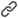

# コンテンツオーサリング – リンクトラッキング

1. 左側の _[!UICONTROL リンク]_ アイコン（）をクリックすると、追跡するコンテンツ内のすべてのリンク済み URL が表示されます。

1. 必要に応じて、_編集_ （）アイコンをクリックし、**[!UICONTROL トラッキングタイプ]** または **[!UICONTROL ラベル]** を変更します。

   リンクに _タグ_ を追加することもできます。

{width="500"}
