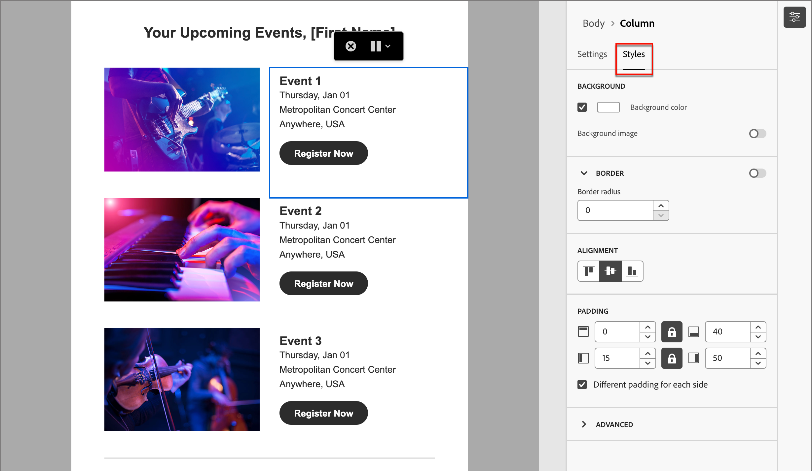

# コンテンツ作成 – ナビゲーション

ビジュアルデザイン空間でコンテンツを操作する際は、ナビゲーションツリーを使用して、コンポーネント、列、コンテンツ要素にアクセスできます。 左側の&#x200B;_[!UICONTROL ナビゲーションツリー]_ アイコン（）をクリックすると、ツリーが表示されます。

{width="800" zoomable="yes"}

次の例では、構造コンポーネント内のパディングと垂直方向の整列を列で調整する手順の概要を示します。

1. 構造コンポーネントの列をキャンバスで直接選択するか、左側に表示されている&#x200B;_ナビゲーションツリー_&#x200B;を使用して選択します。

1. 列ツールバーで、_[!UICONTROL 列を選択]_ ツールをクリックし、編集するツールを選択します。

   構造ツリーから選択することもできます。 その列の編集可能なパラメーターは、右側の&#x200B;_[!UICONTROL 設定]_ タブと&#x200B;_[!UICONTROL スタイル]_ タブに表示されます。

   ビジュアルデザイナーに表示される{width="800" zoomable="yes"}

1. 列のプロパティを編集するには、右側の「_[!UICONTROL スタイル]_」タブをクリックし、必要に応じて変更します。

   * **[!UICONTROL 背景]**&#x200B;の場合、必要に応じて背景色を変更します。

     透明な背景の場合は、チェックボックスをオフにします。 **[!UICONTROL 背景画像]**&#x200B;設定を有効にして、単色の代わりに画像を背景として使用します。

   * **[!UICONTROL 線形]**&#x200B;の場合、_上位_、_中央_、または&#x200B;_下位_ アイコンを選択します。
   * **[!UICONTROL パディング]**&#x200B;の場合、すべての側面のパディングを定義します。

     パディングを微調整する場合は、「**[!UICONTROL 各辺に異なるパディングを使用]**」を選択します。 同期を解除するには、_ロック_ アイコンをクリックします。

   * **[!UICONTROL 詳細]** セクションを展開して、列のインラインスタイルを定義します。

   {width="700" zoomable="yes"}

1. 必要に応じて、これらの手順を繰り返して、コンポーネント内の他の列の整列とパディングを調整します。

1. 変更を保存します。
