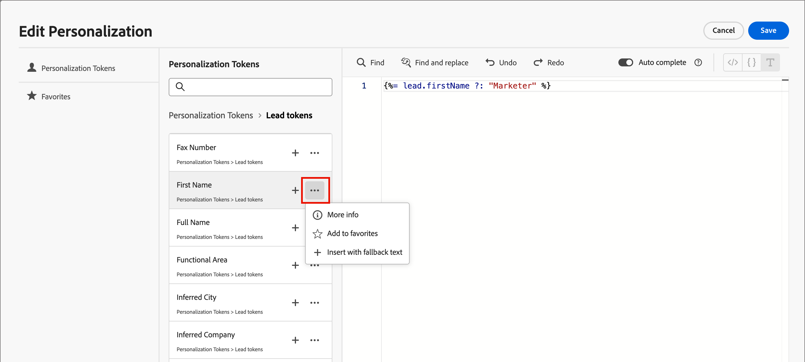

# コンテンツオーサリング – パーソナライゼーション

Journey Optimizer B2B editionでは、パーソナライズされたコンテンツを中括弧 `{{}}` で囲んだ式を作成できる、インラインのシンプルな構文を使用します。 同じコンテンツまたはフィールドに、制限なく複数の式を追加できます。

例えば、パーソナライゼーション式を `Hello {{lead.firstName}} {{lead.lastName}}` として追加できます。 Journey Optimizer B2B editionは、コンテンツの処理時に、式をExperience Platform データベースに含まれるデータで置き換えます。 最初の例は、_Hello John Doe_ となります。

Journey Optimizer B2B editionでのパーソナライゼーションツールの使用について詳しくは、[ コンテンツのパーソナライゼーション ](../user/content/personalization.md) を参照してください。

>[!NOTE]
>
>Journey Optimizer B2B editionは、一貫したエクスペリエンスを実現するために他のAdobe Experience Platform アプリケーションと一致させるために、メール内のパーソナライゼーショントークンの _キャメルケース_ 構文に従います。 このトークン形式は、[Handlebars テンプレート言語 ](https://handlebarsjs.com/guide/#what-is-handlebars){target="_blank"} と完全に互換性があります。 この変更の前に追加されたトークンは、自動的に更新されます。

次の例では、人物トークンとシステムトークンを使用してコンテンツをパーソナライズする手順の概要を説明します。 これには、[ シンプルなアーキテクチャ ](../user/simplified-architecture.md) でプロビジョニングされたJourney Optimizer B2B edition環境で使用できる変更内容が反映されています。

1. テキストコンポーネントを選択し、ツールバーの _パーソナライゼーションを追加_ （）アイコンをクリックします。

   {width="600"}

   これにより、「_Personalizationを編集_ ダイアログが開きます。

1. トークンの横にあるプラス（**+**）記号をクリックして、トークンを追加します。

   フォールバック（リードでそのフィールドが使用できない場合に表示されるデフォルトのテキスト）を含むトークンを追加したい場合は、_詳細_ アイコン（**...**）をクリックして **[!UICONTROL フォールバックテキストで挿入]** を選択します。

   {width="700" zoomable="yes"}

1. 含める追加のトークンやその他の静的テキストを追加します。

1. 「**[!UICONTROL 保存]**」をクリックします。

   パーソナライゼーションスクリプティングがビジュアルデザインスペースに表示されます。 必要に応じて、テンプレートを選択して変更を加えることができます。

   {width="600"}
