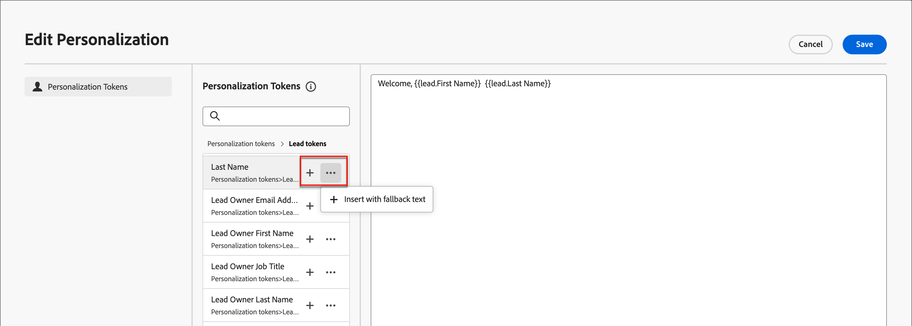

# コンテンツオーサリング – パーソナライゼーション

Journey Optimizer B2B Edition では、インラインのシンプルな構文を使用します。この構文を使用すると、パーソナライズされたコンテンツを二重の中括弧 `{}` で囲んだ式を作成することができます。 同じコンテンツまたはフィールドに、制限なく複数の式を追加できます。

例:

* `Hello {{profile.person.name.firstName}} {{profile.person.name.lastName}}`

* `Hello {{profile.person.name.fullName}}`

Journey Optimizer B2B Edition は、メッセージ（メールおよび SMS）を処理する際に、式をExperience Platformデータベースに含まれるデータに置き換えます。 最初の例は、_Hello John Doe_ となります。

次の例では、リード/アカウント属性とシステムトークンを使用してコンテンツをパーソナライズする手順の概要を説明します。

1. テキストコンポーネントを選択し、ツールバーの _パーソナライゼーションを追加_ アイコンをクリックします。

   {width="600"}

   これにより、「_Personalizationを編集_ ダイアログが開きます。

1. **+** または **...** をクリックして、空白スペースにトークンを追加します。

   {width="700" zoomable="yes"}

1. 「**[!UICONTROL 保存]**」をクリックします。
