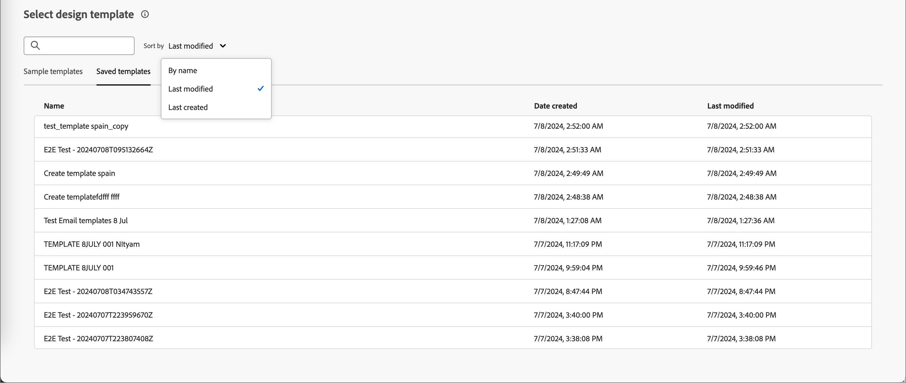
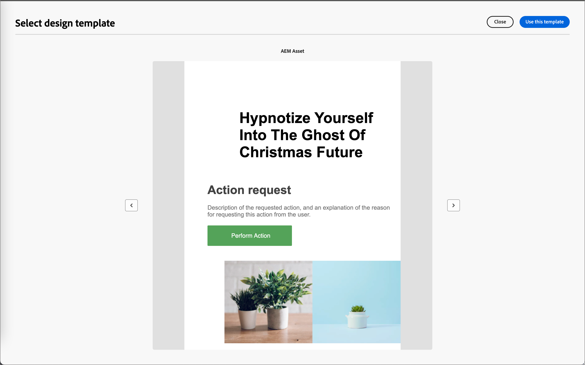

# コンテンツのオーサリング – メールテンプレートの選択

次の中から選択できます。

* **サンプルテンプレート**. Journey Optimizerのインターフェイスには、20種類の電子メールテンプレートが用意されています。

* **保存済みテンプレート**. _[!UICONTROL テンプレート]_ メニューを使用してゼロから作成するか、_[!UICONTROL コンテンツテンプレートとして保存]_ オプションを使用してジャーニーのメールから保存した、保存されたカスタムテンプレートを使用します。

「_[!UICONTROL デザインテンプレートを選択]_」セクションを使用して、テンプレートからコンテンツの作成を開始します。 サンプルテンプレートまたはJourney Optimizer B2B edition インスタンスから保存したカスタムメールテンプレートを使用できます。

>[!BEGINTABS]

>[!TAB 保存されたテンプレート ]

_テンプレートをデザイン_ ホームページでは、「_サンプルテンプレート_」タブがデフォルトで選択されています。 カスタムテンプレートを使用するには、「**[!UICONTROL 保存したテンプレート]**」タブを選択します。

現在のサンドボックスで作成されたすべてのメールテンプレートのリストが表示されます。 _[!UICONTROL 名前]_、_[!UICONTROL 最終変更日]_、_[!UICONTROL 最終作成日]_&#x200B;で並べ替えることができます。

{width="800" zoomable="yes"}

リストから必要なテンプレートを選択します。

選択後、テンプレートのプレビューが表示されます。 プレビューモードでは、右向き矢印と左向き矢印を使用して、1つのカテゴリのすべてのテンプレート（選択内容に応じてサンプルまたは保存済み）間を移動できます。

{width="800" zoomable="yes"}

表示が使用する内容と一致したら、プレビューウィンドウの右上にある「**[!UICONTROL このテンプレートを使用]**」をクリックします。

このアクションにより、コンテンツがビジュアルコンテンツデザイナーにコピーされ、必要に応じてコンテンツを編集できます。

>[!TAB  サンプルテンプレート ]

Adobe Journey Optimizer B2B editionでは、電子メールや電子メールテンプレートの作成に使用できる&#x200B;_標準_&#x200B;の電子メールテンプレートを提供しています。

{width="800" zoomable="yes"}

>[!ENDTABS]