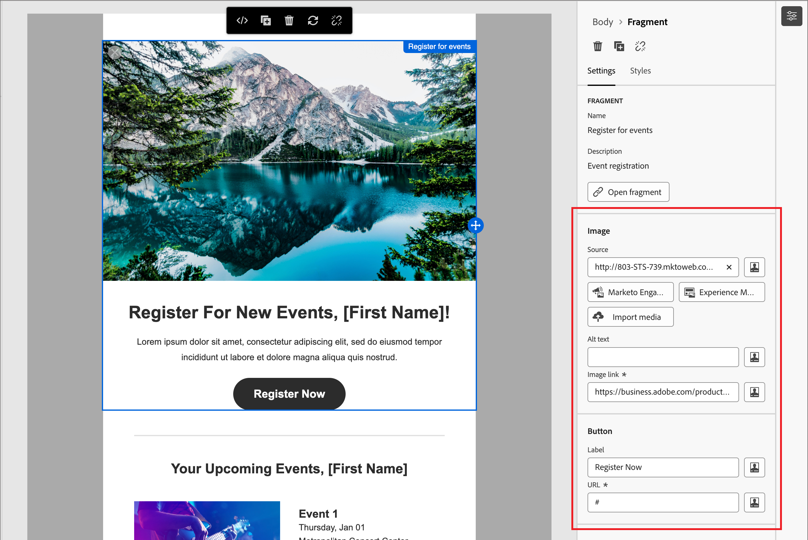

# コンテンツのオーサリング – ビジュアルフラグメントを使用します

ビジュアルフラグメントは、Adobe Journey Optimizer B2B edition全体で複数のコンテンツアセットで参照できる、再利用可能なデザインコンポーネントです。 通常は、コンテンツのブロックを作成し、すばやく挿入することで、オーサリングをより迅速に、より一貫性のあるものにできます。

次の例では、コンテンツのオーサリング時にフラグメントを追加する手順の概要を示します。

1. フラグメントのリストを開くには、「_フラグメント_」アイコン（）を選択します。

   次の操作が可能です。

   * リストの並べ替え。
   * リストを参照、検索、またはフィルターします。
   * サムネール表示とリスト表示を切り替えます。
   * 最近作成したフラグメントを反映するには、リストを更新します。

   {width="700" zoomable="yes"}

1. 任意のフラグメントを構造コンポーネントにドラッグ&amp;ドロップします。

   エディターは、メール構造のセクション/エレメント内でフラグメントをレンダリングします。

   >[!TIP]
   >
   >フラグメントを追加して、メール内の水平方向のレイアウト全体を占めるようにするには、1:1列構造を追加してから、フラグメントをドラッグ&amp;ドロップします。

   フラグメントのコンテンツは、構造内で動的に更新され、コンテンツ内でコンテンツがどのように表示されるかを示します。

>[!BEGINSHADEBOX]

**カスタマイズ可能なフラグメントの編集可能なフィールド**

ビジュアルフラグメントには、カスタマイズ可能な編集可能なフィールドを含めることができます。 カスタムフィールドを使用すると、フラグメントをコンテンツに組み込む際にパラメーターを変更し、元のフラグメントに影響を与えることなく、カスタマイズされたエクスペリエンスを作成できます。 フラグメント作成者は、テキスト、画像、ボタンのコンポーネントを[ カスタマイズするためにフラグメントをデザインできます](../user/content/fragment-authoring.md#enable-fragment-customization)。 含まれているフラグメントに編集可能なフィールドを含むコンポーネントが含まれている場合は、デフォルト値を変更してコンテンツに合わせてカスタマイズできます。

1. フラグメントコンポーネントを選択します。

   右側に表示される設定には、デフォルト値を含むフィールドと編集可能フィールドがあります。

   {width="700" zoomable="yes"}

1. 必要に応じて、編集可能なフィールドを変更します。

>[!ENDSHADEBOX]
