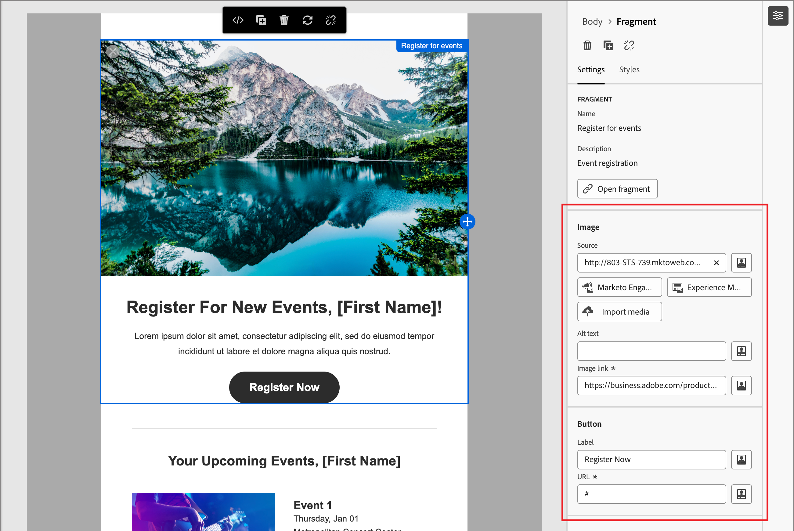

# コンテンツオーサリング – ビジュアルフラグメントの使用

ビジュアルフラグメントは、Adobe Journey Optimizer B2B edition全体で複数のコンテンツアセットから参照できる再利用可能なデザインコンポーネントです。 通常は、オーサリングをより迅速かつ一貫性のあるものにするために、事前に作成してすばやく挿入できるコンテンツのブロックです。

次の例では、コンテンツの作成時にフラグメントを追加する手順の概要を説明します。

1. フラグメントリストを開くには、_フラグメント_ アイコン（）を選択します。

   次の操作が可能です。

   * リストを並べ替えます。
   * リストを参照、検索またはフィルタリングします。
   * サムネール表示とリスト表示を切り替えます。
   * 最近作成したフラグメントが反映されるように、リストを更新します。

   {width="700" zoomable="yes"}

1. 任意のフラグメントを構造コンポーネントにドラッグ&amp;ドロップします。

   エディターは、メール構造のセクション/要素内でフラグメントをレンダリングします。

   >[!TIP]
   >
   >メール内の水平レイアウト全体を占めるようにフラグメントを追加するには、1:1 列構造を追加してから、フラグメントをドラッグ&amp;ドロップします。

   フラグメントのコンテンツは構造内で動的に更新され、コンテンツ内でのコンテンツの表示方法が表示されます。

>[!BEGINSHADEBOX]

**編集可能フィールド**

ビジュアルフラグメントには、カスタマイズ可能な編集可能フィールドを含めることができます。 カスタムフィールドを使用すると、フラグメントをコンテンツに組み込む際にパラメーターを変更し、元のフラグメントに影響を与えることなくカスタマイズされたエクスペリエンスを作成できます。 含まれるフラグメントに編集可能なフィールドを持つコンポーネントが含まれている場合は、デフォルト値を変更できます。

1. フラグメントコンポーネントを選択します。

   右側に表示される設定には、デフォルト値を持つ編集可能なフィールドと編集可能なフィールドが含まれます。

   {width="700" zoomable="yes"}

1. 必要に応じて、編集可能フィールドを変更します。

>[!ENDSHADEBOX]
