# スニペット

<!-- Content authoring steps for reuse -->

## インテントデータ設定 {#intent-data-note}

>[!NOTE]
>
>インテントデータは、Journey Optimizer B2B edition インスタンス用に設定されている場合に含まれます。 また、購買グループを作成した1つ以上の公開されたジャーニー&#x200B;**または**&#x200B;が必要です。 インテント検出モデルと、キーワード、製品、およびカテゴリを送信する方法について詳しくは、[ インテント データ ](../user/admin/intent-data.md)を参照してください。

## AEM Assetsのライセンスノート {#aem-assets-licensing-note}

>[!NOTE]
>
>AEM Assets as a Cloud ServiceおよびDynamic Media ライセンスのライセンスは、統合の前提条件です。 [Dynamic Media withOpen API](https://experienceleague.adobe.com/ja/docs/experience-manager-cloud-service/content/assets/dynamicmedia/dynamic-media-open-apis/dynamic-media-open-apis-overview){target="_blank"}が有効になっていることを確認します。 統合は、_配信層_&#x200B;のリポジトリに制限されています。 _オーサー層_&#x200B;を使用し、それを変換する場合は、Adobe Experience Manager サポートにお問い合わせください。 
>ビジュアルコンテンツをデザインする際に、契約と設定に応じて、Adobe Experience Manager Assets as a Cloud ServiceにAdobe Journey Optimizer B2B editionから直接アクセスできます。

## コンテンツオーサリング – コンポーネント – 構造ステップ {#structures-step}

1. コンテンツデザインを開始するには、**[!UICONTROL 構造]**&#x200B;からアイテムをドラッグして、キャンバスにドロップします。

   必要な数だけ&#x200B;_[!UICONTROL 構造]_&#x200B;の項目を追加し、右側のペインで各項目の設定を編集します。

   >[!TIP]
   >
   >_[!UICONTROL n:n列]_ コンポーネントを選択して、選択した列数（3 ～ 10個）を定義します。 列の下にある矢印を移動して、各列の幅を定義することもできます。

   {width="800" zoomable="yes"}

   各列のサイズは、構造コンポーネントの全幅の10%未満にすることはできません。 削除できるのは空の列のみです。

## コンテンツオーサリング – コンポーネント – コンテンツステップ {#contents-step}

1. 「**[!UICONTROL コンテンツ]**」セクションを展開し、必要な数の要素を 1 つ以上の構造コンポーネントに追加します。

   {width="800" zoomable="yes"}

   <!--
   reference to the contents elements
   -->

## コンテンツオーサリング – コンポーネント – 設定ステップ {#settings-step}

1. 必要に応じて、_[!UICONTROL 設定]_&#x200B;または&#x200B;_[!UICONTROL スタイル]_ タブで、各コンポーネントに対して追加のカスタマイズを行うことができます。

   例えば、各コンポーネントのテキストスタイル、パディング、マージンを変更できます。

## コンテンツオーサリング – アセットステップ {#assets-step}

1. _アセット_ ピッカーから、アセットライブラリに保存されているアセットを直接選択できます。

   アセットを含むフォルダーをダブルクリックします。 項目を構造コンポーネントにドラッグ&amp;ドロップします。

   ソースタイプのアセットの使用について詳しくは、[ コンテンツにアセットを追加](../user/content/assets-overview.md#use-assets-for-content-authoring)を参照してください。

   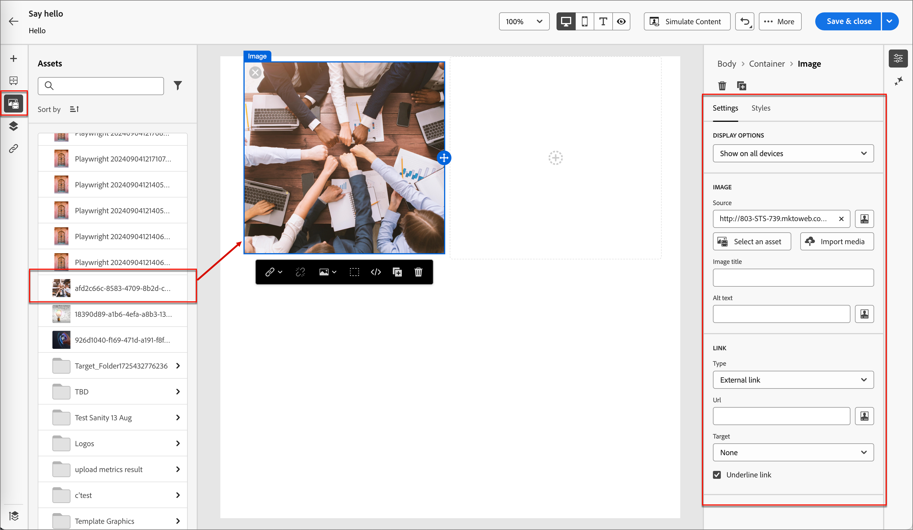{width="800" zoomable="yes"}

## コンテンツオーサリング – パーソナライゼーションステップ {#personalization-step}

1. パーソナライゼーションフィールドを挿入して、プロファイル属性、オーディエンスメンバーシップ、コンテキスト属性などをもとに、コンテンツをカスタマイズします。

## コンテンツのオーサリング – 条件コンテンツステップの有効化 {#dynamic-content-step}

1. 「**[!UICONTROL 条件付きコンテンツを有効にする]**」をクリックし、動的コンテンツを追加して、条件付きルールに基づいてコンテンツをターゲットプロファイルに適応させます。

## コンテンツオーサリング – リンクトラッキングステップ {#links-tracking-step}

1. 左側のペインから「**[!UICONTROL リンク]**」タブを選択すると、追跡されているコンテンツのすべてのURLが表示されます。

   _トラッキングタイプ_&#x200B;または&#x200B;_ラベル_&#x200B;を変更し、必要に応じてタグを追加できます。

## コンテンツコンポーネント – 高度なスタイル {#styles-advanced}

値を含むCSSに準拠する属性を追加で適用するには、**[!UICONTROL 詳細]** スタイル設定を使用します。 既存の属性の値を変更したり、新しい属性を追加したりできます。 スタイル設定は、親子コンポーネント（要素）のCSS継承モデルを使用してコンポーネントに適用されます。

表示される属性には、コンポーネントに対して現在定義されているスタイルが反映されます。 値は、[CSS定義](https://www.w3schools.com/CSSref/index.php){target="_blank"}に従って変更できます。 _追加_ （**+**）アイコンをクリックして、コンポーネントの新しいスタイル属性を追加します。

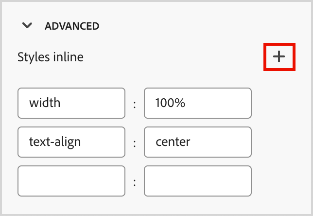{width="250"}

## コンテンツコンポーネント – 線形スタイルの水平 {#styles-alignment-h}

「**[!UICONTROL 線形]**」セクションを展開し、使用する水平方向の整列（左、中央、右）を選択します。 このスタイルは、標準の`text-align` CSS スタイルに変換され、コンポーネントが含まれるコンポーネント内でどのように配置されるかに影響します。

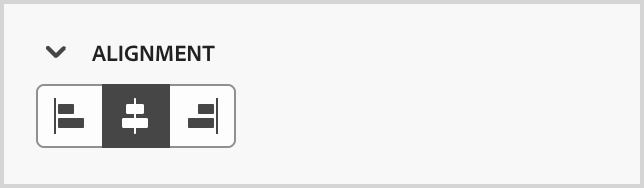{width="250"}

## コンテンツコンポーネント – 縦方向の整列スタイル {#styles-alignment-v}

「**[!UICONTROL 線形]**」セクションを展開し、使用する垂直方向の整列（上、中、下）を選択します。 このスタイルは、標準の`vertical-align` CSS スタイルに変換され、含まれるコンポーネント内での配置に影響します。

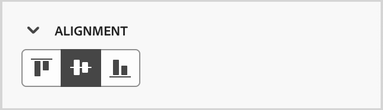{width="250"}

## コンテンツコンポーネント – 水平および垂直の整列スタイル {#styles-alignment-h-v}

「**[!UICONTROL 線形]**」セクションを展開し、使用する水平方向と垂直方向の整列を選択します。 整列スタイルは、HTML コンポーネントを含むコンポーネント（構造またはコンテナ）内で配置する方法に影響します。

水平方向の整列は標準の`text-align` CSS スタイルに変換され、左、中央、または右から選択できます。 垂直方向の整列は標準の`vertical-align` CSS スタイルに変換され、上、中、下から選択できます。

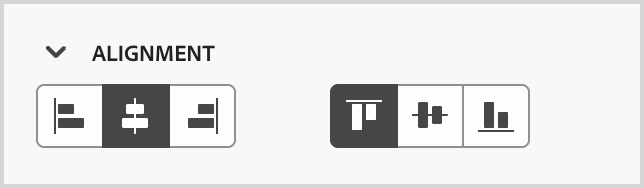{width="300"}

## コンテンツコンポーネント – 背景スタイル {#styles-background}

右側のパネルで「_[!UICONTROL スタイル]_」タブを選択した状態で、**[!UICONTROL 背景]** セクションを使用して、コンポーネントの背景色を定義します。

チェックボックスを選択し、カラーの正方形をクリックして、ピッカーからカラーを選択します。 RGB、HSL、HSB、または16進数値を入力すると、カラーを選択できます。 または、カラースライダーとカラーフィールドを使用してカラーを選択することもできます。

{width="300"}

## コンテンツコンポーネント – 境界線スタイル {#styles-border}

1. 「_[!UICONTROL スタイル]_」タブが選択された右側のパネルで、**[!UICONTROL 境界線]** セクションを展開し、コンポーネントの境界線を表示するオプションを設定します。

1. 境界線の表示オプションを有効にするには、切り替えスイッチを右に動かし、デザイン基準に従って設定します。

   * **[!UICONTROL 境界線カラー]**&#x200B;を設定するには、チェックボックスを選択し、カラーの正方形をクリックしてピッカーからカラーを選択します。 RGB、HSL、HSB、または16進数値を入力すると、カラーを選択できます。 または、カラースライダーとカラーフィールドを使用してカラーを選択することもできます。

   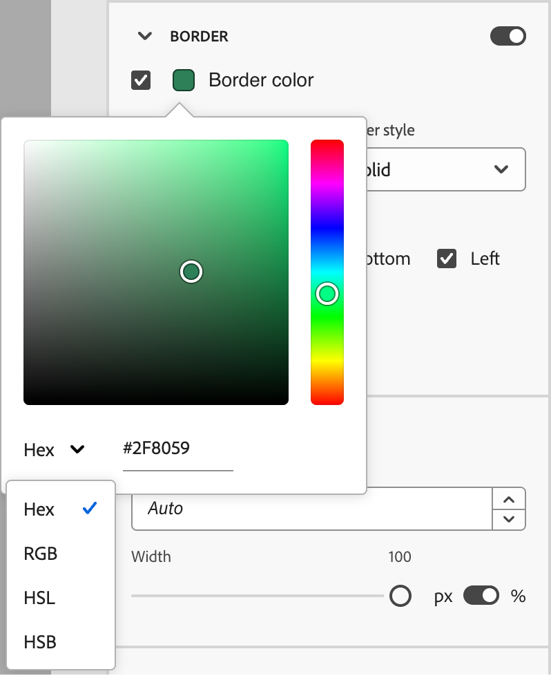{width="300"}

   * **[!UICONTROL 境界線サイズ]** （線幅）を設定するには、上下の矢印アイコンをクリックして、ピクセル数を増減します。

   * **[!UICONTROL 境界線スタイル]**&#x200B;を設定するには、標準CSS `border-style`値のリストから値を選択します。

   * 境界線が表示される場所を決めるには、各&#x200B;**[!UICONTROL 境界線の位置]** チェックボックスを選択します。

   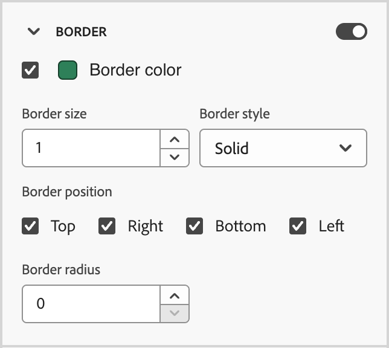{width="250"}

1. **[!UICONTROL 境界線の半径]**&#x200B;に対して、角に対する曲線に応じて数値を設定します。

   値が0 （デフォルト）の場合、角は四角形になります。

## コンテンツコンポーネント – マージンスタイル {#styles-margin}

「_[!UICONTROL スタイル]_」タブが選択された右側のパネルで、**[!UICONTROL マージン]** セクションを展開し、構造コンポーネント内のマージン間隔のオプションを設定します。 このスタイルは、コンポーネントの境界線の外側のスペースに制御するCSS `margin` パラメーターを複製し、他のコンポーネントから分離します。 コンポーネントの周囲にギャップを作成して、コンポーネントの位置と周囲のコンテンツのレイアウトに影響を与えます。

デザインのニーズに応じて、余白の値をピクセル単位で設定します。 コンポーネントのすべての辺、上端、左右、または各辺のマージンを個別に設定できます。

* **すべての辺** – すべての辺に適用する値を1つ設定するには、**[!UICONTROL 各辺の異なる余白]** チェックボックスをオフにします。 上向き矢印アイコンと下向き矢印アイコンをクリックして、ピクセル数を増減します。

  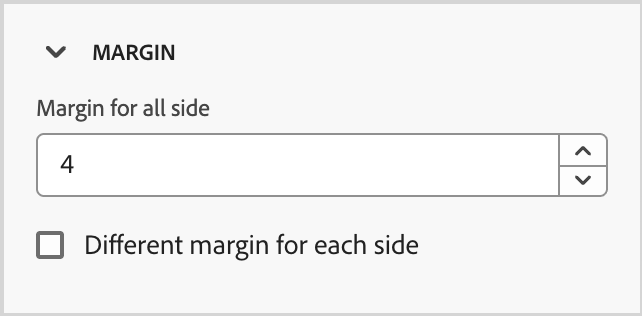{width="250"}

* **Top-bottom** – 上下の余白を同じ値に設定するには、上下の設定の間に&#x200B;_ロック_ アイコンを設定します。 上下の矢印アイコンをクリックして、ピクセル数を増減します。

* **左から右** – 左右の余白を同じ値に設定するには、左右の設定の間に&#x200B;_ロック_ アイコンを設定します。 上下の矢印アイコンをクリックして、ピクセル数を増減します。

  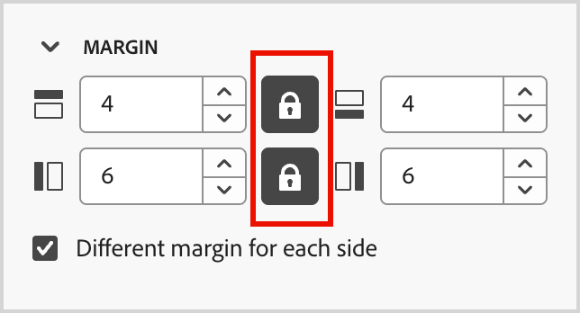{width="250"}

* **独立** – 各余白を独立した値に設定するには、上下の設定と左右の設定の間に&#x200B;_ロック解除_ アイコンを設定します。 各設定で、上向き矢印アイコンと下向き矢印アイコンをクリックして、ピクセル数を増減します。

  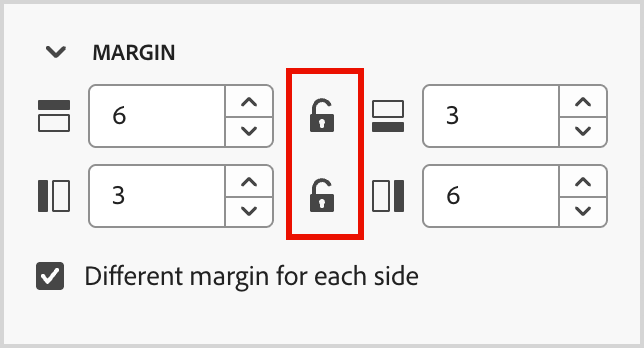{width="250"}

## コンテンツコンポーネント – パディングスタイル {#styles-padding}

「_[!UICONTROL スタイル]_」タブが選択された右側のパネルで、**[!UICONTROL パディング]** セクションを展開し、構造コンポーネント内のパディングのオプションを設定します。 このスタイルは、コンポーネントのコンテンツと境界線の間のスペースであるCSS `padding` パラメーターを複製します。 パディングには、コンテンツとコンポーネントの境界線の間の距離を制御するために使用できる内部間隔が用意されています。

デザインのニーズに応じて、パディング値をピクセル単位で設定します。 コンポーネントのすべての側面、上部下部、左右側面、または各側面に対して、それぞれ個別にパディングを設定できます。

* **すべての辺** – すべての辺に適用する1つの値を設定するには、**[!UICONTROL 各辺に対する異なるパディング]** チェックボックスをオフにします。 上向き矢印アイコンと下向き矢印アイコンをクリックして、ピクセル数を増減します。

  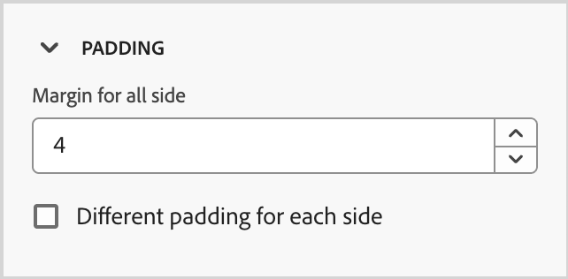{width="250"}

* **Top-bottom** – 上下のパディングを同じ値に設定するには、上下の設定の間に&#x200B;_ロック_ アイコンを設定します。 上下の矢印アイコンをクリックして、ピクセル数を増減します。

* **Left-right** – 左右のパディングを同じ値に設定するには、左右の設定の間に&#x200B;_ロック_ アイコンを設定します。 上下の矢印アイコンをクリックして、ピクセル数を増減します。

  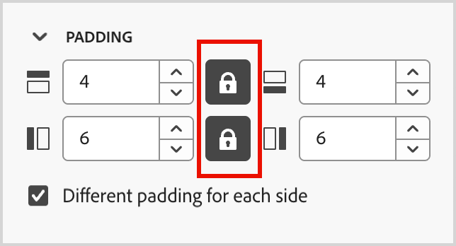{width="250"}

* **独立** – 各辺のパディングを独立した値に設定するには、上下の設定と左右の設定の間に&#x200B;_ロック解除_ アイコンを設定します。 各設定で、上向き矢印アイコンと下向き矢印アイコンをクリックして、ピクセル数を増減します。

  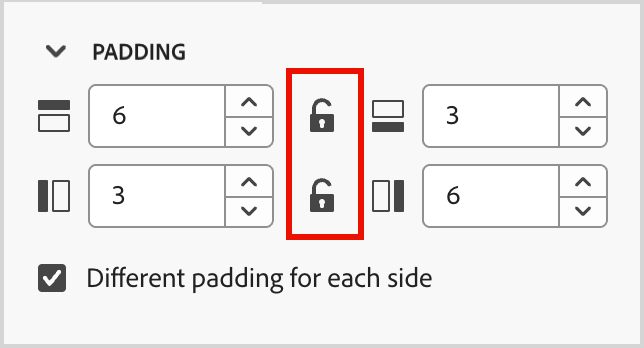{width="250"}

## コンテンツコンポーネント – サイズスタイル {#styles-size}

「_[!UICONTROL スタイル]_」タブが選択された右側のパネルで、**[!UICONTROL サイズ]** セクションを展開し、コンポーネントの高さと幅のオプションを設定します。

* **[!UICONTROL 高さ]** – 上下の矢印アイコンをクリックして、ピクセル数を増減します。 空の値（Auto）がデフォルトで、要素の高さが要素の内容に応じてサイズ調整されます。

* **[!UICONTROL 幅]** - トグルを使用して、幅をピクセルまたはパーセント単位で設定します。

   * パーセンテージ幅の場合は、スライダーを使用してパーセンテージ値を設定します。 パーセンテージは、含まれるブロックのコンテンツボックスに基づいてエレメントのサイズを決定します。このボックスでは、パディングと境界線は除外されます。 例えば、値が50の場合、要素の幅は、含まれるブロックコンテンツの幅の50%に設定されます。

     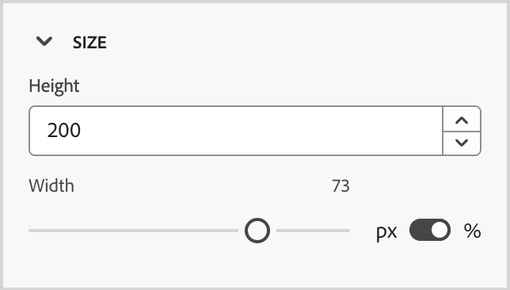{width="250"}

   * ピクセルベースの幅の場合は、上下の矢印アイコンをクリックして、ピクセル数を増減します。 空の値（Auto）がデフォルトで、要素の幅を内容に応じてサイズ調整します。

     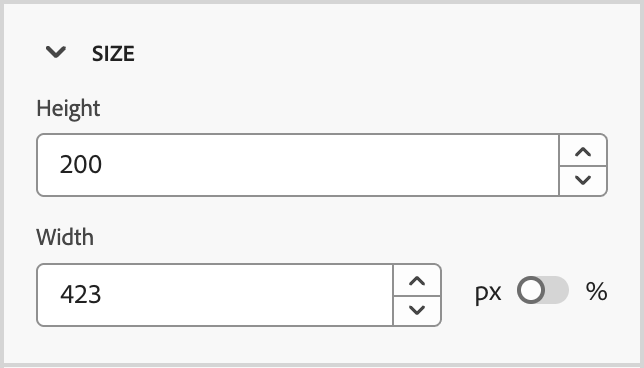{width="250"}

## コンテンツコンポーネント – テキストスタイル {#styles-text}

「_[!UICONTROL スタイル]_」タブが選択された右側のパネルで、**[!UICONTROL テキスト]** セクションを展開し、コンポーネントテキストスタイルのオプションを設定します。

* **[!UICONTROL フォントファミリー]** - コンポーネント内のテキストのフォントファミリーを選択するには、下向き矢印アイコンをクリックします。

* **[!UICONTROL フォントサイズ]** - フォントサイズを増減するか、値を入力するには、上下の矢印アイコンをクリックします。 入力された値には、小数を使用できます。

* **[!UICONTROL 線の高さ]** – 上下の矢印アイコンをクリックして、線の高さを増減するか、値を入力します。 入力された値には、小数を使用できます。

  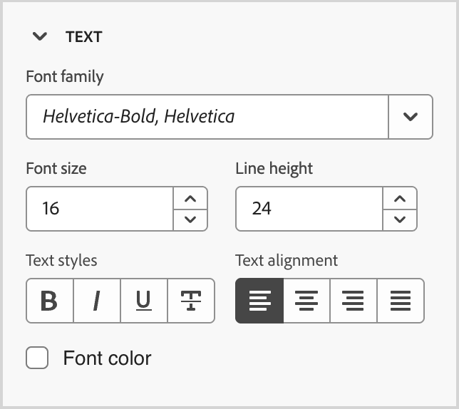{width="250"}

* **[!UICONTROL テキストスタイル]** - テキストスタイルのアイコン（_太字_、_斜体_、_下線付き_、または&#x200B;_取り消し線_）を選択します。

* **[!UICONTROL テキストの整列]** – 横組みテキストの整列のアイコンを選択します：_左_、_中央_、_右_、または&#x200B;_正当化_。

* **[!UICONTROL フォントカラー]** - カラーの正方形をクリックして、ピッカーからフォントカラーを選択します。 RGB、HSL、HSB、または16進数値を入力すると、カラーを選択できます。 または、カラースライダーとカラーフィールドを使用してカラーを選択することもできます。

  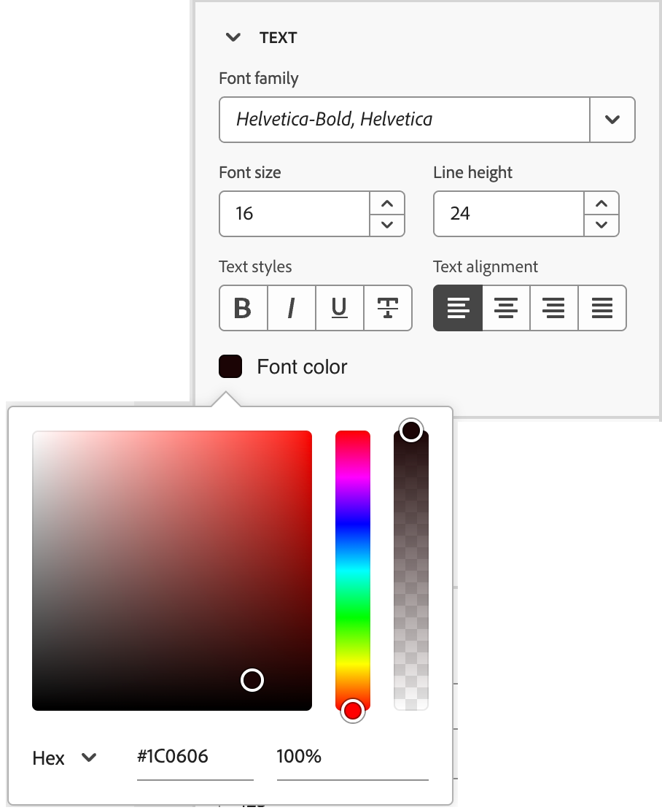{width="300"}

## Content - image selection - Marketo DAM {#me-dam}

Journey Optimizer B2B edition ライブラリまたは接続されたMarket Engage インスタンスから画像アセットを参照して選択するには、このタイプを選択します。

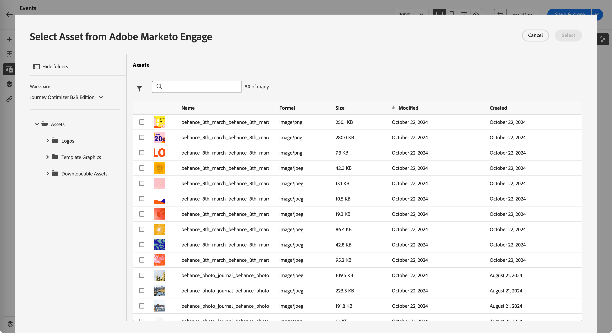{width="700" zoomable="yes"}

ダイアログから、選択したリポジトリから画像を選択できます。 「**[!UICONTROL 選択]**」をクリックして、アセットを追加します。

必要なアセットを見つけるのに役立つツールがあります。

* 左上の&#x200B;_フィルター_ アイコンをクリックして、条件に従って表示される項目をフィルタリングします。

* 「_検索_」フィールドにテキストを入力して、アセット名に一致する表示アイテムをフィルタリングします。

  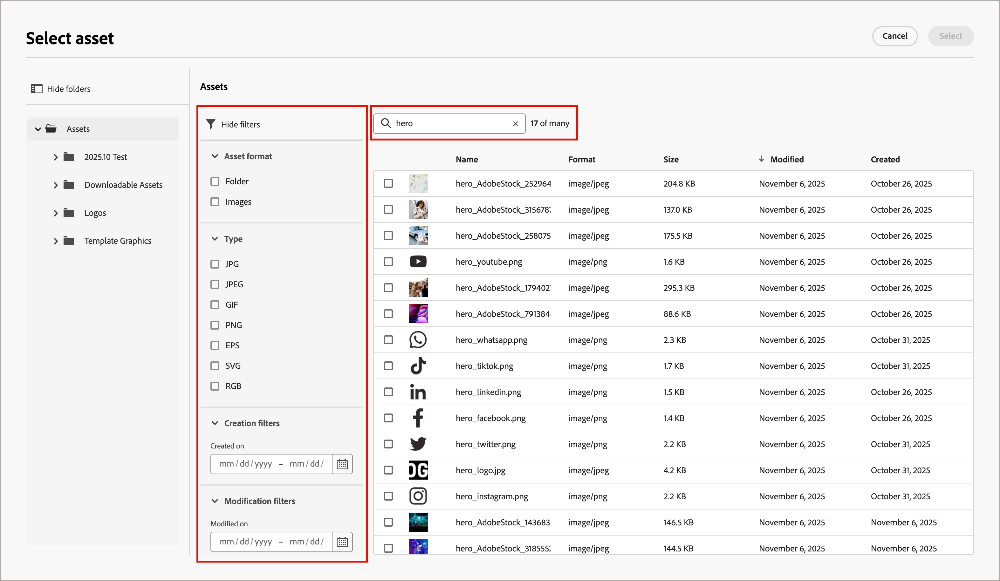{width="700" zoomable="yes"}

## Content - image selection - AEM Assets {#aem-assets-dam}

このタイプを選択すると、[設定されたExperience Manager Assets リポジトリ ](../user/admin/configure-aem-repositories.md)から画像アセットを参照して選択できます。

「_[!UICONTROL Assetsを選択]_」ダイアログで、使用可能なツールを使用して画像を選択し、必要なアセットを見つけて「**[!UICONTROL 選択]**」をクリックします。

* 右上の&#x200B;**[!UICONTROL リポジトリ]**&#x200B;を変更します。

* 右上の&#x200B;**[!UICONTROL アセットの管理]**&#x200B;をクリックして、別のブラウザータブでAssets リポジトリを開き、AEM Assets管理ツールを使用します。

* 右上の&#x200B;_表示タイプ_ セレクターをクリックして、表示を&#x200B;**[!UICONTROL リストビュー]**、**[!UICONTROL グリッドビュー]**、**[!UICONTROL ギャラリービュー]**、または&#x200B;**[!UICONTROL ウォーターフォールビュー]**&#x200B;に変更します。

* 「_並べ替え順序_」アイコンをクリックして、並べ替え順序を昇順と降順で変更します。

  {width="700" zoomable="yes"}

* 「**[!UICONTROL 並べ替え]**」メニューの矢印をクリックして、並べ替え条件を&#x200B;**[!UICONTROL 名前]**、**[!UICONTROL サイズ]**、または&#x200B;**[!UICONTROL 変更]**&#x200B;に変更します。

* 左上の&#x200B;_フィルター_ アイコンをクリックして、条件に従って表示される項目をフィルタリングします。

* 「_検索_」フィールドにテキストを入力して、アセット名に一致する表示アイテムをフィルタリングします。

  {width="700" zoomable="yes"}

## コンテンツ – 画像のアップロード {#image-upload}

このタイプを選択すると、システムからファイルが選択され、Journey Optimizer B2B edition アセットライブラリに読み込まれます。

_[!UICONTROL 画像をアップロード]_ ダイアログで、システムからファイルをファイル ボックスにドラッグ&amp;ドロップします。 最大ファイルサイズは100 MBです。

{width="450"}にインポートします

選択した画像のファイル名がダイアログに表示されます。 アセットファイル名は（フォルダー間で）一意である必要があり、名前のファイルが既に存在する場合は、メッセージが表示されます。 名前の最大文字数は100文字です。特殊文字（`;`、`:`、`\`、`|`など）を含めることはできません。

「**[!UICONTROL 読み込み]**」をクリックします。

## エンゲージメントスコアアクティビティ - Marketo {#engagement-activities-me}

| アクティビティ名 | 説明 | 1 日あたりの最大頻度数 | 既定のモデル アクティビティの重み付け |
| --- | --- | --- | --- |
| [!UICONTROL  イベントに参加] | メンバーがイベントに出席しました | 20 | 60 |
| [!UICONTROL 電子メールのクリック数] | メンバーがメール内のリンクをクリックします | 20 | 30 |
| [!UICONTROL 電子メールを開封] | メンバーがメールを開きます | 20 | 30 |
| [!UICONTROL  フォームが入力されました] | メンバーが web ページ上のフォームに入力して送信します | 20 | 40 |
| [!UICONTROL 注目のアクション] | メンバーに注目のアクションがあります | 20 | 60 |
| [!UICONTROL  リンククリック ] | メンバーが web ページ上のリンクをクリックします | 20 | 40 |
| [!UICONTROL  ページビュー] | Web ページを表示するメンバー | 20 | 40 |
| [!UICONTROL  イベントに登録] | イベントに登録されたメンバー | 20 | 60 |
