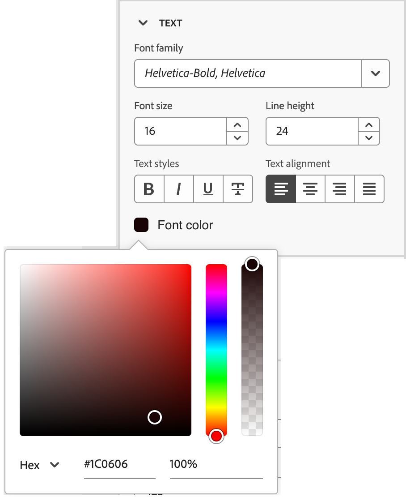

# スニペット

<!-- Content authoring steps for reuse -->

## インテントデータの設定 {#intent-data-note}

>[!NOTE]
>
>インテントデータは、Journey Optimizer B2B edition インスタンスに対して設定される場合に含まれます。 また、1 つ以上の公開済みジャーニー **または** 作成された購入グループが必要です。 インテント検出モデルの詳細と、キーワード、製品、カテゴリの送信方法については、[ インテント データ ](../user/admin/intent-data.md) を参照してください。

## AEM Assets ライセンスノート {#aem-assets-licensing-note}

>[!NOTE]
>
>AEM Assets as a Cloud Serviceのライセンスと Dynamic Media のライセンスは統合の前提条件です。 [Dynamic Media withOpen API](https://experienceleague.adobe.com/ja/docs/experience-manager-cloud-service/content/assets/dynamicmedia/dynamic-media-open-apis/dynamic-media-open-apis-overview){target="_blank"} が有効になっていることを確認します。 統合は、_配信層_ からのリポジトリに制限されます。 _オーサー層_ を使用していて、コンバージョンする場合は、Adobe Experience Manager サポートにお問い合わせください。 
>契約と設定に応じて、ビジュアルコンテンツのデザイン時にAdobe Experience Manager Assets as a Cloud ServiceにAdobe Journey Optimizer B2B editionから直接アクセスできます。

## コンテンツオーサリング – コンポーネント – 構造ステップ {#structures-step}

1. コンテンツデザインを開始するには、**[!UICONTROL 構造]** から項目をドラッグし、キャンバスにドロップします。

   必要に応じて _[!UICONTROL 構造]_ から項目を追加し、右側のパネルで各項目の設定を編集します。

   >[!TIP]
   >
   >_[!UICONTROL n:n 列]_ コンポーネントを選択して、列数（3～10）を任意に定義します。 また、列の下に矢印を移動して、各列の幅を定義することもできます。

   {width="800" zoomable="yes"}

   各列のサイズを構造コンポーネントの全幅の 10% 未満にすることはできません。 削除できるのは空の列のみです。

## コンテンツオーサリング – コンポーネント – コンテンツステップ {#contents-step}

1. 「**[!UICONTROL コンテンツ]**」セクションを展開し、必要な数の要素を 1 つ以上の構造コンポーネントに追加します。

   {width="800" zoomable="yes"}
   <!--
   reference to the contents elements--->

## コンテンツのオーサリング – コンポーネント – 設定手順 {#settings-step}

1. 必要に応じて、「設定」タブまたは _[!UICONTROL スタイル]_ タブで各コンポーネントに追加のカスタマイズを加えるこ _[!UICONTROL ができ]_ す。

   例えば、各コンポーネントのテキストスタイル、パディングまたは余白を変更できます。

## コンテンツオーサリング – アセットステップ {#assets-step}

1. _アセット_ ピッカーから、アセットライブラリに保存されたアセットを直接選択できます。

   アセットを含むフォルダーをダブルクリックします。 項目を構造コンポーネントにドラッグ&amp;ドロップします。

   ソースタイプのアセットの使用について詳しくは、[ コンテンツへのアセットの追加 ](../user/content/assets-overview.md#use-assets-for-content-authoring) を参照してください。

   {width="800" zoomable="yes"}

## コンテンツオーサリング – パーソナライゼーションステップ {#personalization-step}

1. パーソナライゼーションフィールドを挿入して、プロファイル属性、オーディエンスメンバーシップ、コンテキスト属性などからコンテンツをカスタマイズします。

## コンテンツオーサリング – 条件コンテンツステップの有効化 {#dynamic-content-step}

1. 「**[!UICONTROL 条件付きコンテンツを有効にする]**」をクリックし、動的コンテンツを追加して、条件付きルールに基づいてコンテンツをターゲットプロファイルに適応させます。

## コンテンツオーサリング – リンクトラッキング手順 {#links-tracking-step}

1. 左側のペインから「**[!UICONTROL リンク]**」タブを選択し、追跡するコンテンツのすべての URL を表示します。

   _トラッキングタイプ_ または _ラベル_ を変更し、必要に応じてタグを追加できます。

## コンテンツコンポーネント – 詳細スタイル {#styles-advanced}

値に CSS 準拠の追加の属性を適用するには、**[!UICONTROL 詳細]** スタイル設定を使用します。 既存の属性の値を変更したり、新しい属性を追加したりできます。 スタイルは、親子コンポーネント（要素）の CSS 継承モデルを使用してコンポーネントに適用されます。

表示される属性は、コンポーネントに対して現在定義されているスタイルを反映しています。 [CSS 定義 ](https://www.w3schools.com/CSSref/index.php){target="_blank"} に従って値を変更できます。 _追加_ （**+**）アイコンをクリックして、コンポーネントに新しいスタイル属性を追加します。

{width="250"}

## コンテンツコンポーネント – 水平方向の整列スタイル {#styles-alignment-h}

「**[!UICONTROL 整列]**」セクションを展開し、使用する水平方向の整列（左、中央または右）を選択します。 このスタイルは標準の `text-align` CSS スタイルに変換され、コンポーネントを含むコンポーネント内でのコンポーネントの配置方法に影響します。

{width="250"}

## コンテンツコンポーネント – 垂直方向の整列スタイル {#styles-alignment-v}

**[!UICONTROL 配置]** セクションを展開し、使用する垂直方向の配置（上、中央、下）を選択します。 このスタイルは標準の `vertical-align` CSS スタイルに変換され、そのコンポーネント内の配置に影響します。

{width="250"}

## コンテンツコンポーネント – 水平および垂直の整列スタイル {#styles-alignment-h-v}

「**[!UICONTROL 整列]**」セクションを展開し、使用する水平方向と垂直方向の整列を選択します。 整列スタイルは、HTML コンポーネントを含むコンポーネント（構造またはコンテナ）内での配置に影響します。

水平方向揃えは、標準 `text-align`CSS スタイルに変換され、左、中央または右から選択できます。 垂直方向の整列は、標準 `vertical-align` CSS スタイルに変換され、上、中央または下から選択できます。

{width="300"}

## コンテンツコンポーネント – 背景スタイル {#styles-background}

右側のパネルで「_[!UICONTROL スタイル]_」タブを選択した状態で、「**[!UICONTROL 背景]**」セクションを使用してコンポーネントの背景色を定義します。

チェックボックスを選択してカラーの四角形をクリックし、ピッカーからカラーを選択します。 色を選択するには、RGB、HSL、HSB、または 16 進数値を入力します。 または、カラースライダーとカラーフィールドを使用して、カラーを選択できます。

{width="300"}

## コンテンツコンポーネント – 境界線のスタイル {#styles-border}

1. 「_[!UICONTROL スタイル]_」タブを選択した右側のパネルで、「**[!UICONTROL 境界線]**」セクションを展開し、コンポーネントの境界線を表示するオプションを設定します。

1. 切替スイッチを右に移動して図面枠の表示オプションを有効にし、設計基準に従って設定します。

   * **[!UICONTROL 境界線のカラー]** を設定するには、チェックボックスを選択し、カラーの四角形をクリックして、ピッカーから色を選択します。 色を選択するには、RGB、HSL、HSB、または 16 進数値を入力します。 または、カラースライダーとカラーフィールドを使用して、カラーを選択できます。

   {width="300"}

   * **[!UICONTROL 境界線のサイズ]** （線の幅）を設定するには、上向き矢印アイコンと下向き矢印アイコンをクリックしてピクセル数を増減します。

   * **[!UICONTROL 境界線スタイル]** を設定するには、標準 CSS `border-style` 値のリストから値を選択します。

   * 境界線の表示場所を指定するには、それぞれの **[!UICONTROL 境界線の位置]** チェックボックスを選択します。

   {width="250"}

1. **[!UICONTROL 境界半径]** には、コーナーに必要なカーブに従って数値を設定します。

   値が 0 （デフォルト）の場合、コーナーは 2 乗になります。

## コンテンツコンポーネント – マージンのスタイル {#styles-margin}

「_[!UICONTROL スタイル]_」タブを選択した右側のパネルで、「**[!UICONTROL 余白]**」セクションを展開し、構造コンポーネント内の余白の間隔のオプションを設定します。 このスタイルは、コンポーネント境界線の外側の領域をコントロールする CSS `margin` パラメーターを複製して、他のコンポーネントと分離します。 コンポーネントの周囲に隙間ができ、周囲のコンテンツの配置やレイアウトに影響します。

デザインのニーズに応じて、マージンの値をピクセル単位で設定します。 コンポーネントのすべての辺、上部のボタン、左右または各辺の余白は、個別に設定できます。

* **すべての辺** – すべての辺に適用する値を 1 つ設定するには、「**[!UICONTROL 各辺に異なるマージン]**」チェックボックスをオフにします。 上下の矢印アイコンをクリックして、ピクセル数を増減します。

  {width="250"}

* **上下** – 上下の余白を同じ値に設定するには、上下の設定の間に _ロック_ アイコンを設定します。 の上向き矢印アイコンと下向き矢印アイコンをクリックして、ピクセル数を増減します。

* **左右** – 左右の余白を同じ値に設定するには、左右の設定の間に _ロック_ アイコンを設定します。 の上向き矢印アイコンと下向き矢印アイコンをクリックして、ピクセル数を増減します。

  {width="250"}

* **独立** – 各余白を独立した値に設定するには、「上」設定と「下」設定の間、および「左」と「右」の間に _ロック解除_ アイコンを設定します。 各設定で、の上向き矢印アイコンと下向き矢印アイコンをクリックして、ピクセル数を増減します。

  {width="250"}

## コンテンツコンポーネント – パディングスタイル {#styles-padding}

「_[!UICONTROL スタイル]_」タブを選択した右側のパネルで、「**[!UICONTROL パディング]**」セクションを展開し、構造コンポーネント内のパディングのオプションを設定します。 このスタイルは、CSS `padding` パラメーター（コンポーネントのコンテンツとそのボーダーの間のスペース）を複製します。 パディングには、コンテンツとコンポーネントの境界線との距離を制御するために使用できる内部間隔が用意されています。

デザインのニーズに応じて、パディング値をピクセル単位で設定します。 コンポーネントのすべての辺、上部ボタン、左右または各辺のパディングを個別に設定できます。

* **すべての辺** – すべての辺に適用する値を 1 つ設定するには、「**[!UICONTROL 各辺に異なるパディングを使用]**」チェックボックスをオフにします。 上下の矢印アイコンをクリックして、ピクセル数を増減します。

  {width="250"}

* **上下** – 上下のパディングを同じ値に設定するには、上下の設定の間に _ロック_ アイコンを設定します。 の上向き矢印アイコンと下向き矢印アイコンをクリックして、ピクセル数を増減します。

* **左右** – 左右のパディングを同じ値に設定するには、左右の設定の間に _ロック_ アイコンを設定します。 の上向き矢印アイコンと下向き矢印アイコンをクリックして、ピクセル数を増減します。

  {width="250"}

* **独立** – 各辺のパディングを独立した値に設定するには、上部と下部の設定の間、および左と右の間に _ロック解除_ アイコンを設定します。 各設定で、の上向き矢印アイコンと下向き矢印アイコンをクリックして、ピクセル数を増減します。

  {width="250"}

## コンテンツコンポーネント – サイズスタイル {#styles-size}

「_[!UICONTROL スタイル]_」タブを選択した右側のパネルで、「**[!UICONTROL サイズ]**」セクションを展開し、コンポーネントの高さと幅のオプションを設定します。

* **[!UICONTROL 高さ]** – 上下の矢印アイコンをクリックして、ピクセル数を増減します。 デフォルトは空の値（Auto）で、内容に応じて要素の高さのサイズを指定します。

* **[!UICONTROL 幅]** – 幅をピクセル単位またはパーセント単位で設定するには、切替スイッチを使用します。

   * 幅のパーセンテージの場合は、スライダーを使用してパーセンテージの値を設定します。 割合は、含まれるブロックのコンテンツボックス（パディングと境界線を除く）に基づいて要素のサイズを決定します。 例えば、値が 50 の場合、要素の幅は、その要素を含むブロックコンテンツの幅の 50% に設定されます。

     {width="250"}

   * ピクセルベースの幅の場合は、上向き矢印アイコンと下向き矢印アイコンをクリックして、ピクセル数を増減します。 デフォルトは空の値（Auto）で、コンテンツに応じて要素の幅をサイズ設定します。

     {width="250"}

## コンテンツコンポーネント – テキストスタイル {#styles-text}

「_[!UICONTROL スタイル]_」タブを選択した右側のパネルで、「**[!UICONTROL テキスト]**」セクションを展開し、コンポーネントのテキストスタイルのオプションを設定します。

* **[!UICONTROL フォントファミリー]** – 下向き矢印アイコンをクリックして、コンポーネント内のテキストのフォントファミリーを選択します。

* **[!UICONTROL フォントサイズ]** – 上下の矢印アイコンをクリックして、フォントサイズを増減するか、値を入力します。 入力した値には、小数を使用できます。

* **[!UICONTROL 行の高さ]** – 上下の矢印アイコンをクリックして行の高さを増減するか、値を入力します。 入力した値には、小数を使用できます。

  {width="250"}

* **[!UICONTROL テキストスタイル]** - テキストスタイルのアイコンとして、「_太字_」、「_斜体_」、「_下線_」または「_打ち消し線_ を選択します。

* **[!UICONTROL テキストの整列]** - テキストの水平方向の整列のアイコンとして、_左_、_中央_、_右_、_両端揃え_ を選択します。

* **[!UICONTROL フォントカラー]** - カラーの四角形をクリックして、ピッカーからフォントカラーを選択します。 色を選択するには、RGB、HSL、HSB、または 16 進数値を入力します。 または、カラースライダーとカラーフィールドを使用して、カラーを選択できます。

  {width="300"}

## コンテンツ – 画像の選択 – Marketo DAM {#me-dam}

Journey Optimizer B2B edition ライブラリまたは接続された Market Engage インスタンスから画像アセットを参照して選択するには、このタイプを選択します。

{width="700" zoomable="yes"}

ダイアログで、選択したリポジトリから画像を選択できます。 **[!UICONTROL 選択]** をクリックして、アセットを追加します。

必要なアセットを見つけるのに役立つツールを利用できます。

* 左上の _フィルター_ アイコンをクリックし、条件に従って表示される項目をフィルタリングします。

* 「_検索_」フィールドにテキストを入力し、表示される項目をフィルタリングしてアセット名が一致するかどうかを確認します。

  {width="700" zoomable="yes"}

## コンテンツ – 画像の選択 – AEM Assets {#aem-assets-dam}

このタイプを選択して、[ 設定済みの Experience Manage Assets リポジトリ ](../user/admin/configure-aem-repositories.md) から画像アセットを参照して選択します。

_[!UICONTROL Assetsを選択]_ ダイアログで、必要なアセットを見つけるために使用可能なツールを使用して画像を選択し、「**[!UICONTROL 選択]**」をクリックします。

* 右上の **[!UICONTROL リポジトリ]** を変更します。

* 右上の **[!UICONTROL アセットを管理]** をクリックして、別のブラウザータブでAssets リポジトリを開き、AEM Assets management tools を使用します。

* 右上の _表示タイプ_ セレクターをクリックして、表示を **[!UICONTROL リスト表示]**、**[!UICONTROL グリッド表示]**、**[!UICONTROL ギャラリー表示]**、**[!UICONTROL ウォーターフォール表示]** に変更します。

* _並べ替え順序_ アイコンをクリックして、並べ替え順序を昇順と降順の間で変更します。

  {width="700" zoomable="yes"}

* 「**[!UICONTROL 並べ替え基準]**」メニュー矢印をクリックして、並べ替え条件を **[!UICONTROL 名前]**、**[!UICONTROL サイズ]**、**[!UICONTROL 変更]** に変更します。

* 左上の _フィルター_ アイコンをクリックし、条件に従って表示される項目をフィルタリングします。

* 「_検索_」フィールドにテキストを入力し、表示される項目をフィルタリングしてアセット名が一致するかどうかを確認します。

  {width="700" zoomable="yes"}

## コンテンツ – 画像のアップロード {#image-upload}

このタイプを選択してシステムからファイルを選択し、Journey Optimizer B2B edition アセットライブラリに読み込みます。

_[!UICONTROL 画像をアップロード]_ ダイアログで、システムからファイルボックスにファイルをドラッグ&amp;ドロップします。 最大ファイルサイズは 100 MB です。

{width="450"}

選択した画像のファイル名がダイアログに表示されます。 アセットファイル名は（フォルダー間で）一意である必要があり、という名前のファイルが既に存在する場合は、メッセージが表示されます。 名前は最大 100 文字まで指定でき、特殊文字（`;`、`:`、`\`、`|` など）を含めることはできません。

「**[!UICONTROL 読み込み]**」をクリックします。

## エンゲージメントスコアアクティビティ {#engagement-activities}

| アクティビティ名 | 説明 | エンゲージメントタイプ | 1 日あたりの最大頻度数 | 既定のモデル アクティビティの重み付け |
| --- | --- | --- | --- | --- |
| [!UICONTROL  出席イベント ] | メンバーがイベントに出席しました | イベント | 20 | 60 |
| [!UICONTROL  電子メールのクリック ] | メンバーがメール内のリンクをクリックします | メール | 20 | 30 |
| [!UICONTROL  電子メールの開封 ] | メンバーがメールを開きます | メール | 20 | 30 |
| [!UICONTROL  フォームに入力 ] | メンバーが web ページ上のフォームに入力して送信します | Web | 20 | 40 |
| [!UICONTROL 注目のアクション] | メンバーに注目のアクションがあります | キュレート | 20 | 60 |
| [!UICONTROL  リンククリック数 ] | メンバーが web ページ上のリンクをクリックします | Web | 20 | 40 |
| [!UICONTROL  ページビュー数 ] | メンバーが web ページを閲覧した場合 | Web | 20 | 40 |
| [!UICONTROL  イベントの登録 ] | イベントに登録されているメンバー | イベント | 20 | 60 |
