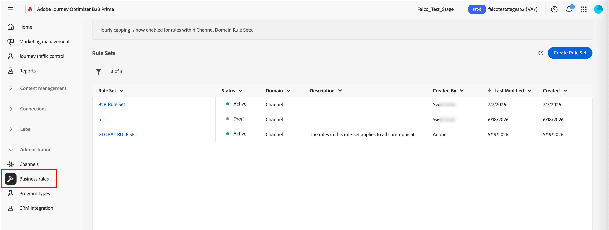
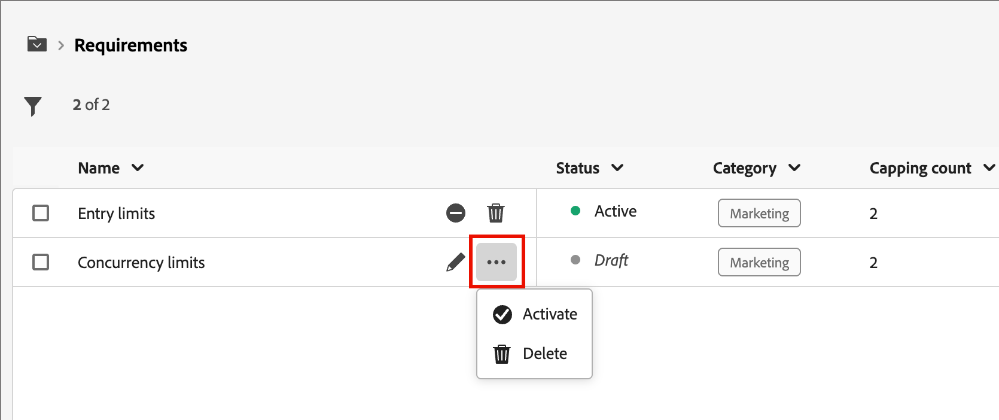

# ビジネスルール {#business-rules}

>[!CONTEXTUALHELP]
>id="ajo-b2b-prime_business_rules_rule_sets"
>title="ルールセット"
>abstract="ルールセットを使用して、様々なタイプのマーケティング通信にフリークエンシーキャップやクワイエットアワーのルールを適用します。 また、フリークエンシーキャップルールに基づいて、オーディエンスの一部に対してジャーニーを除外するルールセットを作成することもできます。"

ビジネスルールを利用すれば、複数のルールを定義してルールセットにグループ化し、マーケターが必要に応じてメールに適用できるようにできます。 これにより、顧客が特定の時間枠内に参加する頻度とジャーニーの数を制限したり、コミュニケーションの種類に応じてユーザーがメッセージを受け取る頻度を制御したりするための詳細な制御が提供されます。

次の 2 つのタイプのルールセットを作成できます。

* **チャネル**&#x200B;ルールセットは、通信チャネルにルールを適用します。 次の設定を行うことができます。

   * **頻度の上限ルール** – 例：*1日に複数の電子メール、SMS、プッシュ通知、ダイレクトメール、WhatsApp通信を送信しないでください。*
   * **サイレントアワーのルール** – 例：*午前8時から午後9時の時間枠の外にメールメッセージを送信しない*

* **ジャーニー**&#x200B;ルールセットは、ジャーニーにエントリキャップルールと同時実行キャップルールを適用します。 （Beta リリースではまだサポートされていません）。

>[!PREREQUISITES]
>
>ビジネスルールを操作するには、次のCX エンタープライズ権限が必要です。
>
>* **[!UICONTROL 頻度ルールを表示]**：ビジネスルールにアクセスして表示します。
>* **[!UICONTROL 頻度ルールの管理]**：ビジネスルールを作成、編集または削除します。

## ルールセットへのアクセスと管理 {#access-manage}

既存のすべてのルールセットにアクセスするには、左側のナビゲーションで&#x200B;**[!UICONTROL 管理]**&#x200B;を展開し、**[!UICONTROL ビジネスルール]**&#x200B;を選択します。

{width="800" zoomable="yes"}

### グローバルおよびカスタムのルールセット {#global-custom}

_ルールセット_&#x200B;に初めてアクセスする場合、デフォルトのルールセットが事前に作成され、アクティブになります。**_[!UICONTROL GLOBAL RULE SET]_**。 これは、ユーザーが1つまたは複数のチャネルでメッセージを受信する頻度を制御するために適用できるグローバルルールセットです。 このルールセットで定義されたルールは、選択したすべてのチャネルに適用されます。

{width="700" zoomable="yes"}

このデフォルトのルールセットに加えて、独自のカスタムルールセットを作成してジャーニーまたはチャネルノードに適用し、特定のキャッピングルールとサイレントアワーのルールを使用できます。

### ルールセットを開く {#open-rule-set}

ルールセット名をクリックして、そのルール定義を表示および編集します。 そのルールセットに含まれるすべてのルールが一覧表示されます。 右上の&#x200B;_詳細メニュー_ （**...**）を使用して、アクティベート、非アクティブ化、または削除します。

{width="700" zoomable="yes"}

### ルールの編集 {#edit-rules}

ルールセット内のドラフトルールの場合は、ルール名の横にある&#x200B;_編集_ （）アイコンをクリックして、ルール設定を編集します。 _詳細メニュー_ （**...**）アイコンをクリックして、ルールをアクティブ化または削除することもできます。

{width="500" zoomable="yes"}

ルールを非アクティブ化するには、アクティブなルールの横にある&#x200B;_非アクティブ化_ （）アイコンをクリックします。 確認ダイアログで、**[!UICONTROL 無効化]**&#x200B;をクリックします。 ステータスが&#x200B;**_[!UICONTROL 非アクティブ]_**&#x200B;に変更され、このルールは今後のメッセージ実行には適用されません。 現在実行中のメッセージは影響を受けません。

>[!NOTE]
>
>ルールまたはルールセットを非アクティブ化しても、個々のプロファイルのカウントは影響を受けず、リセットされません。

## カスタムルールセットの作成と有効化 {#create}

>[!CONTEXTUALHELP]
>id="ajo-b2b-prime_rule_set_domain"
>title="ルールセットのドメイン"
>abstract="ルールセットを作成する際は、ルールセット内のルールが通信チャネルまたはジャーニーに固有のキャップルールを適用するかどうかを指定する必要があります。"

>[!CONTEXTUALHELP]
>id="ajo-b2b-prime_rule_sets_category"
>title="メッセージルールカテゴリの選択"
>abstract="アクティブ化してメッセージに適用すると、選択したカテゴリに一致するすべての頻度ルールがこのメッセージに自動的に適用されます。 現在使用できるのは、マーケティングカテゴリのみです。"

>[!CONTEXTUALHELP]
>id="ajob2b-prime_rule_type"
>title="ルールタイプ"
>abstract="チャネルルールセットに必要なルールタイプを選択します。**フリークエンシーキャップ**&#x200B;タイプを使用して、通信チャネルにキャッピングルールを適用します。 例えば、1日に複数の電子メールまたはSMS通信を送信しないでください。 **メッセージが通知されない時間帯**&#x200B;を選択して、時間ベースの除外を定義し、特定の期間にメッセージが送信されないようにします。"

>[!CONTEXTUALHELP]
>id="ajo-b2b-prime_rule_sets_duration"
>title="キャッピング頻度のリセット"
>abstract="キャッピングカウンターのリセットに使用するカレンダー期間（時間単位、日単位、週単位、月単位）を選択します。 カウンターは、新しい期間の開始時に自動的に0にリセットされます。"

>[!CONTEXTUALHELP]
>id="ajo-b2b-prime_rule_set_rule_capping"
>title="ルールのキャップ"
>abstract="ルールのキャップの設定 ルールセットのドメインと「ルールタイプ」フィールドの選択に応じて、このフィールドでは、プロファイルに送信できるメッセージの最大数や、プロファイルを同時にエントリまたは登録できるジャーニーの最大数を定義できます。"

>[!CONTEXTUALHELP]
>id="ajo-b2b-prime_journey_business_rules"
>title="ルールセット"
>abstract="カスタムアクションに適用するルールセットを選択します。"

>[!NOTE]
>
>チャネルドメインには最大10個、ジャーニードメインには10個のルールセットを作成でき、合計20個のルールセットを作成できます。

1. 左側のナビゲーションで「**[!UICONTROL 管理]**」を展開し、**[!UICONTROL ビジネスルール]**&#x200B;を選択します。

1. _[!UICONTROL ルールセット]_ リストページで、右上の「**[!UICONTROL ルールセットを作成]**」をクリックします。

   {width="400"}

1. ルールセットに一意の&#x200B;**[!UICONTROL 名前]** （必須）を入力し、**[!UICONTROL 説明]** （オプション）を追加します。

1. ルール セット **[!UICONTROL ドメイン]**&#x200B;を選択します。

   * **[!UICONTROL チャネル]** - コミュニケーション チャネルにキャッピング ルールまたはサイレントアワーのルールを適用します。
   * **[!UICONTROL ジャーニー]** - ジャーニーにエントリと同時実行の上限ルールを適用します。

   >[!IMPORTANT]
   >
   >このBeta リリースでは、ジャーニールールはまだサポートされていません。

1. 「**[!UICONTROL 保存]**」をクリックします。

   {width="700" zoomable="yes"}

### ルールの追加 {#add-rules}

ルールセットを作成したら、含める各ルールを追加します。

1. 「**[!UICONTROL ルールを追加]**」をクリックします。

1. 目的に応じてルールパラメーターを設定します。

   ルールに使用できるパラメーターは、作成時に選択したルールセットドメインによって異なります。

   {width="700" zoomable="yes"}

   ジャーニールールとチャネルルールの設定について詳しくは、次の節を参照してください。

   <!-- * [Journey capping](../conflict-prioritization/journey-capping.md) -->
   * [チャネルと通信タイプによるフリークエンシーキャップ](#frequency-capping)
   * [クワイエットアワー](#quiet-hours)

1. 「**[!UICONTROL ルールを作成]**」をクリックして、ルール作成を確定します。

   新しいルールは、_ドラフト_&#x200B;のステータスを持つルールセットにリストされます。

1. 前述の手順を繰り返して、ルールセットに必要な数のルールを追加します。

   作成されたルールは&#x200B;_[!UICONTROL ドラフト]_&#x200B;のステータスを持ち、まだメッセージに影響を与えることはできません。

   {width="700" zoomable="yes"}

1. ルール セットのルールをアクティブ化するには、ルール名の横にある&#x200B;_詳細メニュー_ （**...**）アイコンをクリックし、**[!UICONTROL アクティブ化]**&#x200B;を選択します。

   確認ダイアログで、**[!UICONTROL アクティベート]**&#x200B;をクリックします。

### ルールセットのアクティベート {#activate-rule-set}

ルールセットをアクティブ化すると、ジャーニーまたはチャネルメッセージに適用できるようになります。 ルールセットがアクティブな場合、追加のルールを追加することはできません。 これを非アクティブ化して変更を加え、再度アクティブ化することができます。

1. _ルールセット_ リストページからルールセットを開きます。

1. 右上の&#x200B;_詳細メニュー_ （**...**）をクリックし、「**[!UICONTROL ルールセットをアクティブ化]**」を選択します。

   {width="700" zoomable="yes"}

1. 確認ダイアログで、**[!UICONTROL アクティベート]**&#x200B;をクリックします。

   >[!NOTE]
   >
   >ルールまたはルールセットが完全にアクティブ化されるまでに、最大 10 分かかる場合があります。 ルールを有効にするために、メッセージを変更したり、ジャーニーを再公開したりする必要はありません。

ルール セットのドメイン設定に応じて、アクティブなルール セットをメッセージまたはジャーニーに適用できます。

## チャネル別の配信頻度の上限設定 {#frequency-capping}

チャネルやコミュニケーションの種類ごとに配信頻度の上限を設定することで、プロファイルが受け取るメッセージ数を制限し、同様のコミュニケーションを顧客に過剰に配信するのを防ぎます。 チャネルルールセットは、通信チャネルにキャッピングルールを適用します。 例えば、1日に複数の電子メールまたはSMS通信を送信しないでください。

チャネルルールセットを活用すると、通信タイプ別のフリークエンシーキャップを設定し、類似したメッセージで顧客に過剰な負荷がかかるのを防ぐことができます。 例えば、顧客に送信する&#x200B;_プロモーション情報_&#x200B;の数を制限するルールセットを作成したり、顧客に送信する&#x200B;_ニュースレター_&#x200B;の数を制限する別のルールセットを作成したりできます。 次に、プロモーションコミュニケーションまたはニュースレターのルールセットのいずれかを適用するように選択できます。

>[!IMPORTANT]
>
>チャネルレベルのキャッピングが正しく機能することを確認するには、ジャーニーの構築中に最も優先度の高い名前空間を選択してください。 名前空間の優先度について詳しくは、[Platform ID サービスガイド](https://experienceleague.adobe.com/ja/docs/experience-platform/identity/features/identity-graph-linking-rules/namespace-priority){target="_blank"}を参照してください。

### チャネルのキャップルールの作成 {#create-capping-rule}

>[!CONTEXTUALHELP]
>id="ajo-b2b-prime_rule_sets_channel"
>title="ルールを適用するチャネルを定義"
>abstract="少なくとも 1 つのチャネルを選択します。 キャップは、チャネル間で合計カウントとして適用されます。"

1. キャッピングルールを追加するチャネルルールセットを選択するか、新しいチャネルルールセットを作成します。

1. ルール セット ページで、**[!UICONTROL ルールを追加]**&#x200B;をクリックし、ルールの一意の名前を入力します。

   >[!NOTE]
   >
   > _[!UICONTROL カテゴリ]_ フィールドは、ルールのメッセージ カテゴリを指定します。 現在、このフィールドは読み取り専用で、**[!UICONTROL マーケティング]** カテゴリのみが使用可能です。

1. _[!UICONTROL ルールタイプ]_&#x200B;で、**[!UICONTROL チャネルキャッピング]**&#x200B;を選択します。

   {width="700" zoomable="yes"}として選択されました

1. 「**[!UICONTROL キャッピングカウント]**」フィールドで、ルールのキャッピング値を設定します。

   この値は、個々のユーザープロファイルに送信できるメッセージの最大数（月、週、日、または時間）です。他のフィールドで選択した内容に従います。

1. **[!UICONTROL キャッピング頻度のリセット]**&#x200B;で、キャッピングを適用するかどうかを選択します。

   フリークエンシーキャップは、選択したカレンダーの期間に基づきます。 対応する時間枠の開始時にリセットされます。 各期間のカウンターの有効期限を選択します。

   * **[!UICONTROL 毎時]** - フリークエンシーキャップは、選択した時間数に対して有効です。 カウンターは、各時間枠の開始時に自動的にリセットされます。 1 時間のフリークエンシーキャップの場合、UTC 時間の終了に合わせて 1 時間ごとにリセットされます。
   * **[!UICONTROL 毎日]** - 毎日のフリークエンシーキャップは、その日の 23:59:59 UTC まで有効で、翌日の開始時に 0 にリセットされます。
   * **[!UICONTROL 毎週]** - フリークエンシーキャップは、その週の土曜日 23:59:59 UTC まで有効です。 有効期限は、ルールが作成された日時に関係なく適用されます。 例えば、木曜日にルールが作成された場合、このルールは土曜日の 23:59:59 まで有効です。
   * **[!UICONTROL 毎月]**：頻度キャップは、その月の最終日の 23:59:59 UTC まで有効です。 例えば、1月の月次有効期限は 1月31日、23:59:59 UTC です。

   >[!IMPORTANT]
   >
   >* 正確性を確保するには、ジャーニーのオーサリング中に最優先の名前空間を選択するようにします。 名前空間の優先度について詳しくは、[Platform ID サービスガイド](https://experienceleague.adobe.com/ja/docs/experience-platform/identity/features/identity-graph-linking-rules/namespace-priority){target="_blank"} を参照してください
   >
   >* 通信が配信されると、プロファイルカウンタ値が更新されます。 大量の通信を送信する場合は、スループットにより、受信者が通信の開始から数分または数時間後に電子メールを受け取る可能性があります（同時に数百万の通信を送信している場合）。 これは、受信者が 2 つの通信を同時期に次々に受信する場合に重要です。 受信者が通信を受信するのに十分な時間と、それに応じて更新するカウンタ値を提供するために、可能な限り少なくとも2時間は通信を間隔を空けることをお勧めします。

1. 「**[!UICONTROL 毎]**」フィールドを使用して、キャッピングルールの頻度を複数時間、日、週、または月（指定された時間枠に応じて）に設定します。

   選択した期間タイプに一致する値を入力してください：_時間_&#x200B;に1-23、_日単位_&#x200B;に1-30、_週単位_&#x200B;に1-4、_月単位_&#x200B;に1-3。

   新しい時間枠が開始されると、カウンターは自動的に 0 にリセットされます。 2日間のフリークエンシーキャップの場合、このリセットはUTCの午前0時に2日ごとに行われます。

1. このルールに使用するチャネルを選択します。

   * **[!UICONTROL メール]**
   * **[!UICONTROL SMS]** （現在このBeta リリースではサポートされていません）
   * **[!UICONTROL プッシュ通知]** （現在このBeta リリースではサポートされていません）
   * **[!UICONTROL ダイレクトメール]** （現在このBeta リリースではサポートされていません）
   * **[!UICONTROL WhatsApp]** （現在このBeta リリースではサポートされていません）

   {width="700" zoomable="yes"}

   選択したすべてのチャネルに合計数としてキャッピングを適用する場合は、複数のチャネルを選択します。

   例えば、キャッピングを5に設定し、電子メールとSMS チャネルの両方を選択します。 プロファイルが選択した期間に3通のマーケティングメールと2通のマーケティング SMS メッセージを既に受信している場合、このプロファイルはマーケティングメールまたはSMS メッセージの次回の配信から除外されます。

1. 「**[!UICONTROL 保存]**」をクリックして、ルールの作成を確定します。

   使用頻度ルールは、_[!UICONTROL ドラフト]_&#x200B;のステータスを持つルールセットに追加されます。

1. 上記の手順を繰り返して、必要な数のルールをルールセットに追加します。

1. キャッピングルールをメッセージに適用する準備ができたら、ルールとルールセットをアクティブにします。

### チャネルキャッピングルールセットの適用 {#apply-capping-rule}

1. ジャーニーを作成する際に、ルール用に選択したチャネルの送信[ アクションノード ](../marketing/action-nodes.md)のいずれかを追加し、メッセージのコンテンツを編集します。

1. 「_[!UICONTROL アクション]_」タブで、**[!UICONTROL ビジネスルール]** オプションを、頻度の上限ルールが設定されたルールセットに設定します。

   {width="600" zoomable="yes"}

   >[!NOTE]
   >
   >アクティブ化されたルールセットのみがリストで使用できます。

   <!--Messages where the category selected is **[!UICONTROL Transactional]** will not be evaluated against business rules.-->

1. ジャーニーをアクティブ化する前に、少なくとも10分後には実行をスケジュールしてください。

   これにより、選択したビジネスルールのプロファイルにカウンター値を入力するのに必要な時間が提供されます。 ジャーニーをすぐにアクティブ化すると、ルールセットカウンターの値を受信者のプロファイルに入力できず、メッセージはカスタムルールセットの頻度キャッピングルールにカウントされません。

<!-- 
1. You can view the number of profiles excluded from delivery in the [Customer Journey Analytics report](../reports/report-gs-cja.md), and in the [Live report](../reports/live-report.md), where frequency rules will be listed as a possible reason for users excluded from delivery.

-->

>[!NOTE]
>
>複数のルールを同じチャネルに適用できますが、下限のキャップに達すると、プロファイルは次の配信から除外されます。

頻度ルールをテストする場合は、新しく作成したテストプロファイルを使用することをお勧めします。プロファイルの頻度キャップに達すると、次の期間までカウンターをリセットする方法がないためです。 ルールを非アクティブ化すると、キャップされたプロファイルはメッセージを受信できますが、カウンター増分は削除されません。

## クワイエットアワーの設定 {#quiet-hours}

**_サイレントアワー_**&#x200B;を使用すると、電子メール、SMS、プッシュ通知、WhatsApp チャネルの時間ベースの除外を定義できます。 これにより、特定の期間中にメッセージが送信されなくなり、顧客の環境設定やコンプライアンス要件を適用できます。

>[!NOTE]
>
>現在のBeta リリースでは、ジャーニーでサポートされているのはメールとWhatsApp チャネルのみです。

ルールセットを通じてサイレントアワーを適用し、ジャーニーの個々のチャネルアクションに割り当てることで、正確な制御を実現できます。 これらの基準を合理化することで、顧客体験を向上させ、時間を節約し、コミュニケーションルールへのコンプライアンスを確保することができます。

* **顧客を目覚めさせない** - *適切な顧客、適切なチャネル、適切なタイミング*&#x200B;は、多くのマーケターの信条なので、タイミングがカスタマージャーニーの重要な部分であることは理にかなっています。 サイレントアワーのルールを設定することで、コンタクトがメッセージを受け取るタイミングをより適切に制御し、メッセージに対してアクションを起こす可能性が高いタイミングでコンタクトを獲得できるようにします。
* **利便性** - ジャーニーやキャンペーン全体を停止することなく、オーディエンスがメッセージを受信するのを防ぐ必要がある場合に、キャンペーンやジャーニーをまたいで通信を簡単に傍受します。
* **時間の節約** - カスタム式を使用して複数の条件ノードを追加する代わりに、**時間ベースのルール**&#x200B;を作成して、除外を 1 か所で管理します。\
  <!--* **Extra Safeguard** - Benefit from an extra safeguard in case audience criteria or time-window configurations were incorrectly set, ensuring individuals are still excluded when they should be.-->

>[!BEGINSHADEBOX]

**ガードレールと制限**

* **生成の遅延** - クワイエットアワールールの更新が、既にそのルールを使用しているチャネルアクションに適用されるまでに最大 12 時間かかる場合があります。
* **大量の通信による待ち時間** - 大量の通信が行われる場合、システムがクワイエットアワーの抑制の適用を正常に開始するまでに追加の時間がかかることがあります。

>[!ENDSHADEBOX]

<!--* **Custom actions** – For custom actions, only quiet hours rules are enforced. If a rule set also includes other rules (e.g., frequency capping), those rules are ignored.-->
<!--* **Pre-suppression window** – The system begins suppressing communications 30 minutes before quiet hours start, ensuring that no messages are delivered once the quiet period begins.-->

### サイレントアワーのルールの作成 {#create-quiet-hour-rules}

>[!NOTE]
>
>クワイエットアワーは、**_カスタムルールセット_**&#x200B;でのみ定義できます。 グローバルルールセットは、クワイエットアワー設定をサポートしていません。

1. ルールを追加するチャネル ルール セットを選択するか、新しいチャネル ルール セットを作成します。

1. ルール セット ページで、**[!UICONTROL ルールを追加]**&#x200B;をクリックし、ルールの一意の名前を入力します。

   >[!NOTE]
   >
   > _[!UICONTROL カテゴリ]_ フィールドは、ルールのメッセージ カテゴリを指定します。 現在、このフィールドは読み取り専用で、**[!UICONTROL マーケティング]** カテゴリのみが使用可能です。

1. _[!UICONTROL ルールタイプ]_&#x200B;の場合、**[!UICONTROL 静止時間]**&#x200B;を選択します。

   {width="700" zoomable="yes"}として選択された静止時間

1. 「**[!UICONTROL 日付と時刻]**」セクションで、クワイエットアワーを適用するタイミングを定義します。

   * **[!UICONTROL タイムゾーン]**&#x200B;の場合、個々のタイムゾーンに関係なく、オーディエンス内のすべての受信者の標準タイムゾーンを選択します。

     各プロファイルのタイムゾーンフィールドを使用するには、**[!UICONTROL 受信者のローカルタイムゾーンを使用]**&#x200B;を選択します。

     >[!IMPORTANT]
     >
     >プロファイルにタイムゾーン値がない場合、そのプロファイルではクワイエットアワーは適用されません。

   * _カレンダー_ アイコンをクリックし、サイレントアワーを適用する期間を指定します。

      * **[!UICONTROL 毎週]** - 特定の曜日と時間スロットを選択します。 ルール **[!UICONTROL 終日]**&#x200B;を適用することもできます。

      * **[!UICONTROL カスタム日付]** - カレンダーの特定の日付と時間スロットを選択します。 ルール **[!UICONTROL 終日]**&#x200B;を適用することもできます。

     {width="450"}

   * 「**[!UICONTROL さらに日付を追加]**」ボタンをクリックして、最大5つの期間を追加します。

1. 「**[!UICONTROL クワイエットアワー中の処理アクション]**」セクションで、選択した期間中のメッセージの処理方法を選択します。

   

   * **[!UICONTROL キューメッセージ]** - 一時停止状態でない限り、メッセージはクワイエットアワーの完了時に送信されます。

     >[!NOTE]
     >
     >メッセージが7日以上プロファイルのキューに入ったままの場合、メッセージは破棄されます。

   * **[!UICONTROL メッセージを破棄]** - メッセージは送信されません。

     >[!NOTE]
     >
     >**[!UICONTROL 破棄]**&#x200B;を選択してこのルールをジャーニーアクションに適用すると、プロファイルはメッセージ配信から削除され、ジャーニーから離脱します。

1. 「**[!UICONTROL 保存]**」をクリックして、ルールの作成を確定します。

   サイレントアワーのルールは、_[!UICONTROL ドラフト]_&#x200B;のステータスを持つルールセットに追加されます。

1. 上記の手順を繰り返して、必要な数のルールをルールセットに追加します。

1. ルールをメッセージに適用する準備ができたら、ルールとルールセットをアクティブにします。

### ジャーニーアクションにサイレントアワーを適用する {#apply-quiet-hours}

ルールが保存され、ルールセットがアクティブ化されたら、ジャーニーのチャネルアクションに適用できます。

1. ジャーニーを作成する際に、ルール用に選択したチャネルの送信[ アクションノード ](../marketing/action-nodes.md)のいずれかを追加し、メッセージのコンテンツを編集します。

1. 「_[!UICONTROL アクション]_」タブで、**[!UICONTROL ビジネスルール]** オプションを、サイレントアワー規則で設定されたルールセットに設定します。

   {width="600" zoomable="yes"}

   >[!NOTE]
   >
   >アクティブ化されたルールセットのみがリストで使用できます。

1. 準備ができたら、ジャーニーを完了して公開します。
