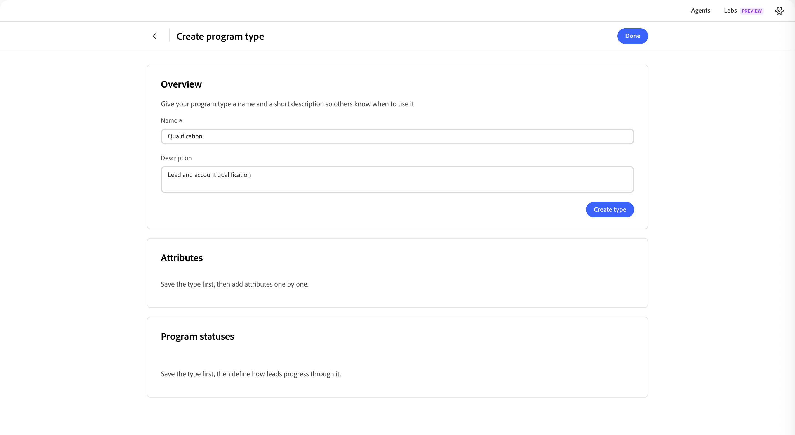

# プログラムタイプ

プログラムの種類は、[&#x200B; プログラム &#x200B;](../marketing/programs.md)とそのメンバーの重要な側面を定義し、異なる種類のマーケティングプログラムを区別します。 各プログラムタイプは、プログラムタイプを使用するプログラムに継承される次のプロパティを定義します。

* **属性** – 属性は、イベントの日付や場所の属性など、プログラムの種類の重要な側面を表します。

* **プログラムのステータスのフロー** – 各ステータスは、プログラムの種類（1、2、3など）のステップに割り当てられます。 プログラムのメンバーは、同じステップ番号を持つステータス（_No-Showed_&#x200B;から&#x200B;_Attended_&#x200B;など）から、より高いステップ番号を持つステータス（_Invited_&#x200B;から&#x200B;_Registered_&#x200B;など）にのみ移動できます。

  プログラムのステータスは相互に排他的で直線的であるため、プログラムごとに1つのステータス値のみを持つことができます。 ステータスをデザインするときは、どのステータス間の移動を許可するかを考えます。 例えば、ウェビナーに参加しなかったものの、後でオンデマンドで参加するオプションがある場合、プログラムメンバーが参加できるように、同じステータス番号を付けるか、オンデマンドをより高いステータス番号に設定する必要があります。

>[!NOTE]
>
>プログラムの種類が1つ以上のプログラムで使用されている場合、その種類を編集することはできません。

_カスタムプログラムタイプを定義するには&#x200B;:_

1. 左側の[!DNL Adobe Journey Optimizer B2B Prime]のナビゲーションで、**[!UICONTROL 管理]**&#x200B;を展開し、**[!UICONTROL プログラムタイプ]**&#x200B;を選択します。

   {width="800" zoomable="yes"}

1. 右上の「**[!UICONTROL タイプを作成]**」をクリックします。

1. 一意の&#x200B;**[!UICONTROL 名前]** （必須）と&#x200B;**[!UICONTROL 説明]** （オプション）を入力してください。

   {width="600" zoomable="yes"}

   >[!TIP]
   >
   >説明を含めることはベストプラクティスであり、プログラムタイプライブラリをより管理しやすくします。

1. 「**[!UICONTROL タイプを作成]**」をクリックします。

1. プログラムの種類に&#x200B;**[!UICONTROL 属性]**&#x200B;を追加します。

   追加する各属性について：

   * 「**[!UICONTROL 属性を追加]**」をクリックします。
   * **[!UICONTROL API名]**&#x200B;を選択し、**[!UICONTROL 表示名]**&#x200B;を入力します。
   * 「**[!UICONTROL 保存]**」をクリックします。

   {width="600" zoomable="yes"}

1. **[!UICONTROL プログラムステータス]**&#x200B;の手順を定義します。

   フローに含める各ステップを定義します。

   * 「**[!UICONTROL 手順を追加]**」をクリックします。
   * ステータス名を入力します。
   * （オプション）「**[!UICONTROL ステータスを追加]**」をクリックし、ステップに含める追加のステータス名を入力します。

   プログラムの実行を成功として追跡する手順については、「**[!UICONTROL 成功としてマーク]**」チェックボックスをオンにします。

   {width="600" zoomable="yes"}

1. 「**[!UICONTROL 完了]**」をクリックして変更を保存し、プログラムタイプリストに戻ります。