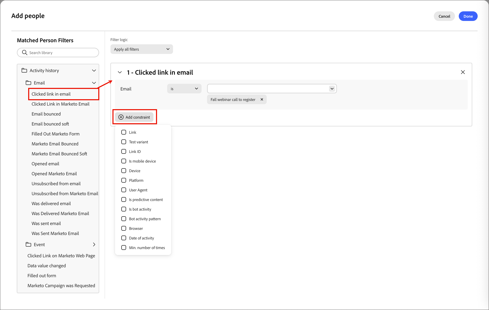
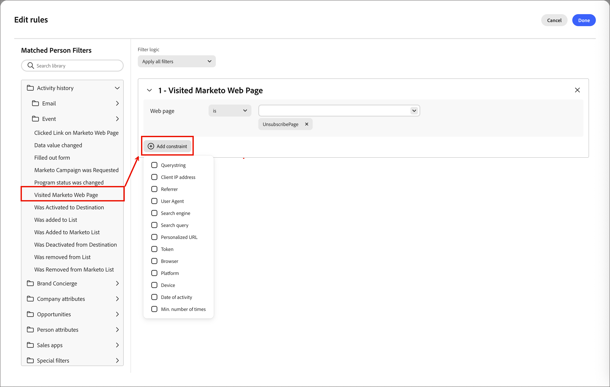

# ユーザーリスト

[!DNL Adobe Journey Optimizer B2B Prime]では、人物リストはターゲティングおよび人物ジャーニーのエントリ用の個人レベルのオーディエンスコンテナであり、ルールベースのライブ選定の動的リストと、固定またはジャーニーで管理されるメンバーシップの静的リストが含まれています。

## ユーザーリストへのアクセスと参照 {#access-browse}

1. 左側のナビゲーションで、**[!UICONTROL マーケティング管理]**&#x200B;を展開します。

1. **[!UICONTROL マーケティング]**&#x200B;のリソースリストの右側で、**[!UICONTROL 人物リスト]**&#x200B;を選択します。

   {width="800" zoomable="yes"}

ページには、**[!UICONTROL 動的リスト]**&#x200B;と&#x200B;**[!UICONTROL 静的リスト]**&#x200B;を表示および管理できる2つのタブがあります。 タブをクリックして、2つのタイプ間でリストビューを切り替えます。

リストの上部にある&#x200B;_検索_ ツールにテキストを入力すると、表示されるリストを名前でフィルタリングできます。 リストツールを使用して、表示されるリストをカスタマイズします。

* 表示される列を制御するには、「_テーブルをカスタマイズ_」（「」）アイコンをクリックします。
* _列をリセット_ （）アイコンをクリックして、列幅をリセットします。

このスペースから、次のこともできます。

* 新しい動的リストと静的リストの作成
* リストにアクセスして現在のメンバーシップを確認
* メンバーシップフィルターの適用

<!--
## Audience Hub

The AI Audience Hub is a centralized, AI-driven starting point for all audience-related capabilities across [!DNL Adobe Journey Optimizer B2B Prime]. It is designed to accelerate first-time user success while progressively unlocking advanced intelligence, insights, and control for returning and power users.

The Hub acts as:

* A guided starting point for discovering, creating, and refining person lists, account lists, and buying groups

* A visibility layer for audience health, coverage, overlap, engagement patterns, and AI-driven insights

* A control center for audience governance, optimization, reuse, and readiness for activation across journeys and sales workflows

### High level structure

Prompt-based starting point - Quick Start prompts and freeform input to help users discover, create, or optimize audiences.

1. AI insights feed - Surfaces key audience signals such as overlap, gaps, saturation risk, and optimization opportunities.

1. Adaptive audience library - A personalized view of people lists, account lists, and buying groups that adapts based on usage, relevance, and activation.

1. Optimization and arbitration nudges - Guides users to refine, split, or reuse audiences before activation.

1. Audience visibility and reporting - High-level insight into audience health, engagement patterns, and usage across active journeys.

### Empty and Error States (High-Level)

No audiences / no data - Show Quick Start prompts to help first-time users create or import person lists

Low data or incomplete audience - Explain what's missing (e.g., insufficient contacts, missing persona coverage, or low engagement data) and suggest next steps.

AI insights unavailable - Provide a graceful fallback with a clear explanation, so users understand why insights aren't shown and what actions they can take manually.
-->

## ユーザーリストの作成 {#create-people-list}

1. _[!UICONTROL 人物リスト]_ ページの右上にある「**[!UICONTROL リストを作成]**」をクリックします。

1. ダイアログで、リストの&#x200B;**[!UICONTROL 親]**&#x200B;としてプログラムを選択します。

1. リストに「**[!UICONTROL 名前]**」（必須）と「**[!UICONTROL 説明]**」（オプション）を入力します。

1. リスト **[!UICONTROL 種類]**&#x200B;を選択してください：

   * [**[!UICONTROL 静的]**](#static-lists) - メンバーシップは、リストの作成時に評価された修飾フィルターによって決定されます。 レコードを手動で選定または選定しない限り、リストメンバーシップは更新されません。
   * [**[!UICONTROL 動的]**](#dynamic-lists) - メンバーシップは、適格なフィルターによって動的に決定されます。 リストのメンバーシップが自動的に更新されます。

   {width="450"}

1. 「**[!UICONTROL 作成]**」をクリックします。

>[!NOTE]
>
>削除と複製は、現在、このBeta リリースのユーザーリストではサポートされていません。

## 静的リスト {#static-lists}

静的リストメンバーシップは、ユーザーの属性とアクティビティを参照するシンプルなフィルターによって定義されます。 メンバーシップは、手動でメンバーを選定または選定しない限り、変更されません。

>[!NOTE]
>
>静的リストフィルター定義は、リストにメンバーを追加またはリストから削除する場合にのみ適用されます。 定義されたフィルターは、その後は使用できません。 フィルターを使用して一貫したオーディエンス定義を維持する場合は、代わりに動的リストを使用します。

<!--
What internet says about Marketo static lists -- which of these is also true in AJO B2B Prime?

* Manual Targeting: Storing fixed cohorts, such as attendees of a specific webinar, people who purchased a certain product, or a list of competitors.
* Third-Party Syncing: Allowing external platforms (like Amplitude or Twilio Segment) to automatically sync and export groups of users directly into Marketo as targeted audiences.
* Status Tracking: Helping marketers organize leads into specific categories or track multi-value interests without needing to create new, permanent database fields.List 
* Segmentation: Acting as a reliable, unchanging recipient or suppression list for email campaigns and engagement programs. Unlike a Smart List—which dynamically adds or removes people based on changing criteria or rules—a static list serves as a reliable snapshot. People remain on the list until explicitly added or removed by you or a backend flow.

So far, activating to a destination is the only thing that they are used for that I have found.
-->

### メンバーを追加 {#static-list-add-members}

1. 静的リストを開き、右上の「**[!UICONTROL 人物を追加]**」をクリックします。

1. ダイアログで、左からフィルターをドラッグ&amp;ドロップして、リードのクオリフィケーションのルールを定義します。

   次のいずれかの組み合わせを使用して、人物をフィルタリングできます。

   * アクティビティ履歴
   * 会社属性
   * 顧客属性
   * ジャーニーメンバーシップなどの特別なフィルター

   追加する各フィルターについて、**[!UICONTROL 制約を追加]**&#x200B;をクリックして、フィルターの一致する条件を調整します。

   {width="700" zoomable="yes"}

1. 変更を保存するには、**[!UICONTROL 完了]**&#x200B;をクリックします。

1. 「**[!UICONTROL メンバー]**」タブを選択します。

   短期間の後、適格なメンバーがリストに表示されます。

   静的リスト {width="700" zoomable="yes"}の メンバー

### メンバーを削除 {#static-list-remove-members}

1. 静的リストを開き、右上の「**[!UICONTROL 人を削除]**」をクリックします。

1. _[!UICONTROL 人物を削除]_ ダイアログで、除外するメンバーに一致するフィルターを追加します。

   {width="700" zoomable="yes"}

1. 変更を保存するには、**[!UICONTROL 完了]**&#x200B;をクリックします。

1. 「**[!UICONTROL メンバー]**」タブを選択します。

   しばらくすると、失格のメンバーはリストから離れます。

### 宛先に対してアクティブ化 {#static-list-activate}

静的リストをアクティブ化すると、ダウンストリームシステムで実行でき、手動エクスポートではなく継続的な同期が行われます。 これは、有料メディアのターゲティング、抑制、ダウンストリームのオーケストレーションに役立ちます。

* 静的リストは人物のコンテナとして機能します。
* アクティベーションは、そのメンバーシップを宛先に送信/同期します。
* その後、リンク先は、LinkedInでターゲティングしたり、外部オーディエンスから削除したりするなど、オーディエンスに対して何かをおこなうことができます。

アクティベーションモデルは、1回限りの書き出しではなく永続的なものであるため、

* 後でリストに追加された人物は、自動的に反映されます。
* 後で削除されたユーザーは、自動的に非アクティブ化されます。
* マーケターは、CSVを繰り返し書き出すことや手動でアップロードすることを避けます。
* ジャーニーは、継続的なオーケストレーションのために、オーディエンスを時間をかけて更新できます。

>[!PREREQUISITES]
>
>静的リストを宛先に対してアクティブ化するには、まず、[!DNL Journey Optimizer B2B Prime] サンドボックスに1つ以上の[設定された宛先](./destinations.md)が必要です。

1. 「**[!UICONTROL 静的リスト]**」タブを選択します。

1. 宛先に対してアクティブ化する静的リストを探します。

1. リストの横にある&#x200B;_詳細メニュー_ （**...**）アイコンをクリックし、**[!UICONTROL 宛先にアクティベート]**&#x200B;を選択します。

   {width="450"}

   静的リストを開き、右上の&#x200B;_[!UICONTROL More]_ メニューを使用することもできます。

   <!-- which UI is it?  _Activate_ (  ) icon next to the static list name. -->

1. 設定済みの宛先接続のチェックボックスをオンにします。

   {width="600" zoomable="yes"}

1. 「**[!UICONTROL 保存]**」をクリックします。

1. 「**[!UICONTROL アクティブ化]**」をクリックして、_[!UICONTROL 宛先にリストをアクティブ化]_ ダイアログでアクティブ化を確認します。

アクティブ化が完了すると、確認が表示されます（_宛先がアクティブ化されました。_） 宛先は、リストの「**[!UICONTROL 宛先]**」タブに「**[!UICONTROL アクティブ]**」としてリストされます。 静的リストは、一度に複数の宛先にアクティベートできます。メンバーシップは、そのすべてに同期されます。

静的リストがアクティブ化されている宛先を確認するには、リストを開いて「**[!UICONTROL 宛先]**」タブを選択します。 デフォルトでは、新しいリストには宛先が接続されていません。

#### 宛先の非アクティブ化 {#deactivate-destination}

1. 静的リストを開き、「**[!UICONTROL 宛先]**」タブを選択します。

1. 削除する宛先の行にある&#x200B;_マイナス_ （**-**）アイコンをクリックします。

1. 「_[!UICONTROL 宛先を非アクティブ化]_」ダイアログで確認します。

非アクティブ化すると、宛先がリストから削除されます。 リスト内の人物も、接続された宛先オーディエンスから削除されます。

## 動的リスト {#dynamic-lists}

動的リストメンバーシップは、ユーザーの属性とアクティビティを参照するシンプルなフィルターを使用して定義されます。 メンバーシップは、フィルターロジックに従ってリードのクオリフィケーションを行い、クオリフィケーションを行うことで自動的に維持されます。

### メンバーシップルールの設定 {#set-membership-rules}

1. 動的リストを開き、「**[!UICONTROL ルール]**」タブを選択します。

1. 「**[!UICONTROL ルールを編集]**」をクリックします。

   {width="550" zoomable="yes"}

1. ダイアログで、左からフィルターをドラッグ&amp;ドロップして、リードのクオリフィケーションのルールを定義します。

   次を任意に組み合わせることで、リストのリードを絞り込むことができます。

   * アクティビティ履歴
   * 会社属性
   * 顧客属性
   * ジャーニーメンバーシップなどの特別なフィルター

   追加する各フィルターについて、**[!UICONTROL 制約を追加]**&#x200B;をクリックして、フィルターの一致する条件を調整します。

   {width="700" zoomable="yes"}

1. 変更を保存するには、**[!UICONTROL 完了]**&#x200B;をクリックします。

1. 「**[!UICONTROL メンバー]**」タブを選択します。

   短期間の後、適格なメンバーがリストに表示されます。

   {width="700" zoomable="yes"}

   概要と最近のアクティビティを表示できる[人物の詳細](./person-details.md) ページを開くには、リスト内の人物の名前をクリックします。

### 動的リストの複製 {#duplicate-dynamic-list}

動的リストの場合、重複アクションはクローン関数に似ています。 この関数を使用して、メンバーシップフィルターを複製し、別のプログラムに追加します。

1. _[!UICONTROL 動的リスト]_ タブで、リストの横にある&#x200B;_詳細メニュー_ （**...**）アイコンをクリックし、**[!UICONTROL 複製]**&#x200B;を選択します。

1. ダイアログで、複製されたリストの&#x200B;**[!UICONTROL 親]** プログラムを選択します。

1. 一意の&#x200B;**[!UICONTROL 名前]** （必須）と&#x200B;**[!UICONTROL 説明]** （オプション）を入力してください。

   デフォルトでは、ダイアログには元のリストの名前に`_copy`が追加されて使用されます。 必要に応じて、リストに別の一意の名前を入力します。

   {width="375"}

1. 「**[!UICONTROL 複製]**」をクリックします。
