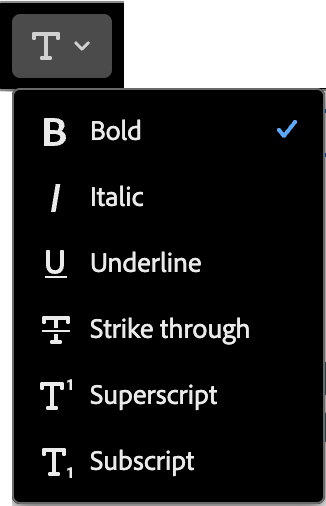
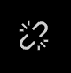
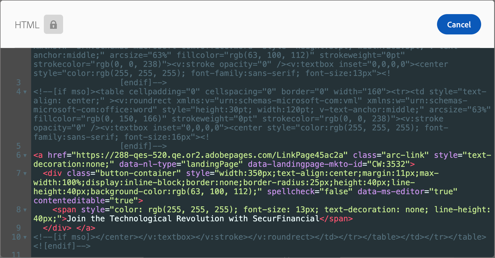
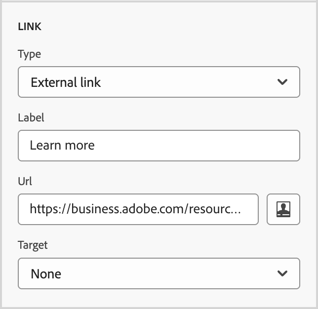

# コンテンツコンポーネント {#content-components}

>[!CONTEXTUALHELP]
>id="ajo-b2b-prime_content_components_email"
>title="コンテンツコンポーネントについて"
>abstract="コンテンツコンポーネントは、メールのデザイン作成に使用できる空のコンテンツプレースホルダーです。"

>[!CONTEXTUALHELP]
>id="ajo-b2b-prime_content_components_landing_page"
>title="コンテンツコンポーネントについて"
>abstract="コンテンツコンポーネントは、ランディングページのデザイン作成に使用できる空のコンテンツプレースホルダーです。"

>[!CONTEXTUALHELP]
>id="ajo-b2b-prime_content_components_fragment"
>title="コンテンツコンポーネントについて"
>abstract="コンテンツコンポーネントは、フラグメントのデザイン作成に使用できる空のコンテンツプレースホルダーです。"

>[!CONTEXTUALHELP]
>id="ajo-b2b-prime_content_components_template"
>title="コンテンツコンポーネントについて"
>abstract="コンテンツコンポーネントは、テンプレートのデザイン作成に使用できる空のコンテンツプレースホルダーです。"

メール、ランディングページ、テンプレート、ビジュアルフラグメントのコンテンツをデザインする場合は、[!UICONTROL &#x200B; コンテンツコンポーネント &#x200B;]を使用してビジュアルデザイン要素を追加します。

レイアウトを定義する1つ以上の[構造コンポーネント &#x200B;](./structure-components.md)内に、必要な数のコンテンツコンポーネントを追加できます。

## コンテンツライブラリ

コンポーネントライブラリの&#x200B;**[!UICONTROL Contents]** セクションには、使用可能なコンテンツコンポーネントが表示されます。

| アイコン | コンポーネント | 説明 |
| --------- | ---- | ----------- |
|  | [コンテナ](#container) | このコンポーネントをデザインに追加して、コンポーネントをグループ化したり、背景や境界線のスタイルを領域に適用したりするために使用できる長方形のコンテナを含めます。 |
|  | [&#x200B; ボタン &#x200B;](#button) | このコンポーネントをデザインに追加して、クリック可能なボタン要素を含めます。 |
|  | [テキスト](#text) | このコンポーネントをデザインに追加して、テキストの本文を含めます。 |
|  | [&#x200B; ディバイダー](#divider) | このコンポーネントをデザインに追加して、コンテンツの個別の領域に水平線を含めます。 |
|  | [HTML](#html) | このコンポーネントをデザインに追加して、既存のHTMLの様々な部分をコピー&amp;ペーストします。 このコンポーネントを使用して、一部の外部コンテンツを再利用するための無料のモジュラーHTML ブロックを作成します。 |
|  | [画像](#image) | このコンポーネントをデザインに追加して、画像ファイルを挿入します。 |
|  | [Social](#social) | このコンポーネントをデザインに追加して、ソーシャルメディアページへのリンクを挿入します。 |
|  | [フォーム](#form) | **_ランディングページでのみ使用できます。_** このコンポーネントをデザインに追加して、作成したフォームを挿入します。 |

## コンテンツコンポーネントツールバー

各コンテンツコンポーネントタイプは、キャンバスで選択したときにツールバーを表示します。 使用可能なツールは、コンポーネントタイプによって異なりますが、レンダリングされたコンテンツ内でコンポーネントを直接操作する簡単な方法を提供します。 ツールバーには、コンポーネントタイプに適用できる書式設定機能と機能機能が含まれています。

{width="450"}

### 書式設定ツール

+++テキストスタイルを変更

<table>
    <tr>
        <th style="width: 30%;">ツール</th>
        <th style="width: 50%;">使用方法</th>
        <th style="width: 20%;">コンポーネント</th>
    </tr>
    <tr>
        <td></td>
        <td>選択したテキスト文字列に、太字、斜体、下線、取り消し線、上付き文字、下付き文字を適用します。</td>
        <td><li>ボタン <li>テキスト</td>
    </tr>
</table>

+++

+++水平方向の整列

<table>
    <tr>
        <th style="width: 30%;">ツール</th>
        <th style="width: 50%;">使用方法</th>
        <th style="width: 20%;">コンポーネント</th>
    </tr>
    <tr>
        <td></td>
        <td>コンポーネントコンテンツに水平配置タイプを適用します。 左、中央揃え、右または両端揃えを選択します。 </td>
        <td><li>ボタン <li>テキスト</td>
    </tr>
</table>

+++

+++リストを作成

<table>
    <tr>
        <th style="width: 30%;">ツール</th>
        <th style="width: 50%;">使用方法</th>
        <th style="width: 20%;">コンポーネント</th>
    </tr>
    <tr>
        <td></td>
        <td>コンポーネントテキストに順序付きリストまたは順序付きリストの書式を適用します。</td>
        <td><li>テキスト</td>
    </tr>
</table>

+++

+++見出しを設定

<table>
    <tr>
        <th style="width: 20%;">ツール</th>
        <th style="width: 60%;">使用方法</th>
        <th style="width: 20%;">コンポーネント</th>
    </tr>
    <tr>
        <td></td>
        <td>カーソル位置の段落に見出しレベルの書式を適用します。</td>
        <td><li>ボタン <li>テキスト</td>
    </tr>
</table>

+++

+++フォント サイズ

<table>
    <tr>
        <th style="width: 20%;">ツール</th>
        <th style="width: 60%;">使用方法</th>
        <th style="width: 20%;">コンポーネント</th>
    </tr>
    <tr>
        <td></td>
        <td>選択したテキストにフォントサイズを適用します。 ツールをクリックし、サイズを選択するか、px値を入力します。</td>
        <td><li>ボタン <li>テキスト</td>
    </tr>
</table>

+++

+++フォントカラー

<table>
    <tr>
        <th style="width: 40%;">ツール</th>
        <th style="width: 40%;">使用方法</th>
        <th style="width: 20%;">コンポーネント</th>
    </tr>
    <tr>
        <td></td>
        <td>選択したテキストにフォントカラーを適用します。 ピッカーからカラーを選択し、カラースライダーとカラーフィールドを使用してカラーを選択します。 または、既知のRGB、HSL、HSB、または16進数値を入力することもできます。 </td>
        <td><li>ボタン <li>テキスト</td>
    </tr>
</table>

+++

+++リンクを挿入

<table>
    <tr>
        <th style="width: 40%;">ツール</th>
        <th style="width: 40%;">使用方法</th>
        <th style="width: 20%;">コンポーネント</th>
    </tr>
    <tr>
        <td></td>
        <td>選択したテキストまたは要素のクリック可能なリンクを作成します。 <li>メールコンテンツ – 外部URLまたはランディングページを指定します。<li>ランディングページコンテンツ – 外部リンクを指定します。</td>
        <td><li>ボタン <li>テキスト <li>Image </td>
    </tr>
</table>

+++

+++リンクを削除

<table>
    <tr>
        <th style="width: 15%;">ツール</th>
        <th style="width: 60%;">使用方法</th>
        <th style="width: 25%;">コンポーネント</th>
    </tr>
    <tr>
        <td></td>
        <td> 選択したテキストまたは要素のクリック可能なリンクを削除します。</td>
        <td><li>ボタン <li>テキスト <li>Image </td>
    </tr>
</table>

+++

### 機能ツール

| ツール | 名前 | 使用方法 |
| ---- | ---- | ----- |
| {width="40"} | パーソナライゼーションの追加 | パーソナライゼーションエディターを使用して、コンポーネントコンテンツにパーソナライゼーショントークンを挿入します。 [詳細情報](./email-authoring.md#personalize-content) |
| {width="40"} | ソースコードを表示 | コンポーネントのHTML ソースコードを読み取り専用ポップアップで表示します。  {width="200"} |
| {width="40"} | 条件付きコンテンツの有効化 | （メールとフラグメント） コンポーネントの条件付きバリアントを有効にします。 |
| {width="40"} | 複製 | コンポーネントのコピーを作成し、以下に直接追加します。 |
| {width="40"} | 削除 | コンポーネントを削除します。 |

## デザインにコンテンツコンポーネントを追加する

1. ビジュアルデザイン空間で、既存のテンプレートを使用するか、必要な構造コンポーネントを空のキャンバスに追加してレイアウトを定義します。

1. **[!UICONTROL コンポーネント]** ライブラリで、選択したコンテンツコンポーネントの&#x200B;_ドラッグハンドル_ を取得し、それを構造コンポーネントにドラッグ&amp;ドロップします。

   単一の構造コンポーネントおよび構造コンポーネントの各列に複数のコンポーネントを追加できます。

   {width="600" zoomable="yes"}

1. 右側の&#x200B;**[!UICONTROL 設定]**&#x200B;および&#x200B;**[!UICONTROL スタイル]** タブ、またはキャンバスに表示されるコンテキストツールバーを使用して、コンポーネントの表示を調整します。

   例えば、コンポーネントのテキストスタイル、パディング、マージンを変更できます。

   {width="600" zoomable="yes"}

デザインの作業中に、[機能ツール &#x200B;](#functional-tools) セクションの&#x200B;**削除**&#x200B;および&#x200B;**複製** ツールを使用して、コンポーネントを削除または複製することもできます。

## コンテンツコンポーネントの設定とスタイル

コンポーネントを追加すると、ビジュアルデザインスペースでコンポーネントが選択され、右側のパネルにそのプロパティが表示されます。 また、いつでもコンポーネントを選択して、設定やスタイルを変更することもできます。 多くの設定やスタイルはコンポーネントに固有ですが、選択したコンテンツコンポーネントに適用できる標準設定やスタイルがいくつかあります。

### 表示オプション

デスクトップまたはモバイルデバイスの表示からコンポーネントを除外する場合は、**[!UICONTROL 表示オプション]**&#x200B;設定を変更します。 デフォルトの&#x200B;_[!UICONTROL すべてのデバイスに表示]_&#x200B;では、すべてのデバイスで表示が有効になります。 別の設定を選択して、デバイスタイプ別にコンポーネントを排他的にします。

* _[!UICONTROL デスクトップデバイスでのみ表示]_ - コンポーネントをデスクトップデバイスに表示し、モバイルデバイスに対して除外する場合は、この設定を選択します。
* _[!UICONTROL モバイルデバイスでのみ表示]_ – この設定は、スマートフォンやタブレットなどのモバイルデバイスにコンポーネントを表示し、デスクトップデバイスに対しては除外する場合に選択します。

{width="400" zoomable="yes"}

### コンテナ {#container}

コンテナを使用して、コンテンツコンポーネントのグループに特定のスタイルを適用します。 [!UICONTROL Container] コンポーネントを追加してから、その中に他のコンテンツコンポーネントを追加します。 このコンポーネントは、HTMLで`div`要素を使用する方法と似ています。 コンテナに含まれるコンテンツコンポーネントに適用されるスタイルとは異なる、明確なスタイルをコンテナに適用できます。

例えば、_[!UICONTROL コンテナ]_&#x200B;コンポーネントを追加してから、 _[!UICONTROL ボタン]_&#x200B;コンポーネントをそのコンテナ内に追加します。 コンテナに特定のエリアのスタイル設定を使用し、必要に応じてボタンとその背景のスタイルを設定できます。

{width="600" zoomable="yes"}

+++背景

{{styles-background}}

+++

+++境界

{{styles-border}}

+++

+++サイズ

{{styles-size}}

+++

+++マージン

{{styles-margin}}

+++

+++パディング

{{styles-padding}}

+++

### ボタン {#button}

[!UICONTROL &#x200B; ボタン &#x200B;] コンポーネントを使用して、1つまたは複数のクリック可能なボタンをコンテンツに挿入します。 ボタンを使用して、ページビューアまたはメール受信者をサポートコンテンツ（公開されたランディングページまたは外部リンク）にリダイレクトします。

#### ボタンのテキストを追加

ボタンコンポーネントがキャンバスに表示されると、ツールバーには、テキスト書式設定のオプションと、パーソナライゼーションおよび条件付きバリアントが含まれます。 エディターツールバーのオプションについて詳しくは、[&#x200B; コンテンツコンポーネントツールバー](#content-component-toolbars)を参照してください。

ボタンのラベルテキストを入力して書式を設定すると、コンテンツに合わせてボタンのサイズが変更されます。

{width="500" zoomable="yes"}

#### リンクオプションの設定 {#button-set-link-options}

「_[!UICONTROL 設定]_」タブで、**[!UICONTROL リンク]** オプションを使用して、ボタンのテキスト、リンク先、およびターゲットページを読み込むためのブラウザーの動作を定義します。

1. リンクの&#x200B;**[!UICONTROL Type]**&#x200B;を設定します。

   * **[!UICONTROL 外部リンク]** – 標準URLをリンク先として使用するには、このタイプを選択します。

     **[!UICONTROL Url]**&#x200B;に、リンク先のURLを入力します。 _パーソナライズ_ （）アイコンをクリックして、パーソナライゼーショントークンをURLのパラメーターとして使用します。

     {width="200"}

   * **ランディングページ** – このタイプを選択すると、接続されているMarketo Engage インスタンス <!-- Journey Optimizer B2B Edition (_Beta_) or -->で公開されたランディングページが選択されます。

     「**[!UICONTROL ランディングページ]**」オプションで、公開されたランディングページを選択します。 _ページを選択_ アイコン （）をクリックし、[公開されたランディングページを選択](./landing-pages.md#link-to-landing-page)。

     {width="200"}

1. **[!UICONTROL Label]**&#x200B;に、ボタン内に表示するテキストを入力します。

   ボタンのサイズは、テキストと設定したスタイルに従って調整されます。

1. **[!UICONTROL Target]**&#x200B;の場合、リンク先をメールまたはページからリダイレクトする方法を選択します。

   * _[!UICONTROL なし]_ - デフォルトのブラウザーまたはクライアントの動作（デフォルト）を使用してリンクを開きます。
   * _[!UICONTROL 空白]_ – 新しいウィンドウまたはタブでリンクを開きます。
   * _[!UICONTROL 自分]_ – 同じフレームでリンクを開きます。
   * _[!UICONTROL 親]_ – 親フレーム内のリンクを開きます。
   * _[!UICONTROL トップ]_ - ウィンドウの本文のリンクを開きます。

#### スタイルを設定

「**[!UICONTROL スタイル]**」タブでボタンのスタイル設定をカスタマイズします。

+++背景

{{styles-background}}

+++

+++テキスト

{{styles-text}}

+++

+++境界

{{styles-border}}

+++

+++サイズ

{{styles-size}}

+++

+++配置

{{styles-alignment-h-v}}

+++

+++ボタンマージン

{{styles-margin}}

+++

+++コンテナマージン

{{styles-margin}}

+++

+++パディング

{{styles-padding}}

+++

+++アドバンス

{{styles-advanced}}

+++

### テキスト {#text}

テキストコンポーネントを使用して、コンテンツにテキストブロックを挿入します。 テキストコンポーネントがキャンバスで選択されている場合は、テキストを入力し、ツールバーオプションを使用して、インラインの書式設定と、パーソナライゼーショントークンや条件付きバリアントなどのオプションを追加します。

「**[!UICONTROL スタイル]**」タブで、テキストコンポーネントのスタイル設定をカスタマイズします。

+++背景

{{styles-background}}

+++

+++テキスト

これらのスタイルは、テキストブロック全体に適用されます。 選択したテキスト文字列にインラインスタイルを適用できます。

{{styles-text}}

+++

+++境界

{{styles-border}}

+++

+++サイズ

{{styles-size}}

+++

+++マージン

{{styles-margin}}

+++

+++パディング

{{styles-padding}}

+++

+++アドバンス

{{styles-advanced}}

+++

### ディバイダー {#divider}

_Divider_ コンポーネントを追加して、コンテンツのセクション間に線形の除算を組み込みます。

+++背景

{{styles-background}}

+++

+++折れ線グラフ

「_[!UICONTROL スタイル]_」タブが選択された右側のパネルで、**[!UICONTROL 行]** セクションを展開し、コンポーネントの高さと幅のオプションを設定します。

* **[!UICONTROL カラー]** - カラーの正方形をクリックして、ピッカーからカラーを選択します。 RGB、HSL、HSB、または16進数値を入力すると、カラーを選択できます。 または、カラースライダーとカラーフィールドを使用してカラーを選択することもできます。

* **[!UICONTROL 高さ]** – 上下の矢印アイコンをクリックして、ピクセル数を増減します。 空の値（Auto）がデフォルトで、要素の高さが要素の内容に応じてサイズ調整されます。

* **[!UICONTROL 幅]** - トグルを使用して、幅をピクセルまたはパーセント単位で設定します。

   * パーセンテージ幅の場合は、スライダーを使用してパーセンテージ値を設定します。 パーセンテージは、含まれるブロックのコンテンツボックスに基づいてエレメントのサイズを決定します。このボックスでは、パディングと境界線は除外されます。 例えば、値が50の場合、要素の幅は、含まれるブロックコンテンツの幅の50%に設定されます。

  {width="250"}

   * ピクセルベースの幅の場合は、上下の矢印アイコンをクリックして、ピクセル数を増減します。 空の値（Auto）がデフォルトで、要素の幅を内容に応じてサイズ調整します。

* **[!UICONTROL スタイル]** - _Solid_、_Dotted_、_Dashed_&#x200B;など、標準CSS `line-style`値のリストから値を選択します。

+++

+++サイズ

{{styles-size}}

+++

+++配置

{{styles-alignment-h}}

+++

+++マージン

{{styles-margin}}

+++

+++パディング

{{styles-padding}}

+++

+++アドバンス

{{styles-advanced}}

+++

### HTML {#html}

HTML コンポーネントを使用して、既存のHTMLの一部を追加します。 このコンポーネントを使用すると、外部コンテンツを再利用するHTMLのモジュール要素を簡単に作成できます。

1. キャンバス上のコンポーネントを選択し、ツールバーの「_ソースコードを表示_」アイコンをクリックします。

   {width="450"}を追加します

1. テキストボックスにHTMLを貼り付け、**[!UICONTROL 保存]**&#x200B;をクリックします。

   {width="600" zoomable="yes"}

   HTMLが有効な場合は、カンバス上にエレメントがレンダリングされます。 他のコンテンツコンポーネントのいずれかにマッピングするエレメントの場合は、コンポーネントタイプに応じて右側のパネルの設定とスタイルを変更できます。 そうでない場合は、HTML コンポーネントとして残ります。

HTML コンポーネントの場合、右側のパネルで、HTML コンポーネント全体に対して次のスタイルを設定できます。

+++背景

{{styles-background}}

+++

+++境界

{{styles-border}}

+++

+++サイズ

{{styles-size}}

+++

+++配置

{{styles-alignment-h-v}}

+++

+++マージン

{{styles-margin}}

+++

+++パディング

{{styles-padding}}

+++

+++アドバンス

{{styles-advanced}}

+++

### Image {#image}

[!UICONTROL 画像] コンポーネントを使用して、画像アセットをコンテンツに挿入します。 _画像_ コンポーネントがキャンバスで選択されている場合、表示されている画像アセットファイルを追加または変更できます。

{width="400" zoomable="yes"}

#### 画像アセットの追加 {#add-image-asset}

画像アセットを追加する方法を選択します。

* **[!UICONTROL アセットを選択]** – このタイプを選択すると、[!DNL Journey Optimizer B2B Prime] Assets ライブラリから画像アセットを参照して選択できます。

  {width="700" zoomable="yes"}

  ダイアログから、選択したリポジトリから画像を選択できます。 「**[!UICONTROL 選択]**」をクリックして、アセットを追加します。

  必要なアセットを見つけるのに役立つツールがあります。

   * 左上の&#x200B;_フィルター_ アイコンをクリックして、条件に従って表示される項目をフィルタリングします。

   * 「_検索_」フィールドにテキストを入力して、アセット名に一致する表示アイテムをフィルタリングします。

* **[!UICONTROL メディアの読み込み]** – このタイプを選択して、システムからファイルを選択し、[!DNL Journey Optimizer B2B Prime] アセットライブラリに読み込みます。

  _[!UICONTROL 画像をアップロード]_ ダイアログで、システムからファイルをファイル ボックスにドラッグ&amp;ドロップします。 最大ファイルサイズは100 MBです。

  {width="450"}

  選択した画像のファイル名がダイアログに表示されます。 アセットファイル名は（フォルダー間で）一意である必要があり、名前のファイルが既に存在する場合は、メッセージが表示されます。 名前の最大文字数は100文字です。特殊文字（`;`、`:`、`\`、`|`など）を含めることはできません。

  「**[!UICONTROL 読み込み]**」をクリックします。

右側のパネルで、画像のタイトルと代替テキストを追加できます。

{width="250"}

#### リンクオプションの設定 {#image-set-link-options}

_[!UICONTROL 設定]_ タブで、**[!UICONTROL リンク]** オプションを使用して、画像を宛先とリンクさせ、ターゲットページを読み込むためのブラウザーの動作を行います。

1. リンクの&#x200B;**[!UICONTROL Type]**&#x200B;を設定します。

   * **[!UICONTROL 外部リンク]** – 標準URLをリンク先として使用するには、このタイプを選択します。

     **[!UICONTROL Url]**&#x200B;に、リンク先のURLを入力します。 _パーソナライズ_ （）アイコンをクリックして、パーソナライゼーショントークンをURLのパラメーターとして使用します。

     {width="250"}

   * **ランディングページ** – このタイプを選択すると、接続されているMarketo Engage インスタンス <!-- Journey Optimizer B2B Edition (_Beta_) or -->で公開されたランディングページが選択されます。

     「**[!UICONTROL ランディングページ]**」オプションで、公開されたランディングページを選択します。 _ページを選択_ アイコン （）をクリックし、[公開されたランディングページを選択](./landing-pages.md#link-to-landing-page)。

     {width="250"}

1. **[!UICONTROL Label]**&#x200B;の場合、オプションで画像リンクの説明テキストを入力します。

1. **[!UICONTROL Target]**&#x200B;の場合、リンク先をメールまたはページからリダイレクトする方法を選択します。

   * _[!UICONTROL なし]_ - デフォルトのブラウザーまたはクライアントの動作（デフォルト）を使用してリンクを開きます。
   * _[!UICONTROL 空白]_ – 新しいウィンドウまたはタブでリンクを開きます。
   * _[!UICONTROL 自分]_ – 同じフレームでリンクを開きます。
   * _[!UICONTROL 親]_ – 親フレーム内のリンクを開きます。
   * _[!UICONTROL トップ]_ - ウィンドウの本文のリンクを開きます。

#### スタイルの設定

右側のパネルで、画像コンポーネントのスタイルを設定します。

+++背景

{{styles-background}}

+++

+++境界

{{styles-border}}

+++

+++サイズ

{{styles-size}}

+++

+++配置

{{styles-alignment-h}}

+++

+++マージン

{{styles-margin}}

+++

+++パディング

{{styles-padding}}

+++

+++アドバンス

{{styles-advanced}}

+++

### ソーシャル {#social}

_ソーシャル_ コンポーネントを使用して、ソーシャルメディアページへのリンクをコンテンツに挿入します。 3つのデフォルトのソーシャルメディアタイプが含まれていますが、ニーズに応じてタイプを追加または削除できます。

{width="600" zoomable="yes"}

* ソーシャルメディアタイプを追加するには、_追加_ （**+**）アイコンをクリックし、追加するソーシャルメディアタイプを選択します。

  {width="250"}

* ソーシャルメディアの種類を削除するには、ソーシャルメディアアイコンの横にある&#x200B;**X**&#x200B;をクリックします。

各ソーシャルメディアの種類のカードを展開して、オプションを設定します。

* **[!UICONTROL URL]** - ソーシャルメディアのグラフィックまたはアイコンにリンクするソーシャルメディア URLを入力します。
* **[!UICONTROL Source]** - デフォルトではなく独自の画像を使用する場合は、画像アセットを選択します。 Assets ライブラリから画像を選択するか、システムから画像ファイルを読み込むことができます。 画像アセットの選択と読み込みについて詳しくは、[画像コンポーネント情報](#add-the-image-asset)を参照してください。
* **[!UICONTROL 代替テキスト]** – 表示される画像の代替テキストを入力します。

{width="250"}

すべてのソーシャルメディアグラフィックに対して一貫した表示サイズを定義するには、**[!UICONTROL 画像のサイズ]**&#x200B;を設定します。

_ソーシャル_ コンポーネントには、次のスタイルオプションを設定できます。

+++背景

{{styles-background}}

+++

+++境界

{{styles-border}}

+++

+++サイズ

{{styles-size}}

+++

+++配置

{{styles-alignment-h}}

+++

+++マージン

{{styles-margin}}

+++

+++パディング

{{styles-padding}}

+++

+++アドバンス

{{styles-advanced}}

+++

### フォーム（ランディングページのみ） {#form}

_Form_ コンポーネントを使用して、公開したフォームをランディングページまたはランディングページテンプレートに追加します。 フォームの作成と公開について詳しくは、[Forms](./forms.md)を参照してください。

1. コンポーネントツールバーの&#x200B;_Form_ ツールをクリックするか、右側の&#x200B;**[!UICONTROL 埋め込みフォーム]** プロパティを使用して、公開されたフォームを選択します。

   {width="600"}

1. フォームのデフォルトの&#x200B;**[!UICONTROL フォローアップタイプ]**&#x200B;を上書きする場合は、ページまたはテンプレートの要件に従って設定を変更します。

   このページは、フォームの&#x200B;_ありがとうページ_&#x200B;とも呼ばれ、この設定により、訪問者がフォームを送信したときに何が起こるかが決まります。

   * **[!UICONTROL ページを維持]** - フォームの送信時に訪問者を同じページに維持するには、このオプションを選択します。

   * **[!UICONTROL ランディングページ]** - [!DNL Journey Optimizer B2B Prime]またはMarketo Engage ランディングページをフォローアップとして選択するには、このオプションを選択します。

   * **[!UICONTROL 外部URL]** – 任意のURLをフォローアップページとして指定するには、このオプションを選択します。 訪問者がフォームを送信すると、ブラウザーは指定されたURLを読み込みます。

     >[!TIP]
     >
     >フォームを使用してファイルをダウンロードする場合は、ホストされているファイルのURLを指定できます。 この設定では、送信ボタンはダウンロードボタンとして機能します。

     {width="280"}

必要に応じて、右側のパネルで「**[!UICONTROL スタイル]**」タブを選択し、構造コンポーネント内のフォームマージンを設定します。

{{styles-margin}}
