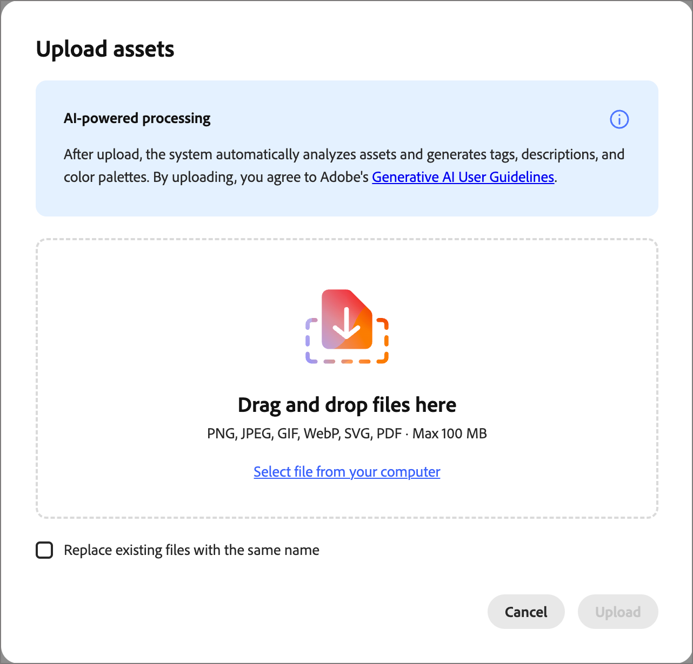

# アセット

[!DNL Adobe Journey Optimizer B2B Prime]では、アセットは通常、ジャーニーをサポートするコンテンツを設計する際に使用される画像です。 これらの画像は、[電子メール &#x200B;](email-authoring.md)、[電子メールテンプレート &#x200B;](templates.md)、[&#x200B; ビジュアルフラグメント &#x200B;](email-authoring.md#visual-fragments)のアセットセレクターまたはビジュアルデザイン空間内のシンプルなドラッグ&amp;ドロップインターフェイスで使用できます。

サポートされているファイル形式：JPG、JPEG、GIF、PNG、EPS、SVG、RGB

<!--
>[!NOTE]
>
>In this Beta release, you can choose images and assets from a one-time copy of your Marketo Engage asset library directly inside the email canvas. Modifying assets in Marketo Engage after the initial copy is **not** reflected in [!DNL Journey Optimizer B2B Prime].
-->

&#x200B;>>
追加の画像アセットは、_[!UICONTROL Assets]_ ライブラリまたはコンテンツデザインスペースからアップロードできます。 これらのアップロードされたアセットは、[!DNL Journey Optimizer B2B Prime] インスタンスでのみ使用できます。
&#x200B;>>
外部システムからのアセットの読み込みと、事前入力されたアセットライブラリへのアクセスはまだ利用できません。 今後のリリースには、既存システムからのアセットのインポート、フォルダーサポート、拡張されたアセット管理機能が含まれる予定です。

<!-- You can [edit these assets using Adobe Express](./image-edit-adobe-express.md), and move them into folders to organize them for use across your emails, templates, and fragments. -->

**Assets** ライブラリでは、画像やその他のクリエイティブアセットを保存および管理するための一元化されたリポジトリにアクセスできます。 また、メタデータを自動的に生成し、自然言語での検索を可能にするAIを利用した機能も搭載されています。

左側のナビゲーションで、**[!UICONTROL Content Management]**&#x200B;を展開し、**[!UICONTROL Assets]**&#x200B;を選択します。

{width="800" zoomable="yes"}

>[!BEGINSHADEBOX]

_[!UICONTROL Assets]_ ライブラリに初めてアクセスする場合は、[_[!UICONTROL 生成AI利用条件&#x200B;]_](https://www.adobe.com/jp/legal/licenses-terms/adobe-gen-ai-user-guidelines.html)を確認し、契約書を確認してください。

{width="500"}

>[!ENDSHADEBOX]

ライブラリでは、次の2つのレイアウトオプションをサポートしています。

* **[!UICONTROL リスト]** — _リストビュー_ （）アイコンをクリックすると、メタデータ列を含む並べ替え可能なテーブルにアセットが表示されます。
* **[!UICONTROL ギャラリー]** — _ギャラリービュー_ （）アイコンをクリックすると、アセットが視覚的なサムネールグリッドとして表示されます。

## アセットの検索 {#find-assets}

_[!UICONTROL 検索]_ フィールドを使用して、必要なアセットを自然言語で記述してアセットを検索します。 検索結果は、AIが生成したメタデータにもとづいているため、ファイル名で検索する場合に限りません。

**例：**

* `team members`
* `nature`
* `exercise`

{width="700" zoomable="yes"}

## アセットの詳細を表示 {#view-details}

リストまたはギャラリービューでアセットを選択すると、右側にAIが生成した説明、タグ、キーワード、その他のメタデータフィールドが表示される詳細ビューが開きます。 この情報は、アセットがアップロードされたときに自動的に生成されます。 生成された説明、タグ、メタデータを確認するには、「**[!UICONTROL AI メタデータ]**」タブを選択します。

{width="700" zoomable="yes"}

## アセットのアップロード {#upload}

1. 右上の「**[!UICONTROL アップロード]**」をクリックします。

1. ダイアログで、ローカルシステムからファイルをドラッグ&amp;ドロップします。

   {width="450"}

   または、**[!UICONTROL コンピューターからファイルを選択]**&#x200B;をクリックして、ローカルファイルシステムを使用してファイルを検索して選択することもできます。

1. 「**[!UICONTROL ファイルをアップロード]**」をクリックして、ファイルを確認し、リポジトリにアップロードします。

アップロードが完了すると、システムは自動的に説明を生成し、タグとキーワードを割り当て、被写体や設定などの視覚属性を抽出します。 手作業によるタグ付けは必要ありません。 このプロセスが完了するまで、新しい画像は&#x200B;_[!UICONTROL 処理中]_&#x200B;のステータスで表示されます。

{width="700" zoomable="yes"}

## コンテンツオーサリングへのアセットの使用 {#assets-authoring}

メール、メールテンプレート、ビジュアルフラグメントを作成する際にアセットを使用します。 ビジュアルコンテンツエディターは、_Assets_ ライブラリの画像にアクセスします。 画像アセットをアップロードして、内部アセットリポジトリに配置することもできます。

画像アセットは、画像コンポーネントの設定を編集する際や、カンバス上で直接編集する際に選択できます。

* **_空のコンポーネント_** - キャンバスに画像コンポーネントを追加すると、そのコンポーネントは空になり、画像ファイルの選択または読み込みを簡単に選択できます。

  {width="500"}

* **_画像コンポーネントツールバー_** - キャンバスで画像コンポーネントを選択している場合、ツールバーから簡単にソースを選択して画像ファイルを選択できます。

  {width="500"}

* **_画像コンポーネント設定_** - キャンバスで画像コンポーネントを選択している場合、右側のパネルで設定を表示および編集できます。 コンポーネントに表示される画像ファイルを追加または変更するには、ソースタイプを選択し、画像ファイルを選択します。

  {width="350"}

「**[!UICONTROL アセットを選択]**」をクリックしてアセットセレクターを開き、[!DNL Journey Optimizer B2B Prime] アセットリポジトリから画像を選択できます。

{width="700" zoomable="yes"}

検索とフィルターを使用して、目的の画像アセットを見つけることができます。 アセットを選択し、「**[!UICONTROL 選択]**」をクリックして、画像コンポーネントに使用します。

また、構造コンポーネントの背景設定で画像アセットを選択することもできます。
