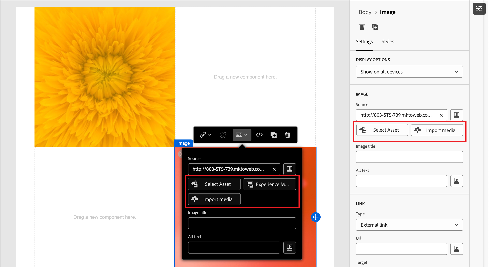

# メールコンテンツ作成

[!DNL Adobe Journey Optimizer B2B Prime]では、電子メール デザイン スペースは、マーケターが電子メールを構成する視覚的なキャンバスを提供します。 左側と上部のパネル（構造、コンテンツコンポーネント、テンプレート、フラグメントなど）のメールデザインツールは、ドラッグ&amp;ドロップでゼロから作成できる機能をサポートしています。 また、テンプレートから開始、生のHTMLをペースト、再利用可能なビジュアルフラグメントからメッセージを組み立てることもできます。

>[!IMPORTANT]
>
>サブドメイン、認証、IP プール、および電子メールチャネル設定の管理者による設定については、[電子メールの配信品質](../start/email-deliverability.md)および[電子メールチャネルの設定](../admin/email-channel-configuration.md)を参照してください。

[!DNL Journey Optimizer B2B Prime]では、すべての電子メールは、個人ジャーニー内の&#x200B;_[!UICONTROL 電子メールを送信]_ アクションに関連付けられます。 ジャーニーの設計から電子メールの定義に至るまでのワークフロー全体が、ひとつの連続的な体験で実現されます。 [&#x200B; ユーザーのジャーニーに&#x200B;_メール送信_ ノード &#x200B;](../marketing/action-nodes.md#add-an-action-node)を追加する場合、「**[!UICONTROL メール作成]**」をクリックしてプロセスを開始します。 まず、メールのアクションとコンテンツ設定を定義します。 「**[!UICONTROL メール本文を編集]**」をクリックして、メールコンテンツデザインスペースを起動します。ここでは、次のオプションからメールのデザイン方法を選択できます。

* ビジュアルデザインインターフェイスを使用して[&#x200B; メールをゼロからデザイン &#x200B;](#design-from-scratch)。 空白のキャンバスにドラッグ&amp;ドロップして、コンポーネントごとにメールレイアウトコンポーネントを作成します。 この方法は、新しいテンプレートや単発のメールを作成するのに最適です。

* [既存のHTML コンテンツ &#x200B;](#import-html-content)をコードエディターに読み込むか、ビジュアルキャンバスと並べて作業します。

* [&#x200B; ビルトインまたはカスタムのメールテンプレートのリストから既存のテンプレート &#x200B;](#templates)を選択します。 この方法は、繰り返し可能なメールのユースケースに最適です。

<!-- * Upload a design prototype (JPG, PNG, PDF, or Figma export) and have AI Assistant convert it into a responsive HTML email. (Image to HTML (Img2HTML) -->

{width="800" zoomable="yes"}

## メールデザインツール {#email-design-tools}

* **一番上のツールバー：**&#x200B;保存、戻る、コードエディターに切り替える、プレビューコントロール。
* **左パネル：**&#x200B;構造（列レイアウト）、コンテンツ（テキスト、ボタン、画像、ディバイダー、ソーシャル、HTML）、フラグメント、テンプレート、ナビゲーションツリー（メールのDOM スタイル階層）。
* **センターキャンバス：** デスクトップとモバイルのプレビューが表示されたWYSIWYG エディター。
* **右側のパネル：** コンテンツプロパティ、背景、境界線、パディング、パーソナライゼーションなど、現在選択されているコンポーネントの設定とスタイル。

>[!BEGINSHADEBOX]

## メールデザインのベストプラクティス {#design-best-practices}

HTMLとCSSのベストプラクティスに従うことで、メールクライアント間で一貫性のあるレンダリングを実現できます。

| アプローチ | ガイダンス |
| -------- | -------- |
| **おすすめ** | 静的なテーブルベースのレイアウト ・ HTMLのテーブルとネストされたテーブル ・ 600～800 pxのテンプレート幅・ シンプルなインライン CSS ・ Web セーフフォント |
| **慎重に使用** | 背景画像（限定的なクライアントサポート） ・ カスタム web フォント（常にフォールバックフォントを定義） ・ 800 pxを超えるレイアウト ・画像マップ |
| **回避** | JavaScript、iframe、またはFlash ・埋め込みオーディオまたはビデオ ・ HTML フォーム ・ Div ベースのレイアウト |

>[!NOTE]
>
>また、メールコンテンツが、適用されるデジタルアクセシビリティ要件を満たしている必要があります。 見出しを論理的に構成し、すべての画像に代替テキストを提供し、明るいモードと暗いモードの両方でカラーコントラストを検証します。

>[!ENDSHADEBOX]

## メールをゼロからデザイン {#design-from-scratch}

ビジュアルコンテンツデザイン機能を使用して、メールの構造とコンテンツを定義します。 シンプルなドラッグ&amp;ドロップ操作で構造コンポーネントを追加、移動させることで、メールコンテンツのレイアウトと整理を数秒でデザインすることができます。

1. _[!UICONTROL メールをデザイン]_ ページから、**[!UICONTROL ゼロからデザイン]** オプションを選択します。

<!-- 

1. In the _[!UICONTROL Create email]_ dialog, choose the type of email content that you want to author.

   * **[!UICONTROL Use Themes]** - Choose this option to create the email in _Theme mode_. In this mode, you can use a defined brand theme to streamline the content authoring process and make sure that the design aligns with defined standards.

   * **[!UICONTROL Manual Styling]** - Choose this option to create the email in _Manual mode_. In this mode, you manually set the styling for all structure and content components that you add to the blank canvas.

-->

1. [&#x200B; キャンバスに構造とコンテンツのコンポーネント &#x200B;](#structure-content)を追加します。

1. [&#x200B; リンクのレビューと更新](#preview-and-edit-linked-urls)。

1. [電子メールをテスト &#x200B;](#check-and-test-the-email)。

コンテンツに問題がなければ、**[!UICONTROL 保存]**&#x200B;をクリックします。

## 既存のHTML コンテンツのインポート {#import-html-content}

{{$include /help/_includes/content-design-import.md}}

{width="500"}

>[!NOTE]
>
>`<table>` タグを HTML ファイルの最初のレイヤーとして使用すると、上部レイヤータグの背景や幅の設定などのスタイルが失われる可能性があります。

ビジュアルメールエディターツールを使用して、必要に応じてインポートしたコンテンツをパーソナライズできます。

## テンプレートを選択 {#templates}

メールデザインスペースを開く場合は、**[!UICONTROL デザインテンプレートを選択]** セクションを使用して、組み込みのサンプルテンプレートまたは保存されたカスタムテンプレートから開始します。 ワークフロー全体については、[電子メールでテンプレートを使用](./templates.md#use-in-journey)を参照してください。

>[!NOTE]
>
>保存したテンプレートには、1つ以上のコンポーネントにガバナンス（コンテンツロック）設定を適用することができます。 ビジュアルデザインスペースでは、管理されたテンプレートから電子メールを[作成](./template-content-governance.md)する際に、ロックされたコンポーネントに関するガイドラインが表示されます。

## 構造とコンテンツの追加 {#structure-content}

ビジュアルメールエディターを使用して、メールメッセージを作成します。 プリヘッダーを追加し、列と区切り記号でレイアウトを構成してから、画像、ボタン、テキストなどのコンテンツコンポーネントを配置します。 また、カスタム CSSを適用して高度なスタイル設定を行い、ダークモードでデザインがレンダリングされる方法をプレビューすることもできます。

### プリヘッダーの設定 {#preheader}

プリヘッダーは、受信トレイのプレビューで件名の後に表示されるテキストのスニペットです。 [!DNL Journey Optimizer B2B Prime]では、プリヘッダーは、電子メールデザインスペースのビジュアルキャンバスで設定されます。件名と一緒に電子メールプロパティ画面で設定されません。

左側のナビゲーションツリーで&#x200B;**[!UICONTROL Body]**&#x200B;を選択した状態で、右側の&#x200B;**[!UICONTROL 設定]** パネルを開きます。

「**[!UICONTROL プリヘッダー]**」テキスト領域をクリックし、プリヘッダーコピーを入力します。 「_パーソナライゼーションを追加_」（）アイコンをクリックして、必要に応じて書式と[&#x200B; パーソナライゼーショントークン &#x200B;](#personalize-content)をリッチテキストコントロールを使用して適用します。

>[!TIP]
>
>プリヘッダーは40～100文字の範囲に収めます。 件名を補完し（繰り返さず）、受信者が電子メールを開くための追加の理由を提供する必要があります。

### ダークモード {#dark-mode}

ダークモードのレンダリングは、CSS `prefers-color-scheme` メディアクエリでサポートされています。 メールデザインツールには、ダークモードのプレビューや、メールクライアントをサポートするカスタムスタイルを定義するオプションが含まれています。これにより、テキストが読みやすいままであること、ロゴが表示されていること、ブランドカラーが暗い背景にも引き続き表示されていることを検証できます。

プレビュー、カスタムダークモード設定の設定、メールクライアントサポート、およびテストのベストプラクティスに関する詳細なガイダンスについては、[&#x200B; メールコンテンツのダークモード &#x200B;](./email-dark-mode.md)を参照してください。

### 構造コンポーネントとコンテンツコンポーネントを追加 {#components}

[構造コンポーネント &#x200B;](./structure-components.md)と[&#x200B; コンテンツコンポーネント &#x200B;](./content-components.md)をキャンバスに追加して、メールレイアウトを構築します。

左側のパネルの&#x200B;**[!UICONTROL 構造]**&#x200B;および&#x200B;**[!UICONTROL コンテンツ]** セクションから項目をドラッグし、右側の&#x200B;_[!UICONTROL 設定]_&#x200B;および&#x200B;_[!UICONTROL スタイル]_ タブで各コンポーネントを設定します。

### カスタム CSS を追加 {#custom-css}

カスタム CSSをメールデザインスペースに直接追加して、標準コンポーネントの設定を超えた高度なスタイル設定を行うことができます。 画像、ボタン、テキストなどのコンテンツコンポーネントを含める前に、このレベルの高いスタイル設定を追加することをお勧めします。

手順、構文ルール、およびトラブルシューティングについては、[&#x200B; コンテンツ用カスタム CSSの追加](./design-custom-css.md)を参照してください。

>[!NOTE]
>
>メールメッセージがロックされたコンテンツ [&#128279;](./template-content-governance.md)を含む テンプレートを使用してデザインされている場合、コンテンツにカスタム CSSを追加することはできません。 ボタンのラベルが&#x200B;**[!UICONTROL カスタム CSS を表示]**&#x200B;に変わり、コンテンツに既に存在するカスタム CSS は読み取り専用になります。

### フラグメントを追加 {#visual-fragments}

ビジュアルフラグメントは、再利用可能なデザインコンポーネントで、[!DNL Journey Optimizer B2B Prime]全体で複数のコンテンツアセットで参照できます。 通常は、コンテンツのブロックを作成し、すばやく挿入することで、オーサリングをより迅速に、より一貫性のあるものにできます。

次の例では、コンテンツのオーサリング時にフラグメントを追加する手順の概要を示します。

1. フラグメントのリストを開くには、「_フラグメント_」アイコン（）を選択します。

   次の操作が可能です。

   * リストの並べ替え。
   * リストを参照、検索、またはフィルターします。
   * サムネール表示とリスト表示を切り替えます。
   * 最近作成したフラグメントを反映するには、リストを更新します。

   {width="700" zoomable="yes"}

1. 任意のフラグメントを構造コンポーネントにドラッグ&amp;ドロップします。

   エディターは、メール構造のセクション/エレメント内でフラグメントをレンダリングします。

   フラグメントのコンテンツは、構造内で動的に更新され、フラグメントがメール内でどのようにレンダリングされるかをプレビューします。

<!-- 
>[!BEGINSHADEBOX]

**Editable fields in customizable fragments**

A visual fragment can include editable fields that you can customize. Custom fields allow you to modify parameters when you incorporate the fragment into your content and create a tailored experience without affecting the original fragment. The fragment author can design the fragment for customization of text, image, and button components. If an included fragment contains components with editable fields, you can change the default values to customize it for your content.

1. Select the fragment component.

   The Settings displayed on the right include editable fields with the default values.

   {width="700" zoomable="yes"}   

1. Change any editable field as needed.

>[!ENDSHADEBOX]
-->

メールが保存されると、要約で「_[!UICONTROL 使用者]_」タブを選択すると、フラグメントの詳細ページに表示されます。

### 画像アセットの追加 {#insert-image}

[!DNL Journey Optimizer B2B Prime]がプロビジョニングされると、既存のMarketo Design Studio アセットが電子メールデザインスペースで使用できるようになります。 これらの画像は、アセットピッカーから直接メールで閲覧し、挿入することができます。

>[!IMPORTANT]
>
>[!DNL Journey Optimizer B2B Prime]でのアセットの使用状況は、Marketo Design Studioからアセットの&#x200B;**回限りのコピー**&#x200B;に基づいています。 最初のコピーの後にMarketo Engageでアセットを変更すると、**not**&#x200B;が[!DNL Journey Optimizer B2B Prime]に反映されます。 ビジュアルデザインスペースまたは[Assets ライブラリ &#x200B;](./digital-asset-management.md)から画像アセットを直接アップロードすることもできます。

サポートされている画像ファイルの種類：

* **完全にサポートされている** （ピッカーで表示、埋め込み可能なインライン）:JPG、PNG、GIF、WebP。
* **注意事項**&#x200B;でアクセス可能：SVG（一部の電子メールクライアントがSVGをレンダリングしないという警告が表示されます）。
* **このBeta リリースではサポートされていません：** TIFF、PDF、DOCX、XLSX、PPTX、CSS、JS、HTML、TXT、バイナリ ファイル、PSD、AI、INDD。

ビジュアルコンテンツデザイン領域で、左側のナビゲーションバーで「_Assets_」（）アイコンを選択します。 アセットセレクターから、Assets ライブラリに保存されているアセットを直接選択できます。

* 画像アセットを構造コンポーネントにドラッグ&amp;ドロップして、新しいアセットを追加します。

  {width="800" zoomable="yes"}

* 既存の画像アセットをキャンバスで選択し、画像ソースツールで「**[!UICONTROL アセットを選択]**」をクリックして置き換えます。

  {width="600" zoomable="yes"}

アセットの使用について詳しくは、[_コンテンツのオーサリングにアセットを使用_](./digital-asset-management.md#assets-authoring)&#x200B;を参照してください。

### レイヤー、設定、スタイルの移動 {#navigation-layers}

ナビゲーションツリーを使用してコンポーネントと列を選択し、右側のパネルで設定とスタイルを調整します。 [&#x200B; ナビゲーションツリー](./structure-components.md#navigation-tree)を参照してください。

### コンテンツのパーソナライズ {#personalize-content}

[!DNL Journey Optimizer B2B Prime]は、パーソナライゼーションにHandlebars構文を使用しています。 トークンは、送信時に各受信者のプロファイルデータの値に置き換えられます。 メール内でパーソナライゼーションを使用できる場所は複数あります。

* **件名** – 最も一般的なパーソナライゼーションポイント。
* **Preheader** — ビジュアルキャンバス内で設定します。プロファイル属性トークンをサポートします。
* **Email body text** — インラインで挿入された名とその他のプロファイル属性。
* **ボタン URL** – 受信者ごとのパラメーターを追加します。

>[!NOTE]
>
>このBeta リリースのPersonalization エディターでは、プロファイル属性のみが使用できます。

_パーソナライゼーションを追加するには&#x200B;:_

1. 電子メールデザインスペース（または件名の電子メールプロパティページ）で、トークンを挿入するフィールドをクリックします。
1. パーソナライゼーショントークンを使用するには、_パーソナライズ_ （）アイコンをクリックします。
1. パーソナライゼーションダイアログで、左側のスキーマツリーを参照します。 プロファイル属性（名、姓、電子メール、役職およびその他のプロファイルフィールド）が一覧表示されます。
1. 属性を選択します。 エディターは、対応するHandlebars式（例：`{{profile.firstName}}`）を挿入します。
1. 欠落しているデータを処理するフォールバック値を追加します：`{{profile.firstName | default: "there"}}`。
1. **[!UICONTROL 確認]**&#x200B;または&#x200B;**[!UICONTROL 挿入]**&#x200B;をクリックします。 式がフィールド内にインラインで表示されます。

+++共通のパーソナライゼーション パターン {#personalization-patterns}

次のようなHandlebars式を使用します（パーソナライゼーションは、[&#x200B; コンテンツのパーソナライズ &#x200B;](#personalize-content)で説明されているのと同じ構文を使用します）。

* `{{profile.lastName}}` – 受信者の姓を挿入します。
* `{{profile.jobTitle}}` – 本文のコピーで受信者の役職を参照します。
* `{{profile.firstName}}, ready to take the next step?` — トークンと静的テキストをインラインで結合します。

値が見つからない場合のフォールバックを含む名あいさつには、前のパーソナライゼーション手順に示すように`default` ヘルパーを使用します（例えば、名がデフォルトの`"there"`の場合）。

+++

+++Handlebars ヘルパー{#handlebars-helpers}

`default`以降、パーソナライゼーションエディターには、条件付きロジック、テキスト変換、日付の書式設定を行うためのHandlebars ヘルパーが組み込まれています。 エディターの関数ブラウザーを使用して、使用可能なヘルパーを検索し、正しい構文で挿入します。

>[!TIP]
>
>電子メールデザイン領域で、`{{`を任意のテキストフィールドに直接入力して、使用可能なプロファイル属性を一覧表示するインライン自動補完ドロップダウンリストをトリガーします。クイック挿入のために完全なパーソナライゼーションダイアログを開く必要はありません。

+++

+++AI支援の式{#ai-personalization}

パーソナライゼーションエディターのAI アシスタントは、平易な言語の説明からハンドルバー式を生成し、既存の式の機能を説明し、潜在的な問題を特定することができます。 式のオーサリングを高速化するために使用します。特に、条件付きロジックや日付形式のヘルパーで使用します。

+++

式エディターツールと構文について詳しくは、[Personalization式](./personalization-expressions.md)を参照してください。

### リンクされたURL トラッキングを編集 {#preview-and-edit-linked-urls}

{{$include /help/_includes/content-design-links.md}}

## メールを確認およびテスト {#check-and-test-the-email}

電子メールデザインスペースツールバーのデスクトップとモバイルのプレビューコントロールを使用して、電子メールレイアウトを保存する前に確認します。 ダークモードのプレビューに切り替えて、読みやすさとコントラストを検証します（メールコンテンツの[&#x200B; ダークモード &#x200B;](./email-dark-mode.md)を参照）。

このBeta リリースでは、テストプロファイル、[!UICONTROL &#x200B; コンテンツをシミュレート &#x200B;]、プルーフワークフローの送信は使用できません。 メールチャネルの概要の[現在の制限](../marketing/email-channel.md#limitations)を参照してください。

ジャーニーをアクティブ化する前に解決する必要があるコンテンツアラートについては、[電子メールコンテンツの検証](#validation)を確認してください。

## メールコンテンツの検証 {#validation}

ジャーニーをアクティブ化する前に、メールコンテンツが有効である必要があります。 [!DNL Journey Optimizer B2B Prime]は、電子メールおよびジャーニーキャンバスでコンテンツレベルのアラートを表示します。 このセクションでは、表示される可能性のあるアラートとその解決方法について説明します。

### 共通コンテンツアラート {#content-alerts}

| アラート | 意味 | 解決方法 |
| ----- | ------------- | -------------- |
| **件名がありません** | 「件名」フィールドが空です。 | 電子メールを開き、「**[!UICONTROL コンテンツ]**」タブに件名を入力します。 Personalization トークンは許可されていますが、フィールドを空にすることはできません。 |
| **メール本文が空です** | メールデザイン分野のキャンバスにコンテンツがない。 | 「**[!UICONTROL メール本文を編集]**」をクリックして、メールデザインスペースを開きます。 少なくとも1つの構造と1つのコンテンツコンポーネントをカンバスにドラッグし、「保存」をクリックします。 |
| **チャネル設定が選択されていません** | メールノードにメールチャネル設定が選択されていません。 | 「**[!UICONTROL アクション]**」タブで、アクティブな&#x200B;**[!UICONTROL メールチャネル設定]**&#x200B;を選択します。 |
| **チャネル設定が削除されました** | 以前に選択したチャネル設定が削除されたか、アクティブではなくなりました。 | 「**[!UICONTROL アクション]**」タブで、別のアクティブな&#x200B;**[!UICONTROL メールチャネル設定]**&#x200B;を選択します。 利用できない場合は、管理者が[&#x200B; メールチャネル設定](../admin/email-channel-configuration.md)で作成または再アクティブ化する必要があります。 |
| **電子メール サイズが100 KBを超えています** | メールの合計サイズ （HTML、インライン CSS、エンコードされたコンテンツ）が、100 KB ISPのベストプラクティスの上限を超えています。 | メールサイズを削減する：大きなインライン画像をMarketo Design Studioから外部でホストされている画像に置き換え、未使用のインライン CSSを削除し、ネストされた構造を簡素化します。 |
| **未解決のパーソナライズ トークン** | Handlebars トークンは、フォールバックのないプロファイル属性を参照し、一部の受信者では属性が見つからない場合があります。 | [&#x200B; コンテンツのパーソナライズ &#x200B;](#personalize-content)の説明に従って、Handlebars `default` ヘルパーを使用してフォールバックを追加します。 または、属性が保証されるプロファイルにジャーニーオーディエンスを制限します。 |
| **画像が読み込まれていません** | 画像コンポーネントは、使用できなくなったアセットを参照します。 | 画像をクリックし、アセットピッカーを開き、Assets ライブラリからアセットを再選択します。 |
