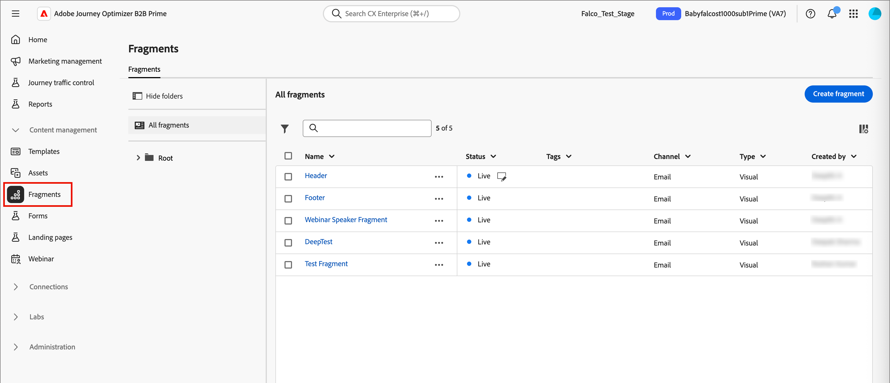

# フラグメント

フラグメントは、再利用可能なコンポーネントで、[!DNL Journey Optimizer B2B Prime]の1つ以上のメールとメールテンプレートで参照できます。 通常は、コンテンツのブロック（テキスト、画像、またはその両方）を作成し、メールやメールテンプレートにすばやく挿入できます。 この機能を利用すれば、マーケティング部門のメンバーが使用するために複数のカスタムコンテンツブロックを事前に構築し、デザインプロセスを向上させるためにメールコンテンツを作成できます。 一般的なユースケースには、電子メールのヘッダー/フッターコンテンツブロック、イベント招待バナー、季節ごとの挨拶などがあります。

>[!BEGINSHADEBOX]

**ビジュアルフラグメント**

ビジュアルフラグメントは、ビジュアルデザインツールを使用して作成された事前定義済みのビジュアルブロックです。複数のメールやメールテンプレートで再利用できます。 現在の[!DNL Journey Optimizer B2B Prime]の範囲と、このドキュメントにはビジュアルフラグメントのみが含まれています。

>[!NOTE]
>
>式ベースのフラグメントは、[!DNL Journey Optimizer B2B Prime]ではまだサポートされていません。

>[!ENDSHADEBOX]

ワークフローでフラグメントを最大限に活用するには：

* _独自のフラグメントを作成_ - ビジュアルコンテンツデザイン空間からコンテンツをフラグメントとして保存するか、ゼロからビジュアルフラグメントを作成します。
* _フラグメントを再利用_ – 電子メールまたは電子メールテンプレートコンテンツで必要な回数だけフラグメントを使用します。

## フラグメントへのアクセスと管理 {#access-manage-fragments}

[!DNL Journey Optimizer B2B Prime]のビジュアルフラグメントにアクセスするには、左側のナビゲーションに移動し、**[!UICONTROL コンテンツ管理]**&#x200B;を展開します。 次に、**[!UICONTROL フラグメント]**&#x200B;を選択します。 このアクションを実行すると、インスタンスで作成されたすべてのフラグメントがテーブルに一覧表示されたリストページが開きます。

{width="700" zoomable="yes"}

テーブルは&#x200B;_[!UICONTROL Modified]_&#x200B;列で並べ替えられ、デフォルトでは最も最近更新されたフラグメントが先頭に表示されます。 列のタイトルをクリックして、昇順と降順を変更します。

左側のフォルダー構造を使用すると、フラグメントを整理できます。 デフォルトでは、すべてのフラグメントが表示されます。 フォルダーを選択すると、選択したフォルダーに含まれるフラグメントとサブフォルダーのみが表示されます。

### フラグメントステータス {#fragment-status}

フラグメントのステータスによって、メールまたはメールテンプレートでの使用の可用性と、フラグメントに行われる変更が決定されます。

| ステータス | 説明 |
| ------ | ----------- |
| 下書き | フラグメントを作成する場合、フラグメントはドラフトステータスになります。 ビジュアルデザインスペースを定義または編集しても、電子メールまたは電子メールテンプレートで使用するために公開するまでは、このステータスのままになります。 使用可能なアクション： <ul><li>すべての詳細を編集<li>ビジュアルデザイン空間での編集<li>公開<li>複製<li>削除 |
| ライブ | フラグメントを公開すると、フラグメントはメールまたはメールテンプレートで使用できるようになります。 公開されたフラグメントコンテンツは、ビジュアルデザイン空間で変更できません。 使用可能なアクション： <ul><li>説明を編集<li>メールまたはテンプレートに追加<li>ドラフトバージョンを作成<li>複製<li>削除（使用中でない場合） |
| ライブ（ドラフト付き） | ライブフラグメントからドラフトを作成しても、ライブバージョンは電子メールまたはメールテンプレートで使用でき、ドラフトコンテンツはビジュアルデザイン空間で変更できます。 ドラフトバージョンを公開すると、現在のライブバージョンに置き換わり、コンテンツが使用中の電子メールや電子メールテンプレートで更新されます。 使用可能なアクション： <ul><li>説明を編集<li>メールまたはテンプレートに追加<li>ビジュアルデザインスペースでのドラフトバージョンの編集<li>ドラフトバージョンを公開<li>複製<li>削除（使用中でない場合） |
| アーカイブ済み | フラグメントはアーカイブされ、_フラグメント_ リストに表示されません。 |

### フラグメントリストのフィルタリング {#filter-list}

名前でフラグメントを検索するには、検索バーにテキスト文字列を入力して一致を検索します。 [ フォルダー](#folders)を選択すると、そのフォルダーの階層の最初のレベルにあるすべてのフラグメントまたはフォルダーに検索が適用されます。

{width="500" zoomable="yes"}

_フィルター_ アイコン （）をクリックして、使用可能なフィルターオプションを表示し、設定を変更して、指定した条件に従って表示される項目をフィルタリングします。

### 列表示のカスタマイズ {#column-display}

右上の&#x200B;_テーブルをカスタマイズ_ アイコン （）をクリックして、テーブルに表示する列をカスタマイズします。

ダイアログで、表示する列を選択し、**[!UICONTROL 適用]**&#x200B;をクリックします。

{width="300"}

### 一括アクション {#bulk-actions}

チェックボックスを使用して複数のフラグメントを選択し、すべてのフラグメントに一括操作を適用できます。 使用可能なアクションは、リストページの下部にある一括アクションバーに表示されます。 次の操作が使用できます。

* **[!UICONTROL フォルダーに移動]** – 選択したフラグメントをフォルダーに移動します。
* **[!UICONTROL アーカイブ]** – 選択したフラグメントをアーカイブします。

また、任意の列ヘッダーをクリックしてフラグメントリストを並べ替え、必要なデータに合わせて列の境界線をドラッグして列のサイズを変更することもできます。

## フラグメントを作成 {#create-fragments}

[!DNL Journey Optimizer B2B Prime]で新しいビジュアルフラグメントを作成するには、右上の「**[!UICONTROL フラグメントを作成]**」をクリックします。

1. _[!UICONTROL フラグメントを作成]_ ページで、便利な&#x200B;**[!UICONTROL 名前]** （必須）と&#x200B;**[!UICONTROL 説明]** （オプション）を入力します。

   * 名前 – 最大100文字、一意にする必要があり、大文字と小文字を区別しない

   * 説明 – 最大300文字

   * Alpha、数値、特殊文字は使用できます

   * 予約済みの文字は&#x200B;**_許可されていません_**: `\ / : * ? " < > |`

   {width="700" zoomable="yes"}

1. 「**[!UICONTROL 作成]**」をクリックします。

   ビジュアルデザインスペースが開き、空のキャンバスが表示されます。

1. コンテンツデザインツールを使用して、ビジュアルフラグメントコンテンツを作成します。

   * [構造とコンテンツの追加](./fragment-authoring.md#design-fragment)
   * [アセットの追加](./fragment-authoring.md#add-assets)
   * [レイヤー、設定、スタイルの移動](./fragment-authoring.md#navigate-layers-settings-styles)
   * [コンテンツのパーソナライズ](./fragment-authoring.md#personalize-content)
   * [リンクされたURL トラッキングを編集](./fragment-authoring.md#edit-linked-url-tracking)

1. いつでも&#x200B;**[!UICONTROL 保存]**&#x200B;をクリックして、ドラフトフラグメントを保存します。

1. フラグメントを電子メールまたは電子メールテンプレートで使用できるようにする準備ができたら、「**[!UICONTROL 公開]**」をクリックします。

## フラグメントの詳細を表示 {#view-details}

リストページで任意のフラグメントの名前をクリックして、フラグメントの詳細ページを開きます。 フラグメントの編集、フラグメントの名前の変更、フラグメントの説明の更新を選択できます。 変更を加え、「名前」フィールドまたは「説明」フィールドの外側をクリックして、変更を自動保存します。

>[!NOTE]
>
>公開されたフラグメントが電子メールまたは電子メールテンプレートで使用されている場合、名前を変更したり、コンテンツを編集したりすることはできません。 フラグメントを変更する場合は、ドラフトバージョンを作成できます。

{width="700" zoomable="yes"}

「**[!UICONTROL フラグメントを編集]**」をクリックして、ビジュアルコンテンツエディターでフラグメントを開きます。

左上の&#x200B;_戻る_&#x200B;矢印をクリックして、いつでもビューを終了すると、_フラグメント_&#x200B;のリストページに戻ります。

## フラグメント参照の表示 {#references}

_Live_ フラグメントの場合、現在フラグメントを参照（使用）しているアセットのリストを表示できます。

1. フラグメントの詳細ページで、詳細（**...**）をクリックします 右上のアイコン。

1. 「**[!UICONTROL 参照を検索]**」を選択します。

   _[!UICONTROL フラグメントの使用状況]_ ページには、[!DNL Journey Optimizer B2B Prime]内でフラグメントが現在使用されているアセットのリストが、電子メールと電子メールテンプレートで表示されます。

   >[!IMPORTANT]
   >
   >メールまたはメールテンプレートで現在使用されているフラグメントは削除できません。

   参照は、カテゴリ _電子メール_&#x200B;または&#x200B;_電子メールテンプレート_&#x200B;に従って表示されます。 [!DNL Journey Optimizer B2B Prime]内のすべての電子メールは、個人ジャーニーの&#x200B;_電子メール送信_ アクションノード内で定義されているため、フラグメントを使用する電子メールの親ジャーニーは参照に表示されます。

1. リンクをクリックして、フラグメントが使用されている対応する電子メールまたは電子メールテンプレートを開きます。

## フォルダーを使用したフラグメントの管理 {#folders}

フラグメントを簡単に移動するには、フォルダーを使用してフラグメントをより効果的に構造化された階層に整理します。 これにより、組織のニーズに応じて項目を分類および管理できます。

_[!UICONTROL ルート]_ フォルダーを選択して、すべてのサブフォルダーにあるフラグメントを含むすべてのフラグメントを表示します。 構造内の任意のフォルダーを選択して、その内容を表示します。 フォルダーを選択した状態で、「フラグメントを作成」をクリックして、そのフォルダーに新しいフラグメントを作成します。

### フォルダーの作成 {#folders-create}

1. 親フォルダー（ルートまたは別のフォルダー）を選択した状態で、右上の「**[!UICONTROL フォルダーを作成]**」をクリックします。

1. 新しいフォルダーの&#x200B;**[!UICONTROL 名前]**&#x200B;を入力し、**[!UICONTROL 保存]**&#x200B;をクリックします。

   選択した親フォルダー内のリストの上に、新しいフォルダーが表示されます。

   その他メニュー（**...**）アイコンをクリックして、フォルダーの名前を変更、移動、または削除できます。

### フォルダーの移動 {#folders-move}

1. _詳細メニュー_&#x200B;をクリックします（**...**） 移動するフラグメントの名前の横にあるアイコン。

1. **[!UICONTROL フォルダーに移動]**&#x200B;を選択します。

1. ダイアログで、フォルダー構造に移動し、フラグメントを移動するフォルダーを選択します。

1. 「**[!UICONTROL 移動]**」をクリックします。

### フォルダーの削除 {#folders-delete}

1. フォルダー構造で、削除するフォルダーの親を選択します。

1. _詳細メニュー_&#x200B;をクリックします（**...**） 削除する表示サブフォルダーの名前の横にあるアイコン。

1. **[!UICONTROL フォルダーを削除]**&#x200B;を選択します。

## フラグメントの編集 {#edit-fragments}

フラグメントの編集は、現在のステータスに応じて異なります。

* フラグメントのステータスが&#x200B;_ドラフト_&#x200B;の場合、その詳細とビジュアルコンテンツを編集できます。
* フラグメントのステータスが&#x200B;_Live_&#x200B;の場合、フラグメントの説明は編集できますが、名前は編集できません。 ドラフトを作成しない限り、ビジュアルコンテンツを編集することはできません。
* フラグメントが既存のドラフトと共に&#x200B;_ライブ_&#x200B;状態にある場合、詳細の編集は説明に限定されます。 ドラフトバージョンのビジュアルコンテンツを編集することもできます。

>[!BEGINTABS]

>[!TAB ドラフト]

1. _[!UICONTROL フラグメント]_&#x200B;のリストページで、フラグメント名をクリックして開きます。

   ビジュアルコンテンツがプレビュー表示されます。

1. 必要に応じて、説明を変更します。

   {width="600" zoomable="yes"}

1. ビジュアルデザインスペースのコンテンツを変更するには、右上の「**[!UICONTROL 編集]**」をクリックします。

   必要に応じて、ビジュアルデザインツールを使用します。

   * [構造とコンテンツの追加](./fragment-authoring.md#design-fragment)
   * [アセットの追加](./fragment-authoring.md#add-assets)
   * [レイヤー、設定、スタイルの移動](./fragment-authoring.md#navigate-layers-settings-styles)
   * [コンテンツのパーソナライズ](./fragment-authoring.md#personalize-content)
   * [リンクされたURL トラッキングを編集](./fragment-authoring.md#edit-linked-url-tracking)

   「**[!UICONTROL 保存]**」または「**[!UICONTROL 保存して閉じる]**」をクリックすると、フラグメントの詳細に戻ります。

1. フラグメントが条件を満たし、電子メールまたは電子メールテンプレートで使用できるようにするには、**[!UICONTROL 公開]**&#x200B;をクリックします。

>[!TAB ライブ]

1. _[!UICONTROL フラグメント]_&#x200B;のリストページで、フラグメント名をクリックして開きます。

   ビジュアルコンテンツのプレビューが表示され、右側にフラグメントの詳細が表示されます。

1. 必要に応じて、説明を変更します。

1. コンテンツを更新する場合は、右上の「**[!UICONTROL 変更]**」をクリックします。

1. ダイアログで、**[!UICONTROL 確認]**&#x200B;をクリックして、フラグメントのドラフトバージョンを作成します。

   {width="300"}

1. 右上の「**[!UICONTROL 編集]**」をクリックします。

1. 必要に応じてビジュアルデザインツールを使用して、ドラフトのコンテンツを更新します。

* [構造とコンテンツの追加](./fragment-authoring.md#design-fragment)
* [アセットの追加](./fragment-authoring.md#add-assets)
* [レイヤー、設定、スタイルの移動](./fragment-authoring.md#navigate-layers-settings-styles)
* [コンテンツのパーソナライズ](./fragment-authoring.md#personalize-content)
* [リンクされたURL トラッキングを編集](./fragment-authoring.md#edit-linked-url-tracking)

「**[!UICONTROL 保存]**」または「**[!UICONTROL 保存して閉じる]**」をクリックすると、フラグメントの詳細に戻ります。

1. ドラフトフラグメントが条件を満たし、変更を電子メールまたは電子メールテンプレートで使用できるようにするには、**[!UICONTROL 公開]**&#x200B;をクリックします。

   ドラフトバージョンを公開すると、現在のライブバージョンに置き換わり、コンテンツは既に使用されているメールとメールテンプレートで更新されます。

>[!TAB  ライブ （ドラフト付き） ]

_[!UICONTROL フラグメント]_&#x200B;のリスト ページから編集用のドラフトバージョンを開くには、次の2つの方法があります。

* フラグメント名の横にある&#x200B;_ドラフト_ アイコン（）をクリックします。

* フラグメント名をクリックして開きます。 次に、右上の&#x200B;_詳細メニュー_ （***...***）アイコンをクリックし、**[!UICONTROL 下書きバージョンを開く]**&#x200B;を選択します。

ドラフトバージョンのビジュアルコンテンツのプレビューが表示されます。

_下書きコンテンツを更新するには&#x200B;:_

1. 右上の「**[!UICONTROL 編集]**」をクリックします。

1. 必要に応じて、ビジュアルデザインツールを使用します。

   * [構造とコンテンツの追加](./fragment-authoring.md#design-fragment)
   * [アセットの追加](./fragment-authoring.md#add-assets)
   * [レイヤー、設定、スタイルの移動](./fragment-authoring.md#navigate-layers-settings-styles)
   * [コンテンツのパーソナライズ](./fragment-authoring.md#personalize-content)
   * [リンクされたURL トラッキングを編集](./fragment-authoring.md#edit-linked-url-tracking)

   「**[!UICONTROL 保存]**」または「**[!UICONTROL 保存して閉じる]**」をクリックすると、フラグメントの詳細に戻ります。

1. ドラフトフラグメントが条件を満たし、変更を電子メールまたは電子メールテンプレートで使用できるようにするには、**[!UICONTROL 公開]**&#x200B;をクリックします。

   ドラフトバージョンを公開すると、現在の公開済みバージョンに置き換わり、コンテンツは既に使用されているメールとメールテンプレートで更新されます。

>[!ENDTABS]

## フラグメントの複製 {#duplicate-fragments}

次のいずれかの方法を使用して、フラグメントを複製できます。

* _[!UICONTROL フラグメント]_&#x200B;のリスト ページで、_詳細_ アイコン （**...**）をクリックします フラグメント名の横にある「**[!UICONTROL 複製]**」を選択します。
* フラグメントの詳細ページの右上にある、_詳細_ （**...**）をクリックします アイコンをクリックし、**[!UICONTROL 複製]**&#x200B;を選択します。

ダイアログで、便利な名前（一意）と説明を入力します。 「**[!UICONTROL 複製]**」をクリックして、アクションを完了します。

複製された（新しい）フラグメントは、同じフォルダーにある&#x200B;_フラグメント_ リストに表示されます。

<!-- 

## Save a new fragment from email or template content {#save-as-fragment}

When you are creating/editing an email or email template in the visual content editor, you can choose to save all or parts of the content as a fragment so that it is available for reuse.

1. When you have some content to be saved as a fragment, click **[!UICONTROL More]** and choose **[!UICONTROL Save as Fragment]**.

1. Select the different elements to be included in the fragment.

   Select multiple structures by holding the Shift or Control button.

   You can only select structures that are adjacent to each other and the interface does not allow you to select non-adjacent elements.

1. With the content selected, click **[!UICONTROL Create]** at the top right.

1. In the dialog, enter a useful name and description for the fragment. Then click **[!UICONTROL Create]**.

   The new fragment is then displayed in the _Fragments_ listing page and is also available for use within emails and email templates.

-->

## 電子メールやテンプレートコンテンツへのビジュアルフラグメントの追加 {#add-to-content}

フラグメントは再利用を考慮して設計されており、電子メールや電子メールテンプレートのオーサリング用に挿入できます。 電子メールまたはテンプレートには、最大30個のフラグメントを追加できます。 フラグメントは、1つのレベルでのみネストできます。

>[!BEGINTABS]

>[!TAB 電子メールにフラグメントを追加]

1. ユーザーのジャーニーに移動し、既存の&#x200B;_[!UICONTROL メール送信]_ アクションノードを開くか、[新しいノードを追加](../marketing/action-nodes.md#add-an-action-node)します。

1. 「**[!UICONTROL メール本文を編集]**」をクリックしてメールコンテンツを開くか、引き続き[ オーサリングします](./email-authoring.md)。

1. **[!UICONTROL 構造]** メニューから項目をドラッグ&amp;ドロップして、フラグメントに&#x200B;_構造_&#x200B;を指定します。

1. 公開されたフラグメントのリストを開くには、_フラグメント_ アイコンをクリックします。

   次の操作が可能です。
   * リストの並べ替え。
   * リストを参照、検索、フィルタリングします。
   * カード（サムネール）とリストビューを切り替えます。
   * 最近作成したフラグメントを反映するには、リストを更新します。

   {width="600"}

1. 任意のフラグメントを構造コンポーネントのプレースホルダーにドラッグ&amp;ドロップします。

   エディターは、メール構造のセクション/エレメント内でフラグメントをレンダリングします。

フラグメントのコンテンツは、構造内で動的に更新され、コンテンツがメールにどのように表示されるかを視覚的に表示します。

>[!TIP]
>
>フラグメントをメール内の水平レイアウト全体に配置する場合は、[!UICONTROL 1:1列]構造を追加し、フラグメントをドラッグ&amp;ドロップします。

電子メールを保存すると、「_[!UICONTROL 使用者]_」タブが選択されている場合に、フラグメントの詳細ページに表示されます。 メールに追加されたフラグメントは、メールまたはテンプレート内では編集できません。公開されたソースフラグメントがコンテンツを定義します。

>[!TAB  メールテンプレートにフラグメントを追加]

1. 左側のナビゲーションから、**[!UICONTROL コンテンツ管理]**&#x200B;を展開し、**[!UICONTROL テンプレート]**&#x200B;を選択します。

1. [新しいテンプレートを作成](./templates-create.md)するか、既存の電子メールテンプレートを開きます。

1. 右側のテンプレートプロパティパネルで、**[!UICONTROL メール本文を編集]**&#x200B;をクリックします。

1. 「**[!UICONTROL 構造]**」メニューから項目をドラッグ&amp;ドロップして、フラグメントに&#x200B;_構造_&#x200B;を含むを指定します。

1. フラグメントのリストを開くには、左側の&#x200B;_フラグメント_ アイコンをクリックします。

   次の操作が可能です。
   * リストの並べ替え。
   * リストを参照、検索、フィルタリングします。
   * カード（サムネール）とリストビューを切り替えます。
   * 最近作成したフラグメントを反映するには、リストを更新します。

   {width="600"}

1. フラグメントを構造コンポーネントにドラッグ&amp;ドロップします。

   エディターは、メールテンプレート構造のセクション/エレメント内でフラグメントをレンダリングします。

>[!TIP]
>
>フラグメントをメールテンプレート内の水平レイアウト全体に配置する場合は、_[!UICONTROL 1:1列]_&#x200B;構造を追加し、フラグメントをドラッグ&amp;ドロップします。

メールテンプレートを保存すると、「_[!UICONTROL 使用者]_」タブが選択されると、フラグメントの詳細ページに表示されます。 メールテンプレートに追加されたフラグメントは、テンプレート内で編集できません。公開されたソースフラグメントがコンテンツを定義します。

>[!ENDTABS]

## メールおよびテンプレートのオーサリング中にフラグメントがアクションを実行 {#fragment-actions}

フラグメントをメールまたはメールテンプレートに追加すると、フラグメントのコンテンツをメールまたはテンプレート内で編集できません。 ただし、次のアクションを適用できます。

* **[!UICONTROL 削除]** – このアクションは、現在の電子メールまたは電子メールテンプレートコンテンツからフラグメントを削除します（フラグメントソースは影響を受けません）。
* **[!UICONTROL 更新]** – このアクションは、現在の電子メールまたは電子メールテンプレートのフラグメントのコンテンツを更新します。 更新は、電子メールまたは電子メールテンプレートに追加した後で、フラグメントに最近編集した内容を反映する場合に便利です。
* **[!UICONTROL 複製]** – このアクションは、エディター内の同じ電子メールまたは電子メールテンプレート内のフラグメントを、同じディメンションで複製し、その下に追加します。
* **[!UICONTROL フラグメントを開く]** – このアクションは、フラグメントエディターページと詳細を含む新しいブラウザータブを開きます。
* **[!UICONTROL 参照を探索]** – このアクションは、フラグメントの使用状況ページを開き、タイプ別にフラグメントの使用状況を表示できます。
* **[!UICONTROL 継承を解除]** – このアクションは、ソースからのフラグメント（およびその変更）の継承を解除します。 このアクションを使用すると、フラグメントコンテンツを電子メールまたは電子メールテンプレート内で独立した編集可能なコンテンツとして利用できます。 このアクションは、元のフラグメントの&#x200B;_Used By_&#x200B;参照から電子メールまたは電子メールテンプレートも削除します。

エディターページでフラグメントを選択すると、これらのアクションはコンテキストツールバーと右側のプロパティパネルから使用できます。

{width="600" zoomable="yes"}
