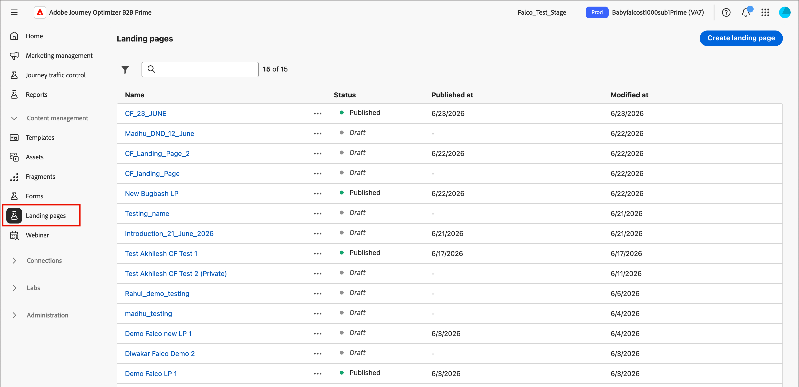
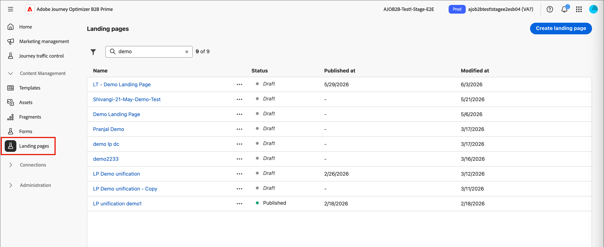

# ランディングページ

ランディングページとは、電子メール、SMS メッセージ、デジタル位置情報でリンクされたアイテムをクリックした後、連絡先や顧客を誘導できるスタンドアロンのweb ページです。 これらのページをジャーニーに組み込むことで、見込み客や顧客にweb上でメッセージを表示してもらい、ジャーニーを進めることができます。

ランディングページの一般的なユースケース：

* マーケティングコミュニケーションや特定のサービスに対するオプトインやオプトアウトの提供。 電子メールやその他のコミュニケーションで、ターゲットリストへのリンクを使用します。
* コミュニケーションを送信する前に同意を収集し、オプトインまたはオプトアウト時に確認メールを送信します。
* ランディングページでフォームを使用して、プロファイルデータ（プログレッシブプロファイリング、嗜好、登録、類似のシナリオ）を取得または更新します。
* ジャーニーオーケストレーションに合わせて設計された、キャンペーン固有の情報に人物を誘導します。
* [!DNL Journey Optimizer B2B Prime]以外の外部ページを作成せずに、ユーザーを専用のweb フォームにリダイレクトします。

## ランディングページワークフロー {#workflow}

ジャーニーオーディエンスのメンバーが特定のリンクをクリックしたときに、定義されたweb ページに誘導するには、[!DNL Journey Optimizer B2B Prime]にランディングページを作成します。

1. [&#x200B; ページを作成](./landing-pages-create-publish.md#create-landing-page) - プリセットを選択し、プライマリページを設定し、必要なサブページを追加します。
1. [&#x200B; ランディングページのコンテンツをデザイン &#x200B;](./landing-page-design.md) - ドラッグ&amp;ドロップ操作のビジュアルデザインコンポーネントを使用してページコンテンツを作成します。
1. [&#x200B; ランディングページをテストする](./landing-pages-create-publish.md#test-landing-page) - ページをプレビューし、フォームの動作をテストします。
1. [&#x200B; ランディングページを公開](./landing-pages-create-publish.md#publish-landing-page) – 公開すると、ページが公開され、リンクに使用できるようになります。
1. [&#x200B; ジャーニーからページにリンク &#x200B;](#link-to-landing-page) – 受信者がアクセスできるように、ランディングページのURLをメール、SMS、またはジャーニーアクションに追加します。

例えば、ランディングページを作成およびデザインして、オーディエンスをオンライン情報に誘導できます。 このページには、コミュニケーションの受信をオプトインまたはオプトアウトできるフォームが含まれます。 また、ニュースレターなどの定期的なコミュニケーションに登録することもできます。

## ランディングページへのアクセスと管理 {#access-manage-landing-pages}

[!DNL Journey Optimizer B2B Prime]のランディングページにアクセスするには、左側のナビゲーションに移動し、**[!UICONTROL コンテンツ管理]**&#x200B;を展開します。 次に、**[!UICONTROL ランディングページ]**&#x200B;を選択します。 このアクションは、インスタンスで作成されたすべてのランディングページのリストを表示します。

{width="800" zoomable="yes"}

リストは、_[!UICONTROL 変更済み]_&#x200B;列に従って並べ替えられ、最も最近更新された項目が上部に表示されます。 列のタイトルをクリックして、昇順と降順を変更します。

### ランディングページリストのフィルター {#filter-list}

ランディングページを名前で検索するには、検索バーにテキスト文字列を入力して一致を検索します。 _フィルター_ アイコン （）をクリックして、使用可能なフィルターオプションを表示し、設定を変更して、指定した条件に従って表示される項目をフィルタリングします。

{width="800" zoomable="yes"}

<!-- 
This is going away? ### Customize the column display

Customize the columns that you want to display in the table by clicking the _Customize table_ icon (  ) at the top right. 

In the dialog, select the columns to display and click **[!UICONTROL Apply]**.

{width="300"} 
-->

### ランディングページのステータスとライフサイクル {#landing-page-status}

ランディングページのステータスによって、電子メールおよびSMS コンテンツ内でのリンクの可用性と、それに対して実行できる変更が決まります。

| ステータス | 説明 |
| -------------------- | ----------- |
| 下書き | ランディングページを作成する場合、そのランディングページはドラフトステータスになります。 ビジュアルコンテンツを定義または編集し、ホストされたページとして公開するまで、このステータスのままになります。 使用可能なアクション： <ul><li>名前または説明を編集</li><li>リンク URLを編集</li><li>ビジュアルデザイン空間での編集</li><li>公開</li><li>複製</li><li>削除</li></ul> |
| 公開日 | ランディングページを公開すると、ランディングページは[!DNL Journey Optimizer B2B Prime] インスタンスでホストされ、メールまたはSMS メッセージのコンテンツでリンクできるようになります。 使用可能なアクション： <ul><li>名前または説明を編集</li><li>リンク URLを編集</li><li>メールまたはSMS メッセージのコンテンツにリンクを追加する</li><li>ドラフトバージョンを作成</li><li>複製</li><li>削除</li></ul> |
| 公開済み下書きあり | 公開されたランディングページからドラフトを作成すると、公開されたバージョンは残り、ドラフトコンテンツはビジュアルデザイン空間で変更できます。 ドラフトバージョンを公開すると、現在の公開済みバージョンが置き換えられ、コンテンツはホストされているページで更新されます。 使用可能なアクション： <ul><li>名前または説明を編集</li><li>リンク URLを編集</li><li>メールまたはSMS メッセージのコンテンツにリンクを追加する</li><li>ビジュアルデザインスペースでのドラフトバージョンの編集</li><li>ドラフトバージョンを公開</li><li>複製</li><li>削除（両方のバージョンを削除）</li><li>ドラフトを破棄（公開済みステータスに戻る）</li></ul> |

{zoomable="yes"}

## ランディングページの編集 {#edit-landing-page}

ランディングページの編集は、現在のステータスに応じて異なります。

* ランディングページのステータスが&#x200B;**_ドラフト_**&#x200B;の場合、その詳細、URL、ビジュアルコンテンツのいずれかを編集できます。
* ランディングページのステータスが&#x200B;**_公開済み_**&#x200B;の場合、説明は編集できますが、名前は編集できません。 ビジュアルコンテンツを変更するには、ページのドラフトバージョンを作成する必要があります。
* ランディングページが&#x200B;**_下書き_**&#x200B;状態で公開済みの場合、詳細の編集は説明に限定されます。 ドラフトバージョンのビジュアルコンテンツを編集することもできます。

>[!BEGINTABS]

>[!TAB ドラフト]

1. _[!UICONTROL ランディングページ]_&#x200B;のリストページで、ランディングページ名をクリックして開きます。

   ビジュアルコンテンツのプレビューが表示され、ランディングページの詳細が右側に表示されます。

1. 名前や説明などの詳細を変更します。

   {width="700" zoomable="yes"}

1. ビジュアルデザインスペースのコンテンツを変更するには、**[!UICONTROL ランディングページを編集]**&#x200B;をクリックします。

   必要に応じて、ビジュアルデザインツールを使用します。

   * [構造とコンテンツの追加](./landing-page-design.md#structure-content-landing-page)
   * [アセットの追加](./landing-page-design.md#add-assets)
   * [レイヤー、設定、スタイルの移動](./landing-page-design.md#navigate-layers-settings-styles)
   * [コンテンツのパーソナライズ](./landing-page-design.md#personalize-content)
   * [リンクされたURL トラッキングを編集](./landing-page-design.md#linked-url-tracking)

1. 「**[!UICONTROL 保存]**」または「**[!UICONTROL 保存して閉じる]**」をクリックすると、ランディングページの詳細に戻ります。

1. ページが条件を満たしており、表示できるようにするには、**[!UICONTROL 公開]**&#x200B;をクリックします。

>[!TAB パブリッシュ済み]

1. _[!UICONTROL ランディングページ]_&#x200B;のリストページで、ページ名をクリックして開きます。

   ビジュアルコンテンツのプレビューが表示され、ランディングページの詳細が右側に表示されます。

1. 必要に応じて、説明を変更します。

   公開したランディングページの場合、他のすべての詳細を変更することはできません。

1. コンテンツを更新する場合は、右側の「**[!UICONTROL ランディングページを編集]**」をクリックします。

   ダイアログで「**[!UICONTROL ドラフトバージョンを作成]**」をクリックして、ビジュアルデザインスペースでドラフトバージョンを開きます。

   必要に応じて、ビジュアルデザインツールを使用します。

   * [構造とコンテンツの追加](./landing-page-design.md#structure-content-landing-page)
   * [アセットの追加](./landing-page-design.md#add-assets)
   * [レイヤー、設定、スタイルの移動](./landing-page-design.md#navigate-layers-settings-styles)
   * [コンテンツのパーソナライズ](./landing-page-design.md#personalize-content)
   * [リンクされたURL トラッキングを編集](./landing-page-design.md#linked-url-tracking)

1. 「**[!UICONTROL 保存]**」または「**[!UICONTROL 保存して閉じる]**」をクリックすると、ランディングページの詳細に戻ります。

1. ドラフトのランディングページが条件を満たしており、公開ページで変更を利用できるようにするには、**[!UICONTROL 公開]**&#x200B;をクリックします。

   ドラフトバージョンを公開すると、現在の公開済みバージョンが置き換えられ、コンテンツがページ URLに更新されます。

>[!TAB 下書きで公開]

ランディングページを開くと、ドラフトバージョンが表示されます。 プレビュースペースの上部にあるタブを使用すると、公開バージョンとドラフトバージョンの表示を切り替えることができます。 下書きのアクションと詳細が右側に表示されます。

{width="700" zoomable="yes"}

_コンテンツを更新するには&#x200B;:_

1. 右上の「**[!UICONTROL ランディングページを編集]**」をクリックします。 必要に応じて、ビジュアルデザインツールを使用します。

   * [構造とコンテンツの追加](./landing-page-design.md#structure-content-landing-page)
   * [アセットの追加](./landing-page-design.md#add-assets)
   * [レイヤー、設定、スタイルの移動](./landing-page-design.md#navigate-layers-settings-styles)
   * [コンテンツのパーソナライズ](./landing-page-design.md#personalize-content)
   * [リンクされたURL トラッキングを編集](./landing-page-design.md#linked-url-tracking)

1. 「**[!UICONTROL 保存]**」または「**[!UICONTROL 保存して閉じる]**」をクリックすると、ランディングページの詳細に戻ります。

1. ドラフトページが条件を満たしており、変更を使用可能にするには、**[!UICONTROL 公開]**&#x200B;をクリックします。

   ドラフトバージョンを公開すると、現在の公開済みバージョンが置き換えられ、コンテンツはホストされているページで更新されます。

>[!ENDTABS]

## ランディングページの複製 {#duplicate-landing-page}

次のいずれかの方法を使用して、ランディングページを複製できます。

* _[!UICONTROL ランディングページ]_&#x200B;のリスト ページで、_詳細_ アイコン （**...**）をクリックします ランディングページ名の横にある「**[!UICONTROL 複製]**」を選択します。
* ランディングページの詳細ページの右上にある「**[!UICONTROL 」をクリックします…詳細]**&#x200B;を選択し、**[!UICONTROL 複製]**&#x200B;を選択します。

{width="600" zoomable="yes"}

ダイアログで、便利な名前（一意）と説明（オプション）を入力します。 「**[!UICONTROL 複製]**」をクリックして、アクションを完了します。

{width="350"}

複製された（新しい）ページは、_ランディングページ_&#x200B;のリストに表示されます。

## ランディングページの削除 {#delete-landing-page}

ランディングページを削除するには、次のいずれかの方法を使用します。

* _[!UICONTROL ランディングページ]_&#x200B;のリスト ページで、_詳細_ アイコン （**...**）をクリックします ランディングページ名の横にある「**[!UICONTROL 削除]**」を選択します。
* ランディングページの詳細ページの右上にある「**[!UICONTROL 」をクリックします…詳細]**&#x200B;を選択し、**[!UICONTROL 削除]**&#x200B;を選択します。

このアクションを実行すると、確認ダイアログが開きます。 「**[!UICONTROL キャンセル]**」をクリックするか、「**[!UICONTROL 削除]**」をクリックして削除を確認することで、プロセスを中止できます。

{width="400"}

## ランディングページへのリンク {#link-to-landing-page}

電子メール、フラグメント、ページコンテンツを作成するマーケターまたはクリエイティブは、[!DNL Journey Optimizer B2B Prime] インスタンスで作成された公開（ライブ）ランディングページへのリンクを埋め込むことができます。

1. フラグメント、電子メール、ランディングページ、またはテンプレートのビジュアルデザインスペースで作業する際に、リンクのテキストの抜粋、ボタンコンポーネント、または画像コンポーネントを選択します。

   右側のパネルには、**[!UICONTROL リンク]**&#x200B;のオプションが表示されます。

1. **[!UICONTROL Type]** オプションで、**[!UICONTROL ランディングページ]**&#x200B;を選択します。

   {width="700" zoomable="yes"}

1. **[!UICONTROL ランディングページ]** オプションで、_ページを選択_ アイコン （）をクリックします。

1. ランディングページを選択ダイアログで、**[!UICONTROL ランディングページソース]**&#x200B;を&#x200B;**[!UICONTROL Journey Optimizer B2B edition]**&#x200B;として設定し、公開されたページのリストからランディングページのチェックボックスをオンにして、**[!UICONTROL 選択]**&#x200B;をクリックします。

   {width="600" zoomable="yes"}

1. 「**[!UICONTROL ターゲット]**」オプションで、リンクターゲットの動作を選択します。

   * **[!UICONTROL なし]** - ブラウザーの既定の動作を使用してリンクを開きます。
   * **[!UICONTROL 空白]** – 新しいウィンドウまたはタブでリンクを開きます。
   * **[!UICONTROL 自分]** – 同じフレームでリンクを開きます。
   * **[!UICONTROL 親]** – 親フレーム内のリンクを開きます。
   * **[!UICONTROL トップ]** - ウィンドウの本文のリンクを開きます。

1. （テキストリンクのみ）リンクされたテキストに下線を引く場合は、「**[!UICONTROL 下線リンク]**」チェックボックスを選択します。

   右側のパネルで「**[!UICONTROL スタイル]**」タブを選択すると、リンクカラーを含むリンクテキストに追加のスタイルを設定できます。
