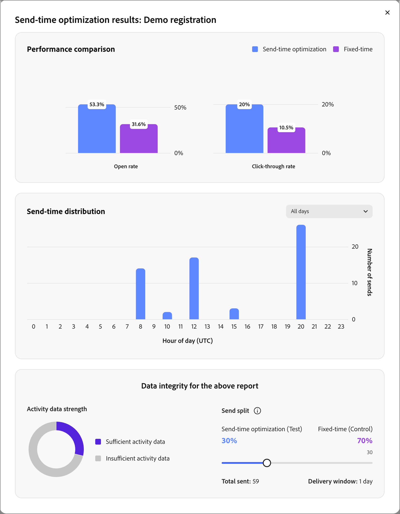

# メール送信時間の最適化

送信時間の最適化（STO）機能を使用して、各プロファイルがエンゲージする可能性が最も高いタイミングを予測し、[人のジャーニー](./person-journeys.md)のメール配信タイミングをパーソナライズします。 STOは、送信時間を固定するのではなく、過去のメールエンゲージメントシグナルを利用して、各受信者に最適な時間に配信をスケジュールし、エンゲージメント全体を向上させます。

STOは、大規模な言語モデルを使用して、各プロファイルの過去のエンゲージメントを分析します。 潜在的な送信時間を予測およびランク付けし、最適化ウィンドウ内で最も高いランク付けされた時間に配信をスケジュールします。

AI アシスタントの自然言語クエリを通じて、使用状況、エンゲージメントリフト、STO比較と非STO比較などのパフォーマンスインサイトを入手できます。

>[!BEGINSHADEBOX]

STOに対して計画されている&#x200B;**_今後の機能強化_**&#x200B;は多数あります。

* _[!UICONTROL 管理者]_&#x200B;領域のグローバル STO設定
* ジャーニーレベルのSTO有効化
* 設定可能なテスト/コントロール分割

>[!ENDSHADEBOX]

## 設定 {#configuration}

[&#x200B; ユーザーのジャーニーに&#x200B;_[!UICONTROL アクション]_ ノード &#x200B;](./action-nodes.md)を追加し、**[!UICONTROL 電子メールを送信]** アクションを選択すると、送信時間の最適化を設定できます。

1. 「_メールを送信_ ジャーニーアクションノード」を選択します。

1. 右側のノードプロパティで、**[!UICONTROL 送信時間の最適化]** オプションを有効にします。

   {width="450" zoomable="no"}

1. ウィンドウとテスト配布を指定するには、STO オプションを設定します。

   * **[!UICONTROL 次の]**&#x200B;以内に送信 – この値により、最適化ウィンドウ（日数）が決定されます。これは、メールを配信できる時間範囲です。 例えば、5日間で開催されるウェビナーの場合、4日間または5日間の期間を設定できます。 STOは、このウィンドウ内の各プロファイルに最適な予測送信時間を選択します。

   * **STO / 固定ディストリビューション** - STOは、_テストとコントロールの分割_&#x200B;を自動的に作成し、対象プロファイルを最適化された送信時間と固定された送信時間で分割します。 分割により、パフォーマンスを直接比較できます。 （カスタムの分割率を許可するように、今後の機能強化が計画されています）。

   >[!NOTE]
   >
   >強力なエンゲージメント履歴を持つプロファイルは、STOの影響を測定するために、コントロールグループとテストグループに均等に分割されます。 統計的に信頼性の高い結果を得るために、STOと非STOの分割は30%から70%の間で制限されています。 これにより、より小さなコホートで結果が歪むことを防ぎ、有意義な比較を実現できます。

1. _[!UICONTROL メールを送信]_ ノードの直後に、[様が&#x200B;_待機_ ノード &#x200B;](./wait-nodes.md)を追加します。

   待機ノードは、STO対応のメールアクションに直ちに従う必要があります。 このノードを追加すると、最適化ウィンドウ全体がクリアされ、すべてのSTO送信が完了するまで、プロファイルがジャーニーに残ります。 このノードを省略すると、システムは設定を無効としてフラグ付けします。

1. ユーザージャーニーの残りの部分を完了したら、[公開](./person-journeys.md#publish)に進みます。

## レポート {#reporting}

STOのパフォーマンス データは、[AI アシスタント &#x200B;](../agents/chat-interface.md)を通じて`send-time-report` スキルを使用して利用できます。 すべてのメールノードを要約したジャーニーレベルのレポートを表示したり、特定のメールアクションのノードレベルのレポートにドリルダウンしたりできます。

レポートには、ジャーニーの各メールノードが表示され、STOが有効になっているかどうかが示されます。 また、STO対応メールと非STO メールの比較を表で示すことで、エンゲージメント向上を評価できます。

### STO レポートの生成 {#generate-sto-report}

AI アシスタントを使用してSTO レポートを生成するには、次の3つの方法があります。

**スラッシュコマンドを使用**

1. AI アシスタントパネルに「`/`」と入力すると、使用可能なスキルのリストが表示されます。
1. リストから&#x200B;**[!UICONTROL send-time-report]**&#x200B;を選択し、上向き矢印をクリックしてクエリを送信します。

   {width="700" zoomable="yes"}

   ジャーニーがエディターで開かれている場合、AI アシスタントはそれをコンテキストとして自動的に使用します。 それ以外の場合は、ジャーニーの指定を求めるプロンプトが表示されます。

   AI アシスタントがレポートを読み込み、概要カードを表示します。

1. 「**[!UICONTROL レポートを開く]**」をクリックして、ノードレベルの詳細を含むレポート全体を表示します。

**電子メールノードをクリック**

1. ジャーニーキャンバスで、**[!UICONTROL メールを送信]** ノードをクリックします。

1. AI アシスタントパネルで、STO レポートを要求します。

   ノードが選択されているため、AI アシスタントはそれをコンテキストとして使用し、そのノードのみにスコープ付きのレポートを返します。

   レポートが読み込まれ、概要カードが表示されます。

1. 「**[!UICONTROL レポートを開く]**」をクリックして、レポート全体を表示します。

**自然言語クエリ**

1. AI アシスタントパネルに、「_ジャーニー名[のSTO レポートを入手する]_」などのリクエストを入力します。

   アシスタントはリクエストを解釈し、`send-time-report` スキルを読み込み、レポートを生成し、概要カードを表示します。

1. 「**[!UICONTROL レポートを開く]**」をクリックして、レポート全体を表示します。

### メールレポートデータを表示する {#sto-report-data}

AI アシスタントパネルを小さくして、表示されるレポートのサイズを大きくしたり、スクロールして幅を完全に表示したりできます。

{width="700" zoomable="yes"}

_[!UICONTROL 詳細]_&#x200B;列で、**[!UICONTROL STO結果を表示]**&#x200B;をクリックしてポップアップウィンドウを開きます。 このウィンドウには、_パフォーマンス比較_、_送信時間ディストリビューション_、_データ整合性_&#x200B;の電子メールデータのビジュアライゼーションが表示されます。

{width="500" zoomable="yes"}
