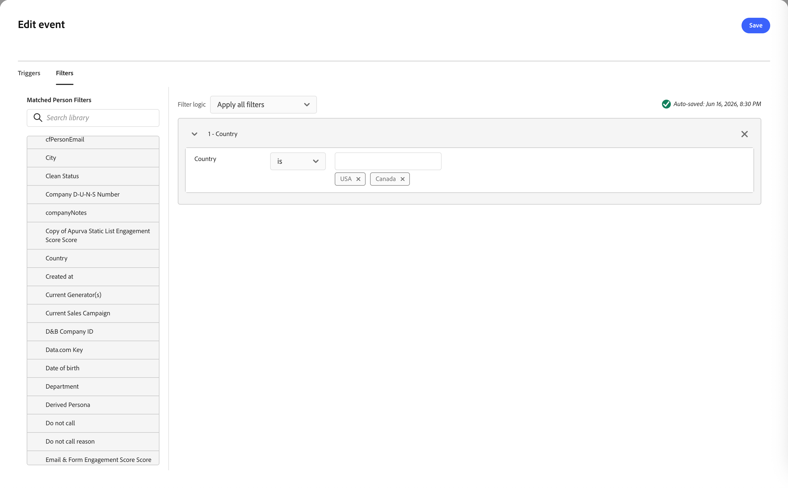

# イベントノードをリッスンします

イベントが発生したときにオーディエンスをジャーニーの次のステップに進めるために、_イベントをリッスン_ ノードを追加します。

## イベントトリガー {#event-triggers}

次のような[!DNL Marketo Engage] アクティビティに関するトリガーを作成できます。

* フォームへの入力 – 人物がランディングページで[!DNL Marketo Engage] フォームを送信するとアクティベートされます。
* Web ページへの訪問 – リードがトラッキング対象のWeb ページを表示するとアクティベートされます（正確なURLを指定するか、ワイルドカードを使用できます）。
* クリックリンク – マーケティングメール内の追跡されたリンクがクリックされたときにアクティベートされます。
* データ値の変更 – 特定のフィールド（リードステータス、スコア、業界など）が個人のレコードで更新されたときにアクティベートされます。
* Campaignはリクエスト済み – APIまたはWebhook統合によく使用され、別のプログラムまたはweb サービスが呼び出すと、このトリガーがキャンペーンを開始します。
* スコアが変更された場合 – 個人のリードスコアが一定のしきい値を超えて増加または減少した場合に発生します。
* モバイルプッシュタップ – モバイルマーケティングスマートキャンペーンで、プッシュ通知がデバイス上でやり取りされたときに発生します。

## イベントフィルター {#event-filters}

| フィルター | 説明 |
| ------- | ----------- |
| アクティビティ履歴/メール | 選択した1つ以上のメールメッセージを使用して評価される条件に基づくメールアクティビティ： <li>メール内リンクをクリックした <li>メールを開封済み |
| アクティビティ履歴/変更されたデータ値 | 選択した人物属性に対して、値の変更が発生しました。 次の変更タイプがあります。 <li>新しい値 <li>前回の値 <li>理由 <li>ソース <li>アクティビティの日付 <li> 分 回数 |

## イベントノードの追加 {#add-event-node}

1. ジャーニーキャンバスに移動します。

1. パスのプラス（**+**）アイコンをクリックし、**[!UICONTROL イベントをリッスン]**&#x200B;を選択します。

   {width="200"}

1. 右側のノードプロパティで、**[!UICONTROL イベント条件を追加]**&#x200B;をクリックします。

1. _[!UICONTROL イベントを編集]_ ダイアログで、イベントをトリガーに追加します。

   {width="600" zoomable="yes"}

1. （オプション）ダイアログで「**[!UICONTROL フィルター]**」タブを選択し、トリガーのフィルター条件を追加します。

1. 「**[!UICONTROL イベントを編集]**」をクリックし、イベントの詳細を定義します。

   {width="600" zoomable="yes"}

1. 「**[!UICONTROL 保存]**」をクリックします。

<!--
1. If needed, set the **[!UICONTROL Timeout]** option to limit the time period to listen for the event.

   >[!NOTE]
   >
   >The journey ends after a timeout unless you define a timeout path, where you can add other nodes.

   Enable the **[!UICONTROL Timeout]** option and select the duration for which the journey waits for an event to occur before it times out.

   You can choose to end the path here or take a different course of action by setting another path. To create a new path in the journey where you can add actions and events applicable to accounts when the event does not occur, select the **[!UICONTROL Set timeout path]** check box.

   {width="700" zoomable="yes"}
-->

>[!NOTE]
>
>イベントノードの「リッスン」のタイムアウト機能は現在機能しません。 後のリリースに向けて計画されています。

