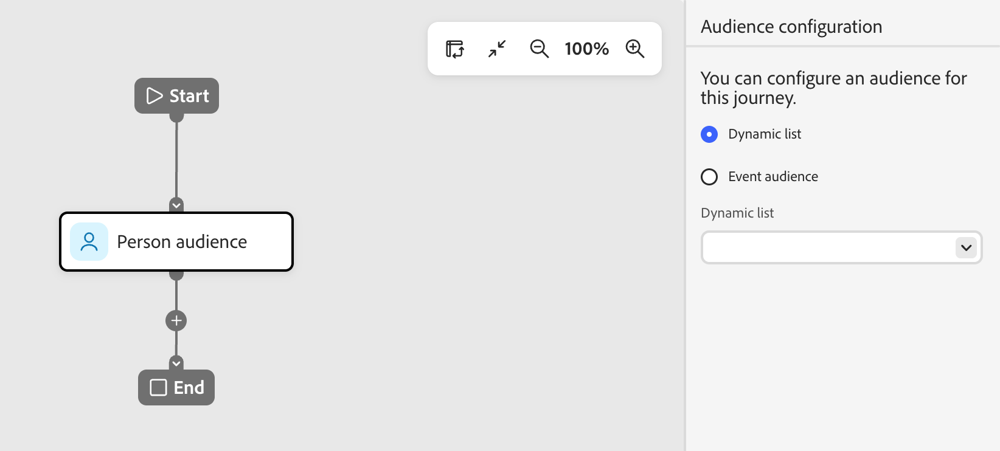

# 人物オーディエンスノード

_人物オーディエンス_ ノードは、ジャーニーにエントリする人物プロファイルを指定します。 ユーザーのジャーニー[を作成する場合、ジャーニーは常に、入力を定義するユーザーのオーディエンスノードから始まります。 ](./person-journeys.md)人物オーディエンスノードには、動的な人物リストまたはイベントトリガーの2つのオーディエンス入力タイプのいずれかを使用できます。

ユーザージャーニーに必要な動的ユーザーリストが既に存在しない場合は、[ ユーザーリストを作成](../audiences/people-lists.md#create-a-people-list)してから、ユーザーオーディエンスノードを設定します。

_ジャーニーオーディエンスを設定するには&#x200B;:_

1. 「**[!UICONTROL 人物オーディエンス]**」ノードをクリックします。

   このアクションは、右側にノードプロパティを表示します。

   {width="500" zoomable="yes"}

1. 人物オーディエンスに対して、次のいずれかのオーディエンス設定オプションを使用します。

   * **[!UICONTROL 動的リスト]** – 動的なルールベースの人物リストを使用します。 リストルールは、ジャーニー実行時に評価され、ジャーニーのメンバーが選定されます。 後で動的リストの資格を失ったユーザーは、ジャーニーから削除されません。 _[動的リスト](../audiences/people-lists.md#dynamic-lists)_&#x200B;を参照してください。

   * **[!UICONTROL イベントオーディエンス]** - イベントオーディエンスを使用すると、条件を満たすイベントに基づいてジャーニーオーディエンスを定義できます。 イベント条件による人物プロファイルフィルタリングとトリガージャーニー入力を使用して、オーディエンスメンバーを定義します。 _[イベントベースのオーディエンス](../audiences/event-based-audiences.md)_&#x200B;を参照してください。

