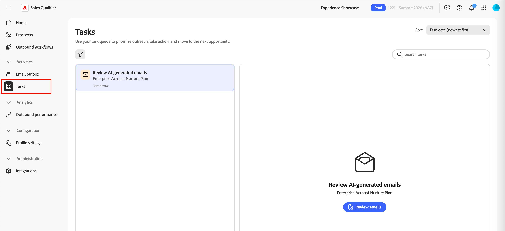

# 販売修飾子

Sales Qualifierは、[!DNL Adobe Journey Optimizer B2B Prime]で使用できるAI駆動型アプリケーションです。 Account Qualification Agentを実装し、Business Development Representatives （BDR）のワークフローを合理化するように設計されています。 セールスクオリフィケーションは、チャネルをまたいで見込み客のクオリフィケーション、アウトリーチ、バイヤーのエンゲージメントワークフローを自動化します。 B2B企業は、手作業のBDR負荷を軽減し、パイプラインを高速化することで、パイプラインを高速化できます。

BDRは、ブラウザーとメールのプラグインを使用して、CRMやOutlook内で直接ビジネスインテリジェンスにアクセスできます。 次のビデオでは、Sales QualifierとAccount Qualification Agentの簡単なデモを示します。

>[!VIDEO](https://video.tv.adobe.com/v/3476550)

## アプリケーションホーム {#application-home}

セールス修飾子は[!DNL Journey Optimizer B2B Prime]に含まれていますが、Adobe Experience Platform内の別のアプリです。

{width="800" zoomable="yes"}

### Account Qualification Agent {#account-qualification-agent}

Account Qualification Agent（AQA）は、セールスクオリフィケーションの中核です。 AQAはAIを活用してアカウントを読み取り、次のステップに進む準備ができているものを判断します。 CRMを接続した状態（読み取り専用）で、調査、メール作成、CRM情報を利用したコンテキストの作成を支援します。

<!--
## Edit the left navigation bar

At the bottom left of the application, click the _Edit_ (  ) icon to control which elements are visible in the left navigation. You can also drag and drop them to reorder as you want.
-->

### 基本的なエージェントの使用 {#basic-agent-usage}

Adobe AI エージェントは&#x200B;_自然言語クエリ_&#x200B;を使用します。つまり、人と会話する場合と同じ言語をテキストプロンプトで使用します。 質問が詳細であればあるほど、その効果は高まります。

自然言語を使用して、エージェントに次のことを依頼できます。

* `Tell me the latest financial results of Bodea`
* `Tell me more about hiring at TechNova`
* `Tell me about the new AI features in Bodea LumaSecure4`

必要な結果を得るためにプロンプトを調整することで、アウトバウンドワークフローを繰り返し実行します。 例：

* _収益の呼び出しやレポートなどのコンテキストからフォローアップメールの描画を作成します。_ 最大120単語。 件名：魅力的で、重要なテーマを取り入れている はじめに：コンテキストソースから直接の引用でフックします。 本文：課題と価値提案につながる CTA：さらなる探求のための短い呼びかけを提案してください。_

* _この電子メールの目的は、会話を開始して信頼性を高めることです。_ コンサルタント的で共感的なトーンの120語に満ちたメールを作成しましょう。 過度に使い慣れたアプローチやセールスアプローチを避け、「うまくいくことを願う」、「チェックインするだけ」、「お願いします」というフレーズを使用しないでください。_

### 製品アクセスとユーザーグループ {#product-access-and-user-groups}

セールスクオリファイア機能へのアクセスは、Adobe Admin Consoleのユーザーグループを通じて管理されます。 ユーザーがアプリケーションにアクセスできるようにするには、製品管理者が適切なユーザーグループを設定する必要があります。

#### 製品管理者

[統合](#integrations)機能にアクセスする必要がある製品管理者は、`Sales Qualifier Admins` ユーザーグループのメンバーである必要があります。

1. Adobe Admin Consoleで、`Sales Qualifier Admins`という名前のユーザーグループを作成します。
1. CRM接続とナレッジベース設定の設定が必要なユーザーを追加します。

#### 標準BDR ユーザー

セールス修飾子にアクセスするには、標準BDR ユーザーが`Sales Qualifier users` ユーザーグループのメンバーである必要があります。

1. Adobe Admin Consoleで、`Sales Qualifier users`という名前のユーザーグループを作成します。
1. グループに&#x200B;**Default Production All Access** AEP プロファイルを割り当てます。
1. グループにユーザーを追加します。

>[!NOTE]
>
>ユーザーグループ名は、前述の手順に示すように正確に一致する必要があります。

## 見込み客 {#prospects}

左側のナビゲーションで「**[!UICONTROL 見込み客]**」を選択して、アクセス可能なすべてのリードのリストを表示します。 リードのステータスや最後のアクティビティなど、情報を素早く確認できます。

リードのステータスと見込み客の管理の最後のアクティビティを表示する{width="800" zoomable="yes"}

_フィルター_  アイコンをクリックして、表示されているリストをリードステータスでフィルタリングします。

## アウトバウンドワークフロー {#outbound-workflows}

>[!NOTE]
>
>製品管理者が作成したアウトバウンドワークフローは、組織内のすべてのユーザーと共有されます。

_アウトバウンドワークフロー_&#x200B;は、目標主導型メールシーケンスの実行にSales Qualifierが使用する構造です。 アウトリーチの目標とターゲティング基準を定義すると、AIがマルチタッチケイデンスを提案し、見込客ごとにパーソナライズされたメールコンテンツを作成します。 登録によってシーケンスがアクティブになる前に、各メールを確認して承認し、設定した時間枠でのみメッセージを送信します。

アウトバウンドワークフローは、次の4つの要素を結び付けます。

* **目標** - アウトリーチから望む成果（ディスカバリーコールの予約やイベント登録の促進など）。
* **ターゲティングフィルター** – 対象となる見込み客を決定する条件。
* **顧客接点の順序** – 各手順の順序は、スケジュールされた日に設定されます。 顧客接点は、**電子メール**、**電話**、**LinkedIn In InMails**&#x200B;のいずれかです。
* **パーソナライズされた電子メールコンテンツ** – 電子メールのタッチポイントごとに、AIが見込み客のプロファイル、アカウントコンテキスト、エンゲージメント履歴、最近のニュースを使用してコンテンツを作成します。

目標は、あらゆる要素を下流に導きます。AIは、ターゲティングフィルターの提案、ケイデンスの設計、タッチポイントプロンプトのドラフト、生成される電子メールのパーソナライゼーションの設定などにAIを活用します。

{width="800" zoomable="yes"}

### 主要概念 {#key-concepts}

| 概念 | 説明 |
| --- | --- |
| **ワークフロー** | 目標、ターゲティングフィルター、ケイデンス、設定によって定義された、再利用可能なアウトバウンドアクティビティ。 |
| **目標** | アウトリーチで達成すべきこと。 |
| **タッチポイント** | 登録に関連してスケジュールされた、シーケンスの1つのステップ（メール、電話、またはLinkedInMail）。 |
| **タッチポイントプロンプト** | 見込み顧客のメール本文と件名を生成する際に、AIが指示するトーン、長さ、フォーカス、call to actionです。 |
| **ケイデンス** | タッチポイントの完全なシーケンス：何個、どの順序、どの日に。 |
| **ターゲティングフィルター** | ワークフローを見込み客のサブセットに制限する条件。 |
| **ドラフト** | レビューの準備ができているものの承認されていない生成メール。 |
| **理由** | 特定のメールの書き方（どのシグナルやデータソースを使用したのか）に関するAIの説明。 |
| **登録** | 見込み客のドラフトを承認する。ワークフローの送信ウィンドウで、ケイデンスをアクティブ化し、メールの送信をキューに入れる |

次の節では、完全なライフサイクルについて説明します。ウィザードでのワークフローの作成、生成された電子メールの確認、見込み顧客の承認、ワークフローの長期的な管理などです。

### アウトバウンドワークフローの作成 {#outbound-workflow}

ワークフローの作成は5段階のウィザードです：**目標**、**ターゲット**、**顧客接点の生成**、**設定**、および&#x200B;**見込み客の追加**。 各ステップは最後のステップの上に構築され、最初の目標はその後の決定をすべて形成します。

1. 左側のナビゲーションで、**[!UICONTROL アウトバウンドワークフロー]**&#x200B;を選択します。

1. **[!UICONTROL 参照]** タブで、右上隅の&#x200B;**[!UICONTROL + ワークフローの作成]**&#x200B;をクリックします。

#### ステップ 1：目標の設定

目標は最も重要なインプットです。AIに成功の様子を伝え、ターゲティング、ケイデンス、メール生成を固定します。

1. 独自の目標を作成するには、**[!UICONTROL 最初から開始]**&#x200B;を選択するか、保存したテンプレートを使用するには、**[!UICONTROL テンプレートから開始]**&#x200B;を選択します。

   {width="700" zoomable="yes"}

1. **[!UICONTROL おすすめの目標]**&#x200B;のいずれかを出発点として選択するか、独自の目標を入力します。

1. 「**[!UICONTROL 次へ：ターゲティング]**」をクリックします。

目標は、トピックだけでなく、**具体的な成果**&#x200B;を述べることで最も効果を発揮します。 例えば、`Book a 15-minute discovery call with marketing leaders evaluating campaign automation`は`Promote campaign automation`より多くのAIを利用できるようにします。

#### 手順2：ターゲティングフィルターの設定

ターゲティングフィルターで適格な見込み客を定義。 後で見込み客を追加すると、これらのフィルターに一致する見込み客のみが選択リストに表示されます。

1. 下向き矢印をクリックして、**[!UICONTROL フィルターを追加]** リストを表示し、適用するフィルターを選択します。

   {width="700" zoomable="yes"}

1. フィルターの値を設定します。

1. オーディエンスを絞り込む必要がある場合は、さらにフィルターを追加します。

   {width="600" zoomable="yes"}

1. 「**[!UICONTROL 次へ：顧客接点を生成]**」をクリックします。

#### ステップ 3：顧客接点の生成とレビュー

ターゲティングを設定すると、AIは&#x200B;**_ケイデンス_**&#x200B;を作成します。目標とターゲティングを分析し、タッチポイントシーケンスを定義し、各ステップに&#x200B;**_タッチポイントプロンプト_**&#x200B;を書き込みます。 特定の日に各顧客接点でマルチステップのケイデンスが表示されます。 メール、電話、LinkedInMailのステップを組み合わせることができます。

{width="700" zoomable="yes"}

メールのタッチポイントを拡大し、プロンプトを読む。 この手順では、トーン、長さ、焦点、_call to action_&#x200B;など、各見込み客の電子メールを作成する際のAIをガイドします。

**ケイデンスを再生成**

ケイデンスが目的と異なる場合は、**[!UICONTROL 再生成]**&#x200B;をクリックし、絞り込み命令を入力します。 例：

* `Make it 3 touchpoints across 2 weeks`
* `Lead with an executive briefing offer in the first email`
* `Add a nurture touch focused on a relevant case study`

AIは、指示に基づいてケイデンス全体を書き換えます。

ケイデンス全体を再生成することなく、単一のメールタッチポイントを調整するには、テキストエリアでプロンプトテキストを直接編集します。

ケイデンスとプロンプトが正しく表示されたら、**[!UICONTROL 次へ：設定]**&#x200B;をクリックします。

見込み客が生成される前に、タッチポイントプロンプトを調整することが重要です。これらのプロンプトは、AIが後で見込み客ごとに使用する主な指示です。 ここでの時間は、生成されるすべてのメールに費やされます。

#### 手順4：ワークフロー設定の設定

**設定**&#x200B;手順は、ワークフローの実行方法を制御します。

{width="700" zoomable="yes"}

1. **[!UICONTROL ワークフロー名]**&#x200B;を確認し、より明確なラベルを付けたい場合は変更します。
1. ワークフローごとに&#x200B;**[!UICONTROL 最大の見込み客]**&#x200B;で、ワークフローが一度に管理できる見込み客の数の上限を確認します。
1. 送信メールの送信が許可されている時間に&#x200B;**[!UICONTROL 送信ウィンドウ]**&#x200B;を設定します。
1. 各電子メールにオプトアウトリンクを含めることができるように、**[!UICONTROL オプトアウトリンクを含める]**&#x200B;を確認します。
1. **[!UICONTROL タイムゾーン]**&#x200B;がオーディエンスと一致することを確認します。
1. 「**[!UICONTROL 見込み客を保存して追加]**」をクリックします。

#### ステップ 5：見込み客を追加し、メール生成を開始する

保存すると、手順2のターゲティングで既にフィルタリングされている見込み客の選択ビューが開きます。

{width="700" zoomable="yes"}

1. リストを確認します。

   行には、通常、見込み客の名前、アカウント、電子メール、役職、エンゲージメントステータス、見込み客ステータスが含まれます。

1. リストを拡大または絞り込む必要がある場合は、ここでフィルターを調整します。
1. チェックボックスを使用して見込み客を選択します。
1. 「**[!UICONTROL 次へ：顧客接点]**&#x200B;を確認」をクリックして、見込み客ごとに&#x200B;**メール生成**&#x200B;を開始します。

AIは、選択した見込み客一人ひとりに対して、ケイデンスの&#x200B;**各メールタッチポイント**&#x200B;ごとにパーソナライズされたメールを生成します。 PhoneとLinkedIn InMailのタッチポイントは、スケジュールされた手順でシーケンスに残ります。 生成はバックグラウンドで実行できます。完了中に他の作業を続行する場合は、**[!UICONTROL 準備ができたら通知]**&#x200B;を使用します。

見込み客ごとに、AIは各タッチポイントプロンプトと見込み客固有のデータ（人物、アカウント、エンゲージメント履歴、最近のニュース）を組み合わせて、件名と本文を生成します。

### 生成されたメールのレビューと調整 {#review-refine-emails}

生成が完了すると、ワークフローの詳細ビューにドラフトをレビューするためのバナーが表示されます。 審査が必要です。承認するまで何も送信しません。

{width="700" zoomable="yes"}

1. ワークフローの詳細ビューで、バナーの「**[!UICONTROL 下書きを確認]**」をクリックします。
1. **[!UICONTROL タッチポイントのレビュー]** ステップには、次の2つのタブがあります。
   * **[!UICONTROL レビューの準備完了]** – 生成が完了したメール。
   * **[!UICONTROL 生成中]** – 電子メールがまだ書き込まれている。
1. 左側の見込み客リストで、名前をクリックして、右側のその見込み客のタッチポイントを読み込みます。
1. タッチポイントで山形（**>**）を使用して、件名と本文を展開して読み上げます。

#### AIの推論を読む

生成された各電子メールについて、**[!UICONTROL 推論]**&#x200B;は、AIがメッセージをどのように作成したかを説明しています。これには、コンテンツとcall to actionを形作ったシグナル、属性、ソースが含まれます。 承認する前に、この情報を確認し、パーソナライゼーションを検証してください。

{width="600" zoomable="yes"}

#### メールを直接編集

小さな編集（文言、トーン、1文）の場合：

1. 拡張されたタッチポイントで、_編集_ アイコンをクリックしてエディターを開きます。
1. 件名または本文を編集します。
1. 「**[!UICONTROL 保存]**」をクリックします。

#### AIを活用して電子メールを調整

より大きな変更（再構築、シフト強調、またはメッセージの変更）の場合は、**[!UICONTROL AIを使用した生成]**&#x200B;を使用します。 AI エージェントは、パーソナライゼーションのコンテキストを維持しながらメールを書き換えます。

1. メールエディターで、**[!UICONTROL AIを使用して生成]**&#x200B;をクリックします。

   {width="600" zoomable="yes"}

1. 明確な指示を入力します。例：
   * `Make it shorter and more direct. Keep it under 100 words.`
   * `Focus more on the prospect's role and how the solution helps them specifically.`
   * `Change the call-to-action to suggest a 15-minute introductory call instead.`
1. リビジョンを確認し、必要に応じて手動で調整します。
1. 「**[!UICONTROL 保存]**」をクリックします。

>[!TIP]
>
>文言やトーンに合わせて直接編集できます。 _[!UICONTROL AIを利用した生成]_&#x200B;は、それ以外の方法でメールをゼロから書き換える場合に適しています。

### 見込み客の承認と登録 {#approve-enroll-prospects}

承認は、見込み顧客のケイデンスをアクティブ化します。 見込み客が承認され、登録されるまで、システムはメールを送信しません。

1. 左側の見込み客リストで、メールを確認し、送信する準備ができている見込み客を選択します。
1. 「**[!UICONTROL 見込み客の承認と登録]**」をクリックします（右下）。

{width="700" zoomable="yes"}

承認された電子メールは、登録に関連する各タッチポイントのスケジュールされた日に、設定された&#x200B;**タイムゾーン**&#x200B;のワークフロー&#x200B;**送信ウィンドウ**&#x200B;中に送信されます。 承認していない見込み客は、行動するまで&#x200B;**[!UICONTROL レビューの準備状態]**&#x200B;のままです。 承認後、定義したケイデンスに従ってワークフローが実行されます。

### 既存ワークフローの管理 {#manage-existing-workflows}

_[!UICONTROL アウトバウンドワークフロー]_ ページの「**[!UICONTROL 参照]**」タブには、すべてのワークフローが一覧表示されます。 各カードには、目標、設定されたタッチポイント、パフォーマンス指標が表示されます。 このビューを使用して、アクティブなワークフローを監視したり、まだレビューが必要なドラフトに戻ったり、ワークフローを開いてさらに見込み客を追加したりします。

### アウトバウンドワークフローのベストプラクティス {#outbound-workflow-best-practices}

* **目標に投資します。** ダウンストリームでのターゲティング、ケイデンス、電子メールはすべて、目標に遡ります。 特定の成果に焦点を当てた目標は、曖昧な目標に打ち勝つ。
* **見込み客ごとの生成の前に、タッチポイントのプロンプトを最終決定します。** 一括生成後、通常、一度にひとつの見込み客に変更を加えます。
* **推論を品質チェックとして使用します。** 誤ったシグナルが強調されたり、見落とされたりした場合は、電子メールを編集するか、タッチポイントプロンプトを再訪問して、ケイデンスを再生成します。
* **編集ツールを変更と一致させます。** 文言やトーンの直接編集。再構成やリフレーム用に&#x200B;**[!UICONTROL AI]**&#x200B;で生成。
* **レビューしたものだけを承認してください。** 顧客接点を拡大し、コンテンツを読み、登録する前に必要に応じて調整します。

## 電子メールの受信トレイ {#email-outbox}

メール送信ボックスでは、送信/生成された送信メールを表示し、プレビューを開き、利用可能な場合は返信を調べることができます。

<!--
## Meeting bookings

This panel displays all meetings set up through automation.

## Chat inbox

This panel displays all your chat threads.


You can interact with clients, and see summaries for the contact and the thread so that you can quickly know where you are in the thread.

-->

## タスク {#tasks}

セールス修飾子の&#x200B;_タスク_&#x200B;領域は、ビジネス開発担当者（BDR）に、アウトバウンドワークフローアクションを管理および処理するための専用のスペースを提供します。 アウトバウンドワークフローエンジンは、BDRが見込み客ごとに取るべき特定のアクション（電話、LinkedInMails、メールレビュー）を表すタスクを自動的に生成します。

タスク管理エクスペリエンスは、ToDo リストだけでなく、**処理キュー**&#x200B;として設計されています。 ページを離れることなく、タスクを開いてアクションを実行し、タスクの完了をマークして、次のタスクに移動できます。

左側のナビゲーションバーで「**[!UICONTROL タスク]**」を選択して、完全なタスクページを開きます。 このページは、タスクを1つずつ処理するためのプライマリワークスペースです。

タスクキューと詳細パネルを表示する{width="800" zoomable="yes"}

<!--
**Homepage feed** - The homepage displays a running feed of your most urgent tasks, with overdue items at the top followed by today's tasks. Each item in the feed has an "Open" button that takes you directly to that task in the Tasks page with the detail panel already loaded.
-->

### タスクタイプ {#task-types}

すべてのタスクはアウトバウンドワークフローステップに関連付けられています。 3つのタイプがあります。

**電話** — ワークフローシーケンスが電話の通話ステップに達したときに作成されます。 タスクパネルには、エージェントが生成したピッチポイントと、コールノートをキャプチャするためのインラインノートフィールドが表示されます。

**LinkedIn InMail** — シーケンスがLinkedIn InMail ステップに到達したときに作成されます。 タスクパネルには、製品の外部でコピーして送信できる、InMailで提案されたコンテンツが表示されます。

**メールレビュー** — ワークフローに登録されている見込客に対するパーソナライズされたメールの生成がシステムによって完了すると作成されます。 見込み客のアウトバウンドが始まる前に、メールを確認し、承認します。 各見込み客には個別のメールレビュータスクが割り当てられます。ワークフローに10人の見込み客を登録すると、生成完了時に最大10件のメールレビュータスクが表示されます。

### タスク管理 {#task-management}

タスクページは、次の2つのパネルに分割されます。

* **左 – タスクリスト：**&#x200B;選択したビューと並べ替え設定に基づいて順序付けおよびフィルタリングされたタスクのキュー。
* **右 – タスク作業パネル：**&#x200B;選択したタスクの詳細（見込客情報、ワークフローコンテキスト、タスク固有のコンテンツ（ピッチポイント、提案されたコピー、メール下書き）、アクションコントロールなど）。

左側のパネルでタスクを選択すると、ページから離れることなく、その詳細が右側のパネルに読み込まれます。

#### キュー制御

作業パネルには、**次**&#x200B;および&#x200B;**前**&#x200B;のコントロールが含まれており、タスクキュー内を順番に移動できます。 キューは、リストに適用する並べ替えおよびフィルター設定を尊重します。 期限切れの電話タスクを期日ごとに並べ替えて作業している場合、_次_&#x200B;と&#x200B;_前_&#x200B;は、正確にそのセットを移動します。

タスクを完了すると、パネルは自動的にキュー内の次のタスクに進みます。

#### 注意

電話タスクとLinkedIn InMail タスクの場合、作業パネルにインラインメモのフィールドが表示されます。 メモは、離れた場所をクリックすると自動保存されるので、現在のタスクを完了する前に別のタスクに移動しても失われることはありません。

#### タスクのアクション

タスクを管理するには、次のアクションを使用します。

* **[!UICONTROL 完了をマーク]** – 主なアクション。 このアクションは、タスクを実行した後（呼び出しを行った、InMailを送信した、メールを確認して承認した）に使用します。 完了すると、タスクは&#x200B;**完了**&#x200B;として記録され、キューは自動的に進みます。

* **[!UICONTROL タッチポイントをスキップ]** – 作業パネルのオーバーフローメニューから使用できます。 この手順を完了できないが、見込み客がワークフロー内の有効なターゲットのままである場合は、このオプションを使用します。
   * 見込み客はシーケンスの次のステップに進みます。 今後のタスクはスケジュール通りに生成されます。
   * 理由を選択：*不正な連絡先情報*、*不正なタイミング*、*コンテンツが関連しない*、または&#x200B;*その他* （フリーテキストフィールドを使用）。
   * タスクのステータスは&#x200B;**スキップ**&#x200B;に設定され、理由とタイムスタンプが記録されます。
   * これがワークフローの最後のステップだった場合、見込み客のワークフロー実行は終了します。 タスクはスキップ済みとして記録されます（削除されません）。

* **[!UICONTROL ワークフローから削除]** – 作業パネルのオーバーフローメニューから使用できます。 見込み客がこのワークフローに属しなくなった場合に使用します。

  ワークフローから見込み客を削除する場合：
   * このワークフロー内のその見込み客に対する保留中および今後のタスクはすべてキャンセルされます。
   * 見込み客の登録ステータスが&#x200B;**BDR**&#x200B;によって削除されました。
   * 理由を選択：*Left company*、*Duplicate*、*Wrong fit*、*既にコンバージョン済み*、または&#x200B;*Other* （テキストフィールドあり）。
   * 確認ダイアログが表示されます。*「このアクションは、[ ワークフロー名]の[見込み客]の残りのすべてのタッチポイントをキャンセルします。 続行しますか？&quot;*
   * タスクの状態は&#x200B;**削除済み**&#x200B;に設定されています。 キャンセルされたすべての兄弟タスクも&#x200B;**削除済み**&#x200B;とマークされます。

>[!NOTE]
>
>スキップと削除の理由データは、チャネル別のスキップ率、ワークフロー別の削除率、上位の理由など、分析に反映されます。 これにより、ワークフローの品質を向上させ、長期的なパフォーマンス分析に情報を提供できます。

### タスクのステータス {#task-status}

各タスクは、次の状態で移動します。

| ステータス | 説明 |
|---|---|
| **保留中** | 作成されましたが、前のワークフローステップはまだ完了していません。 タスクリストには表示されません。 |
| **近日公開予定** | 前の手順は完了しましたが、期限は将来です。 可視かつ実用的：適切なタイミングで完了できます |
| **オープン** | 本日締め切り。 可視かつ実用的。 |
| **期限切れ** | 期日が過ぎました。まだ完了していません。 可視、実用的、視覚的にフラグ付け： |
| **完了** | タスクを実行し、完了をマークしました。 |
| **スキップ** | このタッチポイントをスキップしました。 見込み客はワークフローが進みます。 |
| **削除済み** | ワークフローから見込み客を削除しました。 兄弟タスクはすべてキャンセルされます。 |
| **キャンセル済み** | ワークフローの変更または見込み客の削除により、システムがキャンセルされました。 |

### リストビュー {#list-views}

タスクリストの上部にあるタブを使用して、ビューを切り替えます。

* **今日** *（デフォルト）* – 本日未完了のタスク。

* **期限切れ** – 期限が過ぎて、まだ開いているタスク。 まずは、これらの課題に取り組みましょう。

* **今後** – 前のワークフローステップが既に完了した期日を持つタスク。 これらのタスクは早期に把握できるため、適切なタイミングで計画を立てたり、すばやく行動したりできます（たとえば、見込み客との電話を既に始めている場合）。 予定期日が表示されるので、意図したタイミングがわかります。

* **完了** – 完了、スキップ、または削除したタスクのレコード。 レビューと監査に役立ちます。

### フィルタリングと検索 {#filtering-and-search}

タスクリストをフィルタリングする方法はいくつかあります。

* 複数選択リストを使用して、タスクタイプでフィルタリングします。 複数のタイプを選択すると、選択したタイプの&#x200B;*any*&#x200B;に一致するタスクが表示されます（例：電話&#x200B;**または** メールレビュー）。

* タスクのステータスでフィルタリング。 複数のステータスを選択すると、選択したステータスのいずれかに一致するタスクが表示されます。

* **AND** ロジックを使用して、グループ間でフィルターを実行します。 例えば、`Type = Phone Call and Status = Overdue`には、期限切れのコールタスクのみが表示されます。

検索バーを使用して、見込み客の名前、企業名、エンゲージメント名でタスクを検索します。 検索は、アクティブなフィルターと一緒に適用されます。 テキスト一致のみ – 完全部分一致、ファジィ検索なし。

### 並べ替え {#sorting}

「**並べ替え**」コントロールを使用して、タスクリストの順序を選択します。 並べ替えによって、次と前の順がキューを移動する順序も決まります。

| 並べ替えオプション | 動作 |
|---|---|
| **期日（昇順）** *（デフォルト）* | 最も古い期限が最初です。 期限切れのタスクは、今日のタスクの前に表示されます。 |
| **期日（降順）** | 最終期日が最初です。 |
| **作成日（新しい日付）** | 最近作成したタスクを最初に保存します。 |
| **作成日（古い）** | 最も古いタスクを最初に作成。 |
| **タスクの種類** | タイプ別にグループ化された順序：電話→LinkedIn InMail→メールレビュー。 各グループ内で、期日が昇順で並べ替えられます。 |

### 期限切れのタスク {#overdue-tasks}

タスクが完了していない場合、その期日の翌日に期限切れになります。 期限切れのタスク：

* **期限切れ** ビューに表示され、ホームページ フィードの上部に表示されます。
* タスクリストに「期限切れ」バッジが表示されます。
* 完全に実用的な状態を維持：完了、スキップ、削除できます。

### 今後のタスク {#upcoming-tasks}

次のステップの期日がまだ後である場合でも、見込み客がワークフローステップを完了した瞬間に今後のタスクが作成されます。 この可視性により、insightをパイプラインに早期に導入できるので、事前に計画を立てたり、機会が発生した際に早期に行動を起こしたりすることができます。

今後のタスクにはスケジュールされた期日が表示されるため、いつ対応する予定であるのかを常に把握できます。 今後のタスクを予定どおりに完了することは、完全にサポートされています。ワークフローエンジンは、実際の完了日を記録し、見込み客を通常どおりに進めます。

### タスクの完了 {#task-completion}

タスクの完了は、タスクページに限定されません。

**エンゲージメント済み見込み客ビュー：** エンゲージメント済み見込み客ページのタッチポイントプレビューには、_完了をマーク_&#x200B;するアクションと、コンテンツプレビューおよびオプションのメモ フィールドが含まれます。 ここでタスクを完了すると、タスクページのステータスがすぐに更新されます。 このビューは、自動進めのビヘイビアーをトリガーにするものではありません。キュー処理サーフェスではなく、ビューとアクションのサーフェスです。

**Salesforce（CRM プラグイン）:** SalesforceのSales Qualifier プラグインは、アウトバウンドワークフローカード内のタスクステータス（今後、保留中、完了、期限切れ、スキップ済み）を表示します。 現在のバージョンでは、CRM カードは&#x200B;**読み取り専用**&#x200B;です。タスクのステータスは表示されますが、タスクはセールス修飾子内から完了する必要があります。

### 空の状態 {#empty-states}

* **タスクのない今日：**&#x200B;あなたは&#x200B;_今日のメッセージに追いついています_。 今後のタスクが存在する場合、「_今後のタスクは[N]件あります – 今後のタスクを表示_&#x200B;します」というプロンプトが表示されます。
* **期限切れのタスクが存在します：**&#x200B;期限切れのタスクに最初に対処するよう促すプロンプトが表示されます。

## 統合 {#integrations}

この連携機能を利用すれば、セールス担当者はCRMを利用して、Account Qualification Agent（AQA）とアウトバウンドワークフローで、SalesforceやMicrosoft Dynamics 365のリード、アカウント、取引先責任者、アクティビティ、オーナーに関する一貫したビューを共有できます。 CRM統合は&#x200B;**読み取り専用** アクセスと接続して、AQAがCRM販売データとアクティビティ（電子メール、電話、タスク、予定など）を取得してインサイトを強化できるようにします。 CRM データは、アプリ内のインサイトの獲得と業務効率の向上に使用されます。 この接続を通じてCRM レコードを変更する場合は使用されません。

>[!IMPORTANT]
>
>Sales Qualifierの統合にアクセスするには、`Sales Qualifier Admins` ユーザーグループ メンバーシップが必要です。

### CRM アクセス範囲 {#crm-access-scope}

CRM接続は&#x200B;**_読み取り専用_**&#x200B;です。 使用される典型的なエンティティには、ユーザー、取引先責任者、所有者のマッピング、リード、アカウント、機会、アクティビティなどがあります。 CRM管理者は、SalesforceまたはDynamicsでAPI アクセスを準備します。 次に、Sales Qualifierを接続して、アプリ内のインバウンドフィールドをマッピングします。

### CRMで資格情報を準備する {#prepare-credentials-in-your-crm}

セールス修飾子を接続する前に、CRM管理者と協力してください。 次に、各システムで通常作成される内容を要約します。

#### Microsoft Dynamics 365 （データバース/Power Platform）

1. Azure Active Directoryで、アプリケーション （**[!UICONTROL アプリケーション登録]**）を登録します。

   **クライアント ID**&#x200B;と&#x200B;**テナント ID**&#x200B;に注意し、**クライアントシークレット**&#x200B;を作成します。

1. **[!UICONTROL Power Platform管理センター]**&#x200B;で、環境を開き、**[!UICONTROL 設定]** > **[!UICONTROL ユーザー+権限]** > **[!UICONTROL アプリケーションユーザー]**&#x200B;に移動します。

1. そのAzure AD アプリにリンクされたアプリケーションユーザーを作成します。

1. セールス修飾子が必要とするエンティティ （リード、取引先責任者、アカウント、商談、アクティビティなど）への&#x200B;**読み取り** アクセス権を付与するセキュリティ役割を割り当てます。

   このアプリはデータ読み取りアクセス権を持つセキュリティ役割を必要とします。

**Dynamicsの接続時に提供する情報：**

* クライアント ID
* クライアント秘密鍵
* テナント ID
* Dynamics インスタンス URL （組織URL）

#### Salesforce

Salesforceでは、組織のセキュリティ基準に従って、OAuthを有効にし、IDとデータへのAPI アクセスを許可するスコープを含む外部クライアントアプリ ](https://help.salesforce.com/s/articleView?id=xcloud.create_a_local_external_client_app.htm&type=5) （または&#x200B;_接続アプリ_）を[作成します。 統合ユーザー（クライアント資格情報スタイル設定を使用する場合など）は、リード、アカウント、取引先責任者、タスク、イベント、商談、関連する商談オブジェクトなどのオブジェクトに対する読み取りアクセス権を持っている必要があります。 管理タスクでは、作成後にコンシューマーキーとシークレットを表示するために、**[!UICONTROL 接続されたアプリを管理]**&#x200B;するユーザー（その他の権限を含む）が必要になることがよくあります。

>[!PREREQUISITES]
>
>外部クライアントアプリを作成するには、製品管理者が（プロファイルまたは権限セットから）次の機能を有効にしていることを確認する必要があります。
>
>* アプリケーションをカスタマイズ
>* 設定と設定の表示
>* すべてのデータを変更
>* 接続済みアプリの管理（重要）
>
>   _接続済みアプリの管理_&#x200B;が有効になっていない場合は、外部クライアントアプリの作成後、クライアント IDとクライアントシークレットを表示できない可能性があります。

外部クライアントアプリを作成する場合は、OAuthを有効にして権限を付与します。 次のクライアント資格情報も有効にします。

* ID URL サービス（ID、プロファイル、電子メール、アドレス、電話）にアクセスする
* API （api）によるユーザーデータの管理
* 一意のユーザーID （openid）へのアクセス

アプリを作成したら、クライアントの資格情報フローを再度有効にし、ユーザー名として連絡先メールを使用します。  クライアント資格情報が有効になっている場合は、ユーザーを&#x200B;_別名で実行_&#x200B;に設定します。

設定されたユーザーが次のオブジェクトに対する読み取りアクセス権を持っていることを確認します。

* リード
* アカウント
* 取引先責任者
* タスク
* イベント
* 商談
* OpportunityContactRoles
* OpportunityLineItems

**Sales Qualifier:**&#x200B;でSalesforceを接続する際に提供する情報

* クライアント ID (消費者キー)
* クライアントシークレット （コンシューマーシークレット）
* コールバック URL （接続されたアプリで設定されたもの）
* Salesforce インスタンス URL

>[!IMPORTANT]
>
>電子メールでクライアントの秘密鍵を送信しないでください。 組織で承認済みのセキュアチャネルを使用して、セールス修飾子に入力したユーザーと資格情報を共有します。

### CRMへの接続 {#connect-to-your-crm}

1. Sales Qualifierにログインし、正しいサンドボックスまたは環境が選択されていることを確認します。

1. 左側のナビゲーションで、**[!UICONTROL 管理]**&#x200B;を展開し、**[!UICONTROL 統合]**&#x200B;を選択します。

   SalesforceとMicrosoft Dynamicsのカードが表示されます。

   {width="800" zoomable="yes"}

1. 使用しているCRMの&#x200B;**[!UICONTROL Connect]**&#x200B;をクリックします。

1. CRM管理者から、クライアント ID、シークレット、テナントまたはコールバック値、および&#x200B;**インスタンス URL**&#x200B;を入力します。

1. 接続が成功すると、カードに&#x200B;**[!UICONTROL Connected]**&#x200B;と表示されます。

### インスタンス URL ガイドライン {#instance-url-guidelines}

**インスタンス URL**&#x200B;は、CRMがAPIと統合設定に使用する環境ベース URLである必要があり、UIのみのホスト名ではありません。

**Salesforce**

1. ログインして、ブラウザーのアドレスバー（`{{mydomain}}`値）から組織&#x200B;_マイドメイン_ サブドメインをメモします。

1. セールス修飾子の場合は、規範的な形式（`https://{{mydomain}}.my.salesforce.com`）を使用します。

   **not**&#x200B;は、`lightning.force.com` URLをインスタンス URLとして使用します。

**Microsoft Dynamics 365**

1. ブラウザーでCRMを開き、アドレスバーからベース URLをコピーします。

   通常は`https://{{org}}.crm.dynamics.com`形式です。

### CRM フィールドのマッピング（インバウンドマッピング） {#map-crm-fields-inbound-mapping}

CRMが接続されたら、統合で&#x200B;**[!UICONTROL 管理]**&#x200B;を開いて、**[!UICONTROL CRM インバウンドマッピング]**&#x200B;を操作します。

1. 「**[!UICONTROL セクションを追加]**」をクリックし、名前、オプションの説明、およびエンティティの種類（見込み客など）を入力します。

1. インポートするCRM フィールドを選択し、マッピングをプレビューして保存します。

   セクションが「インバウンドマッピング」タブの下に表示されます。

1. マッピングされた見込み客フィールドは、見込み客の「**[!UICONTROL 人物]**」タブに表示されます。
   * アカウントビューのアカウントフィールド。
   * アカウント体験の商談領域にある商談関連のフィールド。

### リファレンス：サンプル API パラメーター {#reference-sample-api-parameters}

CRM チームはこれらの例を使用して、読み取りアクセスが期待されるリードフィールドを返すことを確認できます。

**Dynamics （OData スタイルの抜粋）**

```text
$select=fullname,_ownerid_value,leadid,emailaddress1,jobtitle,statuscode,createdon,modifiedon,statecode
$filter=_ownerid_value eq '<crmUserId>' [AND additional filters]
$expand=Lead_ActivityPointers(...),parentaccountid(...)
$orderby=modifiedon desc
```

**Salesforce （SOQL抜粋）**

```sql
SELECT Id, Salutation, FirstName, LastName, Name, Title, Company, Email,
  LeadSource, Status, OwnerId, LastModifiedDate, LastActivityDate, CreatedDate,
  (SELECT Id, Subject, ActivityDate, Status FROM Tasks ORDER BY ActivityDate DESC LIMIT 1),
  (SELECT Id, Subject, ActivityDateTime FROM Events ORDER BY ActivityDateTime DESC LIMIT 1)
FROM Lead
WHERE OwnerId = '<crmUserId>' AND IsDeleted = false
ORDER BY LastModifiedDate DESC
```

### ナレッジセンター {#knowledge-center}

_[!UICONTROL ナレッジセンター]_&#x200B;では、AQAが顧客ドキュメントとリンクされた知識にアクセスできるので、セールス修飾子は、独自の資料を使用して、より優れた調査と資格に関するインサイトを生成できます。 メールの生成に使用するコンテンツと情報リソースをアップロードします。

{width="700" zoomable="yes"}

## プロファイル設定 {#profile-settings}

プロファイル設定では、個人情報、電子メールとカレンダーの設定、チャットの空き状況など、自分に関する情報を指定します。

### メールの設定 {#email-settings}

「**[!UICONTROL メール設定]**」タブで、メール接続を設定します。

メール接続オプションとメール署名設定を表示する

* **[!UICONTROL メール接続]** - **[!UICONTROL Connect]**&#x200B;をクリックし、Microsoft ログイン手順に従います。

* **[!UICONTROL 電子メール署名]** – 自動生成された電子メールで使用される電子メール署名を設定します。

### カレンダー設定 {#calendar-configuration}

「**[!UICONTROL カレンダー設定]**」タブで、タイムゾーンと可用性を設定します。

<!-- 

-->

* **[!UICONTROL カレンダー接続]** - **[!UICONTROL 接続]**&#x200B;をクリックし、Microsoft ログイン手順に従ってカレンダーを統合します。

* **[!UICONTROL 会議確認メール]** – 顧客が自分との会議を確認すると、確認メールが返信として送信されます。 これらの設定を使用して、メールの件名と本文を定義します。

* **[!UICONTROL 環境設定]** - デフォルトのミーティングの長さとバックツーバックのミーティング間の時間を設定します。

カレンダーの接続を解除した場合：

* アクティブな予約リンクは効果的に無効になっています。
* 予約ページに、フレンドリーで一時的に利用できない状態が表示されます。
* 再接続すると、設定が保持されます。

### カレンダーの可用性 {#calendar-availability}

セールス修飾子のカレンダーの可用性は、次の2つの入力に基づいています。

* 接続された作業カレンダー（OutlookまたはGmail）
* _カレンダー設定_&#x200B;で設定された可用性+タイムスロット ルール。

セールスクオリファイアでは、イベントコンテンツ全体ではなく、接続されたカレンダーから空き状況/ビジー状況を読み取り、それを設定されたルールと組み合わせて、見込み客が参照できる予約スロットを決定します。

次の項目を設定できます。

* 曜日ごとの作業時間
* 1日あたりの複数のブロック （例：9:00-12:00および1:00-5:00）
* 自分のタイムゾーン
* ミーティング期間
* ミーティング前/ミーティング後のバッファー
* 最低限知らせ
* 予約ウィンドウ

<!-- 
### Chat settings

In the **[!UICONTROL Chat settings]** tab, set your Timezone Live chat availability.


## Representative management

The _[!UICONTROL Representative management]_ panel displays the defined representatives and their calendar status.

## Meeting performance

This panel presents analytics around your completed meetings.
-->

<!--
 SHPHR-24341 remove section
## Set up the Chrome plugin

The AI Assistant Chrome plugin is available on the [Google Store](https://chromewebstore.google.com/detail/ai-assistant/hancbabllcmckehonngbdkhilocpdfji?authuser=0&hl=en).

When the plugin is installed in Chrome, the Adobe logo appears on the middle right when you are on an integrated site:

* Adobe web applications
* Salesforce
* Outlook
* Microsoft Dynamics and web applications
* Google applications 
-->

