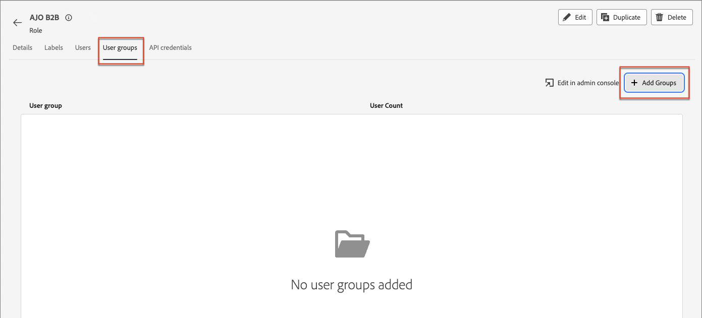

# ユーザーのアクセスと権限

プロビジョニングが完了し、サンドボックスがバインドされたら、次の手順を実行して、チームとユーザーにAdobe Journey Optimizer B2B editionへのアクセスを提供します。

1. [Admin ConsoleでAdobe Journey Optimizer B2B edition製品プロファイル ](#create-profile)を作成します（1回限り/初期設定のみ）。
1. Admin Consoleで [ ユーザーグループを追加 ](#add-user-group) します。
1. [組み込みロールを編集](#edit-roles-for-product-permissions)または[Adobe Experience Platform権限でJourney Optimizer B2B edition権限を使用してカスタムロール ](#create-a-custom-role)を作成します。
1. [Adobe Experience Platformのロールにユーザー](#add-users-to-a-role)または[ グループ ](#add-user-groups-to-a-role)を追加します。

## 製品プロファイルの設定 {#config-profile}

管理者は、Adobeの製品ライセンスとユーザーを一元的に管理する場所であるAdobe Admin Consoleで、これらのタスクを実行できます。 Admin Consoleでは、様々な個別のソリューション内ではなく、1 か所でユーザーを作成および管理できます。 その機能と機能について詳しくは、[Admin Consoleの概要](https://helpx.adobe.com/jp/enterprise/using/admin-console.html) ページを参照してください。

### Admin Console へのアクセス

Admin Consoleを使用してチーム内のユーザーを管理する前に、Admin Consoleにアクセスでき、適切な権限を持っていることを確認する必要があります。

1. システム管理者は、オンボーディングプロセスの一環としてAdobeから複数のメールを受信する必要があります。

   アクセス権が付与された組織名に関する情報を記載したお知らせメールを探します。

1. お知らせメールの **[!UICONTROL 使用を開始]** リンクをクリックして、Admin Consoleに移動します。

   メールが見つからない場合は、ブラウザーを開いてAdmin Console（[https://adminconsole.adobe.com](https://adminconsole.adobe.com)）に直接アクセスします。

1. Adobe IDを使用してログインします。

   ログインに成功すると、Adobe Admin Consoleの _概要_ ページが表示されます。

1. 複数の組織にアクセスできる場合は、正しい組織にログインしていることを確認します。

   組織を変更するには、右上隅の組織名をクリックし、アクセスが必要な組織を選択します。

1. **[!UICONTROL ユーザー]** カードから _[!UICONTROL 管理者]_ を選択して、自分がシステム管理者であることを確認します。

   {width="800" zoomable="yes"}

1. Adobe IDのメールアドレス、ユーザー名、名、姓を入力して検索します。

   * アクセス権が正しく設定されている場合、検索はレコードを返します。

   * **[!UICONTROL 管理者の役割]** 列の値に `System` が表示されている場合、自分（または表示されているユーザー）がシステム管理者であることがわかります。

### Adobe Journey Optimizer B2B editionの商品プロファイルを作成する {#create-profile}

Adobe ソリューションに対するアクセス権をユーザーに付与する場合、必ずしも完全なアクセス権を付与する必要はありません。 製品プロファイルを使用すると、ソリューションごとに独自のユーザー権限を設定できます。 Admin Consoleを使用して製品プロファイルを割り当てます。

ユーザーの使用権限に製品プロファイルを使用する方法について詳しくは、Admin Console ドキュメントの [_エンタープライズユーザーの製品プロファイルの管理_](https://helpx.adobe.com/jp/enterprise/using/manage-product-profiles.html){target="_blank"} を参照してください。

{width="30"} システム管理者またはAdobe Journey Optimizer B2B edition製品管理者は、[https://adminconsole.adobe.com](https://adminconsole.adobe.com)から次の手順を実行できます。

1. 「**[!UICONTROL 製品]**」タブを選択します。

1. プロファイルを追加するAdobe Journey Optimizer B2B edition インスタンスを開き、**[!UICONTROL 新しいプロファイル]**&#x200B;をクリックします。

   {width="600" zoomable="yes"}の製品プロファイル

1. 製品プロファイル名（「_B2B ユーザー_」など）を入力します。

1. **[!UICONTROL 次へ]** をクリックしてから **[!UICONTROL 保存]** をクリックします。

### ユーザーグループの追加 {#add-user-group}

ユーザーグループは、共有された一連の権限を付与されたユーザーのコレクションです。 ユーザーグループのユーザーを追加または削除できます。 グループの権限は、グループ内のユーザーが変更されても、同じままです。

ユーザーグループを使用して権限を管理する方法について詳しくは、Admin Console ドキュメントの [ ユーザーグループの管理 ](https://helpx.adobe.com/jp/enterprise/using/user-groups.html){target="_blank"} を参照してください。

{width="30"} システム管理者は、[https://adminconsole.adobe.com](https://adminconsole.adobe.com)から次の手順を実行できます。

1. 「**[!UICONTROL ユーザー]**」タブを選択します。

1. 左側のナビゲーションで **[!UICONTROL ユーザーグループ]** を選択します。

1. 右上で **[!UICONTROL 新規ユーザーグループ]** をクリックします。

1. ユーザーグループの名前（_B2B ジャーニーユーザー_&#x200B;など）を入力し、**[!UICONTROL 保存]**&#x200B;をクリックします。

   {width="600" zoomable="yes"}

### 製品プロファイルの割り当て {#assign-profile}

{width="30"}製品管理者は、[https://adminconsole.adobe.com](https://adminconsole.adobe.com)から次の手順を実行できます。

1. 作成したユーザーグループをクリックします。

1. 「**[!UICONTROL 割り当てられた製品プロファイル]**」タブを選択し、「**[!UICONTROL プロファイルを割り当て]**」をクリックします。

1. 「**+**」をクリックして、次の製品の各インスタンスを追加します。

   * [!UICONTROL Adobe Journey Optimizer B2B edition - ユーザープロファイル ]
   * [!UICONTROL Adobe Experience Platform - AEP-Default-All-Users]
   * [!UICONTROL Adobe Experience Platform Data Collection - Default Data Collection All Access]
   * [!UICONTROL Adobe Experience Platform - デフォルトの実稼動環境のすべてのアクセス ]

   {width="600" zoomable="yes"}の製品プロファイル

1. 「**[!UICONTROL 保存]**」をクリックします。

### 新しいグループにユーザーを追加 {#add-users}

ユーザー管理について詳しくは、Admin Console ドキュメントの&#x200B;[_Adobe Admin Console ユーザー_](https://helpx.adobe.com/jp/enterprise/using/users.html){target="_blank"}を参照してください。

{width="30"} システム管理者または製品管理者は、[https://adminconsole.adobe.com](https://adminconsole.adobe.com)から次の手順を実行できます。 製品管理者は、組織に既に存在するユーザーのみを追加できます。

1. ユーザーがまだ組織のメンバーではない場合は、各ユーザーを追加します。

   * _[!UICONTROL クイック リンク]_ の下の [**[!UICONTROL ユーザーの追加]**] をクリックします。

   * ユーザーの電子メールアドレスを入力し、**[!UICONTROL 新しいユーザーとして追加]**&#x200B;をクリックします。

     {width="600" zoomable="yes"}

   * 名と姓を入力し、**[!UICONTROL 保存]**&#x200B;をクリックします。

1. 各ユーザーをグループに追加します。

   * ユーザー名をクリックします。

   * ユーザーの詳細ページで、**[!UICONTROL ユーザーグループ]**&#x200B;までスクロールします。

   * 左側の&#x200B;_詳細_ （**...**）アイコンをクリックし、**[!UICONTROL ユーザーグループの編集]**&#x200B;を選択します。

   * **[!UICONTROL ユーザーグループ]**&#x200B;の下にある&#x200B;_追加_ （**+**）アイコンをクリックします。

     {width="600" zoomable="yes"}のユーザーグループを選択

   * 以前に作成したユーザーグループを選択し、**[!UICONTROL 適用]**&#x200B;をクリックします。

   * ユーザーの変更については、**[!UICONTROL 保存]**&#x200B;をクリックします。

## 製品権限の役割の編集 {#edit-roles-for-product-permissions}

権限は、製品プロファイルに割り当てる許可を定義できる単一の権利です。 各権限は、Journey Optimizer B2B editionの機能を表す、ジャーニーや購買グループなどの機能の下にグループ化されます。

Adobe Experience Platformの _権限_ 領域では、管理者は、ユーザーの役割とアクセスポリシーを定義して、製品アプリケーション内の機能とオブジェクトのアクセス権限を管理できます。 このアプリでは、役割を作成および管理すると共に、それらの役割に対して必要なリソース権限を割り当てることができます。 また、権限では、特定の役割に関連付けられたサンドボックスとユーザーを管理することもできます。

Experience Platformのロール権限について詳しくは、Experience Platform ドキュメントの [ ロールの権限の管理 ](https://experienceleague.adobe.com/en/docs/experience-platform/access-control/abac/permissions-ui/permissions){target="_blank"} を参照してください。

1. [experience.adobe.com](https://experienceleague.adobe.com/ja) に移動します。

1. _[!UICONTROL クイックアクセス]_ パネルで、「**[!UICONTROL 権限]**」を選択します。

   >[!NOTE]
   >
   >_[!UICONTROL 権限]_ が表示されない場合は、「**[!UICONTROL すべて表示]**」をクリックし、使用可能なアプリケーションから選択する必要がある場合があります。

   {width="700" zoomable="yes"}

<!--

### B2B product permissions {#b2b-product-permissions}

The following permissions govern access to Journey Optimizer B2B Edition capabilities:

| Category | Description | Permissions |
| -------- | ----------- | ---------- |
| B2B Account Lists | Configure, manage, view, and publish permissions for B2B account lists. These permissions include actions such as add, remove, import, and delete accounts from account lists. | <li>Manage B2B Account Lists |
| B2B Admin Configurations | Configure, manage, and view permissions for B2B administrative configurations. These permissions include digital asset management connections, asset repositories, and events. | <li>Manage B2B Admin Configurations |
| B2B Assets | Configure, manage, and view permissions for B2B assets. These permissions include emails, SMS, landing pages, fragments, templates, and images. | <li>Manage B2B Assets <li>Manage B2B Templates <li>Manage B2B Fragments <li>Manage B2B Emails |
| B2B Buying Groups | Configure, manage, and view permissions for B2B buying groups. These permissions include solution interests, roles templates, and buying group status. | <li>Manage B2B Buying Groups <li>Manage B2B Solution Interests <li>Manage B2B Role Templates <li>Manage B2B Stages <li>View B2B Buying Groups |
| B2B Channel Configurations | Configure, manage, and view permissions for B2B channel configurations. These permissions include settings for communication limits, API credentials, and security settings. | <li>Manage B2B Channels Configurations |
| B2B Dashboards | Configure and view permissions for B2B dashboards. These permissions include account engagement, buying group stages, surging accounts, and contact coverage. | <li>View B2B Engagement Dashboard |
| B2B Journeys | Configure, manage, view, and publish permissions for B2B journeys. These permissions include account and person actions, event listeners, and split paths. | <li>Manage B2B Account Journeys |
| Journey Optimizer Rules | Access and configure frequency rules (communication limits). These permissions should be limited to product administrators. | <li>View Frequency Rules <li>Manage Frequency Rules |

### B2B built-in roles {#b2b-built-in-roles}

When your organization has the Journey Optimizer B2B Edition product provisioned, Experience Platform includes a set of built-in (default) roles that you can use to manage access to the product capabilities:

| Role | Permissions |
| ---- | ----------- |
| B2B Journey Manager | <li>Manage B2B Journeys <li>Manage B2B Buying Groups <li>Manage B2B Account Lists <li>View B2B Engagement Dashboard <li>View B2B Insights Dashboard |
| B2B Channel Manager | <li>Manage B2B Assets <li>Manage B2B Templates <li>Manage B2B Fragments |
| B2B System Administrator | <li>Manage B2B Channels Configurations <li>Manage B2B Admin Configurations |
| B2B Sales User | <li>View B2B Engagement Dashboard <li>View B2B Buying Groups <li>Access In-CRM Insights |

-->

### 役割の権限の編集 {#edit-role-permissions}

組み込みの役割またはカスタムの役割の場合は、いつでも権限を追加または削除できます。 デフォルトまたはカスタムの役割を変更すると、その役割に割り当てられたすべてのユーザーに影響します。

次の例では、B2B チャネルマネージャーのロールに割り当てられたユーザーに対して、B2B ジャーニーリソースに関連する権限を追加します。 この変更により、その役割のユーザーはアカウントジャーニーも管理できます。

>[!NOTE]
>
>Admin Consoleのシステム管理者は、これらの手順を実行できます。

役割のアクセス許可を変更するには（_T） :_

1. 左側のナビゲーションで「**[!UICONTROL 役割]**」を選択します。

1. **_B2B チャネルマネージャー_** の役割名をクリックします。

1. 詳細ページで、右上の **[!UICONTROL 編集]** をクリックします。

   {width="700" zoomable="yes"}

   ロールエディターの _[!UICONTROL リソース]_ メニューには、Experience Cloud - Platform を利用したアプリケーション製品に適用されるリソースのリストが表示されます。

   検索ツールに _B2B_ と入力して、B2B 製品の権限のリストをフィルタリングできます。

1. 「B2B ジャーニー」リソースの _追加_ アイコン（**+**）をクリックします。

   {width="700" zoomable="yes"}

1. _[!UICONTROL B2B ジャーニー]_ 権限カードで、「**[!UICONTROL B2B アカウントのジャーニーを管理]**」を選択します。

1. 「**[!UICONTROL 保存]**」をクリックします。

   <!-- {width="700" zoomable="yes"} -->

1. 「**[!UICONTROL 閉じる]**」をクリックして詳細ページに戻ります。

### 役割にユーザーを追加 {#add-users-to-a-role}

{width="30"} システム管理者またはAEPの製品管理者は、次の手順を実行できます。

1. 役割の詳細を開き、「**[!UICONTROL ユーザー]**」タブを選択します。

   このタブには、役割に割り当てられたすべてのユーザーのリストが表示されます。

1. **[!UICONTROL ユーザーを追加]** をクリックします。

   {width="700" zoomable="yes"}

1. _[!UICONTROL ユーザーを追加]_ ダイアログで、役割に追加するユーザーを見つけて選択します。

   * 検索ツールを使用して、ユーザーのリストをフィルタリングできます。

   * 各ユーザーのチェックボックスを選択します。

   {width="600" zoomable="yes"}

1. 追加するすべてのユーザーを選択したら、「**[!UICONTROL 保存]**」をクリックします。

### 役割へのユーザーグループの追加 {#add-user-groups-to-a-role}

ユーザー管理について詳しくは、Admin Console ドキュメントの&#x200B;[_Adobe Admin Console ユーザー_](https://helpx.adobe.com/jp/enterprise/using/users.html){target="_blank"}を参照してください。

{width="30"} システム管理者またはAEPの製品管理者は、次の手順を実行できます。

1. 役割の詳細を開き、「**[!UICONTROL ユーザーグループ]**」タブを選択します。

   このタブには、役割に割り当てられたすべてのユーザーグループのリストが表示されます。

1. **[!UICONTROL グループを追加]** をクリックします。

   {width="700" zoomable="yes"}

1. _[!UICONTROL グループを追加]_ ダイアログで、役割に追加するグループを見つけて選択します。

   * 検索ツールを使用して、ユーザーグループのリストをフィルタリングできます。

   * 各ユーザーグループのチェックボックスを選択します。

   {width="600" zoomable="yes"}

1. 追加するすべてのグループを選択したら、**[!UICONTROL 保存]**&#x200B;をクリックします。

### カスタムの役割の作成 {#create-a-custom-role}

{width="30"} システム管理者またはAEPの製品管理者は、次の手順を実行できます。

1. 左側のナビゲーションで「**[!UICONTROL 役割]**」を選択し、「**[!UICONTROL 役割を作成]**」を選択します。

1. _[!UICONTROL 新しい役割の作成]_ ダイアログで、「_B2B マーケター_」などの役割の名前と説明（オプション）を入力します。

1. 「**[!UICONTROL 確認]**」をクリックします。

1. サンドボックスを選択します

   {width="700" zoomable="yes"}

1. B2B 製品の権限を追加します。

   <!-- To determine which product capabilities that you want for the role, refer to the list of [B2B product permissions](#b2b-product-permissions). -->

   左側の&#x200B;_[!UICONTROL リソース]_ リストで、B2B アイテムを見つけ、_追加_ （**+**）アイコンをクリックして、役割に対して有効にする各属性を追加します。

   検索ツールに _B2B_ と入力して、B2B 製品の権限のリストをフィルタリングできます。

   {width="700" zoomable="yes"}

1. 右上の **[!UICONTROL 保存]** をクリックします。

1. 役割の詳細に移動し、「**[!UICONTROL ユーザーグループ]**」タブを選択します。

1. **[!UICONTROL グループを追加]** をクリックします。

   {width="700" zoomable="yes"}

1. Admin Consoleで以前に作成したユーザーグループの横にあるチェックボックスをオンにします。

1. 「**[!UICONTROL 保存]**」をクリックします。

カスタムロールが設定され、割り当てられたグループのユーザーは、選択したJourney Optimizer B2B edition機能にアクセスできるようになりました。
