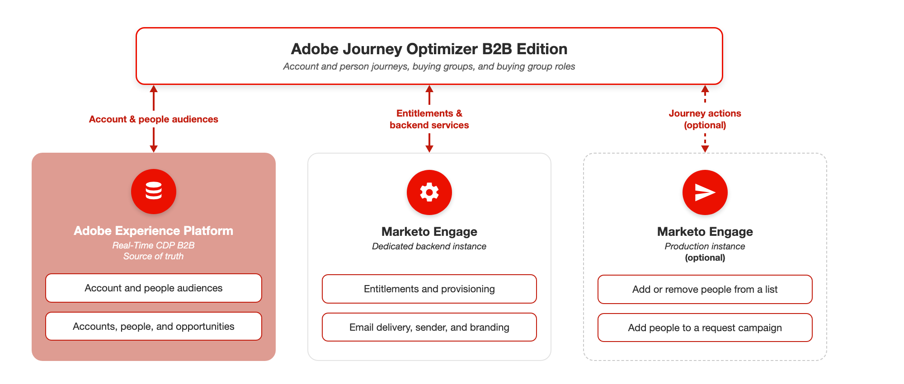

# Adobe Journey Optimizer B2B Edition の概要

Adobe Journey Optimizer B2B Editionなら、組み込みの生成AIと業界をリードする自動化機能を利用して、個人と企業のカスタマージャーニーを調整し、マーケティングに的確な購買グループを割り当てて、特定のオファリングの需要を最大化できます。

## 購買グループを含むアカウントジャーニー

アカウントジャーニーとMarketo EngageおよびAdobe Journey Optimizer standard のジャーニー機能を比較する場合、主な違いは、アカウントジャーニーでは、人物ではなくジャーニー内でアカウントが移動することです。 アカウントに関連付けられたユーザーは通常、個人のアクションではなく、ジャーニーを通じたアカウントの進行状況に基づいて非線形に進行します。 例えば、アカウントが購入ジャーニーの初期段階にいる場合、一般的なソリューションの機能や特徴に関する情報が送信されます。 購入プロセスに沿って、コンテンツは、特定のオファーや販売を成立させるために必要な他のアイテムをよりターゲットにします。 製品を購入すると、情報が再度変更され、ハウツーガイド、ベストプラクティス、今後のイベントに関する情報、追加のアップセルに関するコンテンツが提供されます。 初期段階のコンテンツで顧客とやり取りしたことがない場合でも、アカウントや購買グループ内の他のメンバーの行動にもとづいて、訪問者を現在の段階に進めることができます。

## 高レベルのアーキテクチャ

Adobe Journey Optimizer B2B Editionは、Real-Time CDP B2Bを含むAdobe Experience Platform上に構築されています。 Journey Optimizer B2B EditionとMarketo Engageは、それぞれ独自のデータストアを有する個別のシステムで実行されます。 Experience Platformは、アカウント、人物、商談に関する主要なデータストアであり、信頼できる情報源です。 Journey Optimizer B2B Editionは、アカウントジャーニー、購買グループ、購買グループの役割を一元管理します。

専用のMarketo Engage インスタンスは、各Journey Optimizer B2B Edition サブスクリプションをサポートします。 このインスタンスには、アカウントジャーニー、オーディエンス、購買グループは保存されません。 その代わりに、メール配信、送信者設定、ブランディングドメインなど、使用権限やバックエンドサービスを提供します。

ジャーニーアクションをサポートするために、実稼動インスタンスを含む既存の1つ以上のMarketo Engage インスタンスを接続することもできます。 マーケターは、ジャーニーの行動により、Journey Optimizer B2B Editionのアカウントベースのジャーニーを、Marketo Engageのリードベースのキャンペーン（リストへの人物の追加やリクエストキャンペーンなど）と連携させることができます。 [Marketo Engage インスタンスの接続に関する詳細情報](./admin/marketo-actions-connect.md)。

{zoomable="yes"}

>[!NOTE]
>
>ライセンスの使用権限と、対応する[製品説明](https://helpx.adobe.com/jp/legal/product-descriptions/adobe-journey-optimizer-b2b.html){target="_blank"}を確認して、パフォーマンスのガードレールと静的な制限を確認します。

### サブスクリプションモデル

Experience Platform サンドボックスと専用のMarketo Engage インスタンスを組み合わせると、Journey Optimizer B2B Edition サブスクリプションが定義されます。 この専用インスタンスは、実稼動のMarketo Engage インスタンスとは別のもので、アカウントジャーニーデータを保存するのではなく、使用権限とバックエンドサービスをサポートするために存在します。 [&#x200B; セットアップの詳細](./setup-ultimate.md)を見る。

Experience Platformでは、接続されたMarketo EngageインスタンスとCRM システムからのデータを一元的に把握できます。 統合データを活用してジャーニーを構築、実行します。

### ジャーニー業務

Journey Optimizer B2B Editionは、アカウントジャーニーを作成、保存、実行します。 アカウントジャーニーはMarketo Engageには表示されず、Journey Optimizer B2B Editionでのみ使用できます。

カスタマージャーニーは常に、リードやアカウント、カスタマージャーニーに関する関係者を絞り込むオーディエンスから始まります。 Experience Platformの標準オーディエンスセレクターを使用して、このオーディエンスを選択します。 マーケターは、アカウントの基準、人物の基準、購買グループの基準などを使用してパスを分割し、ジャーニーを実装します。 各パスで、アクションはコミュニケーションを送信したり、イベントが発生するのを待ったりします。

アカウントジャーニーを作成したら、それを公開してジャーニーを公開します。 適格アカウントは、24時間以内に公開済みジャーニーにエントリします。 [&#x200B; データの可用性と同期タイミングについて詳しく見る](./data/data-availability-timing.md)。

### データフロー

Journey Optimizer B2B Editionは、Adobe Real-Time CDP B2B editionの宛先として機能します。 Real-Time CDPのアカウントのセグメンテーション機能を使用して、アカウントと個人を評価するためのアカウントオーディエンスを構築し、評価します。 ジャーニーを公開すると、Journey Optimizer B2B EditionはExperience Platformから適格オーディエンスをアクティブ化します。

購買グループ、購買グループの役割、購買グループのスコアは、Adobe Journey Optimizer B2B Editionで作成および保存されます。 [購買グループの詳細](./buying-groups/buying-groups-overview.md)。
