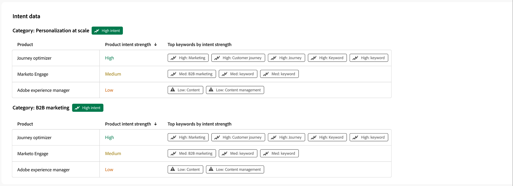

# アカウントの詳細

Journey Optimizer B2B editionのどこからでもアカウント名をクリックすると、_アカウントの詳細_ ページが表示されます。 このページでは、生成 AI の概要など、アカウントに関する有用な情報を提供します。 アカウントに関連付けられた連絡先に対して実行できる [ アクション ](#account-actions) もあります。

{width="700" zoomable="yes"}

「**[!UICONTROL 概要]**」タブを使用してアカウントに関する情報を確認し、「**[!UICONTROL 連絡先]**」タブを使用してアカウントの連絡先のリストにアクセスします。

## [!UICONTROL &#x200B; 概要 &#x200B;] タブ

アカウントの詳細ページは、次の 3 つの主要セクションで構成されます。

### アカウントの概要

{zoomable="yes"}

「アカウントの概要」セクションには、次のアカウント情報が含まれます。

* アカウント名
* アカウント内のユーザー数
* 業界
* 進行中の商談
* アカウントが現在使用されている、最新の 3 つのアカウントジャーニー（ジャーニー名をクリックすると [ ジャーニーの概要 ](../journeys/journey-overview.md) が開きます）
* アカウントの生成 AI の概要。上位のエンゲージメントの高い購入グループに関する情報が含まれます。

### インテントデータ

Journey Optimizer B2B editionでは、インテント検出モデルが、アカウント連絡先のアクティビティに基づいて、十分な信頼性を持つ関心のあるソリューション/製品を予測します。 取引先責任者の意図は、製品に興味を持つ可能性として解釈することができます。

{{intent-data-note}}

{width="700" zoomable="yes"}

* インテントのレベル
* インテントシグナルのタイプ – キーワード、製品、ソリューション

### 連絡先の適用範囲

{width="800" zoomable="yes"}

「_[!UICONTROL 連絡先の対象範囲]_」セクションには、ソリューションの関心に関連付けられた特定の役割を持つアカウントの連絡先の数が表示されます。 役割とソリューションに対する関心の割り当ては、購買グループの役割テンプレートに基づいています。 セルをクリックすると、次の詳細が表示されます。

* 説明、以下の形式で記述します。_x 人には、z ソリューションに関する y 役割があり_ す。
* 列
* 名前
* アカウント
* 役職
* 購買グループ
* 人物エンゲージメントスコア
* 最後のアクティビティ
* 詳細

左上の _フィルター_ （）アイコンをクリックし、次の属性のいずれかを使用してデータ表示をフィルタリングします。

* ソリューションに対する関心
* 期間

### 連絡先の重複

{width="800" zoomable="yes"}

「_[!UICONTROL 連絡先の重複]_」セクションには、複数のソリューションの関心に関連付けられているので、複数の購入グループに属するアカウントの連絡先が表示されます。 この情報は、次の列を持つテーブルの形式で表示されます。

* 名前
* 役職
* アカウント
* ソリューションに対する関心

連絡先名の横にある _情報_ （）をクリックして、次の詳細を含むテーブルを表示します。

* 購入グループ （名前をクリックすると [ 購入グループの詳細 ](../buying-groups/buying-group-details.md) が開きます）
* 役割
* ソリューションに対する関心
* 製品の意図（[ 設定 ](../admin/intent-data.md) の場合）
* 製品

左上の _フィルター_ （）アイコンをクリックし、次の属性のいずれかを使用してデータ表示をフィルタリングします。

* ソリューションに対する関心
* ロール

## [!UICONTROL &#x200B; 連絡先 &#x200B;] タブ

「**[!UICONTROL 連絡先]**」タブを選択して、そのアカウントに関連付けられているすべての人物のリストを表示します。このリストは、Experience Platformに同期されます。 リストされる各連絡先には、名前、メールアドレス、エンゲージメントスコアが含まれます。

{width="700" zoomable="yes"}

## メールを送信

マーケター承認済みのメールを、選択した 1 人以上（一度に最大 50 人）の連絡先や、アカウントのすべての連絡先に送信できます。 使用可能なメールのリストは、接続されたMarketo Engage インスタンスからの承認済みメールに制限されます。

>[!BEGINTABS]

>[!TAB  すべてのアカウント連絡先 ]

1. 「_[!UICONTROL 概要]_」タブで、右上の「**[!UICONTROL メールを送信]**」をクリックします。

   {width="700" zoomable="yes"}

1. _[!UICONTROL メールを送信]_ ダイアログで、「Marketo Engage Workspace」を選択し、送信するメールのチェックボックスをオンにします。

   {width="700" zoomable="yes"}

1. 「**[!UICONTROL 送信]**」をクリックします。

>[!TAB  選択された連絡先 ]

1. 「_[!UICONTROL 連絡先]_」タブから、メールを受信する連絡先のチェックボックスを選択します。

1. 右上または下部の選択バーで、「**[!UICONTROL メールを送信]**」をクリックします。

   {width="700" zoomable="yes"}

1. _[!UICONTROL メールを送信]_ ダイアログで、「Marketo Engage Workspace」を選択し、送信するメールのチェックボックスをオンにします。

   {width="700" zoomable="yes"}

1. 「**[!UICONTROL 送信]**」をクリックします。

>[!ENDTABS]
