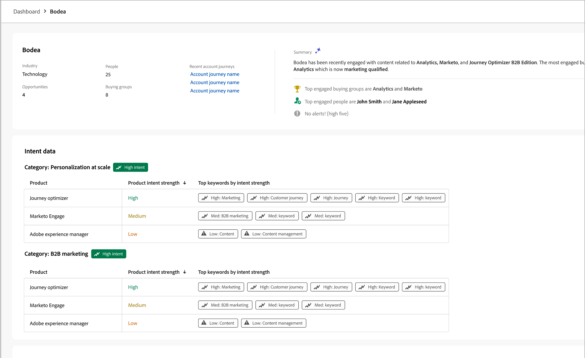
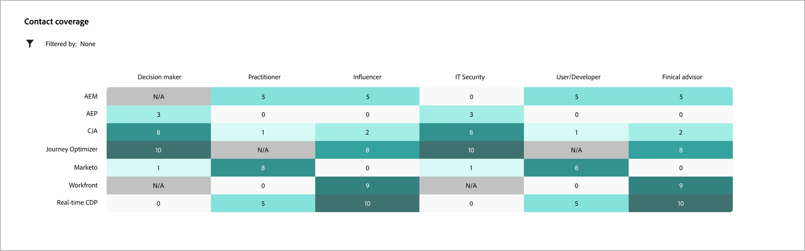
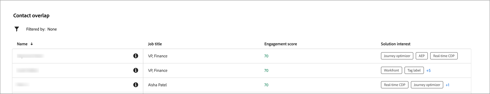
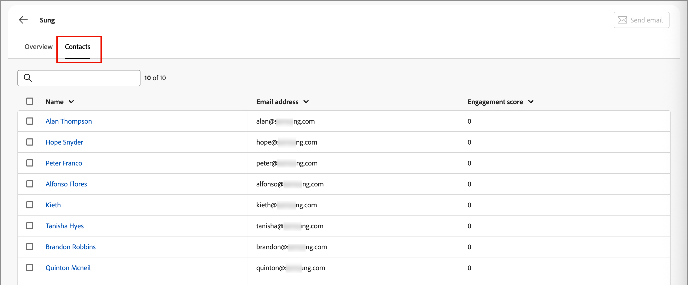
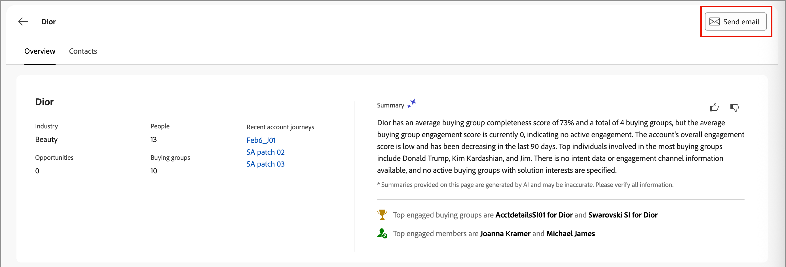
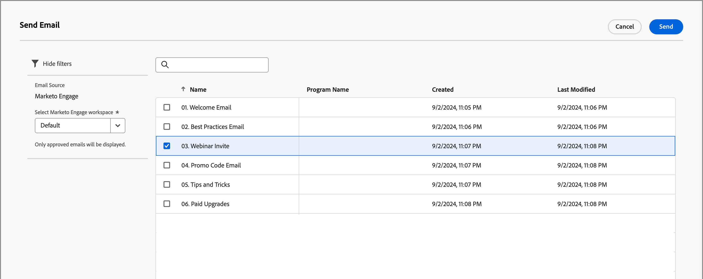
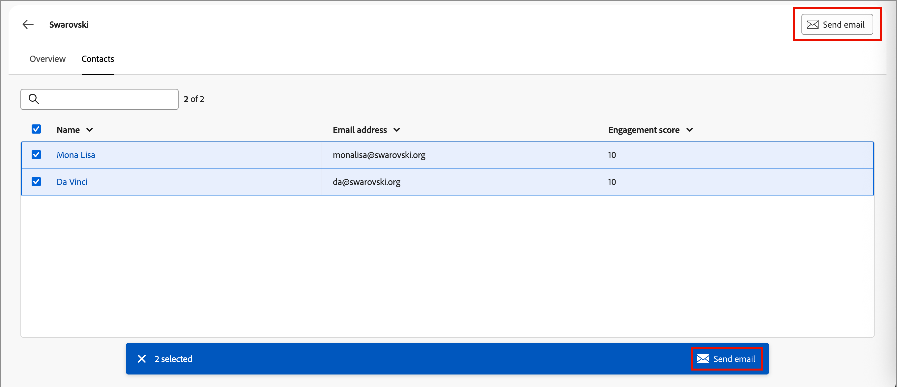

# アカウントの詳細

Journey Optimizer B2B editionの任意の場所からアカウント名をクリックすると、_アカウントの詳細_ ページが表示されます。 このページでは、生成AIの概要など、アカウントに関する有用な情報を提供します。 アカウントに関連付けられた連絡先に対して実行できる[&#x200B; アクション &#x200B;](#account-actions)もあります。

{width="700" zoomable="yes"}

「**[!UICONTROL 概要]**」タブを使用してアカウントに関する情報を確認し、「**[!UICONTROL 連絡先]**」タブを使用してアカウント連絡先のリストにアクセスします。

## [!UICONTROL 概要] タブ

アカウントの詳細ページは、次の3つの主要セクションで構成されています。

### アカウントの概要

{zoomable="yes"}

アカウントの概要セクションには、次のアカウント情報が含まれます。

* アカウント名
* アカウント内の人数
* 業界
* オープンな機会
* アカウントが現在使用されている3つの最新のアカウントジャーニー（ジャーニー名をクリックして、[&#x200B; ジャーニーの概要](../journeys/journeys-overview.md)を開きます）
* アカウントの生成AI概要。これには、最もエンゲージメントの高い購買グループに関する情報が含まれます。

### インテントデータ

Journey Optimizer B2B editionでは、インテント検出モデルは、アカウントの連絡先アクティビティに基づいて、関心のあるソリューション/製品を十分に高い信頼性で予測します。 アカウントコンタクトの意図は、製品に関心を持つ可能性と解釈できます。

{{intent-data-note}}

{width="700" zoomable="yes"}

* 意図のレベル
* インテントシグナルの種類 – キーワード、製品、ソリューション

### 連絡先の適用範囲

{width="800" zoomable="yes"}

「_[!UICONTROL 連絡先のカバー範囲]_」セクションには、ソリューションへの関心に関連付けられた特定の役割を持つアカウントの連絡先の数が表示されます。 役割とソリューションへの関心の割り当ては、購買グループの役割テンプレートに基づいています。 セルをクリックすると、次の詳細が表示されます。

* 説明、次の形式：_x人がz ソリューションの関心に対してyの役割を持っています_
* 列
* 名前
* アカウント
* 役職
* 購買グループ
* 人物エンゲージメントスコア
* 前回のアクティビティ
* 詳細

左上の&#x200B;_フィルター_ （）アイコンをクリックして、次のいずれかの属性を使用してデータ表示をフィルタリングします。

* ソリューションに対する関心
* 期間

### 連絡先の重複

{width="800" zoomable="yes"}

「_[!UICONTROL 連絡先の重複]_」セクションには、複数のソリューションの関心に関連付けられた結果、複数の購買グループに属するアカウントの連絡先が表示されます。 この情報は、次の列を持つテーブルの形式です。

* 名前
* 役職
* アカウント
* ソリューションに対する関心

連絡先名の横にある&#x200B;_情報_ （）をクリックすると、次の詳細を含むテーブルが表示されます。

* 購買グループ （名前をクリックして[購買グループの詳細](../buying-groups/buying-group-details.md)を開きます）
* 役割
* ソリューションに対する関心
* 製品インテント （[設定](../admin/intent-data.md)の場合）
* 製品

左上の&#x200B;_フィルター_ （）アイコンをクリックして、次のいずれかの属性を使用してデータ表示をフィルタリングします。

* ソリューションに対する関心
* ロール

## [!UICONTROL 連絡先] タブ

「**[!UICONTROL 連絡先]**」タブを選択すると、アカウントに関連付けられているすべてのユーザーのリストが表示され、Experience Platformに同期されます。 リストされた各連絡先には、名前、メールアドレス、エンゲージメントスコアが含まれます。

{width="700" zoomable="yes"}

## メールを送信

マーケター承認済みの電子メールを、選択した1人または複数の連絡先（一度に50件まで）に送信したり、アカウントのすべての連絡先に送信したりできます。 利用可能なメールのリストは、接続されたMarketo Engage インスタンスからの承認済みメールに限定されます。

>[!BEGINTABS]

>[!TAB すべてのアカウント連絡先]

1. _[!UICONTROL 概要]_ タブで、右上の&#x200B;**[!UICONTROL 電子メールを送信]**&#x200B;をクリックします。

   {width="700" zoomable="yes"}

1. _[!UICONTROL メールを送信]_ ダイアログで、Marketo Engage ワークスペースを選択し、送信するメールのチェックボックスをオンにします。

   {width="700" zoomable="yes"}

1. 「**[!UICONTROL 送信]**」をクリックします。

>[!TAB 選択した連絡先]

1. 「_[!UICONTROL 連絡先]_」タブで、メールを受信する連絡先のチェックボックスを選択します。

1. 右上または下部の選択バーで、**[!UICONTROL メールを送信]**&#x200B;をクリックします。

   {width="700" zoomable="yes"}

1. _[!UICONTROL メールを送信]_ ダイアログで、Marketo Engage ワークスペースを選択し、送信するメールのチェックボックスをオンにします。

   {width="700" zoomable="yes"}

1. 「**[!UICONTROL 送信]**」をクリックします。

>[!ENDTABS]
