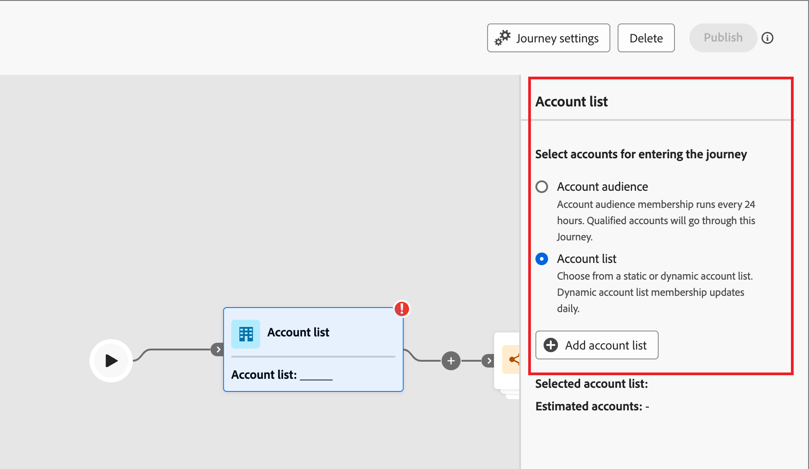
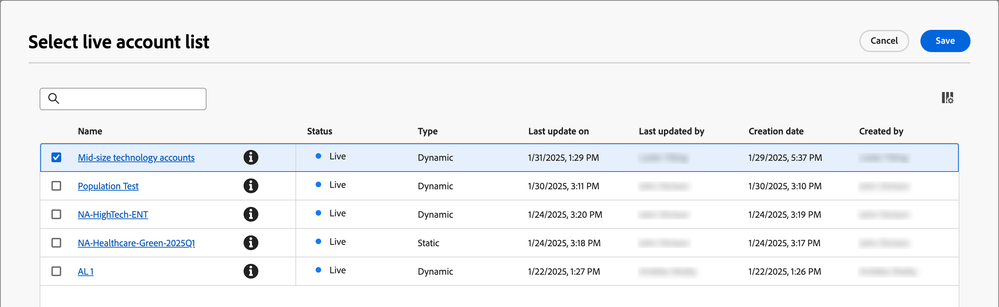
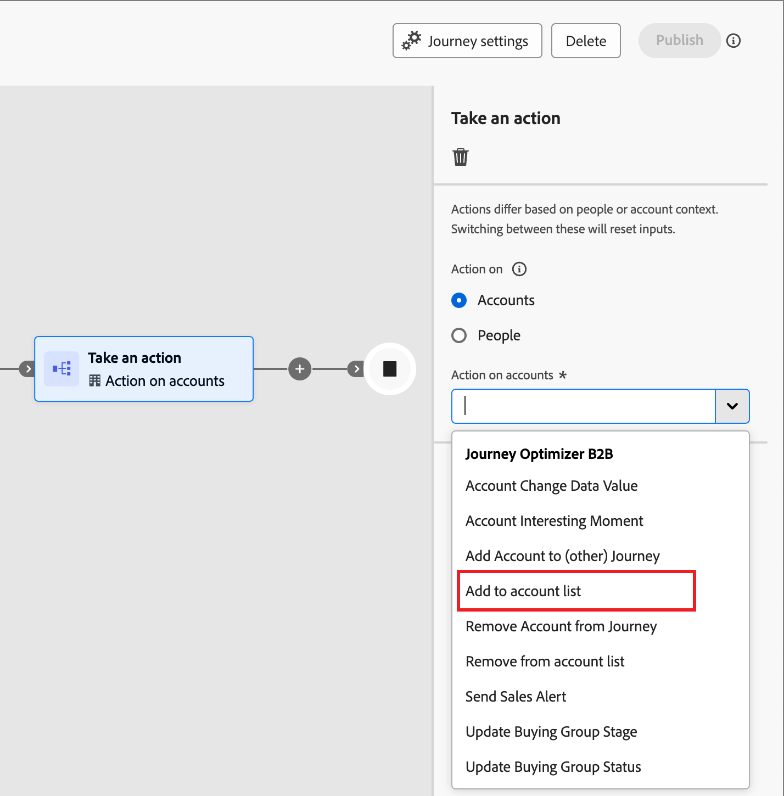
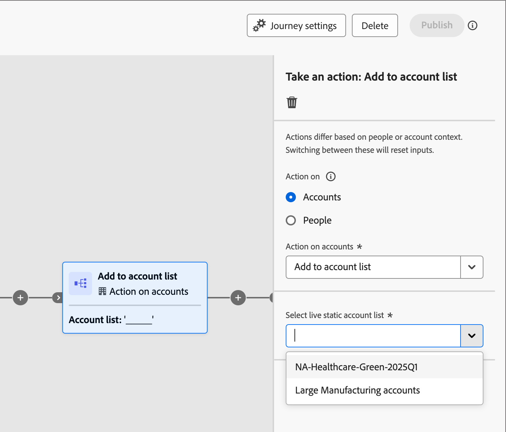
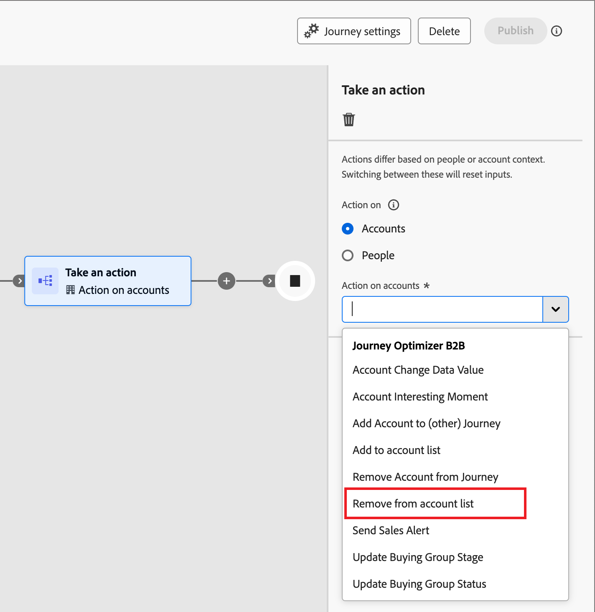
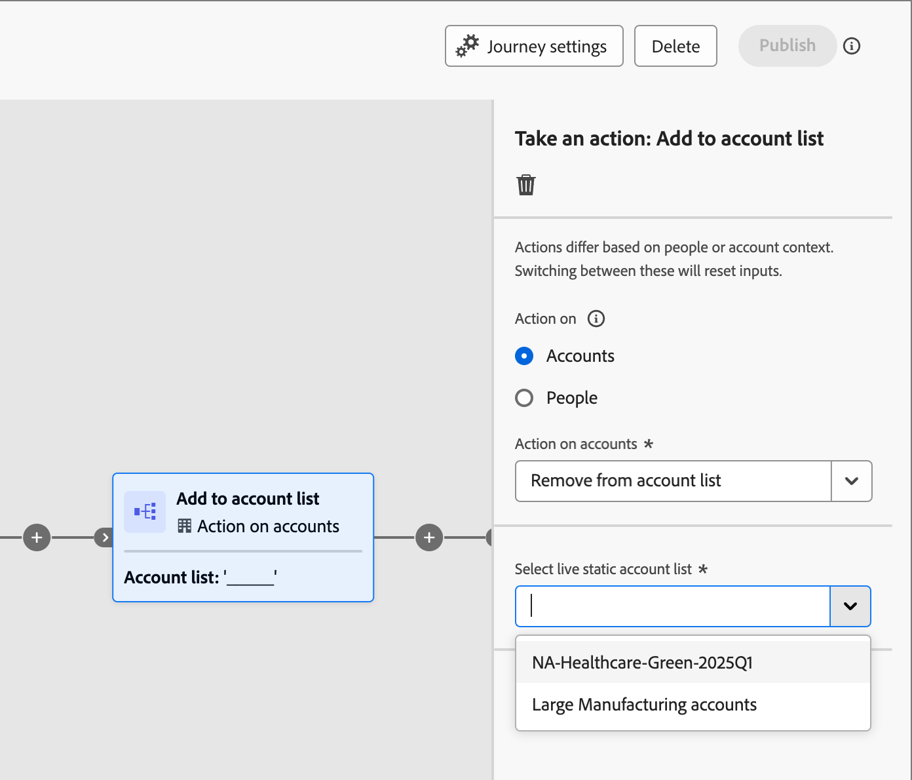
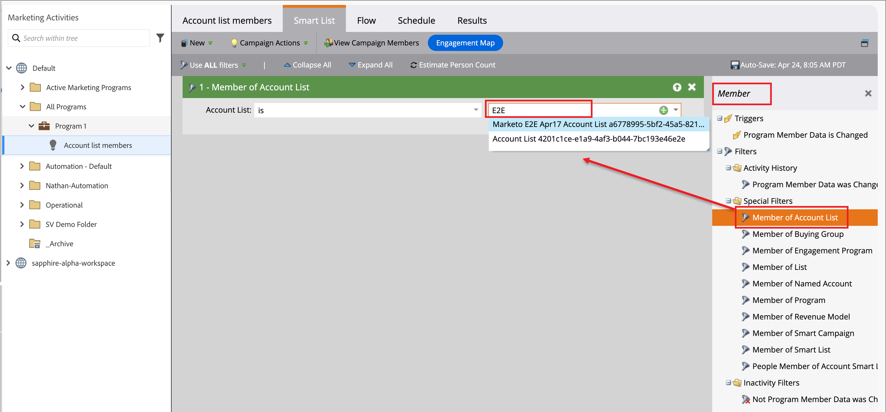
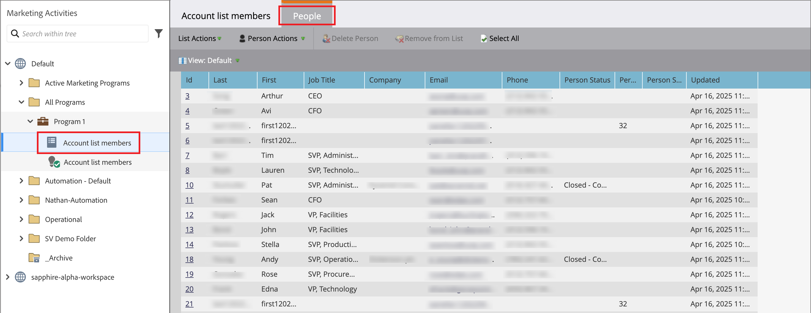

# ジャーニーとプログラムでのアカウントリストの使用

ライブ（公開済み）アカウントリストをアカウントジャーニーに組み込む方法はいくつかあります。

## アカウントオーディエンスノード

すべてのアカウントジャーニーは、[_アカウントオーディエンス_ ノード ](../journeys/account-audience-nodes.md)から始まります。 このノードをアカウントリストを使用するように設定すると、メンバーアカウントは公開時にジャーニーを移動します。

1. 開始&#x200B;_アカウントオーディエンス_ ノードの&#x200B;**[!UICONTROL アカウントリスト]** オプションを選択します。

   {width="500"}

1. 「**[!UICONTROL アカウントリストを追加]**」をクリックします。

1. アカウントリストのチェックボックスを選択し、**[!UICONTROL 保存]**&#x200B;をクリックします。

   {width="600" zoomable="yes"}

## アクションノードを作成 – アカウントに追加

**_静的アカウントリストのみ_**

アカウントジャーニー内で、[a _アクションを実行_ ノード ](../journeys/action-nodes.md)を使用してアカウントを静的アカウントリストに追加します。

たとえば、電子メールを送信するジャーニーパスがあり、一部のアカウントが応答アクションとしてさまざまなアクションを実行する場合があります。 このアクティビティは、ジャーニーの選定ポイントとみなされます。 クオリフィケーションを使用すると、クオリファイドアカウントに対して異なるフローを持つ別のジャーニーのオーディエンスとして使用されるアカウントリストにこれらを追加します。

>[!NOTE]
>
>ノードの実行時にアカウントがリストに既に存在する場合、そのアクションは無視されます。

1. 「]_**[!UICONTROL アカウント]**」の「_[!UICONTROL  アクション」オプションを選択します。

1. _[!UICONTROL アカウントに対するアクション]_&#x200B;で、**[!UICONTROL アカウントリストに追加]**&#x200B;を選択します。

   {width="500"}

1. **[!UICONTROL ライブ静的アカウントリストを選択]**&#x200B;するには、アカウントを追加するアカウントリストを選択します。

   {width="500"}

## アクションノードを作成 – アカウントから削除

**_静的アカウントリストのみ_**

アカウントジャーニー内で、[a _アクションを実行_ ノード ](../journeys/action-nodes.md)を使用して、静的アカウントリストからアカウントを削除します。

たとえば、電子メールを送信するジャーニーパスがあり、一部のアカウントが応答アクションとしてさまざまなアクションを実行する場合があります。 このアクティビティは、ジャーニーの選定ポイントとみなされます。 この選定を行うと、別のジャーニーのオーディエンスとして使用されているアカウントリストから削除し、選定に関するコミュニケーションが重複しないようにします。

>[!NOTE]
>
>削除がスケジュールされているリストにアカウントが含まれていない場合、アクションは無視されます。

1. 「]_**[!UICONTROL アカウント]**」の「_[!UICONTROL  アクション」オプションを選択します。

1. _[!UICONTROL アカウントに対するアクション]_&#x200B;で、**[!UICONTROL アカウントリストから削除]**&#x200B;を選択します。

   {width="500"}

1. **[!UICONTROL ライブ静的アカウントリストを選択]**&#x200B;するには、アカウントを削除するアカウントリストを選択します。

   {width="500"}

## Marketo Engageプログラム – メンバーオブアカウントリスト

マーケターは、Journey Optimizer B2B editionのアカウントリストに属するユーザーに対して、Marketo Engageのプログラムを除外することができます。

Journey Optimizer B2B editionに接続されているMarketo Engage インスタンスでは、スマートリストの&#x200B;_[!UICONTROL Member of Account List]_ フィルターを使用して、キャンペーン戦略に従ってこれらのリードを識別できます。 スマートリストについて詳しくは、[Marketo Engage ドキュメント ](https://experienceleague.adobe.com/en/docs/marketo/using/product-docs/core-marketo-concepts/smart-lists-and-static-lists/understanding-smart-lists){target="_blank"}を参照してください。

### フィルターをスマートリストに追加

1. Marketo Engageで、キャンペーンを選択し、「**[!UICONTROL スマートリスト]**」タブをクリックします。

1. 右側に表示されるフィルターリストで、`Member`と入力し、**[!UICONTROL アカウントリストのメンバー]** フィルターを見つけます。

1. フィルターをスマートリストキャンバスにドラッグします。

1. スマートリストキャンバスで、**[!UICONTROL アカウントのメンバー]** リスト値を設定します。

   下向き矢印をクリックして、すべてのアカウントリストを表示するか、アカウントリスト名の一部を入力して、必要なアカウントリストを見つけます。

   {width="800" zoomable="yes"}

1. キャンペーンフローで、**[!UICONTROL リストに追加]** ステップを追加し、Journey Optimizer B2B edition アカウントリストから人物を入力するリストを選択します。

   フローにステップを追加する方法の詳細については、Marketo Engage ドキュメントの「_[スマートキャンペーンにフローステップを追加する](https://experienceleague.adobe.com/en/docs/marketo/using/product-docs/core-marketo-concepts/smart-campaigns/flow-actions/add-a-flow-step-to-a-smart-campaign){target="_blank"}_」を参照してください。

### メンバーのレビュー

フローの実行後、リストに入力された人物のリストを表示できます。 リストを開き、「人物」タブを選択します。

{width="800" zoomable="yes"}
