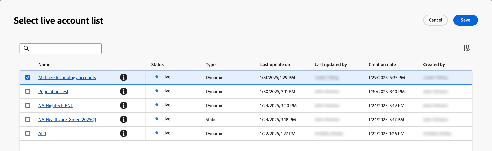
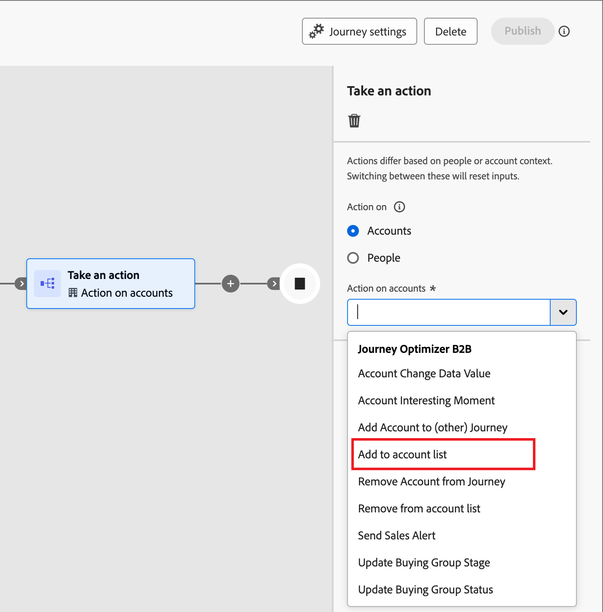

# ジャーニーでのアカウントリストの使用

ライブ（公開済み）アカウントリストをアカウントジャーニーに組み込む方法はいくつかあります。

## アカウントオーディエンスノード

すべてのアカウントジャーニーは、[_アカウントオーディエンス_ ノード &#x200B;](../journeys/account-audience-nodes.md)から始まります。 このノードをアカウントリストを使用するように設定すると、メンバーアカウントは公開時にジャーニーを移動します。

1. 開始&#x200B;_アカウントオーディエンス_ ノードの&#x200B;**[!UICONTROL アカウントリスト]** オプションを選択します。

   {width="500"}

1. 「**[!UICONTROL アカウントリストを追加]**」をクリックします。

1. アカウントリストのチェックボックスを選択し、**[!UICONTROL 保存]**&#x200B;をクリックします。

   {width="600" zoomable="yes"}

## アクションノードを作成 – アカウントに追加

**_静的アカウントリストのみ_**

アカウントジャーニー内で、[a _アクションを実行_ ノード &#x200B;](../journeys/action-nodes.md)を使用してアカウントを静的アカウントリストに追加します。

たとえば、電子メールを送信するジャーニーパスがあり、一部のアカウントが応答としてさまざまなアクションを実行するとします。 このアクティビティは、ジャーニーの選定ポイントとみなされます。 クオリフィケーションを使用すると、クオリファイドアカウントに対して異なるフローを持つ別のジャーニーのオーディエンスとして使用されるアカウントリストにこれらを追加します。

>[!NOTE]
>
>ノードの実行時にアカウントがリストに既に存在する場合、そのアクションは無視されます。

1. 「_&#x200B;**[!UICONTROL アカウント]**」の「_ アクション」オプションを選択します。

1. _[!UICONTROL アカウントに対するアクション]_&#x200B;で、**[!UICONTROL アカウントリストに追加]**&#x200B;を選択します。

   {width="500"}

1. **[!UICONTROL ライブ静的アカウントリストを選択]**&#x200B;するには、アカウントを追加するアカウントリストを選択します。

   {width="500"}

## アクションノードを作成 – アカウントから削除

**_静的アカウントリストのみ_**

アカウントジャーニー内で、[a _アクションを実行_ ノード &#x200B;](../journeys/action-nodes.md)を使用して、静的アカウントリストからアカウントを削除します。

たとえば、電子メールを送信するジャーニーパスがあり、一部のアカウントが応答としてさまざまなアクションを実行するとします。 このアクティビティは、ジャーニーの選定ポイントとみなされます。 この選定では、アカウントリストからこれらを削除します。 このリストは、資格に関するコミュニケーションが重複しないように、追加のメールを送信する別のジャーニーのオーディエンスとして使用されます。

>[!NOTE]
>
>削除がスケジュールされているリストにアカウントが含まれていない場合、アクションは無視されます。

1. 「_&#x200B;**[!UICONTROL アカウント]**」の「_ アクション」オプションを選択します。

1. _[!UICONTROL アカウントに対するアクション]_&#x200B;で、**[!UICONTROL アカウントリストから削除]**&#x200B;を選択します。

   {width="500"}

1. **[!UICONTROL ライブ静的アカウントリストを選択]**&#x200B;するには、アカウントを削除するアカウントリストを選択します。

   {width="500"}
