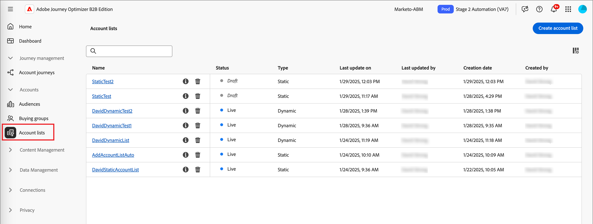
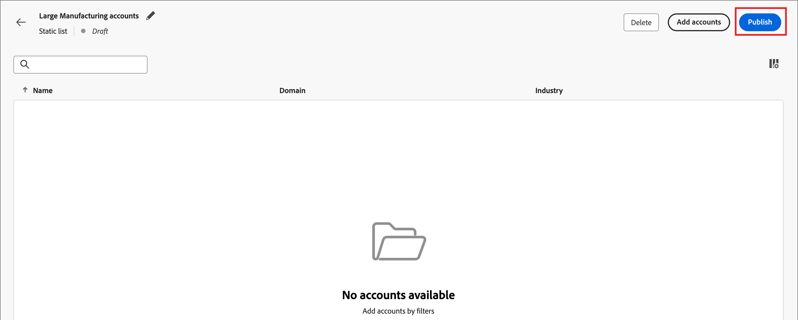

# 顧客リスト

アカウントリストは、マーケターがターゲットのジャーニーオーケストレーションに使用できる名前付きアカウントのコレクションです。 アカウントリストでは、定義済みの条件（業界、場所、会社の規模など）に基づいて指定顧客をターゲットにすることができます。 アカウントリストには、次の 2 種類があります。

* **静的** – 静的アカウントリストでは、アカウントを追加した場合にのみリストが変更されます。 現在のアカウントデータに基づいてリストに入力するフィルターセットを適用するか、アカウントジャーニーを通じてアカウントを追加および削除することで、アカウントを手動で追加できます。
* **動的** – 動的アカウントリストを使用すると、リストを自動的にキュレーションするためのフィルターセットを定義できます。 システムは、このフィルターセットを使用して、アカウント情報の変更に従ってアカウントを追加および削除します。 このリスト管理は、[Real-time Customer Data Platformでのオーディエンスのセグメント化 ](https://experienceleague.adobe.com/en/docs/experience-platform/rtcdp/segmentation/b2b) に似ています。

アカウントリストが _ライブ_ （公開済み）状態の場合、アカウントジャーニーで使用できます。

## アカウントリストへのアクセスと参照

1. Adobe Experience Platformのホームページで、「Adobe Journey Optimizer B2B edition」をクリックします。

1. 左側のナビゲーションで、「**[!UICONTROL アカウント]**」を展開し、「**[!UICONTROL アカウントリスト]**」をクリックします。

   {width="800" zoomable="yes"}

   表示される _[!UICONTROL アカウントリスト]_ ページには、次の列が含まれます。

   * [!UICONTROL  名前 ] （アカウントリストの名前をクリックすると詳細が表示されます）
   * [!UICONTROL ステータス]
   * [!UICONTROL タイプ]
   * [!UICONTROL  最終更新日 ]
   * [!UICONTROL 最終更新者]
   * [!UICONTROL 作成日]
   * [!UICONTROL 作成者]

このテーブルには、名前で検索する機能が含まれています。 並べ替え関数は現在使用できません。

右上隅の _列設定_ （） アイコンをクリックし、チェックボックスをオンまたはオフにすることで、表示されたテーブルをカスタマイズできます。

{width="300"}

アカウントリストの説明を表示するには、名前の横にある _情報_ アイコンをクリックします。

## アカウントリストの作成

アカウントリストを作成する場合、リストを生成するための一連のフィルターを定義します。 例えば、業界がヘルスケアで、売上高が 1 億ドルを超えるアカウントのリストを生成するために使用できます。

1. _[!UICONTROL アカウントリスト]_ ページで、ページの右上にある **[!UICONTROL アカウントリストを作成]** をクリックします。

   {width="700" zoomable="yes"}

1. _[!UICONTROL アカウントリストを作成]_ ダイアログで、一意の **[!UICONTROL 名前]** （必須）と **[!UICONTROL 説明]** （オプション）を入力します。

1. アカウントリストの _[!UICONTROL タイプ]_ を選択し、**[!UICONTROL 静的]** または **[!UICONTROL 動的]** にします。

   {width="380"}

1. 「**[!UICONTROL 作成]**」をクリックします。

   新しい静的アカウントリストが開き、アカウントの空のリストが表示されます。 ページの _[!UICONTROL フィルターでアカウントを追加]_ パネルを使用して、新しい動的アカウントリストが開きます。

## アカウントリストへのアカウントの追加

静的リストの場合は、空のアカウントリストを公開し、アカウントジャーニーを通じてアカウントを追加する手順に進むことができます。 フィルターセットを適用して公開する前に手動でアカウントを追加することもできます。

動的アカウントリストの場合、リストを公開する前に、リストの自動管理に使用するフィルターセットを追加する必要があります。

>[!BEGINTABS]

>[!TAB  静的アカウントリスト ]

静的アカウントリストを作成したら、フィルターセットを適用することでリストに入力できます。 フィルターセットを適用して、公開後に静的アカウントリストにアカウントを追加することもできます（_Live_）。

>[!NOTE]
>
>アカウントリストを空として開始する場合は、フィルターを選択せず、アカウントリストを公開するだけです。 アカウントジャーニーアクションを通じてメンバーを追加する予定がある場合は、空のリストから開始すると便利です（[ アクションノードの実行 – アカウントに追加 ](#take-an-action-node---add-to-account) を参照）。

1. 「**[!UICONTROL アカウントを追加]**」をクリックします。

   {width="700" zoomable="yes"}

   この関数には、空のリストページまたは右上でアクセスできます。

1. _[!UICONTROL フィルターでアカウントを追加]_ ダイアログで、**[!UICONTROL アカウントフィルター]** メニューを使用して、フィルターセットの作成に使用する属性とアクティビティを追加します。

   フィルターは、カテゴリフォルダーにネストされます。 各フォルダーを展開し、使用可能なフィルターのリストをスクロールできます。 または、上部にある _検索_ ツールを使用して、必要なフィルターを見つけます。

   * 左側のメニューからフィルターをフィルター定義スペースにドラッグ&amp;ドロップします。
   * 一致評価の定義を完了します。
   * 含めるフィルターごとに、これらのアクションを繰り返します。

     {width="700" zoomable="yes"}

   * 上部の **[!UICONTROL フィルターロジック]** を適用して、条件を微調整できます。 すべての属性条件または任意の条件に一致するように選択できます。

     {width="450"}

1. フィルターセットとロジックが完了したら、「**[!UICONTROL アカウントの設定]**」をクリックします。

   評価して入力するアカウントの数（データベースのサイズと選択したフィルター条件）によっては、母集団プロセスに時間がかかる場合があります。 アカウントがリストに入力されるまでに最大 2 時間かかる場合があります。

リストの公開に進み、アカウントジャーニーでの追加および削除アクションで使用できるようになります。

>[!TAB  動的アカウントリスト ]

動的アカウントリストを作成したら、リストが _ライブ_ （公開済み）の場合に、リストの管理（アカウントの追加/削除）に使用するフィルターセットを定義します。 アカウントジャーニーを通じてアカウントの追加または削除はできませんが、開始アカウントオーディエンスノードでは公開済みの動的アカウントリストを使用できます。

1. **[!UICONTROL フィルターを選択]** をクリックします。

   {width="700" zoomable="yes"}

1. _[!UICONTROL フィルターによってアカウントを追加]_ ダイアログで、**[!UICONTROL アカウントフィルター]** メニューを使用して、フィルターセットの作成に使用する属性と特別なフィルターを追加します。

   フィルターは、カテゴリフォルダーにネストされます。 各フォルダーを展開し、使用可能なフィルターのリストをスクロールできます。 または、上部にある _検索_ ツールを使用して、必要なフィルターを見つけます。

   * 左側のメニューからフィルターをフィルター定義スペースにドラッグ&amp;ドロップします。
   * 一致評価の定義を完了します。
   * 含めるフィルターごとに、これらのアクションを繰り返します。

     {width="700" zoomable="yes"}

   * 上部の **[!UICONTROL フィルターロジック]** を適用して、条件を微調整できます。 すべての属性条件または任意の条件に一致するように選択できます。

     {width="450"}

1. フィルターセットとロジックが完了したら、「**[!UICONTROL 完了]**」をクリックします。

   フィルターセットに満足したら、[ リストを公開 ](#publish-an-account-list) に進んで、アカウントジャーニーの開始 [ アカウントオーディエンスノード ](#account-audience-node) で使用できるようにします。

   >[!NOTE]
   >
   >リストの公開後に、動的アカウントリストのフィルターを更新することはできません。

   評価して入力するアカウントの数（データベースのサイズと選択したフィルター条件）によっては、母集団プロセスに時間がかかる場合があります。 アカウントがリストに入力されるまでに最大 2 時間かかる場合があります。

>[!ENDTABS]

## アカウントリストのPublish

フィルターセットが完了したらすぐに、アカウントリストの公開に進むことができます。

>[!BEGINTABS]

>[!TAB  静的アカウントリスト ]

1. 右上の **[!UICONTROL Publish]** をクリックします。

   {width="700" zoomable="yes"}

1. _[!UICONTROL Publish静的アカウントリスト]_ ダイアログで、**[!UICONTROL Publish]** をクリックして確定します。

   {width="400"}

静的アカウントリストのステータスが _[!UICONTROL ライブ]_ に変わり、[ アカウントジャーニーで使用 ](#account-list-usage-in-account-journeys) できるようになります。

>[!TAB  動的アカウントリスト ]

フィルターセットが完了したらすぐに、動的アカウントリストの公開に進むことができます。 アカウントリストは、ライブ ステータスになると、アカウントオーディエンスジャーニーノードで選択できるようになります。

1. 右上の **[!UICONTROL Publish]** をクリックします。

   {width="700" zoomable="yes"}

1. _[!UICONTROL Publish動的アカウントリスト]_ ダイアログで、**[!UICONTROL Publish]** をクリックして確定します。

   {width="400"}

動的アカウントリストのステータスが _[!UICONTROL ライブ]_ に変わり、[ アカウントジャーニーで使用 ](#account-list-usage-in-account-journeys) できるようになります。

>[!ENDTABS]

## アカウントジャーニーでのアカウントリストの使用

ライブ（公開済み）アカウントリストをアカウントジャーニーに組み込む方法は 3 つあります。

### アカウントオーディエンスノード

1. 開始 **[!UICONTROL アカウントオーディエンス]** ノードの _アカウントリスト_ を選択します。

   {width="500"}

1. **[!UICONTROL アカウントリストを追加]** をクリックします。

1. アカウントリストのチェックボックスを選択し、「**[!UICONTROL 保存]**」をクリックします。

   {width="600" zoomable="yes"}

リスト内のアカウントは、ライブ（公開済み）になるとジャーニーを進みます。

### アクションノードの作成 – アカウントに追加

**_静的アカウントリストのみ_**

[a _アクションの実行_ ノード ](../journeys/action-nodes.md) を使用して、アカウントを静的アカウントリストに追加します。

例えば、メールを送信するジャーニーパスがあり、一部のアカウントが応答アクションとして様々なアクションを実行する場合などです。 このアクティビティをジャーニーの選定ポイントと見なし、選定アカウントのフローが異なる別のジャーニーのオーディエンスとして使用されるアカウントリストに追加するとします。

>[!NOTE]
>
>ノードの実行時にアカウントがリストに既に含まれている場合、そのアクションは無視されます。

1. _[!UICONTROL アカウントに対するアクション]_ オプション **[!UICONTROL 選択]** ます。

1. _[!UICONTROL アカウントに対するアクション]_ については、**[!UICONTROL アカウントリストに追加]** を選択します。

   {width="500"}

1. **[!UICONTROL ライブ静的アカウントリストを選択]** については、アカウントを追加するアカウントリストを選択します。

   {width="500"}

### アクションノードの実行 – アカウントから削除

**_静的アカウントリストのみ_**

[a _アクションの実行_ ノード ](../journeys/action-nodes.md) を使用して、静的アカウントリストからアカウントを削除します。

例えば、メールを送信するジャーニーパスがあり、一部のアカウントが応答アクションとして様々なアクションを実行する場合などです。 このアクティビティをジャーニーの選定ポイントと見なし、選定コミュニケーションが重複しないように、追加のメールを送信する別のジャーニーのオーディエンスとしてに使用されるアカウントリストから削除するとします。

>[!NOTE]
>
>アカウントが削除予定のリストにない場合、アクションは無視されます。

1. _[!UICONTROL アカウントに対するアクション]_ オプション **[!UICONTROL 選択]** ます。

1. _[!UICONTROL アカウントに対するアクション]_ については、**[!UICONTROL アカウントリストから削除]** を選択します。

   {width="500"}

1. **[!UICONTROL ライブ静的アカウントリストを選択]** については、アカウントを削除するアカウントリストを選択します。

   {width="500"}
