# アカウントリスト

Journey Optimizer B2B editionでは、アカウントリストは、マーケターがターゲットジャーニーオーケストレーションに使用できる名前付きアカウントのコレクションです。 アカウントリストでは、業界、所在地、企業規模などの定義された基準にもとづいて、名前付きアカウントをターゲティングできます。 アカウントリストには、次の2種類があります。

* **静的** – 静的なアカウントリストでは、アカウントを追加するとリストが変更されます。 現在のアカウントデータに基づいてリストに入力するフィルターセットを適用するか、アカウントジャーニーを通じてアカウントを追加および削除することで、アカウントを手動で追加できます。
* **動的** – 動的アカウントリストを使用すると、リストを自動的にキュレートするためのフィルターセットを定義できます。 このフィルターセットを使用して、アカウント情報の変更に応じてアカウントを追加および削除します。 このリスト管理は、Real-time Customer Data Platform[&#128279;](https://experienceleague.adobe.com/ja/docs/experience-platform/rtcdp/segmentation/b2b){target="_blank"}での オーディエンスセグメンテーションに似ています。

アカウントリストが&#x200B;_ライブ_ （公開）状態の場合、アカウントジャーニーおよびMarketo Engage プログラム [&#128279;](./account-lists-journeys.md)で使用できます。

{width="30"} [概要ビデオを視聴](#overview-video)

>[!NOTE]
>
>アカウントリスト Adobe Marketo Engageのアカウントデータを利用して、アカウントセグメントとリストを作成できます。 つまり、Adobe Experience PlatformのアカウントセグメントがMarketo Engageにアクティブに同期されていない場合、そのExperience Platform セグメントのアカウントはJourney Optimizer B2B edition アカウントリストで使用できない可能性があります。 その後、Marketo Engageに同期されたExperience Platform セグメントのアカウントの人物のみが、個人メンバーシップ数とトリガーイベントに含まれます。

## アカウントリストへのアクセスと参照

左側のナビゲーションで、**[!UICONTROL アカウント]**&#x200B;を展開し、**[!UICONTROL アカウントリスト]**&#x200B;をクリックします。

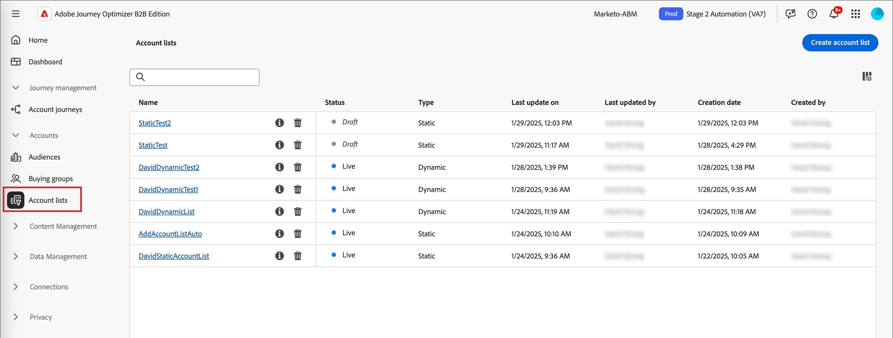{width="800" zoomable="yes"}

表示される&#x200B;_[!UICONTROL アカウントリスト]_ ページには、次の列が含まれています。

* [!UICONTROL 名前] （アカウントリストの名前をクリックすると詳細が表示されます）
* [!UICONTROL ステータス]
* [!UICONTROL タイプ]
* [!UICONTROL 最終更新日：]
* [!UICONTROL 最終更新者]
* [!UICONTROL 作成日]
* [!UICONTROL 作成者]

この表には、名前で検索する機能が含まれています。 並べ替え機能は現在使用できません。

右上隅の&#x200B;_列設定_ （）アイコンをクリックして、チェックボックスを選択またはクリアすると、表示されるテーブルをカスタマイズできます。

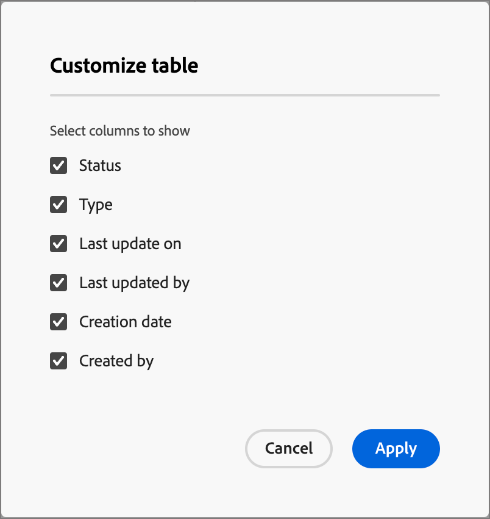{width="300"}

アカウントリストの説明を表示するには、名前の横にある&#x200B;_情報_ （）アイコンをクリックします。

## アカウントリストの作成

アカウントリストを作成する場合、リストを生成するためのフィルターのセットを定義します。 例えば、ヘルスケア業界の売上が1億ドルを超えるアカウントのリストを生成するために利用できます。

1. _[!UICONTROL アカウントリスト]_ ページで、ページの右上にある「**[!UICONTROL アカウントリストを作成]**」をクリックします。

   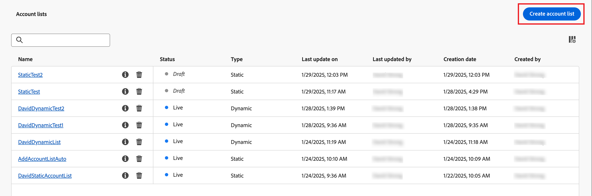{width="700" zoomable="yes"}

1. _[!UICONTROL アカウントリストを作成]_ ダイアログで、一意の&#x200B;**[!UICONTROL 名前]** （必須）と&#x200B;**[!UICONTROL 説明]** （オプション）を入力します。

1. アカウントリストの&#x200B;_[!UICONTROL タイプ]_、**[!UICONTROL 静的]**&#x200B;または&#x200B;**[!UICONTROL 動的]**&#x200B;を選択します。

   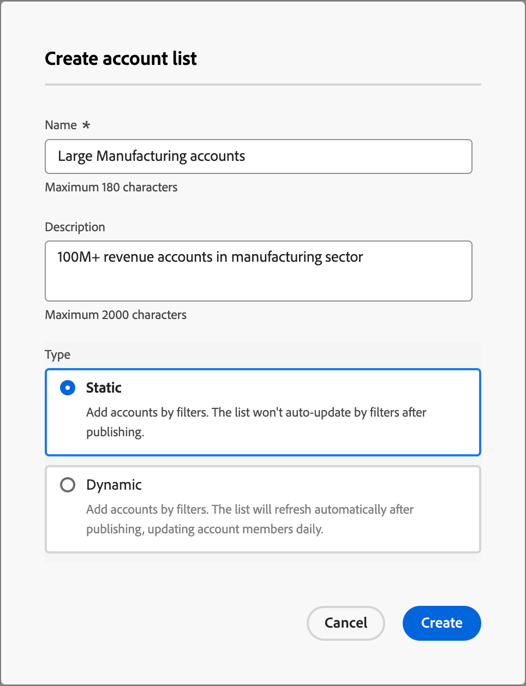{width="380"}

1. 「**[!UICONTROL 作成]**」をクリックします。

   新しい静的アカウントリストが開き、空のアカウントリストが表示されます。 新しい動的アカウントリストが開き、ページの「_[!UICONTROL フィルターでアカウントを追加]_」パネルが表示されます。

## アカウントリストへのアカウントの追加

静的リストの場合は、空のアカウントリストを公開し、アカウントジャーニーを通じてアカウントを追加できます。 フィルターセットを公開する前に適用して、アカウントを手動で追加することもできます。

動的アカウントリストの場合、リストを公開する前に、リストを自動的に管理するために使用するフィルターセットを追加する必要があります。

>[!BEGINTABS]

>[!TAB 静的アカウントリスト ]

静的アカウントリストを作成したら、フィルターセットを適用してリストに入力できます。 また、フィルターセットを適用して、公開後（_Live_）に静的アカウントリストにアカウントを追加することもできます。

>[!NOTE]
>
>アカウントリストを空として開始する場合は、フィルターを選択せず、アカウントリストを公開するだけです。 アカウントジャーニーアクションを通じてメンバーを追加する予定がある場合は、空のリストから開始すると便利です（[&#x200B; アクションノードを取得 – アカウントに追加](#take-an-action-node---add-to-account)を参照）。

1. 「**[!UICONTROL アカウントを追加]**」をクリックします。

   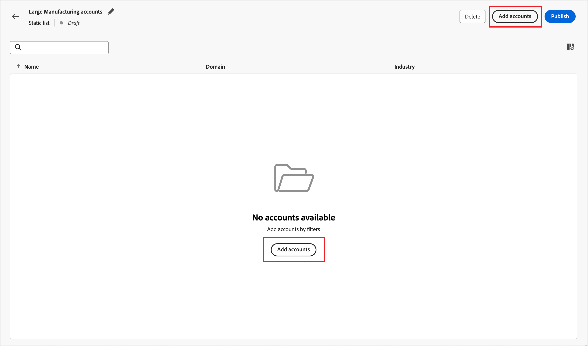{width="700" zoomable="yes"}に入力します

   この関数には、空のリストページまたは右上にアクセスできます。

1. _[!UICONTROL フィルターでアカウントを追加]_ ダイアログで、**[!UICONTROL アカウントフィルター]** メニューを使用して、フィルターセットの作成に使用する属性とアクティビティを追加します。

   フィルターはカテゴリーフォルダーにネストされます。 各フォルダーを展開し、利用可能なフィルターのリストをスクロールできます。 または、上部の&#x200B;_検索_ ツールを使用して、必要なフィルターを見つけます。

   * 左メニューからフィルター定義スペースにフィルターをドラッグ&amp;ドロップします。
   * 一致評価の定義を完了します。
   * 含めるフィルターごとに、これらのアクションを繰り返します。

     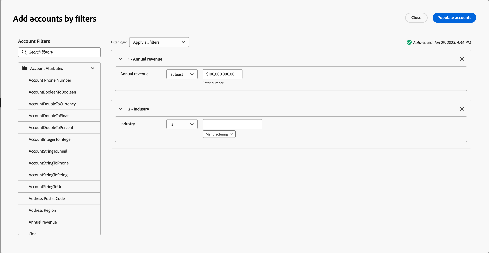{width="700" zoomable="yes"}に入力するフィルターを追加

   * 上部の&#x200B;**[!UICONTROL フィルターロジック]**&#x200B;を適用することで、条件を微調整できます。 すべての属性条件または任意の条件を一致させるように選択できます。

     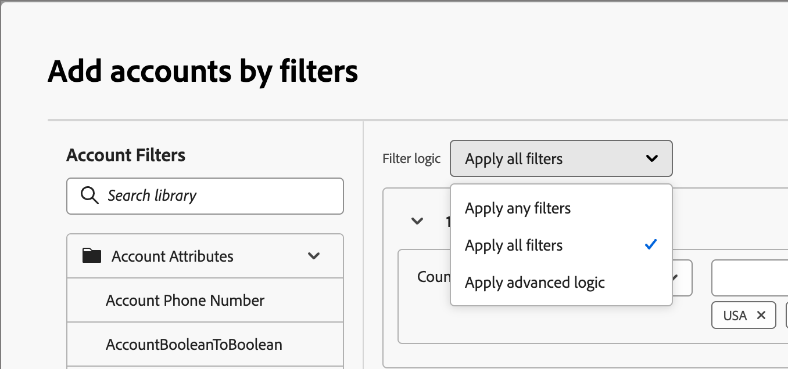{width="450"}

1. フィルターセットとロジックが完了したら、**[!UICONTROL アカウントの設定]**&#x200B;をクリックします。

   評価および入力するアカウントの数（データベースのサイズと選択したフィルター条件）によっては、生成プロセスに時間がかかる場合があります。 アカウントがリストに入力されるまでに最大2時間かかる場合があります。

リストを公開して、アカウントジャーニーでアクションを追加および削除できるようにします。

>[!TAB 動的アカウントリスト ]

動的アカウントリストを作成した後、リストの管理（アカウントの追加と削除）に使用するフィルターセットを定義します。このフィルターセットは、_ライブ_ （公開）の場合に使用します。 アカウントジャーニーを通じてアカウントを追加または削除することはできませんが、公開された動的アカウントリストは、開始アカウントオーディエンスノードで使用できます。

1. 「**[!UICONTROL フィルターを選択]**」をクリックします。

   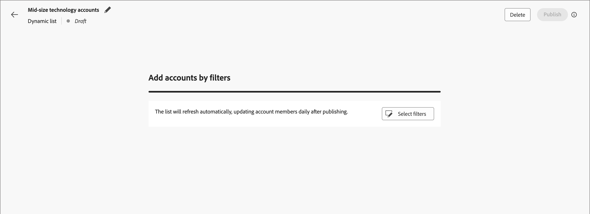{width="700" zoomable="yes"}

1. _[!UICONTROL フィルターでアカウントを追加]_ ダイアログで、**[!UICONTROL アカウントフィルター]** メニューを使用して、フィルターセットの作成に使用する属性と特殊フィルターを追加します。

   フィルターはカテゴリーフォルダーにネストされます。 各フォルダーを展開し、利用可能なフィルターのリストをスクロールできます。 または、上部の&#x200B;_検索_ ツールを使用して、必要なフィルターを見つけます。

   * 左メニューからフィルター定義スペースにフィルターをドラッグ&amp;ドロップします。
   * 一致評価の定義を完了します。
   * 含めるフィルターごとに、これらのアクションを繰り返します。

     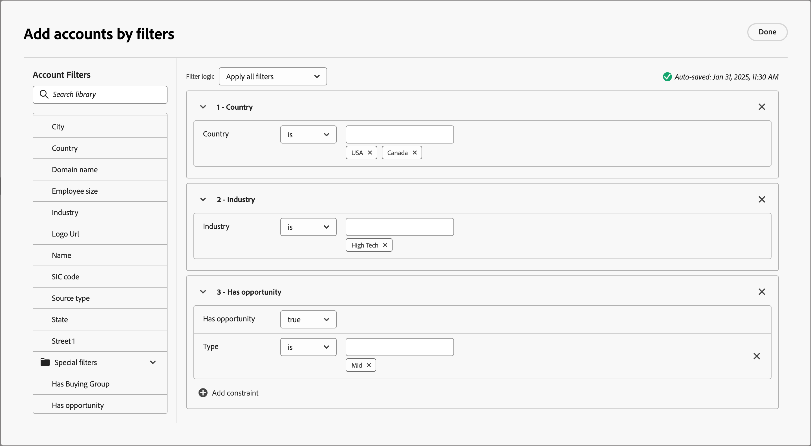{width="700" zoomable="yes"}に入力するフィルターを追加

   * 上部の&#x200B;**[!UICONTROL フィルターロジック]**&#x200B;を適用することで、条件を微調整できます。 すべての属性条件または任意の条件を一致させるように選択できます。

     {width="450"}

1. フィルターセットとロジックが完了したら、**[!UICONTROL 完了]**&#x200B;をクリックします。

   フィルターセットに満足している場合は、[&#x200B; リストを公開](#publish-an-account-list)に進み、アカウントジャーニーの最初の[&#x200B; アカウントオーディエンスノード &#x200B;](#account-audience-node)で使用できるようにします。

   >[!NOTE]
   >
   >リストの公開後に、動的アカウントリストのフィルターを更新することはできません。

   評価および入力するアカウントの数（データベースのサイズと選択したフィルター条件）によっては、生成プロセスに時間がかかる場合があります。 アカウントがリストに入力されるまでに最大2時間かかる場合があります。

>[!ENDTABS]

## アカウントリストの公開

フィルターセットが完了するとすぐに、アカウントリストの公開に進むことができます。

>[!BEGINTABS]

>[!TAB 静的アカウントリスト ]

1. 右上の「**[!UICONTROL 公開]**」をクリックします。

   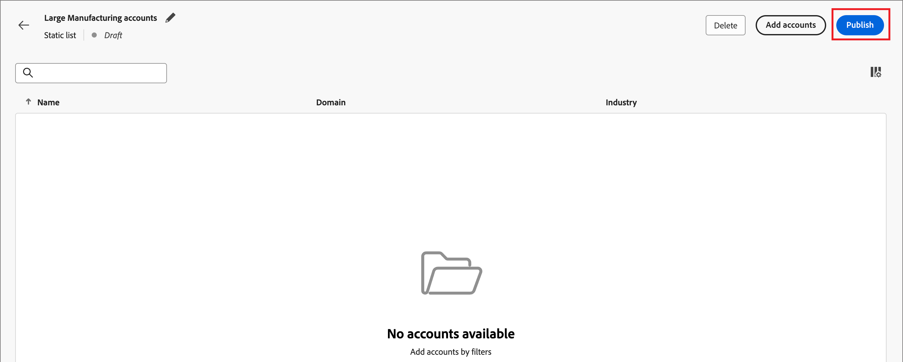{width="700" zoomable="yes"}

1. _[!UICONTROL 静的アカウントリストを公開]_ ダイアログで、**[!UICONTROL 公開]**&#x200B;をクリックして確認します。

   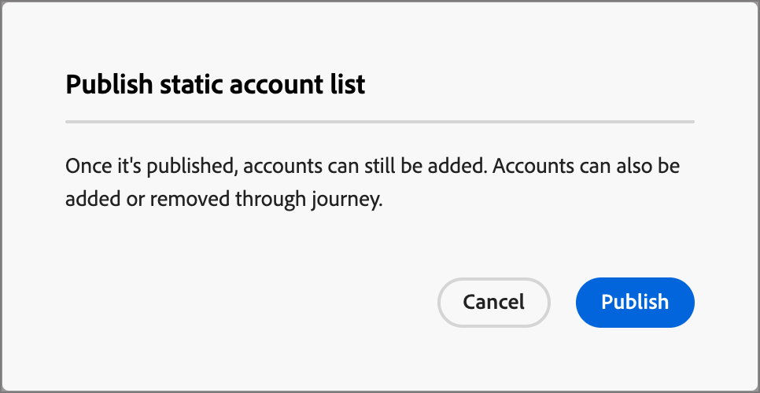{width="400"}

静的アカウントリストのステータスが&#x200B;_[!UICONTROL ライブ]_&#x200B;に変更され、アカウントジャーニー[&#128279;](#account-list-usage-in-account-journeys)で使用できるようになります。

>[!TAB 動的アカウントリスト ]

フィルターセットが完了するとすぐに、動的アカウントリストの公開に進むことができます。 アカウントリストがライブステータスになると、アカウントオーディエンスジャーニーノードで選択できるようになります。

1. 右上の「**[!UICONTROL 公開]**」をクリックします。

   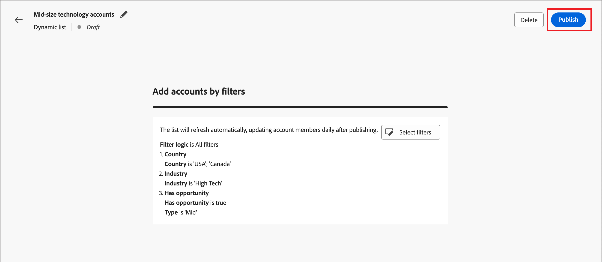{width="700" zoomable="yes"}

1. _[!UICONTROL 動的アカウントリストを公開]_ ダイアログで、**[!UICONTROL 公開]**&#x200B;をクリックして確認します。

   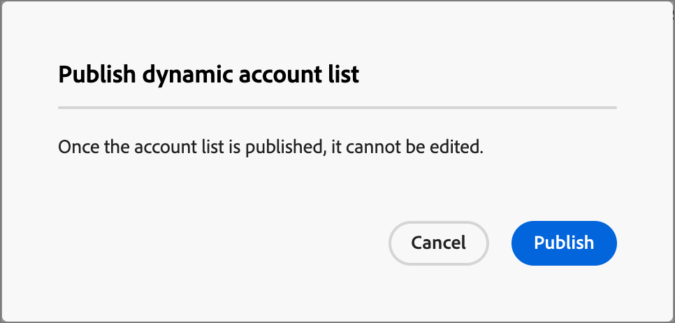{width="400"}

動的アカウントリストのステータスが&#x200B;_[!UICONTROL ライブ]_&#x200B;に変更され、アカウントジャーニー[&#128279;](#account-list-usage-in-account-journeys)で使用できるようになります。

>[!ENDTABS]

## 概要動画

>[!VIDEO](https://video.tv.adobe.com/v/3448636/?learn=on)
