# CRM 内から詳細ページへのアクセス

Adobe Journey Optimizer B2B editionを利用すれば、営業部門とアカウント部門のメンバーは、SalesforceやMicrosoft DynamicsなどのCRM （顧客関係管理）ツールから、アカウントと購買グループの情報に関する詳細なページに直接アクセスできます。 この連携機能により、営業担当者は、エンゲージメント履歴、インテントシグナル、AIが生成したレコメンデーションなど、リアルタイムのアカウントおよび購買グループのインサイトにすばやくアクセスできます。 この能力により、セールス部門は、より迅速なアウトリーチ、スマートな優先順位付け、マーケティング部門との連携を強化できます。

Journey Optimizer B2B editionの[ アカウントの詳細](account-details.md)および[人物の詳細](person-details.md) ページをCRMから表示できるように、SalesforceまたはDynamics管理者は、アカウント、取引先責任者、またはリード表示からリンクを追加できます。

営業部門のメンバーがCRM インスタンスからのリンクを使用する場合、サンドボックスは&#x200B;_製品_&#x200B;である必要があり、IMS組織は次の順序付きロジックに従って決定されます。

1. ユーザーがアクセスした最新の組織
1. リストの先頭にアルファベット順の並べ替えがある
1. 環境設定で選択された組織

## Salesforce リンク

_アプリケーションをカスタマイズ_&#x200B;権限を持つSalesforce管理者は、アカウント、取引先責任者、またはリードのレイアウトでリンクを設定できます。 設定されたリンク セールスユーザーは、Adobe Journey Optimizer B2B editionの対応するアカウントの詳細または人物の詳細ページにアクセスできます。

Salesforceで、カスタムリンクをボタン、ハイパーリンク、またはリンクされたアイコンとして追加し、チームの環境設定に従ってカスタマイズします。

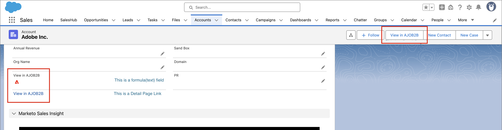{width="800" zoomable="yes"}

Salesforceでのカスタムリンクの追加について詳しくは、Salesforce ドキュメントの[ カスタムボタンとリンクの定義](https://help.salesforce.com/s/articleView?id=platform.defining_custom_links.htm&type=5)を参照してください。

リンクのターゲット URLを定義する場合、アカウント、取引先責任者、またはリードレイアウトを使用して、Journey Optimizer B2B editionの対応する詳細ページにリンクできます。

* **アカウント** - `https://experience.adobe.com/#/journey-optimizer-b2b/accounts/crm/account/[18-character ID of account]`

* **連絡先** - `https://experience.adobe.com/#/journey-optimizer-b2b/accounts/crm/contact/[18-character ID of contact]`

* **リード** - `https://experience.adobe.com/#/journey-optimizer-b2b/accounts/crm/lead/[18-character ID of lead]`

`Account` オブジェクトを使用して、`CASESAFEID(Account.Id)`や`CASESAFEID(Id)`など、アカウントの18文字のIDを取得します。

**_Examples:_**

+++フィールドリンク

1. Salesforceで、**[!UICONTROL 設定]** > **[!UICONTROL Object Manager]** > **[!UICONTROL アカウント]**/**[!UICONTROL 連絡先]**/**[!UICONTROL リード]** > **[!UICONTROL フィールドと関係]**&#x200B;に移動します。
1. 「**[!UICONTROL 新規]**」をクリックして数式（テキスト）フィールドを作成し、_アカウント_、_連絡先_、または&#x200B;_リード_ レイアウトに追加します。

   数式の場合は、次の例を参考にしてください。

   **_Text ハイパーリンク:_**

   * アカウント - `HYPERLINK("https://experience.adobe.com/#/journey-optimizer-b2b/accounts/crm/account/" & CASESAFEID(Id), "View in AJO B2B")`
   * お問い合わせ – `HYPERLINK("https://experience.adobe.com/#/journey-optimizer-b2b/accounts/crm/contact/" & CASESAFEID(Id), "View in AJO B2B")`
   * リード - `HYPERLINK("https://experience.adobe.com/#/journey-optimizer-b2b/accounts/crm/lead/" & CASESAFEID(Id), "View in AJO B2B")`

   **_Icon ハイパーリンク:_**

   * アカウント - `HYPERLINK("https://experience.adobe.com/#/journey-optimizer-b2b/accounts/crm/account/" & CASESAFEID(Id), IMAGE("https://cdn.experience.adobe.net/assets/HeroIcons.6620f5dc.svg#AdobeExperienceSubCloud", "View in AJO B2B", 24, 24))`
   * お問い合わせ – `HYPERLINK("https://experience.adobe.com/#/journey-optimizer-b2b/accounts/crm/contact/" & CASESAFEID(Id), IMAGE("https://cdn.experience.adobe.net/assets/HeroIcons.6620f5dc.svg#AdobeExperienceSubCloud", "View in AJO B2B", 24, 24))`
   * お問い合わせ – `HYPERLINK("https://experience.adobe.com/#/journey-optimizer-b2b/accounts/crm/lead/" & CASESAFEID(Id), IMAGE("https://cdn.experience.adobe.net/assets/HeroIcons.6620f5dc.svg#AdobeExperienceSubCloud", "View in AJO B2B", 24, 24))`

   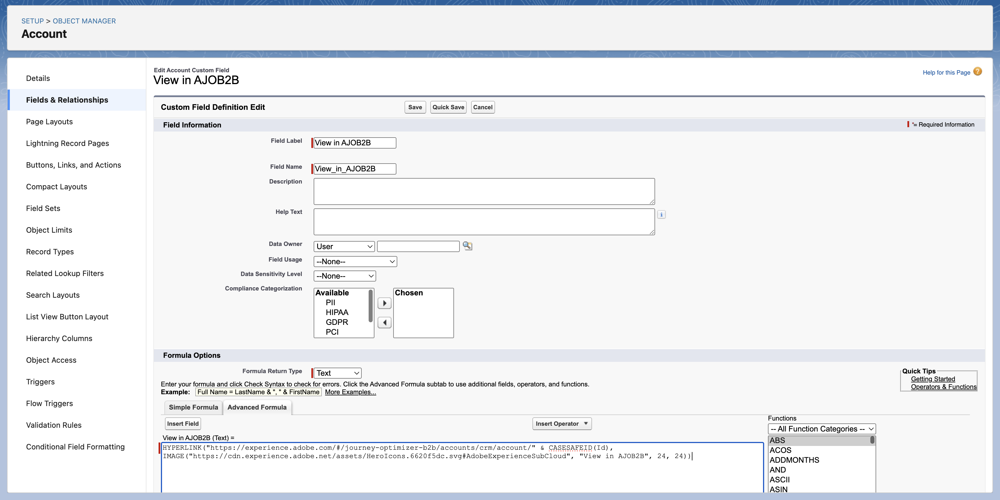{width="800" zoomable="yes"}

1. レイアウトの変更を表示するには、ページを更新します。 **[!UICONTROL プロファイル]**&#x200B;に移動し、**[!UICONTROL 表示密度]**&#x200B;の下にある別のオプションを選択します。

   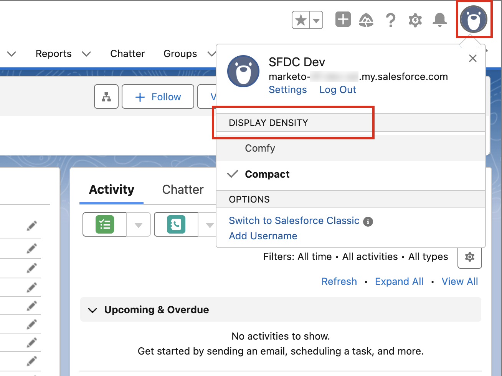{width="450" zoomable="yes"}

+++

+++詳細ページリンク

1. Salesforceで、**[!UICONTROL Setup]** > **[!UICONTROL Object Manager]** > **[!UICONTROL Account]**/**[!UICONTROL Contact]**/**[!UICONTROL Lead]** > **[!UICONTROL Button, Links, and Actions]**&#x200B;に移動します。
1. 右上隅の&#x200B;**[!UICONTROL 新規ボタンまたはリンク]**&#x200B;をクリックして、詳細ページリンクを作成します。

   数式の場合は、次の例を参考にしてください。

   * アカウント - `{!URLFOR("https://experience.adobe.com/#/journey-optimizer-b2b/accounts/crm/account/" & CASESAFEID(Account.Id), null)}`
   * お問い合わせ – `{!URLFOR("https://experience.adobe.com/#/journey-optimizer-b2b/accounts/crm/contact/" & CASESAFEID(Contact.Id), null)}`
   * リード - `{!URLFOR("https://experience.adobe.com/#/journey-optimizer-b2b/accounts/crm/lead/" & CASESAFEID(Lead.Id), null)}`

   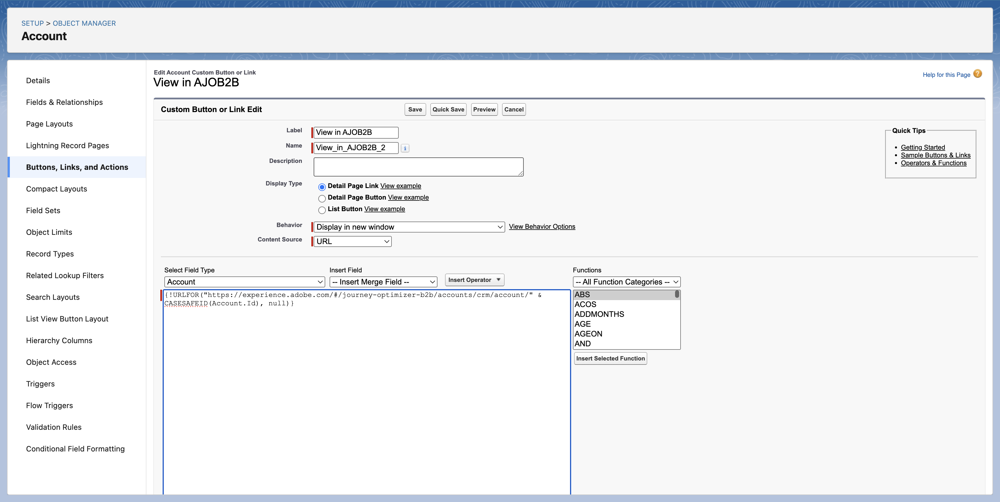{width="800" zoomable="yes"}

1. 左側のナビゲーションで&#x200B;**[!UICONTROL ページレイアウト]**&#x200B;に移動します。

1. **[!UICONTROL カスタムリンク]**&#x200B;からリンクをドラッグし、レイアウトの&#x200B;_カスタムリンク_ セクションにドロップします。

+++

+++詳細ページボタン

1. Salesforceで、**[!UICONTROL Setup]** > **[!UICONTROL Object Manager]** > **[!UICONTROL Account]**/**[!UICONTROL Contact]**/**[!UICONTROL Lead]** > **[!UICONTROL Button, Links, and Actions]**&#x200B;に移動します。
1. 右上隅の&#x200B;**[!UICONTROL 新規ボタンまたはリンク]**&#x200B;をクリックして、詳細ページボタンを作成します。

   **[!UICONTROL 表示タイプ]**&#x200B;で、**[!UICONTROL 詳細ページリンク]**&#x200B;を選択します。

   数式の場合は、次の例を参考にしてください。

   * アカウント - `{!URLFOR("https://experience.adobe.com/#/journey-optimizer-b2b/accounts/crm/account/" & CASESAFEID(Account.Id), null)}`
   * お問い合わせ – `{!URLFOR("https://experience.adobe.com/#/journey-optimizer-b2b/accounts/crm/contact/" & CASESAFEID(Contact.Id), null)}`
   * リード - `{!URLFOR("https://experience.adobe.com/#/journey-optimizer-b2b/accounts/crm/lead/" & CASESAFEID(Lead.Id), null)}`

   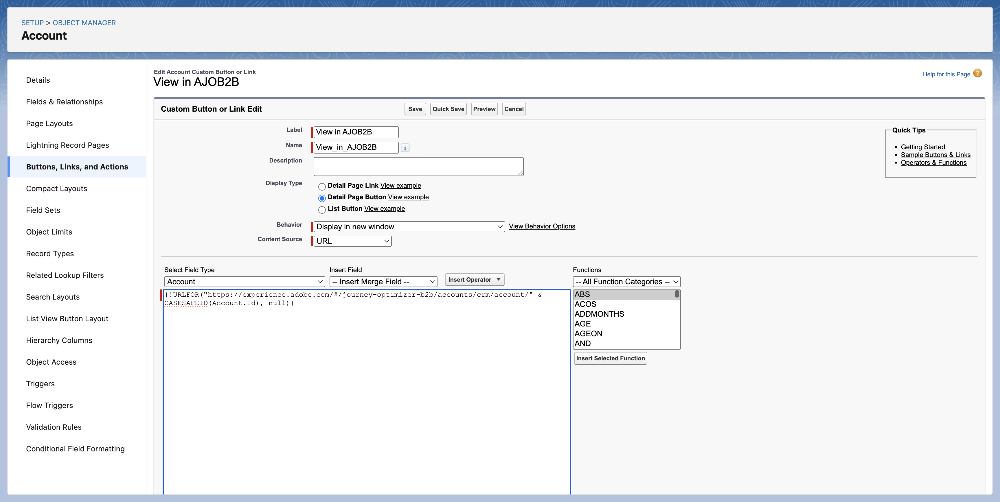{width="800" zoomable="yes"}

1. 左側のナビゲーションで&#x200B;**[!UICONTROL ページレイアウト]**&#x200B;に移動します。

1. **[!UICONTROL Mobile &amp; Lightning Actions]**&#x200B;からボタンをドラッグし、レイアウトの&#x200B;**[!UICONTROL Salesforce Mobile and Lightning Experience Actions]** セクションにドロップします。

   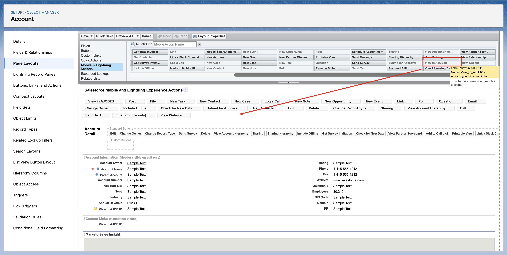{width="800" zoomable="yes"}

+++

## Microsoft Dynamics リンク

Dynamics開発者は、アカウント、取引先責任者、またはリード エンティティを拡張して、リンクフィールドを追加できます。 設定されたリンク セールスユーザーは、Adobe Journey Optimizer B2B editionの対応するアカウントの詳細または人物の詳細ページにアクセスできます。

カスタムリンクをボタン、ハイパーリンク、またはリンクされたアイコンリンクとして追加し、チームの好みに応じてカスタマイズします。

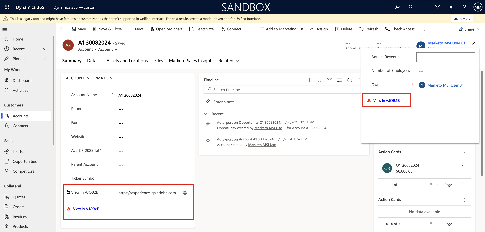{width="800" zoomable="yes"}のカスタムリンク

Power Appsを使用して、Dynamics コンポーネントなどのMicrosoft モデル駆動型アプリケーションをカスタマイズします。 Power Appsを使用してDynamicsでカスタムリンクを追加する方法について詳しくは、[PowerApps ドキュメント ](https://learn.microsoft.com/en-us/power-apps/maker/model-driven-apps/create-edit-web-resources)を参照してください。

リンクのターゲット URLを定義する場合、アカウント、取引先責任者、またはリードビューを使用して、Journey Optimizer B2B editionの対応する詳細ページにリンクできます。

* **アカウント** - `https://experience.adobe.com/#/journey-optimizer-b2b/accounts/crm/account/[Account ID]`

* **連絡先** - `https://experience.adobe.com/#/journey-optimizer-b2b/accounts/crm/contact/[Contact ID]`

* **リード** - `https://experience.adobe.com/#/journey-optimizer-b2b/accounts/crm/lead/[Lead ID]`

**_Examples:_**

+++URL フィールド

次の一連のタスクに従って、カスタムリンクをURL フィールドとして追加します。

**1 - ソリューションフィールドを設定**

1. **[!UICONTROL 詳細設定]** > **[!UICONTROL システムのカスタマイズ]**&#x200B;に移動し、**[!UICONTROL ソリューション]** タブを選択します。
1. **[!UICONTROL エンティティ]** > **[!UICONTROL アカウント]**/**[!UICONTROL 連絡先]**/**[!UICONTROL リード]** > **[!UICONTROL フィールド]**&#x200B;を選択します。
1. 「**[!UICONTROL 新規]**」をクリックし、新しいフィールドを設定します。

   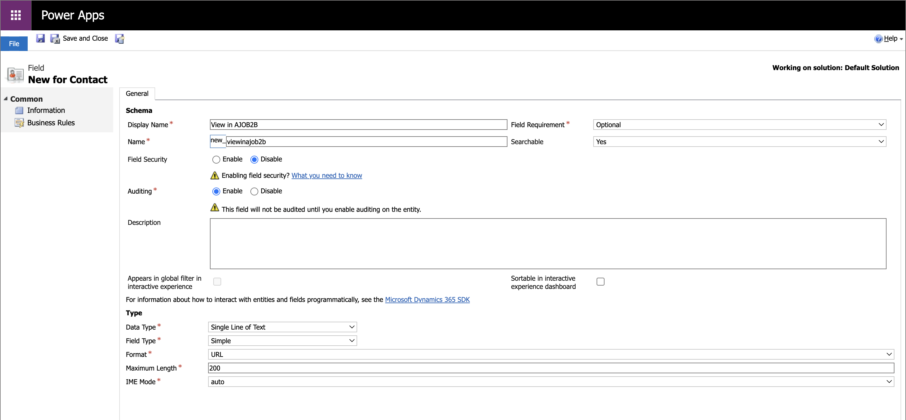{width="800" zoomable="yes"}の新しいフィールド

1. フィールド設定を保存します。
1. 「_[!UICONTROL ソリューション]_」タブから、「**[!UICONTROL Web リソース]**」を選択します。
1. 「**[!UICONTROL 新規]**」をクリックし、次のスクリプト（JScript） web リソースを設定します。

   ```js
   function setViewInAjoB2b(executionContext) {
    var url = "https://experience.adobe.com/#/journey-optimizer-b2b/accounts/crm";
   
    var formContext = executionContext.getFormContext();
   
    // Get the entity ID (GUID)
    var id = formContext.data.entity.getId();
   
    // Get the entity type (account, lead, contact)
    var type = formContext.data.entity.getEntityName().toLowerCase();
   
    if (id && type) {
        // Remove curly braces
        id = id.replace(/[{}]/g, "").toLowerCase();
   
        // Set the value in the custom field (Ensure this field exists on the form)
        formContext.getAttribute("new_viewinajob2b").setValue(url + "/" + type + "/" + id);
       }
   }
   ```

   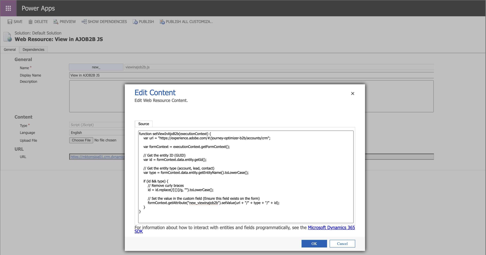{width="800" zoomable="yes"}

1. ページの上部で、**[!UICONTROL SAVE]**&#x200B;をクリックし、**[!UICONTROL PUBLISH]**&#x200B;をクリックします。

**2 - フォームを設定**

1. 「_ソリューション_」タブで、**[!UICONTROL エンティティ]** > **[!UICONTROL アカウント]**/**[!UICONTROL 連絡先]**/**[!UICONTROL リード]** > **[!UICONTROL Forms]** > **[!UICONTROL アカウント]**/**[!UICONTROL 連絡先]**/**[!UICONTROL リード]**」を選択します。
1. 最初のタスクで作成した新しいフィールドを&#x200B;**[!UICONTROL フィールドエクスプローラー]**&#x200B;から&#x200B;**[!UICONTROL 概要]** セクションにドラッグします。

   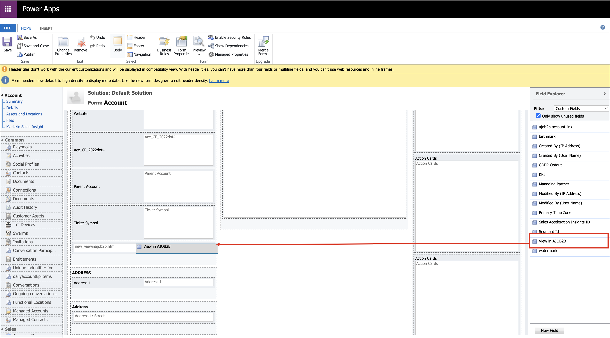{width="800" zoomable="yes"}

1. _概要_ セクションのフィールドをダブルクリックし、そのプロパティを設定します。

   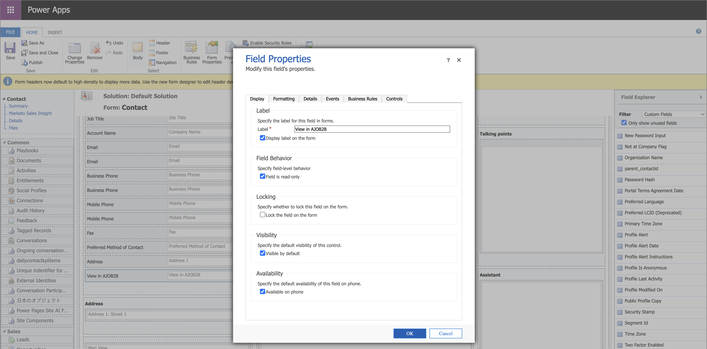{width="800" zoomable="yes"}

   プロパティの設定が完了したら、**[!UICONTROL OK]**&#x200B;をクリックします。

1. ページの上部にあるリボンで、**[!UICONTROL 保存]**&#x200B;をクリックし、**[!UICONTROL 公開]**&#x200B;をクリックします。

**3 - JS web リソースをフォームライブラリに追加**

1. 上部の「_[!UICONTROL ホーム]_」タブで、「**[!UICONTROL フォームプロパティ]**」をクリックします。
1. 「**[!UICONTROL 追加]**」をクリックします。

   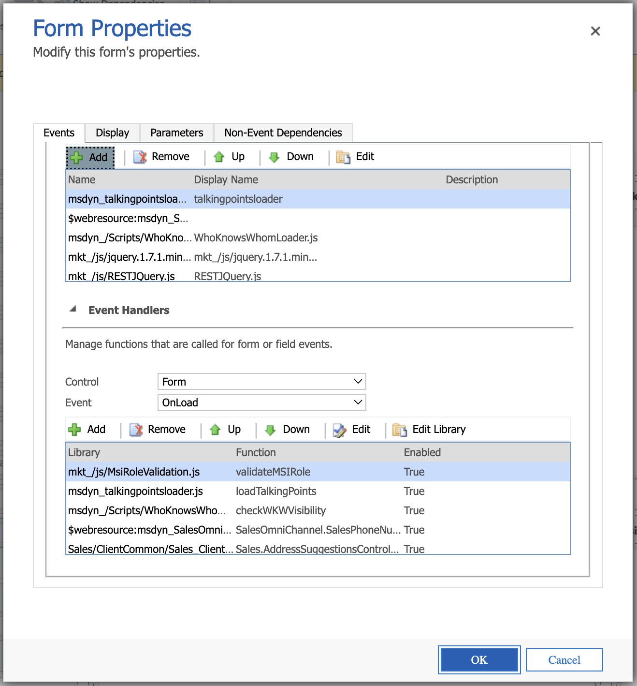{width="500" zoomable="yes"}

1. リソースを見つけて選択し、**[!UICONTROL 追加]**&#x200B;をクリックします。

   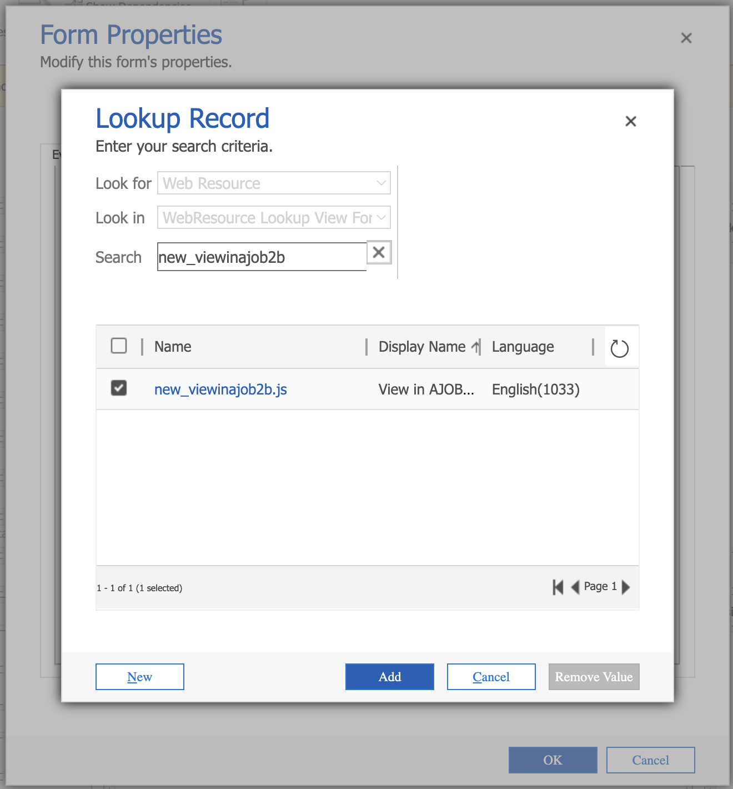{width="500" zoomable="yes"}

1. 追加されたリソースを選択した状態で、_[!UICONTROL イベントハンドラー]_&#x200B;の下の&#x200B;**[!UICONTROL 追加]**&#x200B;をクリックします。
1. `setViewInAjoB2b`関数を&#x200B;**[!UICONTROL イベントハンドラー]**&#x200B;に追加します。
1. _[!UICONTROL イベントハンドラー]_ リストで関数を選択した状態で、**[!UICONTROL コントロール]**&#x200B;を`Form`に、**[!UICONTROL イベント]**&#x200B;を`OnLoad`に設定します。

   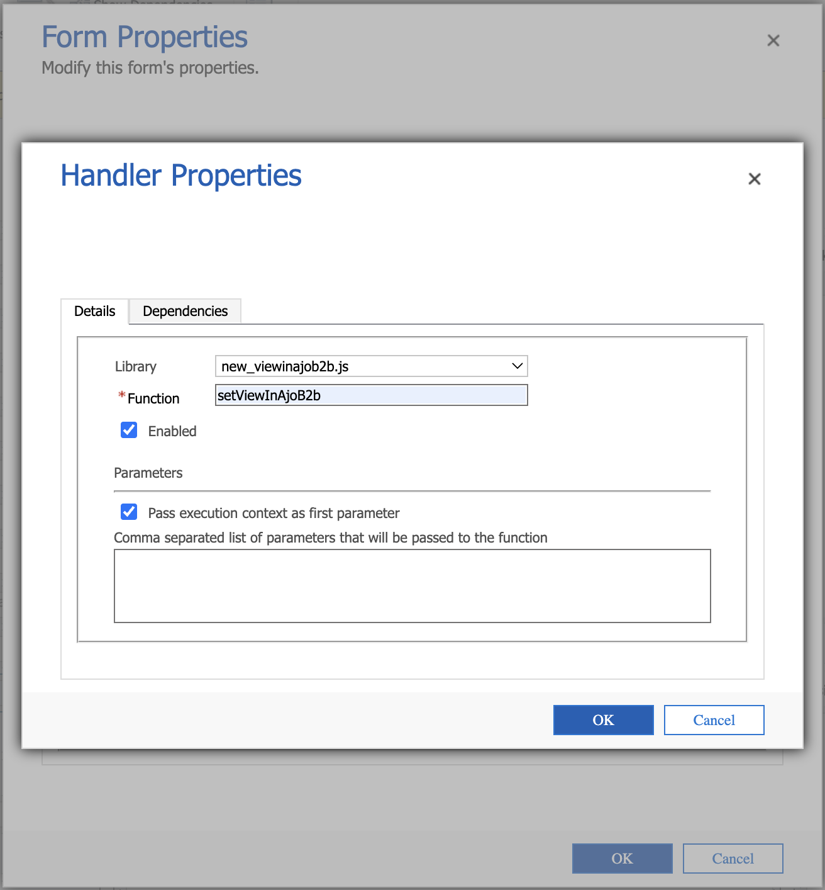{width="500" zoomable="yes"}

1. 「**[!UICONTROL OK]**」をクリックします。

1. 上部の「_[!UICONTROL ホーム]_」タブで、「**[!UICONTROL 保存]**」をクリックしてから「**[!UICONTROL 公開]**」をクリックします。

**4 - リンクを確認**

リンクを確認するには、Dynamicsのアカウント、取引先責任者、またはリード ビューを確認します。

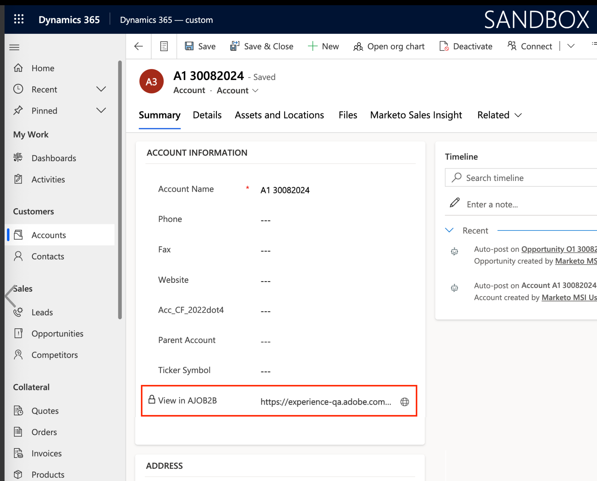{width="500" zoomable="yes"}

リンクが表示されない場合は、Dynamics ホームページの&#x200B;**[!UICONTROL 顧客]**&#x200B;の下にあるアカウント、取引先責任者、またはリードに移動してみてください。 特定のアカウント、取引先責任者、またはリードのビューに戻ります。 ログアウトして、再度ログインすることもできます。

+++

+++HTML web リソース

次の一連のタスクに従って、カスタムリンクをHTML web リソースとして追加します。

>[!NOTE]
>
>この例は、DynamicsでのWeb ページのweb リソースの使用方法によって異なります。

**1 - ソリューション web リソースの設定**

1. **[!UICONTROL 詳細設定]** > **[!UICONTROL システムのカスタマイズ]**&#x200B;に移動し、**[!UICONTROL ソリューション]** タブを選択します。

1. 「_[!UICONTROL ソリューション]_」タブで、「**[!UICONTROL Web リソース]**」を選択します。

1. **[!UICONTROL New]**&#x200B;をクリックし、次の関数を使用して次のスクリプト （JScript） web リソースを設定します。

   ```js
   function getFormContext(executionContext) {
       window.top["formContext"] = executionContext.getFormContext();
   }
   ```

   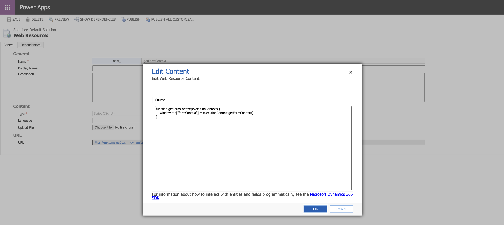{width="800" zoomable="yes"}

1. 「**[!UICONTROL 新規]**」をクリックして、別のweb リソースを作成し、次のHTMLを使用してWeb ページ （HTML） web リソースを設定します。

   ```html
   <html>
   <head>
       <script>
       function onLoad(){
           // Adobe URL
           var url = "https://experience.adobe.com/#/journey-optimizer-b2b/accounts/crm";
   
           // Get the entity ID (GUID)
           var id = window.top.formContext.data.entity.getId();
   
           // Get the entity type (account, lead, contact)
           var type = window.top.formContext.data.entity.getEntityName().toLowerCase();
   
           if (id && type) {
               // Remove curly braces
               id = id.replace(/[{}]/g, "").toLowerCase();
               var url = url + "/" + type + "/" + id;
   
               // Find the hyperlink and set the href value
               var link = document.getElementById("link");
               link.href = url;
           }
       }
       </script>
   </head>
   <body onload="onLoad()" style="margin-left: 0;">
       <a id="link" style="text-decoration: none; font-family: sans-serif; font-size: 13px;" target="_blank">
           
           <span style="vertical-align: middle;">View in AJOB2B</span>
       </a>
   </body>
   </html>
   ```

1. ページの上部で、**[!UICONTROL SAVE]**&#x200B;をクリックし、**[!UICONTROL PUBLISH]**&#x200B;をクリックします。

**2 - JS web リソースをフォームライブラリに追加**

1. 「_ソリューション_」タブで、**[!UICONTROL エンティティ]** > **[!UICONTROL アカウント]**/**[!UICONTROL 連絡先]**/**[!UICONTROL リード]** > **[!UICONTROL Forms]** > **[!UICONTROL アカウント]**/**[!UICONTROL 連絡先]**/**[!UICONTROL リード]**」を選択します。

1. 上部の「_ホーム_」タブで、「**[!UICONTROL フォームプロパティ]**」をクリックします。

1. 「**[!UICONTROL 追加]**」をクリックします。

1. 作成したJScript web リソース （`new_getFormContext`）を見つけて選択し、**[!UICONTROL 追加]**&#x200B;をクリックします。

   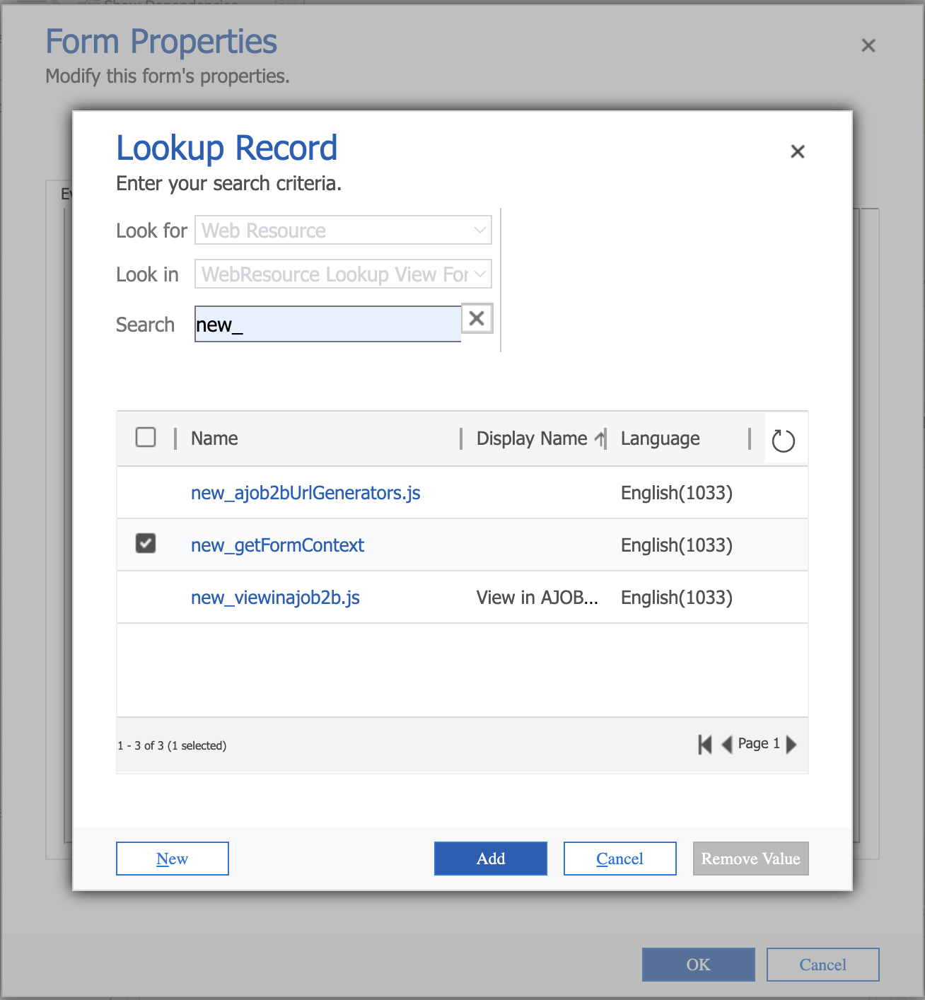{width="500" zoomable="yes"}

1. 追加されたリソースを選択した状態で、_[!UICONTROL イベントハンドラー]_&#x200B;の下の&#x200B;**[!UICONTROL 追加]**&#x200B;をクリックします。
1. `getFormContext`関数を&#x200B;**[!UICONTROL イベントハンドラー]**&#x200B;に追加します。
1. _[!UICONTROL イベントハンドラー]_ リストで関数を選択した状態で、**[!UICONTROL コントロール]**&#x200B;を`Form`に、**[!UICONTROL イベント]**&#x200B;を`OnLoad`に設定します。

   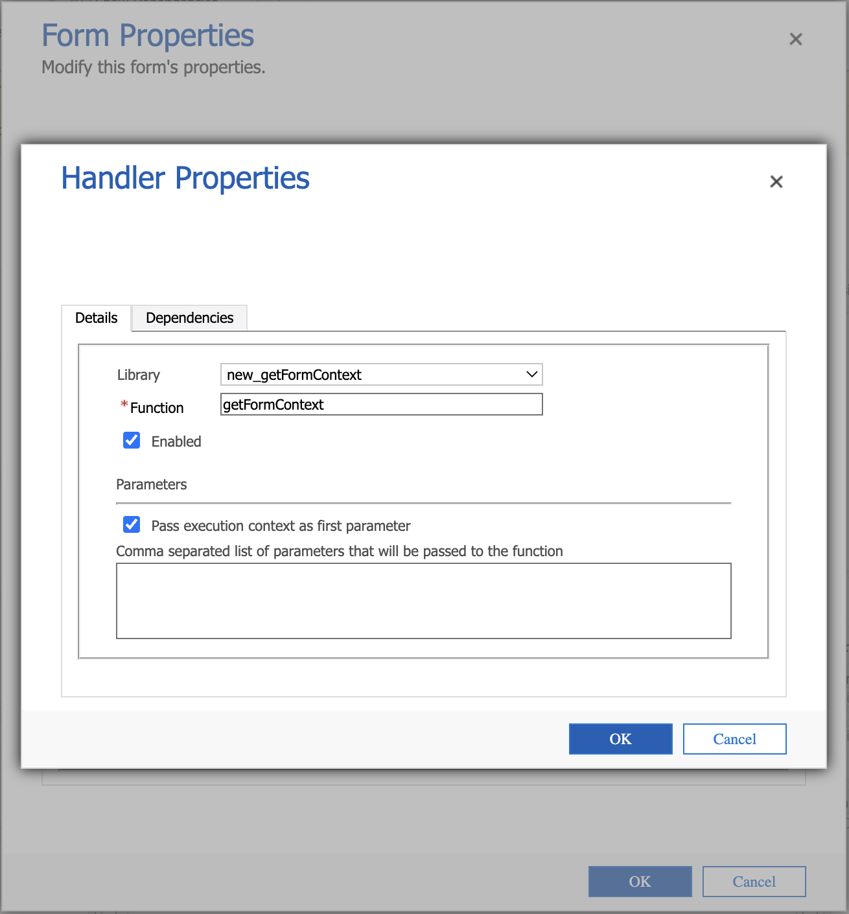{width="500" zoomable="yes"}

1. 「**[!UICONTROL OK]**」をクリックします。

1. 上部の「_[!UICONTROL ホーム]_」タブで、「**[!UICONTROL 保存]**」をクリックしてから「**[!UICONTROL 公開]**」をクリックします。

**3 - フォームを設定**

1. アカウント、取引先責任者、またはリードフォームの「**[!UICONTROL HOME]**」タブで、**[!UICONTROL Body]** （_概要_ セクションでリンクされたリソースを作成する）または&#x200B;**[!UICONTROL ヘッダー]** （ヘッダーメニューで作成する）を選択します。

   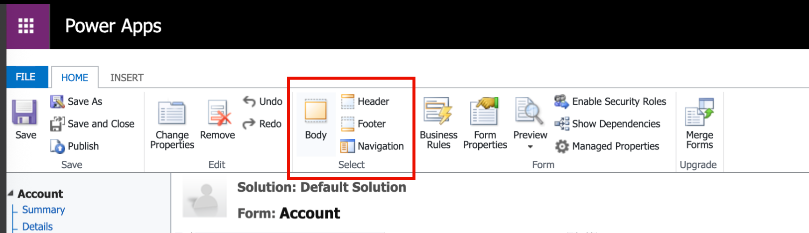{width="500" zoomable="yes"}

1. 上部の「**[!UICONTROL INSERT]**」タブを選択し、「**[!UICONTROL Web リソース]**」をクリックします。

1. 作成したweb リソースを挿入し、プロパティを設定します。

   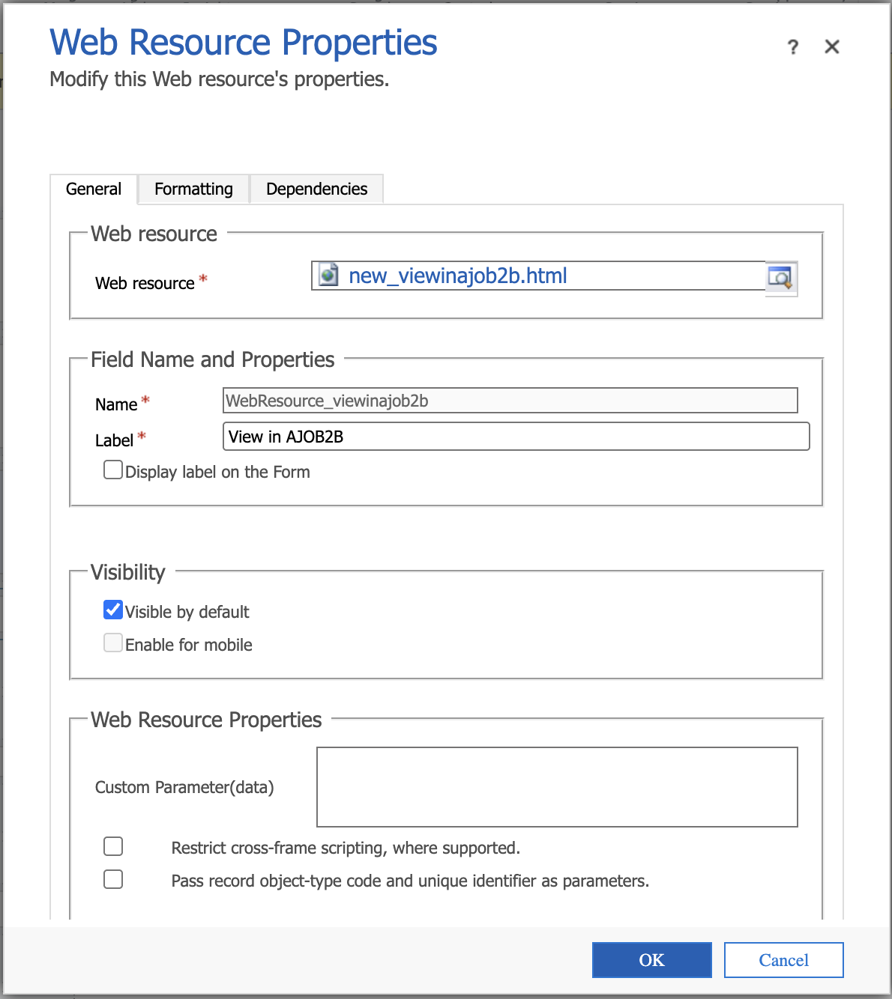{width="500" zoomable="yes"}

   Web リソースのプロパティと書式設定について詳しくは、[Power Apps ドキュメント ](https://learn.microsoft.com/en-us/power-apps/maker/model-driven-apps/web-resource-properties-legacy)を参照してください。

1. 「**[!UICONTROL OK]**」をクリックします。

   Web リソースのBody/Summary プレースメントを選択した場合、そのプレースメントはフォームレイアウトに表示されます。

   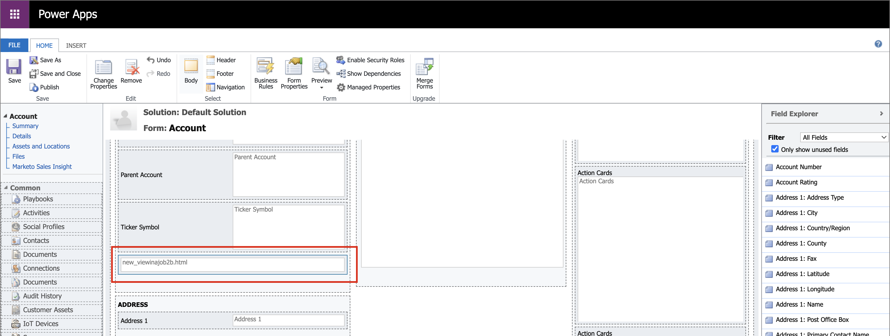{width="800" zoomable="yes"}

1. 上部の「_[!UICONTROL ホーム]_」タブで、「**[!UICONTROL 保存]**」をクリックしてから「**[!UICONTROL 公開]**」をクリックします。

**4 - リンクを確認**

リンクを確認するには、Dynamicsのアカウント、取引先責任者、またはリード ビューを確認します。

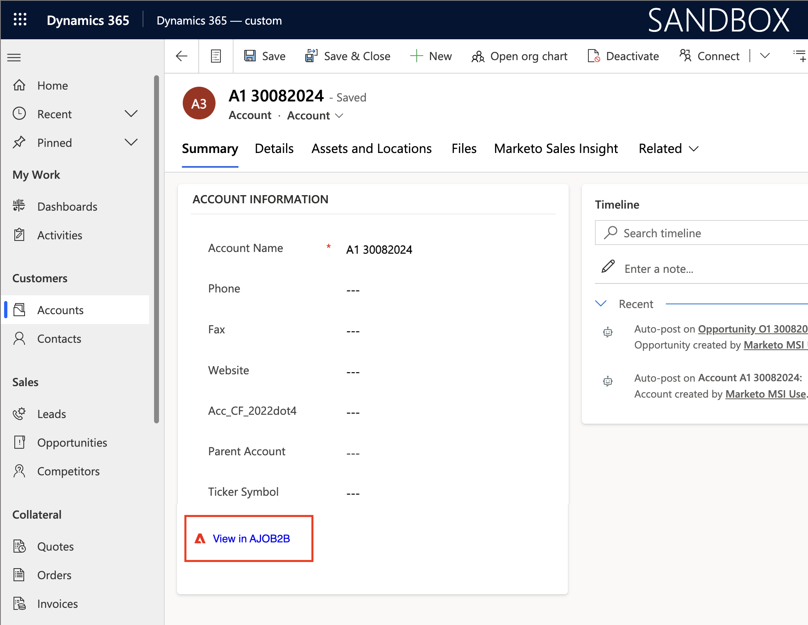{width="500" zoomable="yes"}

リンクが表示されない場合は、Dynamics ホームページの&#x200B;**[!UICONTROL 顧客]**&#x200B;の下にあるアカウント、取引先責任者、またはリードに移動してみてください。 特定のアカウント、取引先責任者、またはリードのビューに戻ります。 ログアウトして、再度ログインすることもできます。

+++
