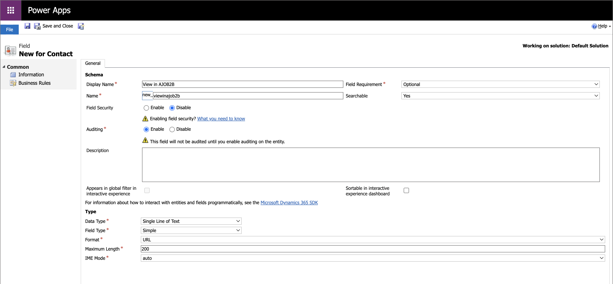
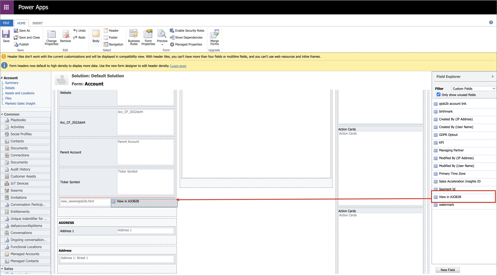

# CRM 内から詳細ページへのアクセス

Adobe Journey Optimizer B2B editionを使用すると、営業およびアカウントチームメンバーは、SalesforceやMicrosoft Dynamicsなどの Customer Relationship Management （CRM）ツールからアカウントおよび購入グループ情報の詳細ページに直接アクセスできます。 この統合により、営業担当者は、エンゲージメント履歴、インテントシグナル、AI で生成されたレコメンデーションなど、リアルタイムのアカウントおよび購入グループのインサイトにすばやくアクセスできます。 この機能により、セールスチームはアウトリーチを迅速化し、優先順位付けをスマート化し、マーケティングとの連携を強化することができます。

営業およびアカウントチームメンバーが CRM からJourney Optimizer B2B editionの [ アカウントの詳細 ](account-details.md) および [ 人物の詳細 ](person-details.md) ページを表示できるようにするには、Salesforceまたは Dynamics 管理者がアカウント、連絡先またはリード表示からリンクを追加できます。

営業チームメンバーが CRM インスタンスからのリンクを使用する場合、サンドボックスは _Prod_ である必要があり、次の順序付きロジックに従って IMS 組織が決定されます。

1. ユーザーがアクセスした最新の組織
1. アルファベット順に並べ替えられた、リストの最初の項目
1. 環境設定で選択した組織

## Salesforce リンク

_アプリケーションのカスタマイズ_ 権限を持つSalesforce管理者は、アカウント、連絡先、リードのレイアウトでリンクを設定できます。 設定されたリンクにより、営業ユーザーはAdobe Journey Optimizer B2B editionの対応するアカウントの詳細または人物の詳細ページにアクセスできます。

Salesforceで、カスタムリンクをボタン、ハイパーリンク、またはリンクされたアイコンとして追加し、チームの環境設定に応じてカスタマイズします。

{width="800" zoomable="yes"}

Salesforceへのカスタムリンクの追加について詳しくは、Salesforce ドキュメントの [ カスタムボタンとカスタムリンクの定義 ](https://help.salesforce.com/s/articleView?id=platform.defining_custom_links.htm&type=5) を参照してください。

リンクのターゲット URL を定義する際には、アカウント、連絡先またはリードのレイアウトを使用して、Journey Optimizer B2B editionの対応する詳細ページにリンクさせることができます。

* **アカウント** - `https://experience.adobe.com/#/journey-optimizer-b2b/accounts/crm/account/[18-character ID of account]`

* **連絡先** - `https://experience.adobe.com/#/journey-optimizer-b2b/accounts/crm/contact/[18-character ID of contact]`

* **リード** - `https://experience.adobe.com/#/journey-optimizer-b2b/accounts/crm/lead/[18-character ID of lead]`

`Account` オブジェクトを使用して、アカウントの 18 文字の ID （`CASESAFEID(Account.Id)`、`CASESAFEID(Id)` など）を取得します。

**_Examples:_**

+++フィールドリンク

1. Salesforceで、**[!UICONTROL 設定]**/**[!UICONTROL Object Manager]**/**[!UICONTROL アカウント]**/**[!UICONTROL 連絡先]**/**[!UICONTROL リード]**/**[!UICONTROL フィールドと関係]** に移動します。
1. 「**[!UICONTROL 新規]**」をクリックして、式（テキスト）フィールドを作成し、_アカウント_、_連絡先_ または _リード_ レイアウトに追加します。

   数式の場合は、次の例を参考にしてください。

   **_Text ハイパーリンク:_**

   * アカウント - `HYPERLINK("https://experience.adobe.com/#/journey-optimizer-b2b/accounts/crm/account/" & CASESAFEID(Id), "View in AJO B2B")`
   * 連絡先 – `HYPERLINK("https://experience.adobe.com/#/journey-optimizer-b2b/accounts/crm/contact/" & CASESAFEID(Id), "View in AJO B2B")`
   * リード - `HYPERLINK("https://experience.adobe.com/#/journey-optimizer-b2b/accounts/crm/lead/" & CASESAFEID(Id), "View in AJO B2B")`

   **_Icon ハイパーリンク:_**

   * アカウント - `HYPERLINK("https://experience.adobe.com/#/journey-optimizer-b2b/accounts/crm/account/" & CASESAFEID(Id), IMAGE("https://cdn.experience.adobe.net/assets/HeroIcons.6620f5dc.svg#AdobeExperienceSubCloud", "View in AJO B2B", 24, 24))`
   * 連絡先 – `HYPERLINK("https://experience.adobe.com/#/journey-optimizer-b2b/accounts/crm/contact/" & CASESAFEID(Id), IMAGE("https://cdn.experience.adobe.net/assets/HeroIcons.6620f5dc.svg#AdobeExperienceSubCloud", "View in AJO B2B", 24, 24))`
   * 連絡先 – `HYPERLINK("https://experience.adobe.com/#/journey-optimizer-b2b/accounts/crm/lead/" & CASESAFEID(Id), IMAGE("https://cdn.experience.adobe.net/assets/HeroIcons.6620f5dc.svg#AdobeExperienceSubCloud", "View in AJO B2B", 24, 24))`

   {width="800" zoomable="yes"}

1. レイアウトの変更を表示するには、ページを更新します。 **[!UICONTROL プロファイル]** に移動し、**[!UICONTROL 表示密度]** で別のオプションを選択します。

   {width="450" zoomable="yes"}

+++

+++詳細ページリンク

1. Salesforceで、**[!UICONTROL 設定]**/**[!UICONTROL Object Manager]**/**[!UICONTROL アカウント]**/**[!UICONTROL 連絡先]**/**[!UICONTROL リード]**/**[!UICONTROL ボタン、リンク、アクション]** に移動します。
1. 右上隅の **[!UICONTROL 新規ボタンまたはリンク]** をクリックして、詳細ページリンクを作成します。

   数式の場合は、次の例を参考にしてください。

   * アカウント - `{!URLFOR("https://experience.adobe.com/#/journey-optimizer-b2b/accounts/crm/account/" & CASESAFEID(Account.Id), null)}`
   * 連絡先 – `{!URLFOR("https://experience.adobe.com/#/journey-optimizer-b2b/accounts/crm/contact/" & CASESAFEID(Contact.Id), null)}`
   * リード - `{!URLFOR("https://experience.adobe.com/#/journey-optimizer-b2b/accounts/crm/lead/" & CASESAFEID(Lead.Id), null)}`

   {width="800" zoomable="yes"}

1. 左側のナビゲーションの **[!UICONTROL ページレイアウト]** に移動します。

1. **[!UICONTROL カスタムリンク]** からリンクをドラッグし、レイアウトの _カスタムリンク_ セクションにドロップします。

+++

+++「詳細ページ」ボタン

1. Salesforceで、**[!UICONTROL 設定]**/**[!UICONTROL Object Manager]**/**[!UICONTROL アカウント]**/**[!UICONTROL 連絡先]**/**[!UICONTROL リード]**/**[!UICONTROL ボタン、リンク、アクション]** に移動します。
1. 右上隅の **[!UICONTROL 新規ボタンまたはリンク]** をクリックして、詳細ページボタンを作成します。

   「**[!UICONTROL 表示タイプ]**」で「**[!UICONTROL 詳細ページリンク]**」を選択します。

   数式の場合は、次の例を参考にしてください。

   * アカウント - `{!URLFOR("https://experience.adobe.com/#/journey-optimizer-b2b/accounts/crm/account/" & CASESAFEID(Account.Id), null)}`
   * 連絡先 – `{!URLFOR("https://experience.adobe.com/#/journey-optimizer-b2b/accounts/crm/contact/" & CASESAFEID(Contact.Id), null)}`
   * リード - `{!URLFOR("https://experience.adobe.com/#/journey-optimizer-b2b/accounts/crm/lead/" & CASESAFEID(Lead.Id), null)}`

   {width="800" zoomable="yes"}

1. 左側のナビゲーションの **[!UICONTROL ページレイアウト]** に移動します。

1. **[!UICONTROL モバイルおよび Lightning アクション]** からボタンをドラッグして、レイアウトの **[!UICONTROL Salesforce モバイルおよび Lightning Experience アクション]** セクションにドロップします。

   {width="800" zoomable="yes"}

+++

## Microsoft Dynamics リンク

Dynamics 開発者は、アカウント、連絡先またはリードのエンティティを拡張して、リンクフィールドを追加できます。 設定されたリンクにより、営業ユーザーはAdobe Journey Optimizer B2B editionの対応するアカウントの詳細または人物の詳細ページにアクセスできます。

カスタムリンクをボタン、ハイパーリンク、またはリンクされたアイコンリンクとして追加し、チームの環境設定に応じてカスタマイズします。

{width="800" zoomable="yes"}

Power Apps を使用して、Dynamics コンポーネントなどのMicrosoft モデル駆動型アプリをカスタマイズします。 パワーアプリを使用して Dynamics にカスタムリンクを追加する方法について詳しくは、[ パワーアプリのドキュメント ](https://learn.microsoft.com/en-us/power-apps/maker/model-driven-apps/create-edit-web-resources) を参照してください。

リンクのターゲット URL を定義する際には、アカウント、連絡先またはリード表示を使用して、Journey Optimizer B2B editionの対応する詳細ページにリンクさせることができます。

* **アカウント** - `https://experience.adobe.com/#/journey-optimizer-b2b/accounts/crm/account/[Account ID]`

* **連絡先** - `https://experience.adobe.com/#/journey-optimizer-b2b/accounts/crm/contact/[Contact ID]`

* **リード** - `https://experience.adobe.com/#/journey-optimizer-b2b/accounts/crm/lead/[Lead ID]`

**_Examples:_**

+++URL フィールド

次の一連のタスクに従って、カスタムリンクを URL フィールドとして追加します。

**1 - ソリューションフィールドの設定**

1. **[!UICONTROL 詳細設定]**/**[!UICONTROL システムをカスタマイズ]** に移動し、「**[!UICONTROL ソリューション]**」タブを選択します。
1. **[!UICONTROL エンティティ]**/**[!UICONTROL アカウント]**/**[!UICONTROL 連絡先]**/**[!UICONTROL リード]**/**[!UICONTROL フィールド]** を選択します。
1. **[!UICONTROL 新規]** をクリックして、新しいフィールドを設定します。

   {width="800" zoomable="yes"}

1. フィールド設定を保存します。
1. 「_[!UICONTROL ソリューション]_」タブで、「**[!UICONTROL Web リソース]**」を選択します。
1. 「**[!UICONTROL 新規]**」をクリックして、次のスクリプト（JScript） web リソースを設定します。

   ```js
   function setViewInAjoB2b(executionContext) {
    var url = "https://experience.adobe.com/#/journey-optimizer-b2b/accounts/crm";
   
    var formContext = executionContext.getFormContext();
   
    // Get the entity ID (GUID)
    var id = formContext.data.entity.getId();
   
    // Get the entity type (account, lead, contact)
    var type = formContext.data.entity.getEntityName().toLowerCase();
   
    if (id && type) {
        // Remove curly braces
        id = id.replace(/[{}]/g, "").toLowerCase();
   
        // Set the value in the custom field (Ensure this field exists on the form)
        formContext.getAttribute("new_viewinajob2b").setValue(url + "/" + type + "/" + id);
       }
   }
   ```

   {width="800" zoomable="yes"}

1. ページの上部で、「**[!UICONTROL 保存]**」をクリックし、「**[!UICONTROL 公開]**」をクリックします。

**2 - フォームの設定**

1. 「_ソリューション_」タブで、**[!UICONTROL エンティティ]**/**[!UICONTROL アカウント]**/**[!UICONTROL 連絡先]**/**[!UICONTROL リード]**/**[!UICONTROL 10&rbrace;Forms]**/アカウント **[!UICONTROL /]** 連絡先 **[!UICONTROL /]** リード **[!UICONTROL を選択します。]**
1. 最初のタスクで作成した新しいフィールドを **[!UICONTROL フィールドエクスプローラー]** から **[!UICONTROL 概要]** セクションにドラッグします。

   {width="800" zoomable="yes"}

1. 「_概要_」セクションのフィールドをダブルクリックし、そのプロパティを設定します。

   {width="800" zoomable="yes"}

   プロパティの設定が完了したら、「**[!UICONTROL OK]**」をクリックします。

1. ページ上部のリボンで **[!UICONTROL 保存]** をクリックし、次に **[!UICONTROL 公開]** をクリックします。

**3 - JS web リソースをフォームライブラリに追加する**

1. 上部の「_[!UICONTROL ホーム]_」タブで、「**[!UICONTROL フォームのプロパティ]**」をクリックします。
1. 「**[!UICONTROL 追加]**」をクリックします。

   {width="500" zoomable="yes"}

1. リソースを探して選択し、「**[!UICONTROL 追加]**」をクリックします。

   {width="500" zoomable="yes"}

1. 追加したリソースを選択した状態で、「**[!UICONTROL イベントハンドラー]** の下の _[!UICONTROL 追加]_ をクリックします。
1. `setViewInAjoB2b` 関数を **[!UICONTROL イベントハンドラー]** に追加します。
1. _[!UICONTROL イベントハンドラー]_ リストで選択した関数を使用して、**[!UICONTROL コントロール]** を `Form` に、**[!UICONTROL イベント]** を `OnLoad` に設定します。

   {width="500" zoomable="yes"}

1. 「**[!UICONTROL OK]**」をクリックします。

1. 上部の _[!UICONTROL ホーム]_ タブで **[!UICONTROL 保存]** をクリックし、**[!UICONTROL 公開]** をクリックします。

**4 - リンクの確認**

リンクを確認するには、Dynamics のアカウント、連絡先またはリード表示を確認します。

{width="500" zoomable="yes"}

リンクが表示されない場合は、Dynamics ホームページの **[!UICONTROL 顧客]** の下のアカウント、連絡先またはリードに移動してみてください。 次に、特定のアカウント、連絡先またはリード表示に戻ります。 また、ログアウトしてから再度ログインすることもできます。

+++

+++HTML web resource

次の一連のタスクに従って、カスタムリンクをHTML web リソースとして追加します。

>[!NOTE]
>
>この例は、Dynamics が Web ページの Web リソースをどのように使用するかによって異なります。

**1 - ソリューションの web リソースを設定**

1. **[!UICONTROL 詳細設定]**/**[!UICONTROL システムをカスタマイズ]** に移動し、「**[!UICONTROL ソリューション]**」タブを選択します。

1. 「_[!UICONTROL ソリューション]_」タブで、「**[!UICONTROL Web リソース]**」を選択します。

1. 「**[!UICONTROL 新規]**」をクリックし、次の関数を使用して次のスクリプト（JScript） web リソースを設定します。

   ```js
   function getFormContext(executionContext) {
       window.top["formContext"] = executionContext.getFormContext();
   }
   ```

   {width="800" zoomable="yes"}

1. **[!UICONTROL 新規]** をクリックして、別の web リソースを作成し、次のHTMLを使用して Web ページ（HTML）の web リソースを設定します。

   ```html
   <html>
   <head>
       <script>
       function onLoad(){
           // Adobe URL
           var url = "https://experience.adobe.com/#/journey-optimizer-b2b/accounts/crm";
   
           // Get the entity ID (GUID)
           var id = window.top.formContext.data.entity.getId();
   
           // Get the entity type (account, lead, contact)
           var type = window.top.formContext.data.entity.getEntityName().toLowerCase();
   
           if (id && type) {
               // Remove curly braces
               id = id.replace(/[{}]/g, "").toLowerCase();
               var url = url + "/" + type + "/" + id;
   
               // Find the hyperlink and set the href value
               var link = document.getElementById("link");
               link.href = url;
           }
       }
       </script>
   </head>
   <body onload="onLoad()" style="margin-left: 0;">
       <a id="link" style="text-decoration: none; font-family: sans-serif; font-size: 13px;" target="_blank">
           
           <span style="vertical-align: middle;">View in AJOB2B</span>
       </a>
   </body>
   </html>
   ```

1. ページの上部で、「**[!UICONTROL 保存]**」をクリックし、「**[!UICONTROL 公開]**」をクリックします。

**2 - JS web リソースをフォームライブラリに追加する**

1. 「_ソリューション_」タブで、**[!UICONTROL エンティティ]**/**[!UICONTROL アカウント]**/**[!UICONTROL 連絡先]**/**[!UICONTROL リード]**/**[!UICONTROL 10&rbrace;Forms]**/アカウント **[!UICONTROL /]** 連絡先 **[!UICONTROL /]** リード **[!UICONTROL を選択します。]**

1. 上部の「_ホーム_」タブで、「**[!UICONTROL フォームのプロパティ]**」をクリックします。

1. 「**[!UICONTROL 追加]**」をクリックします。

1. 作成した JScript web リソース（`new_getFormContext`）を見つけて選択し、「**[!UICONTROL 追加]**」をクリックします。

   {width="500" zoomable="yes"}

1. 追加したリソースを選択した状態で、「**[!UICONTROL イベントハンドラー]** の下の _[!UICONTROL 追加]_ をクリックします。
1. `getFormContext` 関数を **[!UICONTROL イベントハンドラー]** に追加します。
1. _[!UICONTROL イベントハンドラー]_ リストで選択した関数を使用して、**[!UICONTROL コントロール]** を `Form` に、**[!UICONTROL イベント]** を `OnLoad` に設定します。

   {width="500" zoomable="yes"}

1. 「**[!UICONTROL OK]**」をクリックします。

1. 上部の _[!UICONTROL ホーム]_ タブで **[!UICONTROL 保存]** をクリックし、**[!UICONTROL 公開]** をクリックします。

**3 - フォームの設定**

1. アカウント、連絡先、リードフォームの「**[!UICONTROL ホーム]**」タブで、「**[!UICONTROL 本文]**」（「_概要_」セクションにリンクされたリソースを作成する場合）または「**[!UICONTROL ヘッダー]**」（「ヘッダーメニューで作成する場合）を選択します。

   {width="500" zoomable="yes"}

1. 上部の「**[!UICONTROL 挿入]**」タブを選択し、「**[!UICONTROL Web リソース]**」をクリックします。

1. 作成した web リソースを挿入し、プロパティを設定します。

   {width="500" zoomable="yes"}

   Web リソースのプロパティと形式について詳しくは、[Power Apps のドキュメント ](https://learn.microsoft.com/en-us/power-apps/maker/model-driven-apps/web-resource-properties-legacy) を参照してください。

1. 「**[!UICONTROL OK]**」をクリックします。

   Web リソースに本文/概要プレースメントを選択した場合、フォームレイアウトに表示されます。

   {width="800" zoomable="yes"}

1. 上部の _[!UICONTROL ホーム]_ タブで **[!UICONTROL 保存]** をクリックし、**[!UICONTROL 公開]** をクリックします。

**4 - リンクの確認**

リンクを確認するには、Dynamics のアカウント、連絡先またはリード表示を確認します。

{width="500" zoomable="yes"}

リンクが表示されない場合は、Dynamics ホームページの **[!UICONTROL 顧客]** の下のアカウント、連絡先またはリードに移動してみてください。 次に、特定のアカウント、連絡先またはリード表示に戻ります。 また、ログアウトしてから再度ログインすることもできます。

+++
