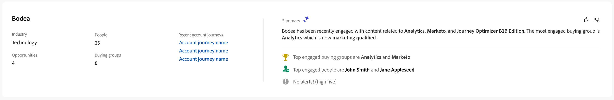
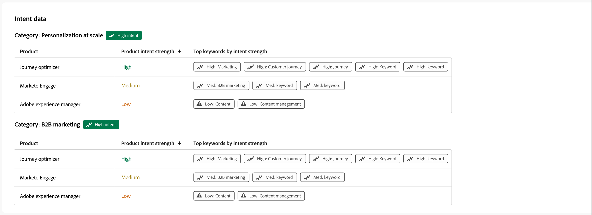

# 顧客の詳細

Journey Optimizer B2B editionの任意の場所から人物名をクリックすると、人物詳細ページが表示されます。 このページには、アカウントまたは購買グループに関連付けられた人物に関する有用な情報が含まれ、ハイライトデータとインテントデータ（設定されている場合）の生成AI概要が含まれます。<!-- There are also [actions](#person-actions) that you can execute for the person. -->

{width="800" zoomable="yes"}

このページにアクセスするには、[&#x200B; インテリジェントダッシュボード &#x200B;](../dashboards/intelligent-dashboard.md)、[購買グループの詳細ページ &#x200B;](../buying-groups/buying-group-details.md)、[&#x200B; アカウントの詳細ページ &#x200B;](./account-details.md)に表示されている名前をクリックします。

人物の詳細ページは、次の4つのセクションで構成されています。

## 人物の概要

{zoomable="yes"}

ページ上部の「人物の概要」セクションには、次の情報が含まれています。

* 名前
* 職位
* メール
* 電話番号
* エンゲージメントスコア
* 概要

## アクティビティ

このセクションには、最新のメール、web、フォーム入力、および人物に関連する注目のアクション（最大20）のリストが表示されます。 項目は、日時を含むアクティビティタイプとしてリストされます。

{width="700" zoomable="yes"}

## エンゲージメントスコアにもとづく購買グループ

このセクションでは、その人物がメンバーである購買グループが含まれ、エンゲージメントスコアに従って並べ替えられます。 各カードには、次の購買グループ情報が含まれます。

* 名前 – 名前をクリックして、[購買グループの詳細](../buying-groups/buying-group-details.md)を開きます。
* エンゲージメントスコア
* 完全性スコア
* Stage
* メンバー

{width="700" zoomable="yes"}

## インテントデータ

Journey Optimizer B2B editionでは、インテント検出モデルは、個人のアクティビティに基づいて、十分な信頼性で関心のあるソリューション/製品を予測します。 また、タグ付けされたコンテンツとともに、他のアカウントの共同メンバーのアクティビティも活用します。 人の意図は、製品に興味を持つ可能性として解釈できます。

{{intent-data-note}}

{width="700" zoomable="yes"}

* 意図のレベル
* インテントシグナルの種類 – キーワード、製品、ソリューション

<!-- ## Person actions -->
