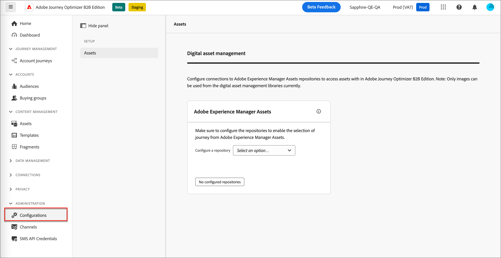
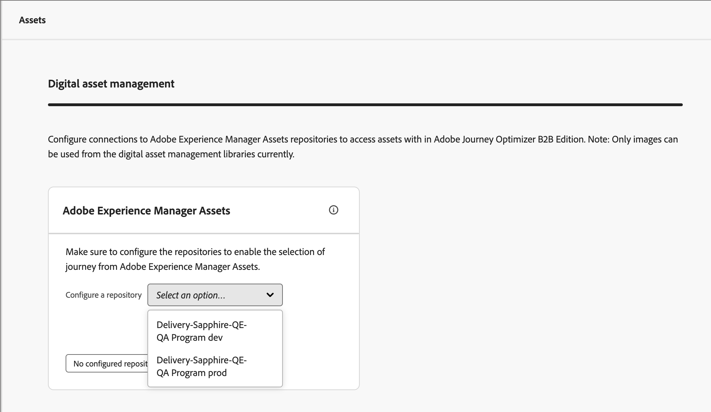
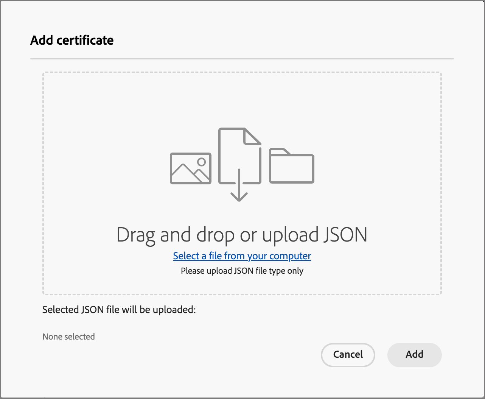
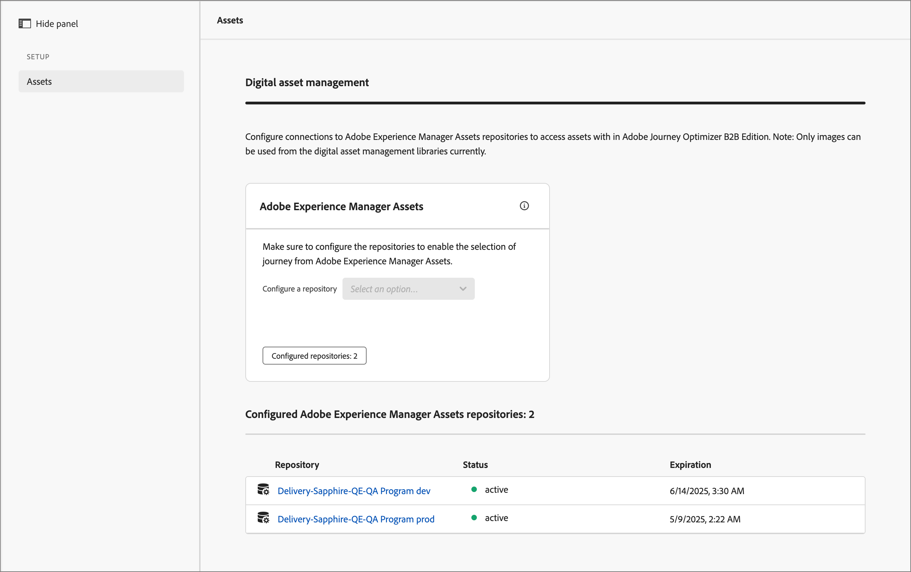
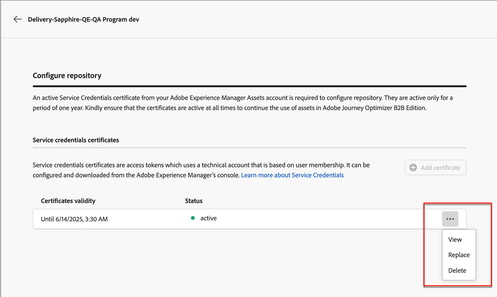
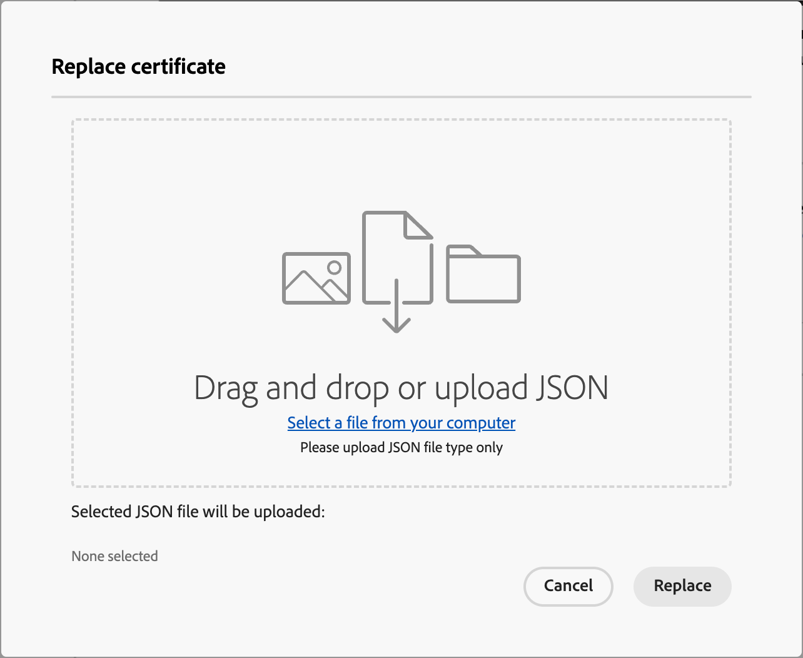
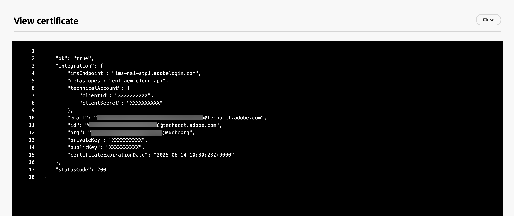

# Experience Manager アセットリポジトリの設定

[!DNL Adobe Journey Optimizer B2B Edition]は[!DNL Adobe Experience Manager Assets as a Cloud Service]と統合され、メールコンテンツでアセットを使用できるようになります。 [!DNL Experience Manager Assets]と情報を交換することで、透明性が確保されます。 この機能を有効にするには、接続を[!DNL Adobe Experience Assets]に設定します。

Adobe Experience Manager Cloud Managerはプログラムに整理されており、各プログラムには複数の環境とリポジトリがあります（[詳細情報](https://experienceleague.adobe.com/ja/docs/experience-manager-cloud-service/content/implementing/using-cloud-manager/programs/program-types){target="_blank"}）。 Adobe Journey Optimizer B2B editionでAdobe Experience Manager Assetsを設定する場合、デジタルアセットへのアクセスに使用する各リポジトリへの接続を設定します。

{{aem-assets-licensing-note}}

## 前提条件

* AEM ヘッドレス Developer Consoleで、必要な環境のサービス資格情報を生成します（[詳細情報](https://experienceleague.adobe.com/ja/docs/experience-manager-learn/getting-started-with-aem-headless/authentication/service-credentials#generate-service-credentials){target="_blank"}）。
* 接続に必要な証明書を取得します。 ベストプラクティスとして、有効期限が切れるまでに残り少なくとも6か月の証明書があることを確認します。 証明書は365日ごとに有効期限が切れます。
* Adobe Journey Optimizer B2B editionでは、一度にひとつのデジタルアセット管理ソースにアクセスできます。 切り替える前に、必要なアセットがAdobe Experience Managerで使用可能であることを確認します。

>[!IMPORTANT]
>
>サービス資格情報は正真正銘のもので、秘密鍵が含まれています。 これらの資格情報は、組織のITおよびセキュリティポリシーに従って保存、管理、アクセスする必要があります。

## リポジトリ接続の追加

1. 左側のナビゲーションで **[!UICONTROL 管理]**/**[!UICONTROL 設定]** を選択します。

1. 中間パネルの&#x200B;**[!UICONTROL Assets]**&#x200B;をクリックします。

   {width="700" zoomable="yes"}

   <!--   The default digital asset management option is configured as `Adobe Marketo Engage`.
    -->
   ここから、各AEM環境リポジトリへの接続を1つずつ設定できます。

1. _[!UICONTROL Adobe Experience Manager Assets]_ ボックス内で、**[!UICONTROL リポジトリの設定]**&#x200B;の横にある矢印をクリックし、リポジトリを選択します。

   {width="500"}

1. 「**[!UICONTROL 証明書を追加]**」をクリックし、ダイアログツールを使用してファイルをアップロードします。

   .json ファイルをダイアログにドラッグしてアップロードできます。 リンクをクリックして、システムからファイルを見つけて選択することもできます。

   {width="500"}

   アップロード後、証明書が下部に表示されます。

   >[!NOTE]
   >
   >無効なファイルを使用すると、ダイアログの下部にエラーが表示されます。

   「**[!UICONTROL 追加]**」をクリックして、証明書を完了します。

1. 戻る（←）矢印をクリックして、メイン設定ページに戻ります。

   設定されたリポジトリは、選択パネルの下のテーブルに表示されます。 手順3～4を繰り返して、別のリポジトリを追加できます。

   {width="600" zoomable="yes"}

リポジトリの設定が完了すると、チームメンバーはコンテンツのオーサリング時に[!DNL Adobe Experience Manager Assets]を選択できます。

>[!NOTE]
>
>Adobe Journey Optimizer B2B editionでは、コンテンツのオーサリング時に、一度にひとつのデジタルアセット管理ソースにアクセスできます。 

## 証明書の置き換え

証明書は、作成日から365日ごとに有効期限が切れます。 チームが引き続きアセットにアクセスできるようにするには、有効期限が切れる前に証明書を置き換えます。

>[!NOTE]
>
>[!DNL Adobe Journey Optimizer B2B Edition]は、使用状況に関する情報を[!DNL Experience Manager Assets]と通信します。 信頼性の高い使用データの同期とデータの不整合を防ぐため、接続はアクティブな状態を維持する必要があります。 管理者は、アプリ内通知を介して証明書の有効期限が切れる通知を受け取ります。 有効期限は、_[!UICONTROL 管理]_ エリアの&#x200B;_Assets_ サブセクションにも表示されます。

1. デジタルアセット管理ページで、設定されたリポジトリのリストを探します。

1. 目的のリポジトリをクリックして、証明書を置き換えます。

1. 省略記号（**...**）をクリックします 証明書ファイルのアイコンをクリックすると、そのファイルに対するアクションのオプションが表示されます。

   {width="600" zoomable="yes"}

1. ファイルのアップロード用ダイアログを開くには、**[!UICONTROL 置換]**&#x200B;を選択します。

1. ファイルをダイアログにドラッグするか、リンクを使用してアップロードします。 ファイルがJSON タイプであることを確認します。

   {width="500"}

1. 「**[!UICONTROL 置換]**」をクリックして、アップロードを確定します。

## 証明書の表示

リポジトリ接続に関連付けられている証明書JSON ファイルを表示できます。

1. デジタルアセット管理ページで、設定されたリポジトリのリストを探します。

1. 接続したリポジトリをクリックします。

1. 省略記号（**...**）をクリックします 証明書ファイルのアイコンをクリックすると、そのファイルに対するアクションのオプションが表示されます。

1. **[!UICONTROL ビュー]**&#x200B;を選択します。

   {width="600"}

1. 「**[!UICONTROL 閉じる]**」をクリックして、リポジトリの設定ページに戻ります。

## リポジトリ接続の削除

リポジトリを削除すると、Journey Optimizer B2B edition内のExperience Manager Assets環境へのユーザーアクセス権が削除されます。

1. _[!UICONTROL デジタルアセット管理]_ ページで、設定されたアセットリポジトリのリストを探します。

1. 目的のリポジトリ名をクリックして、接続を編集します。

1. 省略記号（**...**）をクリックします 証明書ファイルのアイコンをクリックすると、そのファイルに対するアクションのオプションが表示されます。

1. **[!UICONTROL 削除]**&#x200B;を選択します。

1. 確認ダイアログで、「**[!UICONTROL 削除]**」をクリックします。

<!--

## Switch back to Adobe Marketo Engage Assets

Select Adobe Marketo Engage digital asset management in the Assets section.

After the confirmation, the Adobe Marketo Engage assets library is available for users.
-->
