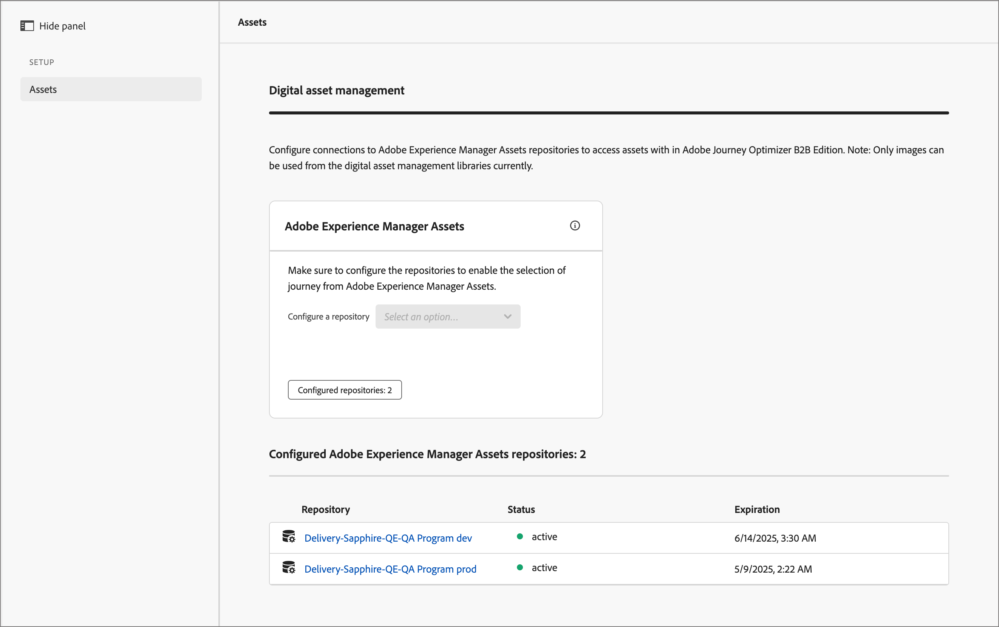

# Experience Manager アセットリポジトリーの設定

Adobe Journey Optimizer B2B editionは、Adobe Experience Manager Assets as a Cloud Serviceと統合されており、アカウントジャーニー内でメールなどのアセットを使用する以上のことが可能になっています。 Experience Manager Assetsとの情報交換により、透明性が確保されます。 Adobe Experience Assetsへの接続を設定してこの機能を有効にします。

Adobe Experience Manager Cloud Managerはプログラム別に整理されており、各プログラムには複数の環境とリポジトリがあります（[ 詳細情報 ](https://experienceleague.adobe.com/en/docs/experience-manager-cloud-service/content/implementing/using-cloud-manager/programs/program-types){target="_blank"}）。 Adobe Journey Optimizer B2B editionでAdobe Experience Manager Assetsを設定する場合、デジタルアセットへのアクセスに使用する各リポジトリへの接続を設定します。

{{aem-assets-licensing-note}}

## 前提条件

* 目的の環境のサービス資格情報をAEM ヘッドレス Developer Consoleで生成します（[ 詳細情報 ](https://experienceleague.adobe.com/en/docs/experience-manager-learn/getting-started-with-aem-headless/authentication/service-credentials#generate-service-credentials){target="_blank"}）。
* 接続に必要な証明書を入手します。 ベストプラクティスとして、証明書の有効期限が切れるまで、少なくとも 6 か月は残っていることを確認します。 証明書は 365 日ごとに期限切れになります。
* Adobe Journey Optimizer B2B editionでは、一度に 1 つのデジタルアセット管理ソースへのアクセスをサポートしています。 切り替える前に、必要なアセットがAdobe Experience Managerで使用可能であることを確認してください。

>[!IMPORTANT]
>
>サービス資格情報は真の意味で、秘密鍵が含まれています。 これらの資格情報は、組織の IT およびセキュリティポリシーに従って保存、管理およびアクセスする必要があります。

## リポジトリ接続の追加

1. 左側のナビゲーションで **[!UICONTROL 管理]**/**[!UICONTROL 設定]** を選択します。

1. 中間パネルの **0&rbrace;Assets&rbrace; をクリックします。**

   {width="700" zoomable="yes"}

<!--   The default digital asset management option is configured as `Adobe Marketo Engage`.
-->
ここから、各AEM環境リポジトリーへの接続を 1 つずつ設定できます。

1. 「_[!UICONTROL Adobe Experience Manager Assets]_」ボックス内で、「**[!UICONTROL リポジトリーを設定]** の横にある矢印をクリックし、リポジトリーを選択します。

   {width="500"}

1. **[!UICONTROL 証明書を追加]** をクリックし、ダイアログツールを使用してファイルをアップロードします。

   .json ファイルをダイアログにドラッグするか、リンクをクリックしてシステムからファイルを見つけて選択することで、アップロードできます（ファイルが有効な JSON 型であることを確認してください）。

   {width="500"}

   アップロード後、証明書が下部に表示されます。

   >[!NOTE]
   >
   >無効なファイルを使用すると、ダイアログの下部にエラーが表示されます。

   「**[!UICONTROL 追加]**」をクリックして、証明書を完成させます。

1. 戻る（←）矢印をクリックして、メインの設定ページに戻ります。

   設定されたリポジトリが、選択パネルの下のテーブルに表示されます。 手順 3～4 を繰り返して、別のリポジトリを追加できます。

   {width="600" zoomable="yes"}

リポジトリの設定が完了したら、チームメンバーは、コンテンツのオーサリング時にAdobe Experience Manager Assetsを選択できます。

>[!NOTE]
>
>Adobe Journey Optimizer B2B editionでは、コンテンツのオーサリング時に、一度に 1 つのデジタルアセット管理ソースへのアクセスをサポートしています。 

## 証明書の置換

証明書は作成日から 365 日ごとに期限切れになります。 チームが引き続きアセットにアクセスできるように、有効期限の前に置き換えます。

>[!NOTE]
>
>Adobe Journey Optimizer B2B editionは、Experience Manager assets と通信して使用状況の情報を取得します。 信頼性の高い使用状況データ同期およびデータの不一致を防ぐには、接続がアクティブである必要があります。 管理者ユーザーには、アプリ内通知を通じて、証明書の有効期限が切れることを知らせる通知が届きます。 また、Assetsのサブセクション（管理領域のデジタルアセット管理）の有効期限に注意することもできます。

1. デジタルアセット管理ページで、設定済みリポジトリのリストを探します。

1. 目的のリポジトリをクリックして、証明書を置き換えます。

1. 証明書ファイルの省略記号（**...**）アイコンをクリックして、その証明書ファイルに対するアクションのオプションを表示します。

   {width="600" zoomable="yes"}

1. 「**[!UICONTROL 置換]**」を選択して、ファイルのアップロード用のダイアログを開きます。

1. ダイアログ上にファイルをドラッグするか、リンクを使用して、ファイルをアップロードします。 ファイルの JSON タイプが指定されていることを確認します。

   {width="500"}

1. **[!UICONTROL 置換]** をクリックして、アップロードを確定します。

## 証明書の表示

リポジトリ接続に関連付けられた証明書 JSON ファイルを確認できます。

1. デジタルアセット管理ページで、設定済みリポジトリのリストを探します。

1. 接続したリポジトリをクリックします。

1. 証明書ファイルの省略記号（**...**）アイコンをクリックして、その証明書ファイルに対するアクションのオプションを表示します。

1. **[!UICONTROL 表示]** を選択します。

   {width="600"}

1. 「**[!UICONTROL 閉じる]**」をクリックして、「リポジトリを設定」ページに戻ります。

## リポジトリ接続の削除

リポジトリーを削除すると、Journey Optimizer B2B edition内のExperience Manager Assets環境へのユーザーアクセス権が削除されます。

1. _[!UICONTROL デジタルアセット管理]_ ページで、設定済みアセットリポジトリのリストを探します。

1. 目的のリポジトリー名をクリックして、接続を編集します。

1. 証明書ファイルの省略記号（**...**）アイコンをクリックして、その証明書ファイルに対するアクションのオプションを表示します。

1. 「**[!UICONTROL 削除]**」を選択します。

1. 確認ダイアログで、「**[!UICONTROL 削除]**」をクリックします。
<!--

## Switch back to Adobe Marketo Engage Assets

Select Adobe Marketo Engage digital asset management in the Assets section.

After the confirmation, the Adobe Marketo Engage assets library is available for users.
-->
