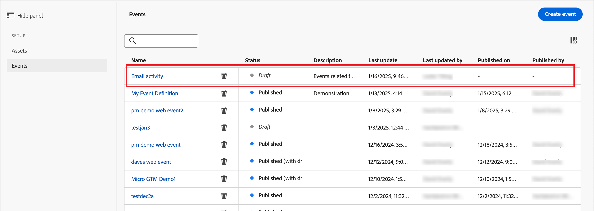
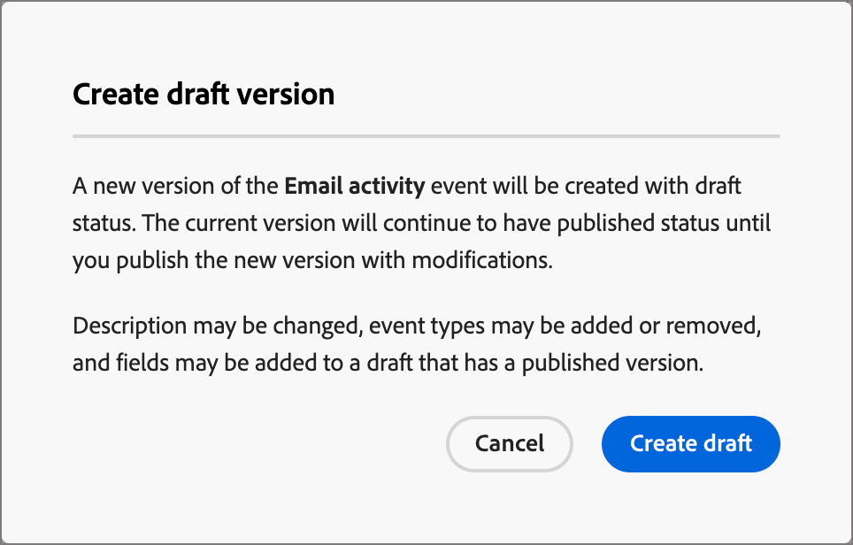

# Experience Platform イベント定義の設定

管理者は、Adobe Experience Platform（AEP）ベースのイベント定義を設定できます。これにより、マーケターは、[AEP Experience Events](https://experienceleague.adobe.com/ja/docs/experience-platform/xdm/classes/experienceevent){target="_blank"} に反応するアカウントジャーニーを作成できます。

{width="30"} [概要ビデオを視聴](#overview-video)

アカウントジャーニーでAEP エクスペリエンスイベントを使用するには、次の 2 つの手順があります。

1. AEP イベント定義を作成して公開します。

2. アカウントジャーニーで、「_イベントをリッスン_」ノードおよび [AEP イベント定義を人物イベントとして選択 ](../journeys/listen-for-event-nodes.md#listen-for-an-experience-event) を追加します。

各イベント定義には、次のExperience Platform入力が必要です。

* **_スキーマ_** - エクスペリエンスイベントデータ構造を定義する XDM スキーマ。 エクスペリエンスイベントに基づく必要があり、プロファイルを有効にする必要があります。

  >[!NOTE]
  >
  >必要なスキーマが確実に定義されるように、エンジニアリングチームと調整します。 [XDM スキーマの作成 ](https://experienceleague.adobe.com/ja/docs/experience-platform/xdm/schema/composition){target="_blank"} は、データエンジニアが組織全体のユースケース要件に基づいて実行する複雑なプロセスです。

* **_イベントタイプ_** - XDM ExperienceEventType （イベント定義ごとに最大 20）。

* **_フィールド_** - スキーマに存在する XDM フィールド（イベント定義ごとに最大 20）

* **_名前_** - イベント定義の一意の名前。

* **_説明_** - イベント定義の説明。

## 制限とガードレール

組織の目標を達成するためにイベント定義を作成および管理する際は、次の点に注意してください。

* Journey Optimizer B2B editionは、最大 50 個のイベント定義をサポートします。

* アカウントジャーニーでは、Web SDKや HTTP API などのAEP ストリーミング機能を使用して取り込まれたAEP エクスペリエンスイベントをリッスンできます。

* スキーマとイベントタイプのセットを組み合わせて使用できるのは、1 つのAEP イベント定義のみです。 スキーマ（例えば、`My Schema`）およびイベントタイプ（例えば、`Web Webpagedetails Page Views`）を使用してイベント定義を作成する場合、他のイベント定義では `My Schema` と `Web Webpagedetails Page Views` の組み合わせを使用できません。

* 1 つのイベント定義を複数のアカウントジャーニーで使用できます。

* AEP エクスペリエンスイベントは、アカウントジャーニー内で意思決定目的に使用できますが、保持されません。 したがって、Journey Optimizer B2B edition内では、AEP エクスペリエンスイベントの履歴レコードを活用できません。

* _アクティビティの日付_ および _最小回数_ の制約はサポートされていません。

* イベント定義を公開した後は、スキーマと名前を変更できません。 ただし、ドラフトバージョンを作成して再度公開することで、イベントタイプとフィールドを追加できます。

* 公開済みジャーニーで使用されるイベント定義は削除できません。

## イベント定義へのアクセスと管理

1. 左側のナビゲーションで **[!UICONTROL 管理]**/**[!UICONTROL 設定]** を選択します。

1. 中間パネルの **[!UICONTROL イベント]** をクリックして、イベント定義のリストを表示します。

   このページから、イベント定義 [ 作成 ](#create-an-event-definition)、[ 公開 ](#publish-an-event-defintion)、[ 編集 ](#publish-an-event-defintion)、[ 削除 ](#delete-an-event-definition) を実行できます。

   {width="800" zoomable="yes"}

   テーブルは「変更済み _[!UICONTROL 列で並べ替えられ]_ す。デフォルトでは、最も新しく更新された定義が先頭に表示されます。<!-- Click the column title to change between ascending and descending.-->

1. イベント定義の詳細にアクセスするには、名前をクリックします。

### イベント定義のステータスとライフサイクル

_[!UICONTROL イベント定義]_ リストの **[!UICONTROL ステータス]** 列には、各定義の現在のステータスが示されます。 ステータスは、アカウントジャーニーで使用できる状態と、それに対して行える変更を決定します。

| ステータス | 説明 |
| -------------------- | ----------- |
| 下書き | イベント定義を作成すると、そのイベント定義はドラフトステータスになります。 アカウントジャーニーで使用するために公開するまで、このステータスのままになります。 使用可能なアクション： <ul><li>すべての詳細を編集<li>公開<li>削除 |
| 公開日 | イベント定義を公開すると、アカウントジャーニーで使用できるようになります。 詳細は変更できません。 使用可能なアクション： <ul><li>_イベントをリッスン_ ジャーニーノードで使用可能<li>ドラフトバージョンを作成<li>削除（使用中でない場合） |
| 公開済み (ドラフトあり) | 公開済みのイベント定義からドラフトを作成する場合、公開されたバージョンはアカウントジャーニーで引き続き使用でき、ドラフトバージョンは変更できます。 ドラフトバージョンを公開すると、現在の公開バージョンが置き換えられ、まだ実行されていないアカウントジャーニーのイベント定義が更新されます。 使用可能なアクション： <ul><li>すべての詳細を編集<li>ドラフトバージョンを公開<li>ドラフトバージョンを破棄<li>削除（使用中でない場合） |

{zoomable="yes"}

### イベント定義リストのフィルタリング

名前でイベント定義を検索するには、検索バーに一致するテキスト文字列を入力します。

{width="700" zoomable="yes"}

## イベント定義の作成

1. 左側のナビゲーションで **[!UICONTROL 管理]**/**[!UICONTROL 設定]** を選択します。

1. 中間パネルの **[!UICONTROL イベント]** をクリックして、イベント定義のリストを表示します。

1. 右上の **[!UICONTROL イベントを作成]** をクリックします。

1. **[!UICONTROL 名前]** （必須）と **[!UICONTROL 説明]** （オプション）を入力します。

   {width="600" zoomable="yes"}

1. イベント定義に使用する **[!UICONTROL スキーマ]** を設定します。

   選択するスキーマによって、定義に追加できるフィールドが決まり、アカウントジャーニーの _イベントをリッスン_ ノードの制約として使用できるようになります。

   * **[!UICONTROL スキーマを選択]** をクリックします。
   * ダイアログで、エクスペリエンスイベントベースのスキーマのリストからスキーマを選択します。
   * 「**[!UICONTROL 選択]**」をクリックします。

   {width="600" zoomable="yes"}

1. イベント定義に使用する **[!UICONTROL イベントタイプ]** を選択します。

   選択する [ イベントタイプ ](https://experienceleague.adobe.com/ja/docs/experience-platform/xdm/classes/experienceevent#eventType){target="_blank"} によって、アカウントジャーニーの _イベントをリッスン_ ノードの制約として使用できるイベントが決まります。

   * **[!UICONTROL イベントタイプを選択]** をクリックします。
   * ダイアログで、リストから 1 つ以上のイベントタイプを選択します（最大 20）。
   * 「**[!UICONTROL 選択]**」をクリックします。

   {width="600" zoomable="yes"}

1. イベント定義に使用する **[!UICONTROL フィールド]** を選択します。

   選択するフィールドによって、アカウントジャーニーの _イベントをリッスン_ ノードにイベントを使用する場合に利用できる制約が決まります。

   >[!NOTE]
   >
   >`eventType` フィールドは必須であり、自動的に選択されます。

   * **[!UICONTROL フィールドを選択]** をクリックします。
   * ダイアログで、リストから 1 つ以上のフィールドを選択します（最大 20）。
   * 「**[!UICONTROL 選択]**」をクリックします。

   {width="600" zoomable="yes"}

1. スキーマ、イベントタイプおよびフィールドが完成したら、「**[!UICONTROL 作成]**」をクリックします。

   作成時にはリストページが表示され、新しいイベントが _ドラフト_ ステータスでリストの上部に表示されます。

   {width="700" zoomable="yes"}

## イベント定義の公開

ドラフトイベントの定義が完了し、ニーズに合っていることを確認したら、その定義を公開して、アカウントジャーニーで使用できるようにします。 イベント定義を公開した後、変更が必要な場合は、ドラフトバージョンを作成できます。 ただし、スキーマは変更できません。また、追加できるのはイベントタイプとフィールドのみです（削除することはできません）。

1. 左側のナビゲーションで **[!UICONTROL 管理]**/**[!UICONTROL 設定]** を選択します。

1. 中間パネルの **[!UICONTROL イベント]** をクリックして、イベント定義のリストを表示します。

1. _[!UICONTROL イベント定義]_ リストで、ドラフトイベント定義の名前をクリックして詳細ページを開きます。

   {width="600" zoomable="yes"}

   必要に応じて、公開する前に設定を確認します。 要件を満たさない場合は [ ドラフトを編集 ](#edit-an-event-definition) できます。

1. 右上の **[!UICONTROL 公開]** をクリックします。

1. 確認ダイアログで、「**[!UICONTROL 公開]**」をクリックします。

   {width="300"}

   イベント定義のステータスが _公開済み_ に変わり、[ アカウントジャーニーで使用できる ](../journeys/listen-for-event-nodes.md#listen-for-an-experience-event) ようになりました。

   {width="700" zoomable="yes"}

## イベント定義の編集

1. 左側のナビゲーションで **[!UICONTROL 管理]**/**[!UICONTROL 設定]** を選択します。

1. 中間パネルの **[!UICONTROL イベント]** をクリックして、イベント定義のリストを表示します。

   イベント定義の編集は、現在のステータスに応じて異なります。

   * イベント定義が _ドラフト_ ステータスの場合は、その詳細を任意に編集できます。
   * イベント定義が _公開済み_ ステータスの場合は、編集できません。 編集可能なドラフトバージョンを作成し、公開済みのバージョンと置き換えることができます。
   * イベント定義が _公開済み（ドラフト）_ ステータスの場合、ドラフトバージョンを変更できます（説明を編集し、イベントタイプとフィールドを追加します）。

   {width="700" zoomable="yes"}

1. _[!UICONTROL イベント定義]_ リストページで、イベント定義名をクリックして開きます。

ステータスに応じて手順に従います。

>[!BEGINTABS]

>[!TAB ドラフト]

1. 必要に応じて、イベント定義の詳細を変更します。

   {width="600" zoomable="yes"}

   [ イベント定義の作成 ](#create-an-event-definition) に使用するのと同じガイドラインに従います。

   変更内容は自動的にドラフトに保存されます。

1. イベント定義が条件を満たしており、アカウントジャーニーで使用できるようにする場合は、「**[!UICONTROL 公開]**」をクリックします。

1. 確認ダイアログで、「**[!UICONTROL 公開]**」をクリックします。

   イベント定義のステータスが _公開済み_ に変わり、アカウントジャーニーで使用できるようになりました。

>[!TAB パブリッシュ済み]

1. イベント定義を更新するには、右上の **[!UICONTROL ドラフトバージョンを作成]** をクリックします。

   {width="600" zoomable="yes"}

1. 確認ダイアログで、「**[!UICONTROL ドラフトを作成]**」をクリックして、ドラフトバージョンを開きます。

   {width="300"}

   このアクションにより、ドラフトバージョンが作成されてリストページに戻ります。ここで、イベント定義のステータスは _公開済み（ドラフト）_ になります。

1. イベント定義名をクリックして開きます。

   _公開済み（ドラフトを使用）_ イベント定義の場合、「_[!UICONTROL 公開済み]_ バージョン」タブがデフォルトで選択されます。

1. 「**[!UICONTROL ドラフト]** バージョン」タブを選択します。

   {width="600" zoomable="yes"}

1. 必要に応じて、編集可能な詳細（**[!UICONTROL 説明]**、**[!UICONTROL イベントタイプ]**、**[!UICONTROL フィールド]**）を変更します。

   [ イベント定義の作成 ](#create-an-event-definition) に使用するのと同じガイドラインに従います。

   変更内容は自動的にドラフトに保存されます。

1. ドラフトイベント定義が条件を満たしており、アカウントジャーニーで使用するために現在の公開済みバージョンを置き換える場合は、「**[!UICONTROL ドラフトを公開]**」をクリックします。

1. 確認ダイアログで、「**[!UICONTROL 公開]**」をクリックします。

   {width="300"}

   ドラフトバージョンを公開すると、現在の公開バージョンが置き換えられ、既に使用中でまだ実行されていないアカウントジャーニーの場合はイベント定義が更新されます。

>[!TAB  公開済み（ドラフト付き） ]

_公開済み（ドラフト）_ イベント定義を開くと、デフォルトで _[!UICONTROL 公開済み]_ バージョンタブが選択されます。

1. 「**[!UICONTROL ドラフト]** バージョン」タブを選択します。

   {width="600" zoomable="yes"}

1. 必要に応じて、編集可能な詳細（**[!UICONTROL 説明]**、**[!UICONTROL イベントタイプ]**、**[!UICONTROL フィールド]**）を変更します。

   [ イベント定義の作成 ](#create-an-event-definition) に使用するのと同じガイドラインに従います。

   変更内容は自動的にドラフトに保存されます。

1. ドラフトイベント定義が条件を満たしており、アカウントジャーニーで使用するために現在の公開済みバージョンを置き換える場合は、「**[!UICONTROL ドラフトを公開]**」をクリックします。

1. 確認ダイアログで、「**[!UICONTROL 公開]**」をクリックします。

   {width="300"}

   ドラフトバージョンを公開すると、現在の公開バージョンが置き換えられ、既に使用中でまだ実行されていないアカウントジャーニーの場合はイベント定義が更新されます。

>[!ENDTABS]

## イベント定義の削除

公開済みのアカウントジャーニーで使用されていないイベント定義は削除できます。

>[!CAUTION]
>
>この操作は慎重に行ってください。 イベント定義の削除は元に戻すことができません。

1. 左側のナビゲーションで **[!UICONTROL 管理]**/**[!UICONTROL 設定]** を選択します。

1. 中間パネルの **[!UICONTROL イベント]** をクリックして、イベント定義のリストを表示します。

1. リストでイベント定義を見つけ、名前の右側にある _削除_ （）アイコンをクリックします。

1. 確認ダイアログで、「**[!UICONTROL 削除]**」をクリックします。

   {width="300"}

## 概要ビデオ

>[!VIDEO](https://video.tv.adobe.com/v/3448637/?learn=on)