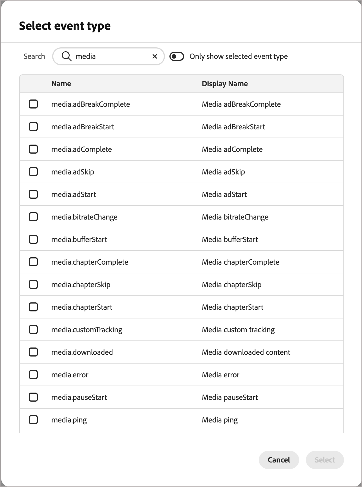

# エクスペリエンスイベントとフィールドの選択

管理者は、Experience Event結合スキーマ内で、特定の[AEP Experience Events](https://experienceleague.adobe.com/en/docs/experience-platform/xdm/classes/experienceevent){target="_blank"}とその関連フィールドを選択できます。 選択後、ユーザーはそれらのエクスペリエンスイベントをリッスンするように決定ルールを設定して、ほぼリアルタイムのイベントデータにもとづいて、動的かつターゲットを絞ったキャンペーンアクションを有効にできます。

<!-- {width="30"} [Watch the video overview](#overview-video) -->
ジャーニーでAEP エクスペリエンスイベントを使用するには、次の2 ステップのプロセスを実行します。

1. 管理者[は、Journey Optimizer B2B edition設定にAEP エクスペリエンスイベントとフィールド ](#add-an-event)を追加します。

2. ジャーニーで、マーケターが&#x200B;_イベントをリッスン_ ノードを追加し、[ エクスペリエンスイベント ](../journeys/listen-for-event-nodes.md#listen-for-an-experience-event)を選択します。

   * ノードで使用するイベントを選択します。
   * 制約として使用するフィールドを選択します。

>[!BEGINSHADEBOX]

## ガイドラインと制限事項

自社の目標を達成するイベントを選択する際には、次の点を考慮してください。

* 1つのイベントにつき、最大50件のイベントと100件のフィールドを選択できます。

* ジャーニーは、Web SDKやHTTP APIなどのExperience Platform ストリーミング機能を使用して取り込まれたエクスペリエンスイベントをリッスンできます。

* エクスペリエンスイベントは、ジャーニー内の決定目的で使用できますが、保持されません。 そのため、Journey Optimizer B2B edition内のエクスペリエンスイベントの履歴を活用することはできません。

* エクスペリエンスイベントを使用してジャーニーを公開する場合、さらにフィールドを追加できますが、以前に選択したフィールドを削除することはできません。

* 複数のジャーニーでエクスペリエンスイベントを参照するか、同じジャーニー内で1つ以上を使用できます。

>[!ENDSHADEBOX]

## エクスペリエンスイベントの管理

1. 左側のナビゲーションで、**[!UICONTROL 管理]** > **[!UICONTROL 設定]**&#x200B;を選択します。

1. 中間パネルの&#x200B;**[!UICONTROL XDM クラス]**&#x200B;をクリックし、**[!UICONTROL イベント]** タブをクリックして、使用可能なイベントのリストを表示します。

   {width="800" zoomable="yes"}

   リストは、_[!UICONTROL 最終更新]_&#x200B;列に従って表示され、デフォルトでは最も最近更新されたイベントが上部に表示されます。

   このページから、ジャーニーで使用するイベントを[選択](#add-an-event)および[編集](#edit-an-event)できます。

   選択したイベントの詳細にアクセスするには、イベント名をクリックします。

### イベントリストのフィルタリング

_[!UICONTROL 検索]_ フィールドにテキストを入力して、イベント名と一致するイベントの表示をフィルタリングします。

{width="600" zoomable="yes"}でフィルタリング

### イベントの追加

ジャーニー内の&#x200B;_イベントをリッスンする_ ノードでエクスペリエンスイベントを使用できるようにするには、イベントとサポートされているフィールドを選択します。

>[!NOTE]
>
>ベータリリースでは、リストからイベントを削除することはできません。 追加する各イベントが、組織で使用するイベントであることを確認します。

1. 右上の「**[!UICONTROL エクスペリエンスイベントを選択]**」をクリックします。

   イベント詳細ページが表示されます。 このページから、イベントタイプとフィールドを選択できます。

   {width="700" zoomable="yes"}

1. イベントタイプを選択します。

   * **[!UICONTROL イベントタイプを選択]**&#x200B;をクリックします。

   * ダイアログで、イベントタイプを選択します。

     「_[!UICONTROL 検索]_」フィールドを使用して、表示されたリストを名前でフィルタリングします。 **[!UICONTROL 選択したフィールドのみを表示]** スライダーを使用して、現在の選択を確認します。

     {width="450" zoomable="yes"}

   * 「**[!UICONTROL 選択]**」をクリックします。

1. イベントタイプの1つ以上のフィールドを選択します。

   * **[!UICONTROL フィールドを選択]**&#x200B;をクリックします。

   * ダイアログで、一致するイベントの制約として使用するフィールドを選択します。

     「_[!UICONTROL 検索]_」フィールドを使用して、表示されたリストを名前でフィルタリングします。 **[!UICONTROL 選択したフィールドのみを表示]** スライダーを使用して、現在の選択を確認します。

     {width="450" zoomable="yes"}

   * 「**[!UICONTROL 選択]**」をクリックします。

1. イベントの詳細ページで、**[!UICONTROL 保存]**&#x200B;をクリックします。

保存されたイベントは、_[!UICONTROL イベント]_ タブのリストに表示されます。

### イベントの編集

イベントの詳細を編集して、フィールドを変更します。

1. イベント名をクリックするか、_詳細メニュー_ （**...**）アイコンをクリックして、**[!UICONTROL 編集]**&#x200B;を選択します。

   {width="500" zoomable="yes"}

1. **[!UICONTROL フィールドを編集]**&#x200B;をクリックして、_[!UICONTROL フィールドを選択]_ ダイアログでフィールドを追加するか、既存の選択範囲を削除します。

1. 「**[!UICONTROL 選択]**」をクリックして、選択内容を保存します。

### イベントの削除

>[!NOTE]
>
>この機能のBeta リリースでは、選択したイベントのリストからイベントを削除することはできません。 イベントの削除は、GA リリースで予定されています。

## イベントとフィールド

[!DNL Journey Optimizer B2B Edition]の場合、特定の人物レベルのアクティビティは[!DNL Experience Platform]個のエクスペリエンスイベントとしてキャプチャされます。 これらのイベントは、XDM Experience Event スキーマを使用し、ジャーニー固有のフィールドグループを含むシステムデータセットに保存されます。 これらのイベントは、[!UICONTROL Journey Optimizer B2B Edition]で他のエクスペリエンスイベントと同様に使用できます。

各イベントは、ジャーニー&#x200B;_イベントのリッスン_ ノード（イベントに基づく決定）で使用できる、定義されたフィールドセットを公開します。 使用可能なイベントタイプとそのフィールドを確認して、これらのジャーニーノードで使用するイベントとフィールドを決定します。

### メール送信済み

このイベントは、マーケティングメールが個人に送信された日時を追跡します。

イベントタイプ：`directMarketing.emailSent`

+++フィールド

| 表示名 | パス |
| ------------ | ---- |
| 識別子 | `_id` |
| イベントタイプ | `eventType` |
| タイムスタンプ | `timestamp` |
| 顧客 ID | `personID` |
| 人物ソース ID | `personKey.sourceID` |
| 人物のソースタイプ | `personKey.sourceType` |
| 人物ソースインスタンス ID | `personKey.sourceInstanceID` |
| 人物ソースキー | `personKey.sourceKey` |
| メールソース ID | `directMarketing.emailSent.mailingKey.sourceID` |
| メールソースタイプ | `directMarketing.emailSent.mailingKey.sourceType` |
| メールソースインスタンス ID | `directMarketing.emailSent.mailingKey.sourceInstanceID ` |
| メールソースキー | `directMailing.emailSent.mailingKey.sourceKey` |
| 郵送先名 | `directMarketing.emailSent.mailingName` |
| ジャーニー ID | `_experience.journeyOrchestration.stepEvents.journeyID` |
| ノード ID | `_experience.journeyOrchestration.stepEvents.nodeID` |

+++

### メール到着

このイベントは、メールがユーザーのメールサービスに正常に配信された時点を追跡します。

イベントタイプ：`directMarketing.emailDelivered `

+++フィールド

| 表示名 | パス |
| ------------ | ---- |
| 識別子 | `_id` |
| イベントタイプ | `eventType` |
| タイムスタンプ | `timestamp` |
| 顧客 ID | `personID` |
| 人物ソース ID | `personKey.sourceID` |
| 人物のソースタイプ | `personKey.sourceType` |
| 人物ソースインスタンス ID | `personKey.sourceInstanceID` |
| 人物ソースキー | `personKey.sourceKey` |
| メーリングソース ID | `directMarketing.mailingKey.sourceID` |
| メーリングソースタイプ | `directMarketing.mailingKey.sourceType` |
| メーリングソースインスタンス ID | `directMarketing.mailingKey.sourceInstanceID` |
| 郵送元キー | `directMarketing.mailingKey.sourceKey` |
| 郵送先名 | `directMarketing.mailingName` |
| ジャーニー ID | `_experience.journeyOrchestration.stepEvents.journeyID` |
| ノード ID | `_experience.journeyOrchestration.stepEvents.nodeID` |

+++

### メール開封済み

このイベントは、オーディエンスがマーケティングメールを開封したタイミングを追跡します。

イベントタイプ：`directMarketing.emailOpened`

+++フィールド

| 表示名 | パス |
| ------------ | ---- |
| 識別子 | `_id` |
| イベントタイプ | `eventType` |
| タイムスタンプ | `timestamp` |
| 顧客 ID | `personID` |
| 人物ソース ID | `personKey.sourceID` |
| 人物のソースタイプ | `personKey.sourceType` |
| 人物ソースインスタンス ID | `personKey.sourceInstanceID` |
| 人物ソースキー | `personKey.sourceKey` |
| メーリングソース ID | `directMarketing.mailingKey.sourceID` |
| メーリングソースタイプ | `directMarketing.mailingKey.sourceType` |
| メーリングソースインスタンス ID | `directMarketing.mailingKey.sourceInstanceID` |
| 郵送元キー | `directMarketing.mailingKey.sourceKey` |
| 郵送先名 | `directMarketing.mailingName` |
| モバイルデバイスである | `device.isMobileDevice` |
| デバイスモデル | `device.model` |
| ユーザーエージェント | `environment.browserDetails.userAgent` |
| オペレーティングシステム | `environment.operatingSystem` |
| ジャーニー ID | `_experience.journeyOrchestration.stepEvents.journeyID` |
| ノード ID | `_experience.journeyOrchestration.stepEvents.nodeID` |

+++

### 電子メールのクリック数

このイベントは、オーディエンスがマーケティングメール内のリンクをクリックしたときに追跡されます。

イベントタイプ：`directMarketing.emailClicked`

+++フィールド

| 表示名 | パス |
| ------------ | ---- |
| 識別子 | `_id` |
| イベントタイプ | `eventType` |
| タイムスタンプ | `timestamp` |
| 顧客 ID | `personID` |
| 人物ソース ID | `personKey.sourceID` |
| 人物のソースタイプ | `personKey.sourceType` |
| 人物ソースインスタンス ID | `personKey.sourceInstanceID` |
| 人物ソースキー | `personKey.sourceKey` |
| メーリングソース ID | `directMarketing.mailingKey.sourceID` |
| メーリングソースタイプ | `directMarketing.mailingKey.sourceType` |
| メーリングソースインスタンス ID | `directMarketing.mailingKey.sourceInstanceID` |
| 郵送元キー | `directMarketing.mailingKey.sourceKey` |
| 郵送先名 | `directMarketing.mailingName` |
| リンク URL | `directMarketing.linkURL` |
| モバイルデバイスである | `device.isMobileDevice` |
| モデル | `device.model` |
| ユーザーエージェント | `environment.browserDetails.userAgent` |
| オペレーティングシステム | `environment.operatingSystem` |
| ジャーニー ID | `_experience.journeyOrchestration.stepEvents.journeyID` |
| ノード ID | `_experience.journeyOrchestration.stepEvents.nodeID` |

+++

### バウンスメール

このイベントは、個人へのメールがバウンスしたときに追跡されます。

イベントタイプ：`directMarketing.emailBounced`

+++フィールド

| 表示名 | パス |
| ------------ | ---- |
| 識別子 | `_id` |
| イベントタイプ | `eventType` |
| タイムスタンプ | `timestamp` |
| 顧客 ID | `personID` |
| 人物ソース ID | `personKey.sourceID` |
| 人物のソースタイプ | `personKey.sourceType` |
| 人物ソースインスタンス ID | `personKey.sourceInstanceID` |
| 人物ソースキー | `personKey.sourceKey` |
| メーリングソース ID | `directMarketing.mailingKey.sourceID` |
| メーリングソースタイプ | `directMarketing.mailingKey.sourceType` |
| メーリングソースインスタンス ID | `directMarketing.mailingKey.sourceInstanceID` |
| 郵送元キー | `directMarketing.mailingKey.sourceKey` |
| 郵送先名 | `directMarketing.mailingName` |
| メール | `directMarketing.email` |
| 電子メールバウンスコード | `directMarketing.emailBouncedCode` |
| 電子メールバウンスの詳細 | `directMarketing.emailBouncedDetails` |
| ジャーニー ID | `_experience.journeyOrchestration.stepEvents.journeyID` |
| ノード ID | `_experience.journeyOrchestration.stepEvents.nodeID` |

+++

### ソフトバウンスメール

このイベントは、メールからユーザーへのソフトバウンスを追跡します。

イベントタイプ：`directMarketing.emailBouncedSoft`

+++フィールド

| 表示名 | パス |
| ------------ | ---- |
| 識別子 | `_id` |
| イベントタイプ | `eventType` |
| タイムスタンプ | `timestamp` |
| 顧客 ID | `personID` |
| 人物ソース ID | `personKey.sourceID` |
| 人物のソースタイプ | `personKey.sourceType` |
| 人物ソースインスタンス ID | `personKey.sourceInstanceID` |
| 人物ソースキー | `personKey.sourceKey` |
| メーリングソース ID | `directMarketing.mailingKey.sourceID` |
| メーリングソースタイプ | `directMarketing.mailingKey.sourceType` |
| メーリングソースインスタンス ID | `directMarketing.mailingKey.sourceInstanceID` |
| 郵送元キー | `directMarketing.mailingKey.sourceKey` |
| 郵送先名 | `directMarketing.mailingName` |
| メール | `directMarketing.email` |
| 電子メールバウンスコード | `directMarketing.emailBouncedCode` |
| 電子メールバウンスの詳細 | `directMarketing.emailBouncedDetails` |
| ジャーニー ID | `_experience.journeyOrchestration.stepEvents.journeyID` |
| ノード ID | `_experience.journeyOrchestration.stepEvents.nodeID` |

+++

### メール購読解除

このイベントは、オーディエンスがマーケティングメールの購読を解除したタイミングを追跡します。

イベントタイプ：`directMarketing.emailUnsubscribed `

+++フィールド

| 表示名 | パス |
| ------------ | ---- |
| 識別子 | `_id` |
| イベントタイプ | `eventType` |
| タイムスタンプ | `timestamp` |
| 顧客 ID | `personID` |
| 人物ソース ID | `personKey.sourceID` |
| 人物のソースタイプ | `personKey.sourceType` |
| 人物ソースインスタンス ID | `personKey.sourceInstanceID` |
| 人物ソースキー | `personKey.sourceKey` |
| メーリングソース ID | `directMarketing.mailingKey.sourceID` |
| メーリングソースタイプ | `directMarketing.mailingKey.sourceType` |
| メーリングソースインスタンス ID | `directMarketing.mailingKey.sourceInstanceID` |
| 郵送元キー | `directMarketing.mailingKey.sourceKey` |
| 郵送先名 | `directMarketing.mailingName` |
| ジャーニー ID | `_experience.journeyOrchestration.stepEvents.journeyID` |
| ノード ID | `_experience.journeyOrchestration.stepEvents.nodeID` |

+++

### Web ページにアクセス

このイベントタイプは、ヒットをページビューとしてマークするための標準的な方法です。

イベントタイプ：`web.webpagedetails.pageViews`

+++フィールド

| 表示名 | パス |
| ------------ | ---- |
| 識別子 | `_id` |
| イベントタイプ | `eventType` |
| タイムスタンプ | `timestamp` |
| 顧客 ID | `personID` |
| 人物ソース ID | `personKey.sourceID` |
| 人物のソースタイプ | `personKey.sourceType` |
| 人物ソースインスタンス ID | `personKey.sourceInstanceID` |
| 人物ソースキー | `personKey.sourceKey` |
| Web ページソース ID | `web.webPageDetails.webPageKey.sourceID` |
| web ページのソースタイプ | `web.webPageDetails.webPageKey.sourceType` |
| Web ページソースインスタンス ID | `web.webPageDetails.webPageKey.sourceInstanceID` |
| Web ページソースキー | `web.webPageDetails.webPageKey.sourceKey` |
| Web ページ名 | `web.webPageDetails.name` |
| web ページ URL | `web.webPageDetails.URL` |
| web ページクエリパラメーター | `web.webPageDetails.queryParameters` |
| Web ページ ID | `web.webPageDetails.webPageID` |
| ユーザーエージェント | `environment.browserDetails.userAgent` |
| リファラー URL | `web.webReferrer.URL` |

+++

### フォームに入力

このイベントは、オーディエンスがweb ページのフォームに入力したときに追跡されます。

イベントタイプ：`web.formFilledOut`

+++フィールド

| 表示名 | パス |
| ------------ | ---- |
| 識別子 | `_id` |
| イベントタイプ | `eventType` |
| タイムスタンプ | `timestamp` |
| 顧客 ID | `personID` |
| 人物ソース ID | `personKey.sourceID` |
| 人物のソースタイプ | `personKey.sourceType` |
| 人物ソースインスタンス ID | `personKey.sourceInstanceID` |
| 人物ソースキー | `personKey.sourceKey` |
| Web フォームソース ID | `web.fillOutForm.webFormKey.sourceID` |
| Web フォームのソースの種類 | `web.fillOutForm.webFormKey.sourceType` |
| Web フォームソースインスタンス ID | `web.fillOutForm.webFormKey.sourceInstanceID` |
| Web フォームのソースキー | `web.fillOutForm.webFormKey.sourceKey` |
| Web フォーム ID | `web.fillOutForm.webFormID` |
| Web フォーム名 | `web.fillOutForm.webFormName` |
| web ページクエリパラメーター | `web.webPageDetails.queryParameters` |
| Web ページ ID | `web.webPageDetails.webPageID` |
| ユーザーエージェント | `environment.browserDetails.userAgent` |
| リファラー URL | `web.webReferrer.URL` |

+++

### Web リンクをクリックしました

Web SDKがリンクのクリックを自動的に記録したことを示すイベント信号。

イベントタイプ：`web.webinteraction.linkClicks`

+++フィールド

| 表示名 | パス |
| ------------ | ---- |
| 識別子 | `_id` |
| イベントタイプ | `eventType` |
| タイムスタンプ | `timestamp` |
| 顧客 ID | `personID` |
| 人物ソース ID | `personKey.sourceID` |
| 人物のソースタイプ | `personKey.sourceType` |
| 人物ソースインスタンス ID | `personKey.sourceInstanceID` |
| 人物ソースキー | `personKey.sourceKey` |
| Web インタラクションソース ID | `web.webInteraction.webInteractionKey.sourceID` |
| Web インタラクションのソースタイプ | `web.webInteraction.webInteractionKey.sourceType` |
| Web インタラクションソースインスタンス ID | `web.webInteraction.webInteractionKey.sourceInstanceID` |
| Web インタラクションソースキー | `web.webInteraction.webInteractionKey.sourceKey` |
| Web インタラクションリンク ID | `web.webInteraction.linkID` |
| Web インタラクションリンク URL | `web.webInteraction.linkURL` |
| web ページクエリパラメーター | `web.webPageDetails.queryParameters` |
| Web ページ ID | `web.webPageDetails.webPageID` |
| ユーザーエージェント | `environment.browserDetails.userAgent` |
| リファラー URL | `web.webReferrer.URL` |

+++

### 注目のアクション

このイベントは、興味深い瞬間が人のために記録されたときに追跡されます。

イベントタイプ：`leadOperation.interestingMoment `

+++フィールド

| 表示名 | パス |
| ------------ | ---- |
| 識別子 | `_id` |
| イベントタイプ | `eventType` |
| タイムスタンプ | `timestamp` |
| 顧客 ID | `personID` |
| 人物ソース ID | `personKey.sourceID` |
| 人物のソースタイプ | `personKey.sourceType` |
| 人物ソースインスタンス ID | `personKey.sourceInstanceID` |
| 人物ソースキー | `personKey.sourceKey` |
| モーメント日 | `leadOperation.interestingMoment.date` |
| モーメントの説明 | `leadOperation.interestingMoment.description` |
| モーメントソース | `leadOperation.interestingMoment.source` |
| モーメントタイプ | `leadOperation.interestingMoment.type` |
| ジャーニー ID | `_experience.journeyOrchestration.stepEvents.journeyID` |
| ノード ID | `_experience.journeyOrchestration.stepEvents.nodeID` |

+++

<!--
 ## Overview video

>[!VIDEO](https://video.tv.adobe.com/v/3448637/?learn=on) 
-->