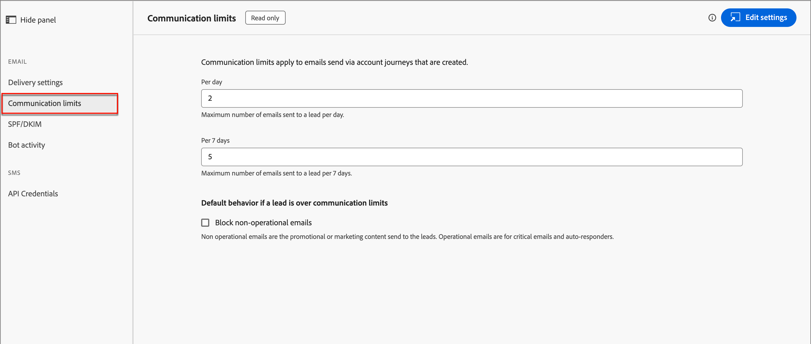

# メールチャネル設定

Adobe Journey Optimizer B2B editionは、Marketo Engageのチャネル関数とイベントトラッキングを活用します。 管理者は、マーケターに対してチャネル配信を有効にするために、配信とトラッキングの設定が適切に行われていることを確認する必要があります。 Marketo Engageを介したメール配信およびトラッキングに必要なプロトコルについては、[&#x200B; トラッキングとメール配信のプロトコル &#x200B;](../start/email-protocols.md) を参照してください。

## 配信設定

デフォルトのメール設定は、マーケターがアカウントジャーニーでメールを作成する際に使用されます。 メール配信設定を確認するには、**[!UICONTROL 管理]**/**[!UICONTROL チャネル]** に移動します。 ナビゲーションパネルの _[!UICONTROL メール]_ の下にある **[!UICONTROL 配信設定]** を選択します。

{width="800" zoomable="yes"}

これらの設定は、Journey Optimizer B2B editionでは読み取り専用です。 右上の **[!UICONTROL 設定を編集]** をクリックして、接続されたMarketo Engage インスタンスの設定オプションにアクセスします。

>[!NOTE]
>
>Adobe Marketo Engageのこれらの設定にアクセスして編集するには、製品管理者権限が必要です。

現在の設定をレビューするには、次の各タブを選択します。

### [!UICONTROL &#x200B; メールヘッダーパラメーター &#x200B;] {#email-header}

メールヘッダーパラメーターでは、次のデフォルト値を定義します。

* **[!UICONTROL 送信元メール]** - メールヘッダーの _送信元_ フィールドにリストされているメールアドレス。

* **[!UICONTROL 送信者ラベル]** - メール送信者アドレスの表示名。

* **[!UICONTROL 登録解除HTML]** – 操作以外のメールに表示されるHTML（サポートされているメールクライアント用）で、受信者に登録解除アクションを説明します。 このテキストとリンクが下部に追加されます。

* **[!UICONTROL 登録解除テキスト]** – 受信者に登録解除アクションを説明するために、操作以外のメールに表示されるプレーンテキストです。 このテキストとリンクが下部に追加されます。

* **[!UICONTROL web ページとして表示HTML]** - _web ページとして表示_ に使用されるHTML（サポートされているメールクライアント用）。ブラウザーにメールを表示するためのリンクを提供します。

* **[!UICONTROL Web ページテキストとして表示]** - _Web ページとして表示_ に使用されるプレーンテキスト。ブラウザーにメールを表示するためのリンクを提供します。

### [!UICONTROL &#x200B; ブランディングドメイン &#x200B;] {#branding-domains}

ブランディングドメインを確認するには、「**[!UICONTROL ブランディングドメイン]**」タブをクリックします。

{width="700" zoomable="yes"}

この設定は、接続されたMarketo Engage インスタンス内の 1 つ以上のワークスペースのプライマリドメインを定義します。 新しいメールではデフォルトとしてこのドメインが使用されますが、マーケターは [&#x200B; メールごとに上書き &#x200B;](../content/add-email.md#define-the-email-settings) できます。 デフォルトのブランディングドメインの定義について詳しくは、[Marketo Engage ドキュメント &#x200B;](https://experienceleague.adobe.com/ja/docs/marketo/using/product-docs/administration/email-setup/add-multiple-branding-domains/edit-your-default-branding-domain){target="_blank"} を参照してください。

>[!NOTE]
>
>複数のブランドをマーケティングし、それぞれに独自のブランドトラッキングリンクを設定する場合は、ブランディングドメインを追加できます。 複数のブランディングドメインの追加について詳しくは、[Marketo Engage ドキュメント &#x200B;](https://experienceleague.adobe.com/ja/docs/marketo/using/product-docs/administration/email-setup/add-multiple-branding-domains/add-an-additional-branding-domain){target="_blank"} を参照してください。

### [!UICONTROL &#x200B; カスタムヘッダーオプション &#x200B;] {#custom-header-options}

カスタムヘッダーオプションを確認するには、「**[!UICONTROL カスタムヘッダーオプション]**」タブをクリックします。

{width="700" zoomable="yes"}

_[!UICONTROL Strict Transport Security]_ が有効な場合は、トラッキングリンクが HTTPS 経由で提供されることが保証されます（SSL で保護されたトラッキングリンクを含むサブスクリプションの場合のみ）。

## 通信制限

通信の制限は、連絡先が組織から受信するメールの数を制御します。 設定した制限は、Journey Optimizer B2B editionと接続されたMarketo Engage インスタンスの間で共有されます。 これらの制限を設定すると、1 つのリードが一定期間に受信するメールの数が最大数を超えないようになります。

>[!AVAILABILITY]
>
>通信の制限は、[&#x200B; シンプルなアーキテクチャ &#x200B;](../simplified-architecture.md) でプロビジョニングされた Journey Optimizer B2B edition環境で使用できます。

例えば、1 日に 5 通のメールという制限を定義した場合、システムは 6 通目のメールを抑制することで、1 人の連絡先が 1 日で 6 通目のメールを受信しないようにしています。 Journey Optimizer B2B editionとMarketo Engageの間で共有される通信制限を使用すると、通信制限ルールが 1 か所で定義されます。 Journey Optimizer B2B editionまたはMarketo Engageからの送信アクションに関係なく、6 番目のメールは抑制されます。

すべてのMarketo Engage実稼動インスタンスには、デフォルトで通信制限が定義されています（詳しくは、[Marketo Engageのドキュメント &#x200B;](https://experienceleague.adobe.com/ja/docs/marketo/using/product-docs/administration/email-setup/enable-communication-limits){target="_blank"} を参照）。 共有通信制限を使用するには、Journey Optimizer B2B editionでルールを定義し、それらの制限の共有をMarketo Munchkin コードまで拡張します。

>[!IMPORTANT]
>
>通信規則セットをMarketo Munchkin コードに拡張する場合は、Adobe アカウント管理チームにお問い合わせください。 この設定は、通常、オンボーディングプロセスの一部です。

通信制限ルールを確認または設定するには、**[!UICONTROL 管理]**/**[!UICONTROL チャネル]** に移動します。 ナビゲーションパネルの _[!UICONTROL メール]_ の下にある **[!UICONTROL 通信の制限]** を選択します。

{width="700" zoomable="yes"}

デフォルトでは、グローバルルールセットがあり、必要に応じて複数のルールを定義、アクティブ化および非アクティブ化できます。 ルールセット名をクリックして、ルールリストを表示します。

### ルールの作成

1. 右上の **[!UICONTROL ルールを作成]** をクリックします。

   {width="600" zoomable="yes"}

1. **[!UICONTROL ルール名]** を入力します。

1. **[!UICONTROL キャッピング量]** を設定します。

   値を入力するか、右側の _上_ または _下_ 矢印をクリックして値を増減します。

1. 制限の期間を定義する方法に応じて、**[!UICONTROL キャッピング頻度をリセット]** 値を選択します。

   _[!UICONTROL 時間別]_、_[!UICONTROL 日別]_、_[!UICONTROL 週別]_、_[!UICONTROL 月別]_ から選択できます。

   {width="600" zoomable="yes"}

1. 期間に含める頻度単位の数に応じて、「**[!UICONTROL ごと]** の値を設定します。

   例えば、頻度として _毎日_ を使用し、この値を `3` に設定した場合、期間は 3 日と定義されます。

1. 右上の **[!UICONTROL ルールを作成]** をクリックします。

新しいルールは _ドラフト_ 状態であり、アクティブ化を選択するまで通信制限に適用されません。

### ルール管理

ルールが _ドラフト_ 状態にある限り、定義を編集したり、ルールを削除したりできます。 ルールを適用する場合は、そのルールをアクティブにします。 リストのドラフトルール名の横にある _その他メニュー_ （***...***）アイコンをクリックし、**[!UICONTROL アクティブ化]** を選択します。

{width="400" zoomable="yes"}

次に、確認ダイアログで **[!UICONTROL アクティブ化]** をクリックします。

アクティブなルールは編集または削除できず、非アクティブ化のみ可能です。 適用された通信制限から削除するアクティブなルールの場合、アクティブなルール名の横にある _非アクティブ化_ （）アイコンをクリックします。

{width="400" zoomable="yes"}

次に、確認ダイアログで **[!UICONTROL 非アクティブ化]** をクリックします。

ルールは「非アクティブ _ステータスで表示され_ す。 ドラフトルールに似ており、必要に応じて編集、削除またはアクティブ化できます。

## SPF/DKIM

SPF （Sender Policy Framework）とDKIM（Domain Keys Identified Mail）を DNS 設定に組み込むことで、メール配信率を向上させます。 これらのテクノロジーは、メールがスパムではないことを受信者に保証します。 受信者のスパムフィルターがメールを拒否しないようにするには、ドメインに SPF とDKIMが設定されていることを確認します。

現在の設定を確認するには、**[!UICONTROL 管理]**/**[!UICONTROL チャネル]** に移動します。 ナビゲーションパネルの _[!UICONTROL メール]_ の下で **[!UICONTROL SPF/DKIM]** を選択します。

{width="700" zoomable="yes"}

これらの設定は、Journey Optimizer B2B editionでは読み取り専用です。 右上の **[!UICONTROL 設定を編集]** をクリックして、接続されたMarketo Engage インスタンスの設定オプションにアクセスします。

>[!NOTE]
>
>Adobe Marketo Engageのこれらの設定にアクセスして編集するには、製品管理者権限が必要です。

### SPF 設定

ネットワーク管理者は、DNS エントリに次の行を追加する必要があります。

`[domain] IN TXT v=spf1 mx ip4:[corpIP] include:mktomail.com ~all`

このエントリでは、`[domain]` を web サイトのプライマリドメイン（`company.com` など）に、`[corpIP]` を企業のメールサーバーの IP アドレス（`255.255.255.255` など）に置き換えます。 Marketo Engageを通じて複数のドメインからメールを送信する場合、ドメインごとにこのエントリを 1 行に追加します。

DNS エントリに既に SPF レコードが存在する場合は、次を追加します。

`include:mktomail.com`

### DKIM設定

DKIMは、メール受信者がメールメッセージの送信者を検証するために使用する認証プロトコルです。 受信者はメッセージが偽造されたものではないと確信できるので、多くの場合、インボックスへのメールの配信品質が向上します。

DNS レコードに公開鍵があり、接続されたMarketo Engage インスタンスで送信側ドメインが有効になっている場合は、送信メッセージにカスタムDKIM署名が使用されます。 カスタム DKIM署名には、送信される各メールに暗号化されたデジタル署名が含まれます。 その後、受信者は、送信ドメインの DNS で _公開鍵_ を検索することで、デジタル署名を復号化できます。 メール内のキーが DNS レコード内のキーと一致する場合、受信側のメールサーバーはMarketo Engageを通じて送信されたメールを受け入れる可能性が高くなります。

メール配信用のカスタム DKIM署名の設定について詳しくは、[Marketo Engage ドキュメント &#x200B;](https://experienceleague.adobe.com/ja/docs/marketo/using/product-docs/email-marketing/deliverability/set-up-a-custom-dkim-signature){target="_blank"} を参照してください。

## ボットアクティビティ

メールボットアクティビティが、誤ってメールの開封やクリックデータを水増ししてしまう可能性があります。

Marketo Engageでは、ボットアクティビティの確認に次の 2 つの方法を使用します。

* **インタラクティブ Advertising ビューロー（IAB）リストとの一致** - IAB UA/IP （ユーザーエージェント/IP アドレス）リストのいずれかと一致するアクティビティは、ボットとしてマークされます。

* **近接パターンと一致** - 2 つ以上のアクティビティが同時に（1 秒以内に）発生した場合、それらのアクティビティはボットとして識別されます。 このメソッドでは、比較のために次の属性を考慮します。

   * リード ID（同じであること）
   * メールアセット（同じであること）
   * リンククリックまたはメール開封
   * 時間差（1 秒未満であること）

メールリンクのクリックとメールの開封アクティビティの場合、新しい属性には次の値が入力されます。

* ボットとして識別されたアクティビティには、識別されたパターンやメソッドとして _ボットアクティビティ_ `True`、および _ボットアクティビティパターン_ があります。
* ボットでないと識別されたアクティビティには、_ボットアクティビティ_ が `False` として、_ボットアクティビティパターン_ が `N/A` として含まれます。
* 属性が導入される前に発生するアクティビティでは、_ボットアクティビティ_ が空（null）として、_ボットアクティビティパターン_ が空（null）として設定されています

現在の設定を確認するには、**[!UICONTROL 管理]**/**[!UICONTROL チャネル]** に移動します。 ナビゲーションパネルの _[!UICONTROL メール]_ の下にある **[!UICONTROL ボットアクティビティ]** を選択します。

{width="700" zoomable="yes"}

これらの設定は、Journey Optimizer B2B editionでは読み取り専用です。 右上の **[!UICONTROL 設定を編集]** をクリックして、接続されたMarketo Engage インスタンスの設定オプションにアクセスします。

>[!NOTE]
>
>Adobe Marketo Engageのこれらの設定にアクセスして編集するには、製品管理者権限が必要です。

ボットアクティビティオプションの設定について詳しくは、[Marketo Engage ドキュメント &#x200B;](https://experienceleague.adobe.com/ja/docs/marketo/using/product-docs/administration/email-setup/filtering-email-bot-activity#select-filter-type){target="_blank"} を参照してください。
