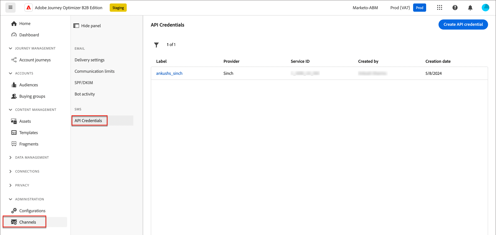

# SMS 設定

Adobe Journey Optimizer B2B editionは、SMS サービスプロバイダー（または SMS ゲートウェイプロバイダー）を通じてテキストメッセージを送信します。 SMS メッセージを作成する前に、_管理者_ 設定からサービスプロバイダーを設定します。

## SMS ゲートウェイサービスプロバイダー

Adobe Journey Optimizer B2B editionは現在、独立してテキストメッセージサービスを提供するサードパーティプロバイダーと統合されています。 テキストメッセージのサポートされているプロバイダーは、Sinch、Twilio および Infobip です。

Adobe Journey Optimizer B2B editionで SMS チャネルを設定する前に、これらのプロバイダーのいずれかでアカウントを作成して、API トークンとサービス ID を取得する必要があります。 これらの資格情報は、Adobe Journey Optimizer B2B editionと該当するプロバイダーとの接続を設定するために必要です。

>[!IMPORTANT]
>
>テキストメッセージサービスを使用した場合、該当するプロバイダーが定める追加の利用条件に同意したとみなされます。サードパーティのソリューションとして、Sinch、Twilio、Infobip は、Adobe Journey Optimizer B2B editionのユーザーが統合を通じて利用できます。 サードパーティ製品について、アドビは一切関係せず、責任も負いません。テキストメッセージサービス（SMS）に関する問題やサポートのリクエストについては、プロバイダーにお問い合わせください。

## 既存の SMS API 設定の検証

>[!NOTE]
>
>説明された設定は、SMS 管理者権限を持つユーザーのみがアクセスできます。

1. 左側のナビゲーションで、「**[!UICONTROL 管理者]**」セクションを展開し、「**[!UICONTROL チャネル]**」をクリックします。

   {width="800" zoomable="yes"}

1. ナビゲーションパネルで、「**[!UICONTROL API 資格情報]**」を選択します。

   このページには、お使いのインスタンスで使用可能な API 設定が一覧表示されます。

1. 必要に応じて、「_フィルター_」アイコン（）をクリックし、オプションを選択して、SMS サービスプロバイダーまたは作成者による設定済み API 資格情報のリストを表示します。

   {width="600" zoomable="yes"}

## SMS サービスプロバイダーの新しい API 資格情報の作成

>[!BEGINTABS]

>[!TAB  シンチ ]

Adobe Journey Optimizer B2B editionで Sinch を SMS プロバイダーとして設定するには（_T） :_

1. 左側のナビゲーションで、「**[!UICONTROL 管理者]**」セクションを展開し、「**[!UICONTROL 設定]**」をクリックします。

1. **[!UICONTROL API 資格情報]** リストの右上にある「_[!UICONTROL 新しい API 資格情報の作成]_ をクリックします。

1. SMS API 資格情報を設定します。

   {width="500"}

   * **[!UICONTROL SMS ベンダー]** - SMS プロバイダーとして「`Sinch`」を選択します。

   * **[!UICONTROL 名前]** - API 資格情報の名前を入力します。

   * **[!UICONTROL サービス ID]** および **[!UICONTROL API トークン]** - Sinch アカウントから API ページにアクセスします（資格情報は「SMS」タブで確認できます）。

   Sinch アカウントでこの情報を見つける方法について詳しくは、[Sinch 開発者向けドキュメント &#x200B;](https://developers.sinch.com/docs/sms/getting-started) を参照してください。

1. API 資格情報の設定の詳細が完了したら、「**[!UICONTROL 送信]**」をクリックします。

>[!TAB  ツイリオ ]

Adobe Journey Optimizer B2B editionで Twilio を SMS プロバイダーとして設定するには（_T） :_

1. 左側のナビゲーションで、「**[!UICONTROL 管理者]**」セクションを展開し、「**[!UICONTROL 設定]**」をクリックします。

1. **[!UICONTROL API 資格情報]** リストの右上にある「_[!UICONTROL 新しい API 資格情報の作成]_ をクリックします。

1. SMS API 資格情報を設定します。

   {width="500"}

   * **[!UICONTROL SMS ベンダー]** - SMS プロバイダーとして「`Twilio`」を選択します。

   * **[!UICONTROL 名前]** - API 資格情報定義の名前を入力します。

   * **[!UICONTROL アカウント SID]** および **[!UICONTROL 認証トークン]** - Twilio コンソールダッシュボードページの _アカウント情報_ パネルにアクセスして、資格情報を検索します。

   Twilio アカウントでこの情報を見つける方法については、[Twilio ヘルプセンター &#x200B;](https://help.twilio.com/articles/14726256820123-What-is-a-Twilio-Account-SID-and-where-can-I-find-it-) を参照してください。

1. API 資格情報の設定の詳細が完了したら、ページの右上にある「**[!UICONTROL 送信]**」をクリックします。

>[!TAB Infobip]

Adobe Journey Optimizer B2B editionで Infobip を SMS プロバイダーとして設定するには（_T） :_

1. 左側のナビゲーションで、「**[!UICONTROL 管理者]**」セクションを展開し、「**[!UICONTROL 設定]**」をクリックします。

1. **[!UICONTROL API 資格情報]** リストの右上にある「_[!UICONTROL 新しい API 資格情報の作成]_ をクリックします。

1. SMS API 資格情報を設定します。

   {width="500"}

   * **[!UICONTROL SMS ベンダー]** - SMS プロバイダーとして「`Infobip`」を選択します。

   * **[!UICONTROL 名前]** - API 資格情報定義の名前を入力します。

   * **[!UICONTROL API ベース URL]** および **[!UICONTROL API キー]** - Infobip アカウントの web インターフェイスのホームページまたは API キー管理ページにアクセスして、資格情報を検索します。

   お使いの Infobip アカウントでこの情報を見つける方法の詳細については、[Infobip のドキュメント &#x200B;](https://www.infobip.com/docs/api/_blank) を参照してください。

1. API 資格情報の設定の詳細が完了したら、ページの右上にある「**[!UICONTROL 送信]**」をクリックします。

>[!ENDTABS]

「_[!UICONTROL 送信]_」をクリックすると、資格情報が直ちに検証されて保存され、_[!UICONTROL API 資格情報]_ リストページにリダイレクトされます。 送信された資格情報が無効な場合は、リストページにエラーメッセージが表示されます。 この場合、設定をキャンセルするか、設定を更新して再度送信するかを選択できます。
