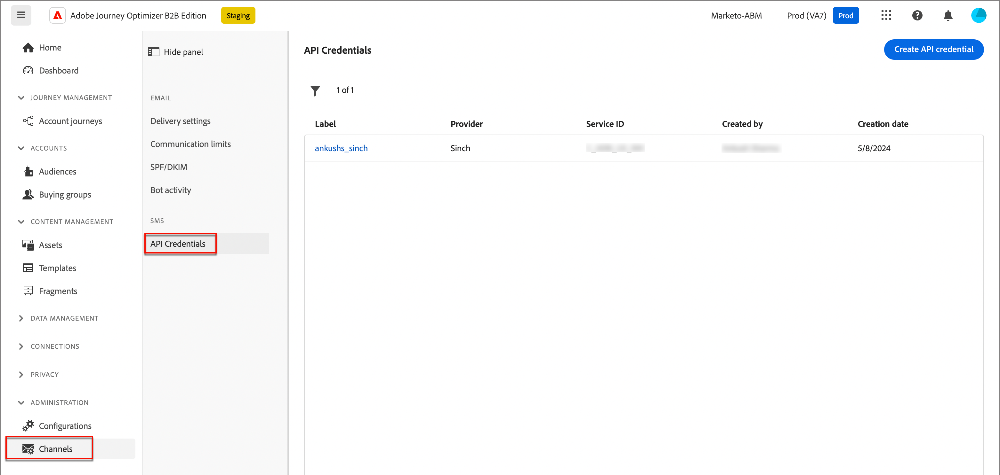
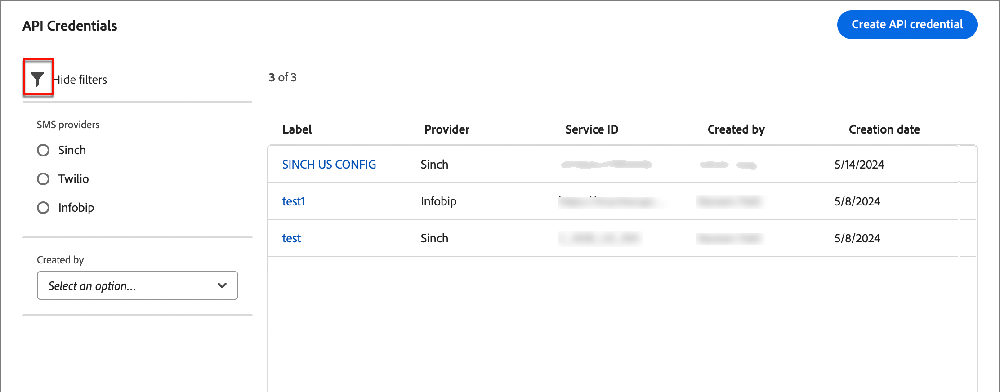
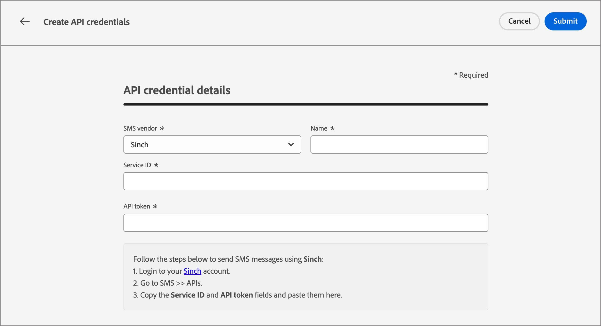
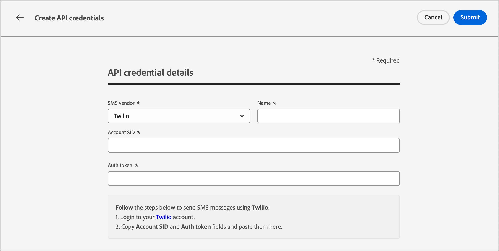

# SMS チャネル設定

Adobe Journey Optimizer B2B editionは、SMS サービスプロバイダー（またはSMS ゲートウェイプロバイダー）を介してテキストメッセージを送信します。 SMS メッセージを作成する前に、_管理者_&#x200B;設定からサービスプロバイダーを設定します。

## SMS ゲートウェイサービスプロバイダー

Adobe Journey Optimizer B2B editionは現在、テキストメッセージングサービスを独自に提供するサードパーティプロバイダーと統合されています。 テキストメッセージでサポートされるプロバイダーは、Sinch、Twilio、Infobipです。

Adobe Journey Optimizer B2B editionでSMS チャネルを設定する前に、API トークンとサービス IDを取得するには、これらのプロバイダーのいずれかを使用してアカウントを作成する必要があります。 これらの資格情報は、Adobe Journey Optimizer B2B editionと該当するプロバイダーとの間の接続を設定するために必要です。

>[!IMPORTANT]
>
>テキストメッセージサービスを使用した場合、該当するプロバイダーが定める追加の利用条件に同意したとみなされます。 サードパーティソリューションとして、Sinch、Twilio、Infobipは、Adobe Journey Optimizer B2B editionのユーザーが統合を通じて利用できます。 サードパーティ製品について、アドビは一切関係せず、責任も負いません。 テキストメッセージングサービス（SMS）に関連する問題やサポートのリクエストについては、プロバイダーにお問い合わせください。

## 既存のSMS API設定の検証

>[!NOTE]
>
>説明された設定は、SMS管理者権限を持つユーザーのみがアクセスできます。

1. 左側のナビゲーションで、**[!UICONTROL 管理]** セクションを展開し、**[!UICONTROL チャネル]**&#x200B;をクリックします。

   {width="800" zoomable="yes"}

1. ナビゲーションパネルで、**[!UICONTROL API資格情報]**&#x200B;を選択します。

   このページには、インスタンスで使用可能なAPI設定が一覧表示されます。

1. 必要に応じて、_フィルター_ アイコン（）をクリックし、オプションを選択して、SMS サービスプロバイダーまたは作成者が設定したAPI資格情報のリストを表示します。

   {width="600" zoomable="yes"}

## SMS サービスプロバイダーの新しいAPI資格情報の作成

>[!BEGINTABS]

>[!TAB  シンチ ]

_Adobe Journey Optimizer B2B editionを使用してSinchをSMS プロバイダーとして設定するには&#x200B;:_

1. 左側のナビゲーションで、**[!UICONTROL 管理者]** セクションを展開し、**[!UICONTROL 設定]**&#x200B;をクリックします。

1. _[!UICONTROL API資格情報]_ リストの右上にある「**[!UICONTROL 新しいAPI資格情報を作成]**」をクリックします。

1. SMS API 資格情報を設定します。

   {width="500"}

   * **[!UICONTROL SMS ベンダー]** - SMS プロバイダーとして`Sinch`を選択します。

   * **[!UICONTROL 名前]** - API資格情報の名前を入力します。

   * **[!UICONTROL サービス ID]**&#x200B;および&#x200B;**[!UICONTROL API トークン]** - Sinch アカウントからAPI ページにアクセスします（SMS タブで資格情報を確認できます）。

   Sinch アカウントでこの情報を見つける方法について詳しくは、[Sinch開発者ドキュメント ](https://developers.sinch.com/docs/sms/getting-started)を参照してください

1. API資格情報の設定の詳細が完了したら、**[!UICONTROL 送信]**&#x200B;をクリックします。

>[!TAB Twilio]

_Adobe Journey Optimizer B2B editionを使用してTwilioをSMS プロバイダーとして設定するには&#x200B;:_

1. 左側のナビゲーションで、**[!UICONTROL 管理者]** セクションを展開し、**[!UICONTROL 設定]**&#x200B;をクリックします。

1. _[!UICONTROL API資格情報]_ リストの右上にある「**[!UICONTROL 新しいAPI資格情報を作成]**」をクリックします。

1. SMS API 資格情報を設定します。

   {width="500"}

   * **[!UICONTROL SMS ベンダー]** - SMS プロバイダーとして`Twilio`を選択します。

   * **[!UICONTROL 名前]** - API資格情報定義の名前を入力します。

   * **[!UICONTROL アカウント SID]**&#x200B;と&#x200B;**[!UICONTROL 認証トークン]** - Twilio Console ダッシュボードページの&#x200B;_アカウント情報_ ペインにアクセスして、資格情報を検索します。

   Twilio アカウントでこの情報を見つける方法について詳しくは、[Twilio ヘルプセンター](https://help.twilio.com/articles/14726256820123-What-is-a-Twilio-Account-SID-and-where-can-I-find-it-)を参照してください。

1. API資格情報の設定の詳細が完了したら、ページの右上にある「**[!UICONTROL 送信]**」をクリックします。

>[!TAB Infobip]

_InfobipをAdobe Journey Optimizer B2B editionを使用したSMS プロバイダーとして設定するには&#x200B;:_

1. 左側のナビゲーションで、**[!UICONTROL 管理者]** セクションを展開し、**[!UICONTROL 設定]**&#x200B;をクリックします。

1. _[!UICONTROL API資格情報]_ リストの右上にある「**[!UICONTROL 新しいAPI資格情報を作成]**」をクリックします。

1. SMS API 資格情報を設定します。

   {width="500"}

   * **[!UICONTROL SMS ベンダー]** - SMS プロバイダーとして`Infobip`を選択します。

   * **[!UICONTROL 名前]** - API資格情報定義の名前を入力します。

   * **[!UICONTROL API ベース URL]**&#x200B;と&#x200B;**[!UICONTROL API キー]** - Web インターフェイスのホームページまたはInfobip アカウントのAPI キー管理ページにアクセスして、資格情報を検索します。

   お使いのInfobip アカウントでこの情報を見つける方法について詳しくは、[Infobip ドキュメント ](https://www.infobip.com/docs/api/_blank)を参照してください。

1. API資格情報の設定の詳細が完了したら、ページの右上にある「**[!UICONTROL 送信]**」をクリックします。

>[!ENDTABS]

_[!UICONTROL 送信]_&#x200B;をクリックすると、資格情報はすぐに検証および保存され、_[!UICONTROL API資格情報]_&#x200B;の一覧ページにリダイレクトされます。 送信された資格情報が無効な場合、リストページにエラーメッセージが表示されます。 この場合、設定をキャンセルするか、更新して再送信するかを選択できます。
