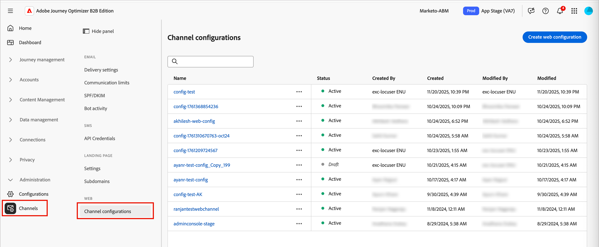
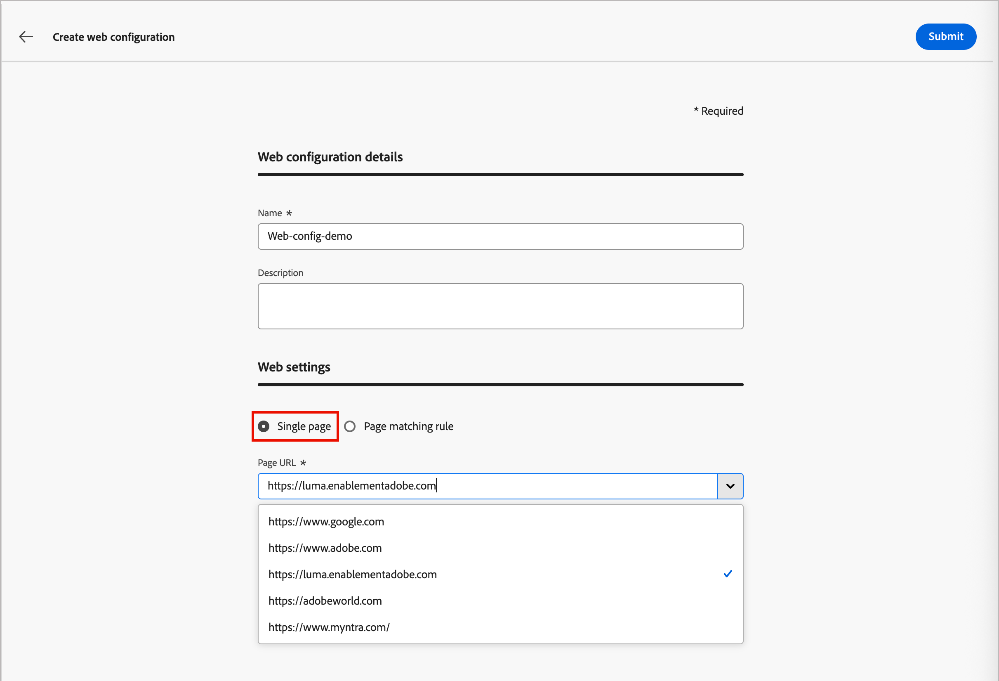
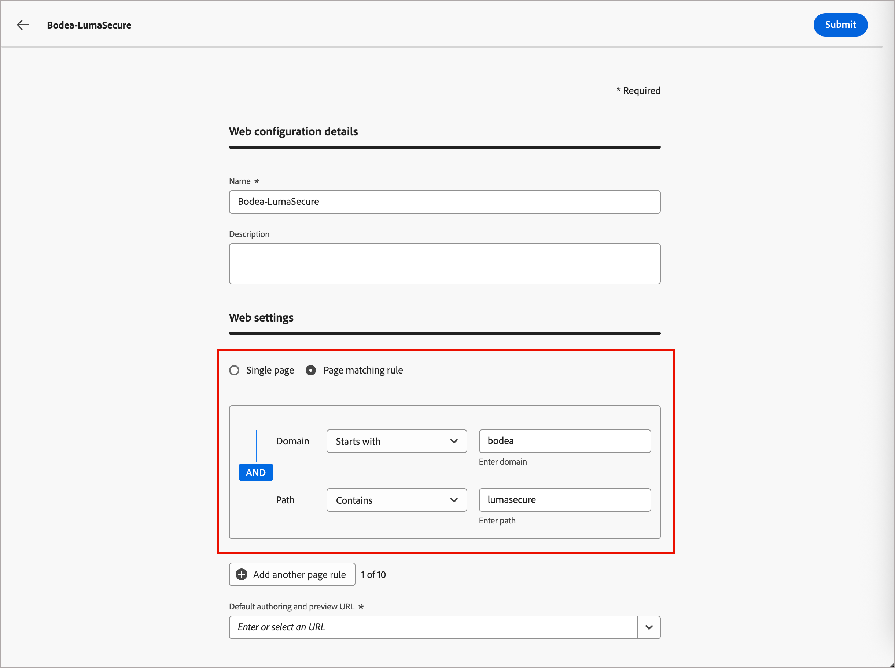
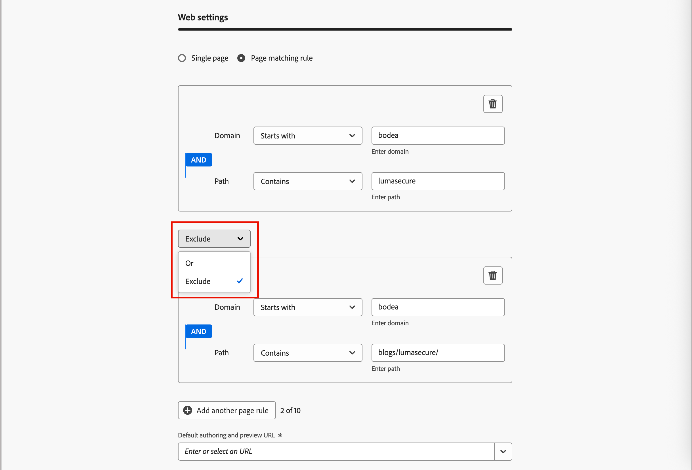
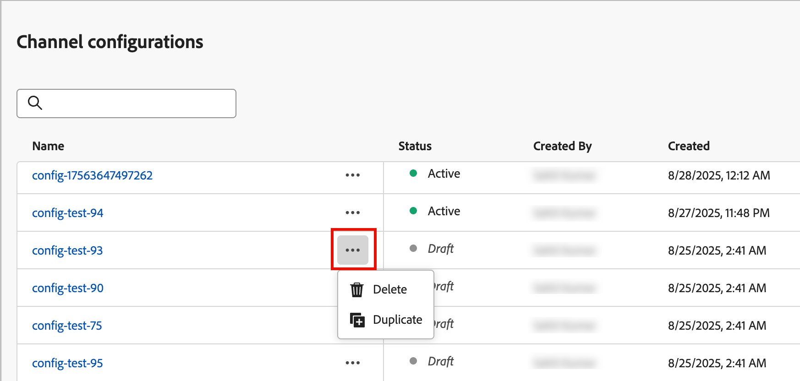

# web チャネル設定

Web設定は、コンテンツが配信されるURLによって識別されるweb プロパティです。 1つのページ URLまたは複数のページを一致させることで、web エクスペリエンスが1つまたは複数のweb ページに変更を適用できるようにします。 これらの設定は、マーケターがジャーニー[&#128279;](../content/web-experiences.md#create-a-web-experience)にweb パーソナライゼーションアクションノードを追加し、キャンペーンの[&#x200B; エクスペリエンスの変更](../content/web-experience-design.md)をデザインするために必要です。

>[!BEGINSHADEBOX]

**前提条件**

Web チャネルを使用するには、訪問者の特定とコンテンツ配信のために[Adobe Experience Platform Web SDK](https://experienceleague.adobe.com/en/docs/experience-platform/collection/js/js-overview) （`alloy.js`）が実装されている必要があります。 Adobe Experience Platform Web SDKのバージョンが2.16以降であることを確認します。

Journey Optimizer B2B editionのweb チャネル設定には、次の[権限](../admin/user-management.md#b2b-product-permissions)が必要です。

* _[!UICONTROL チャネル設定]_ > _[!UICONTROL メッセージプリセットの管理]_ - web チャネル設定の作成、更新、削除に必要です。
* _[!UICONTROL チャネル設定]_ > _[!UICONTROL メッセージプリセットの表示]_ - web チャネル設定の表示に必要です。

>[!ENDSHADEBOX]

## Web チャネル設定の作成

1. 左側のナビゲーションで、**[!UICONTROL 管理]** > **[!UICONTROL チャネル]**&#x200B;に移動します。

1. ナビゲーションパネルの&#x200B;_[!UICONTROL Web]_&#x200B;で、**[!UICONTROL チャネル設定]**&#x200B;を選択します。

   {width="800" zoomable="yes"}

1. 右上の「**[!UICONTROL チャネル設定を作成]**」をクリックします。

1. 設定に「**[!UICONTROL 名前]**」（必須）と「**[!UICONTROL 説明]**」（オプション）を入力します。

   >[!NOTE]
   >
   >名前は文字（A ～ Z）で始める必要があり、英数字のみを含めることができます。 アンダースコア `_`、ドット `.`、ハイフン `-`文字も使用できます。

1. 「**[!UICONTROL Web 設定]**」セクションで、次のいずれかのオプションを選択します。

   * **[!UICONTROL 単一ページ]** – 変更を単一ページにのみ適用する場合は、**[!UICONTROL ページ URL]**&#x200B;を入力または選択します。

     {width="600" zoomable="yes"}

   * **[!UICONTROL ページ一致ルール]** – 同じルールに一致する複数のURLをターゲットにするには、[&#x200B; ページ一致ルール &#x200B;](#build-a-pages-matching-rule)を作成し、**[!UICONTROL デフォルトのオーサリングおよびプレビューURL]**&#x200B;を入力します。

1. 「**[!UICONTROL 送信]**」をクリックして変更を保存します。

設定を保存すると、_ドラフト_&#x200B;の状態になり、マーケターがジャーニーでweb チャネルを使用する際に利用できるようになります。 設定がドラフト状態のままである限り、引き続き設定を編集できます。 _詳細_ アイコン （**...**）をクリックして、ドラフト web チャネル設定を削除することもできます 名前の横にある&#x200B;**[!UICONTROL 削除]**&#x200B;を選択します。

Web チャネルがジャーニーで使用されるとすぐに、_アクティブ_ ステータスに移動します。 この状態では、設定の名前と説明を編集できます。 Web設定を変更したり、設定を削除したりすることはできません。

## ルールに一致するページ {#pages-matching-rule}

Web設定を作成する際に、ルール _に一致する_ ページを作成して、同じルールに一致する複数のURLをターゲットにすることができます。 これらのルールにより、複数のページに同じコンテンツ変更を適用できます。

例えば、web サイト全体でヒーローバナーに変更を適用したり、すべての製品ページに表示されるトップ画像を追加したりすることができます。

### ルールの作成

1. Web チャネル設定[&#128279;](#create-a-web-channel-configuration)を作成する場合は、**[!UICONTROL 一致するルール]**&#x200B;のページを選択します。

1. 各セクションの異なる演算子を使用して、**[!UICONTROL ドメイン]**&#x200B;および&#x200B;**[!UICONTROL ページ]** フィールドの条件を定義し、ルールを構築します。

   +++ドメイン演算子

   入力した文字列値に従ってドメインを照合するには、次の演算子を使用します。

   | 演算子 | 説明 | 例 |
   | --- | --- | --- |
   | [!UICONTROL 次と等しい] | ドメインの完全一致。 | |
   | [!UICONTROL が]で始まります | 入力した文字列で始まるすべてのドメイン（サブドメインを含む）と一致します。 | `Starts with: dev`は、`dev.example.com`、`dev.products.example.com`、`developer.example.com`など、`dev`で始まるすべてのドメインとサブドメインに一致します |
   | [!UICONTROL が]で終了 | 入力された文字列で終わるすべてのドメイン（サブドメインを含む）と一致します。 | `Ends with: example.com`は、`stage.example.com`、`prod.example.com`、`myexample.com`など、`example.com`で終わるすべてのドメインとサブドメインに一致します |
   | [!UICONTROL 一致するワイルドカード &#x200B;] | 文字列の中央にワイルドカード一致（`dev.*.example.com`など）を定義できます。 検証ルールでは、演算子が&#x200B;_ワイルドカードに一致する_&#x200B;場合、値に1つだけのワイルドカード（アスタリスク）が含まれている必要があります。 | `Wildcard matching: dev.*.example.com`は、`dev.products.example.com`、`dev.mytest.products.example.com`、`dev.blog.example.com`などのドメインに一致します |
   | [!UICONTROL Any] | すべてのドメインに一致します。 ドメイン間で特定のパスをテストする場合に便利です。 | |

   +++

   +++パス演算子

   入力した文字列値に従ってパスを一致させるには、次の演算子を使用します。

   | 演算子 | 説明 | 例 |
   | --- | --- | --- |
   | [!UICONTROL 次と等しい] | パスの完全一致。 | |
   | [!UICONTROL が]で始まります | 文字列で始まるすべてのパス（サブパスを含む）と一致します。 | |
   | [!UICONTROL が]で終了 | 文字列で終わるすべてのパス（サブパスを含む）と一致します。 | |
   | [!UICONTROL Any] | すべてのパスに一致します。 これは、1つまたは複数のドメインのすべてのパスをターゲットにする場合に便利です。 | |
   | [!UICONTROL 一致するワイルドカード &#x200B;] | パス内の内部ワイルドカード（`/products/*/detail`など）を定義できます。 パスコンポーネント内のワイルドカード文字`*`は、最初の`/`文字までの任意の文字シーケンスと一致します。  `/*/`は、任意の文字シーケンス（サブパスを含む）と一致します。 | `Wildcard matching: /products/*/detail`は、`example.com/products/yoga/detail`、`example.com/products/surf/detail`、`example.com/products/tennis/detail`、`example.com/products/yoga/pants/detail`などのパスに一致します |
   | [!UICONTROL 次を含む] | 値は`*mystring*`などのワイルドカードに変換され、文字シーケンスを含むすべてのパスに一致します。 | `Contains: product`は、`example.com/products`、`example.com/yoga/perfproduct`、`example.com/surf/productdescription`、`example.com/home/product/page`など、文字列`product`を含むすべてのパスに一致します |

   +++

   例えば、_Bodea_ web サイトのすべての&#x200B;_LumaSecure_ ソリューションページでコンテンツの変更をサポートするには、**[!UICONTROL ドメイン]** > **[!UICONTROL で始まる]** > `bodea`と&#x200B;**[!UICONTROL ページ]** > **[!UICONTROL 含む]** > `lumasecure`を選択します。

   {width="600" zoomable="yes"}

1. ユースケースで複数のルールが必要な場合は、**[!UICONTROL 別のページルールを追加]**&#x200B;をクリックし、前の手順を繰り返します。

   * 最大10個のルールを定義できます。

   * 異なるルール間で&#x200B;**[!UICONTROL Or]**&#x200B;または&#x200B;**[!UICONTROL Exclude]**&#x200B;演算子を使用します。

     _[!UICONTROL または]_&#x200B;は、複数のルールを定義するための既定の演算子であり、一致させる複数の条件定義を追加するのに便利です。

     _[!UICONTROL 除外]_&#x200B;は、定義されたルールに一致するページの1つをターゲットにしない場合に便利です。 例えば、`lumasecure`を含むが、ブログページ（`bodea.com/blogs/lumasecure/latest-release`など）を除外するすべての`bodea.com` ページをターゲットにできます。

   除外{width="600" zoomable="yes"}のルールに一致する ページ

1. **[!UICONTROL デフォルトのオーサリングおよびプレビュー URL]** を入力します。

   この手順により、ルールによって生成または一致するページに、web エクスペリエンスコンテンツのデザインとプレビューの両方の目的で指定されたURLが割り当てられます。

## Web チャネルの複製

既存のweb チャネル設定を複製し、それを変更して、既存のweb チャネルに基づいて新しいweb チャネルを作成できます。 ライブラリに保存されているアクティブなweb チャネル設定は変更できません。

1. _詳細メニュー_ アイコン （**...**）をクリックします バリエーションを選択し、**[!UICONTROL 複製]**&#x200B;を選択します。

   {width="450"}

   このアクションは、名前に`_Copy_nnn`が追加された重複したweb チャネルを作成します。

1. 複製されたweb チャネルの名前をクリックして、パラメーターを編集します。

   * ルールの目的または項目に一致するように、名前と説明を変更します。
   * 必要に応じて、単一ページのURLを変更します。
   * 必要に応じて、ルールに一致するページを変更します。

1. 設定が完了したら、**[!UICONTROL 送信]**&#x200B;をクリックします。
