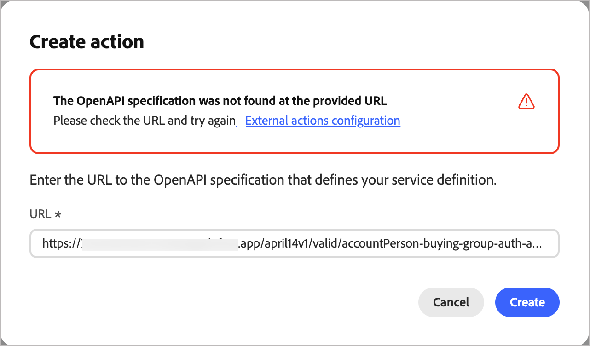

# 外部アクションの設定

外部対応により、Journey Optimizer B2B editionのアカウントジャーニーは、ジャーニーキャンバスから直接、外部システムと接続できます。 アカウントオーディエンスが外部アクションノードに到達すると、システムは設定された外部サービスに対して非同期発信コールを行い、アカウント、人物、またはその両方のオーディエンス属性データを渡します。 外部サービスは、データを処理し、コールバックを使用して応答し、ジャーニーの実行を導くために使用できるオーディエンスデータとメタデータを返します。

この機能では、次の2つのジャーニーノードタイプをサポートしています。

* **外部アクション** – 外部サービスを呼び出し、1つの送信パスに沿って続行します。 CRM レコードの更新や下流の通知のトリガーなど、_火災と忘れ_&#x200B;の統合に最適です。
* **外部分割パス** – 外部サービスを呼び出し、定義された複数のパスのいずれかに沿ってアカウントをルーティングするために応答を評価します。

>[!NOTE]
>
>外部アクションサービスは、アカウントジャーニーでのみサポートされます。 これらのノードタイプは、個人ジャーニーでは使用できません。

## 導入の概要

外部活動を設定するには、3つの役割をまたいで順番に調整する必要があります。

| | 役割 | タスク |
| ---- | ---- | ---- |
| 1 | 開発者 | [外部サービスを実装して公開](#implement-service) |
| 2 | 管理者 | [Journey Optimizer B2B editionでアクションを設定](#configure-action) |
| 3 | マーケター | [ アカウントジャーニーに外部ノードを追加](#add-journey-node) |

## 外部サービスの実装 {#implement-service}

開発者は、[Adobe Journey Optimizer B2B editionの外部アクションサービスプロバイダーインターフェイス ](https://developer.adobe.com/journey-optimizer-b2b-apis/)に準拠した公開Web サービスを作成して公開する必要があります。

>[!NOTE]
>
>コールバック関数にはベアラートークンが必要です。 これを取得するには、IMS組織用にAdobe Developer Console](https://developer.adobe.com/developer-console/docs/guides/authentication/ServerToServerAuthentication/implementation)で[OAuth サーバー間の資格情報を設定します。

サービスが公開されたら、OpenAPI仕様のURLと認証情報を、アクションの設定を担当する製品管理者に提供します。

## アクションの設定 {#configure-action}

アクションは、マーケターがジャーニーで使用できるようにするために、設定し、アクティベートする必要があります。 アクションは&#x200B;_ドラフト_&#x200B;状態で作成され、変更は自動的に保存されます。 アクティベートするまでドラフトとして残ります。

>[!PREREQUISITES]
>
>設定を追加する前に、開発者からOpenAPI仕様のURLと認証情報を取得します。
>
>外部アクションを定義してアクティブ化するには、_[!UICONTROL B2B管理設定の管理]_ [製品権限](./user-management.md#b2b-product-permissions)が必要です。

1. **[!UICONTROL 管理]** > **[!UICONTROL 設定]**&#x200B;に移動します。

1. 中間パネルで「**[!UICONTROL 外部アクション]**」をクリックします。

   {width="800" zoomable="yes"}

1. 右上の「**[!UICONTROL アクションを作成]**」をクリックします。

1. 外部サービスのOpenAPI仕様のURLを入力し、**[!UICONTROL 作成]**&#x200B;をクリックします。

   {width="500"}

   このステップを成功させるには、外部サービスがライブで到達可能である必要があります。 検証エラーがある場合、ダイアログには、エラーを説明するメッセージと、そのエラーを解決するための提案が表示されます。 詳しくは、[_トラブルシューティング_](#troubleshooting)&#x200B;を参照してください。

1. URLが正常に解決したら、**[!UICONTROL サービスの詳細]**&#x200B;を確認します。

   サービスの詳細は、アクションの作成時にOpenAPI仕様から直接読み取られます。 作成後に設定でこれらのプロパティを変更することはできません。

   | プロパティ | 説明 | OpenAPI仕様プロパティ |
   | -------- | ----------- | --------------------- |
   | [!UICONTROL 名前] | アクションの名前 | `info.title` |
   | [!UICONTROL 説明] | アクションの説明 | `info.description` |
   | [!UICONTROL URL] | 外部サービスを定義するOpenAPI仕様へのURL | `servers.url` |

1. 外部サービス （`components.securitySchemes`）の&#x200B;**[!UICONTROL 認証]**&#x200B;資格情報を入力します。

   >[!NOTE]
   >
   >表示される資格情報フィールドは、外部サービスで定義された認証メカニズムによって異なります。 サポートされているタイプは、API キー、OAuth2、およびHTTP Basic認証です。

   {width="600" zoomable="yes"}

   設定されたアクションが&#x200B;_ドラフト_&#x200B;または&#x200B;_アクティブ_&#x200B;の状態にある場合、必要に応じて資格情報を変更できます。

1. 「**[!UICONTROL 次へ]**」をクリックします。

1. アクションが外部サービスとデータを交換する方法を定義するには、**[!UICONTROL 設定]** プロパティを設定します。

   >[!NOTE]
   >
   >_静的_&#x200B;としてマークされたプロパティは、設定時に更新できず、サービス定義に基づいています。

   * **[!UICONTROL アクションの種類]** （_静的_） – サポートされているジャーニーノードの種類：

      * [!UICONTROL 外部アクション ] （`enableSplitPath` = false）
      * [!UICONTROL 外部アクション分割パス ] （`enableSplitPath` = true）

     アクション設定の作成後にアクションタイプを変更することはできません。

   * **[!UICONTROL アクセサー]** （_静的_） – （外部アクション分割パスのみ）外部サービスによって返される変数は、外部スプリットパスノードのパス条件として使用できます。 (`invocationPayloadDef.accessorsMetadata`)

   * **[!UICONTROL ジャーニーコンテキスト]** （_静的_） – リクエストで送信されたオーディエンスデータの範囲（`supportedEntityType`）:

      * [!UICONTROL  アカウント ] - アカウントのみを送信

      * [!UICONTROL 人物] – 人物のみを送信

      * [!UICONTROL  アカウントのユーザー] - アカウントおよびアカウント関連のユーザーを送信します

   * **[!UICONTROL 送信フィールド]** - テーブル内の各フィールドを[XDM フィールド ](../admin/xdm-field-management.md)にマッピングします。 これらのフィールドは、リクエスト本文で外部サービスに送信されます。 サービス定義プロパティ：`invocationPayloadDef.accountFields`、`invocationPayloadDef.fields`。

     {width="600" zoomable="yes"}

   * **[!UICONTROL 受信フィールド]** - テーブル内の各フィールドを[更新可能なXDM フィールド ](../admin/xdm-field-management.md#updatable-fields)にマッピングします。 これらのフィールドは、外部サービス応答から入力されます。 サービス定義プロパティ：`callbackPayloadDef.accountFields`、`callbackPayloadDef.fields`。 作成後に更新可能。

   * **[!UICONTROL ヘッダーパラメーター]** - リクエストでHTTP ヘッダーとして渡す各行の値を入力します。 サービス定義プロパティ：`invocationPayloadDef.headers`。

   * **[!UICONTROL タイムアウト]** - リクエストが失敗したと見なされるまでのコールバックを外部サービスが呼び出すのを待つ時間を分単位で入力します。 サービス定義プロパティ：`timeout`。

   * **[!UICONTROL グローバル属性]** - リクエスト本文に静的フィールドとして含める各行の値を入力します。 サービス定義プロパティ：`invocationPayloadDef.globalAttributes`。

     {width="600" zoomable="yes"}

1. _戻る矢印_&#x200B;をクリックしてリストに戻り、アクションを&#x200B;_ドラフト_&#x200B;状態に保ちます。

   または、**[!UICONTROL アクティブ化]**&#x200B;をクリックして、アクション設定を&#x200B;_アクティブ_&#x200B;状態に変更します。 設定された外部アクションは、アカウントジャーニーで使用できるようにするためにアクティブである必要があります。

### トラブルシューティング {#troubleshooting}

外部サービスのOpenAPI仕様にURLを入力し、**[!UICONTROL Create]**&#x200B;をクリックすると、システムはサービスの検証を実行します。 エラーが発生すると、ダイアログにエラーを説明するメッセージが表示されます。

{width="600" zoomable="yes"}

>[!NOTE]
>
>次の多くのエラーを解決するには、公開Web サービスを作成および公開した開発者と協力する必要があります。

#### 検証エラーの詳細

| 表示されるエラー | なぜそうなったのか | 今後の施策 |
|---|---|---|
| `This URL is already used by another external action` | この仕様URLは、既に組織内の別のアクションに登録されています。 | 別の仕様URLを使用するか、既に使用している既存のアクションを削除します。 |
| `An action with this name already exists` | スペックの`info.title`は、既に存在するアクションと一致します | スペックの`info.title` フィールドのタイトルをユニークなものに変更します。 |
| `Duplicate operation ID found in the specification` | スペック内の2つ以上の操作が同じ`operationId`を共有しています。 | すべての操作に一意の`operationId`を付与します。 |
| `Field in the specification exceeds the maximum allowed length` | スペックのテキストフィールド（タイトルや説明など）が長すぎます。 | フラグが設定されているフィールドを短くします。 |
| `The entity type value is invalid` | エンティティ型のAdobe固有の`x-`拡張機能に認識されない値があります | エンティティの種類をサポートされている値に修正します。 有効なオプションについては、[開発者ドキュメント ](https://developer.adobe.com/journey-optimizer-b2b-apis/)を参照してください。 |
| `The provided document is not a valid OpenAPI specification` | 仕様は構造的に解析できません。 | OpenAPI 3.0 スキーマに対して仕様を検証し、問題を修正します。 |
| `Required OpenAPI field is missing` | 標準のOpenAPI必須フィールドがありません（`info`または`paths`など）。 | 見つからないフィールドを追加します。 |
| `Required endpoint is missing from the specification` | Adobe Journey Optimizer B2B editionに必要なエンドポイントが、仕様で定義されていません。 | 必要なエンドポイントを追加します。 エンドポイントが必要な場合は、[開発者ドキュメント ](https://developer.adobe.com/journey-optimizer-b2b-apis/)を参照してください。 |
| `Required extension field is missing` | 必要なAdobe `x-`拡張機能フィールドがスペックにありません。 | ドキュメントの説明に従って、不足している拡張機能フィールドを追加します。 |
| `Security schemes are missing from the specification` | 仕様には`components`で定義された`securitySchemes`がありません。 | 少なくとも1つのセキュリティスキームを定義します。 |
| `Multiple authentication types are not supported` | 仕様で複数の認証スキームが定義されています。 | 1つの認証タイプを使用するようにスペックを更新します。 |
| `The authentication type is not supported` | 使用したセキュリティスキームの種類（`oauth2`や`openIdConnect`など）はサポートされていません。 | サポートされている認証タイプに切り替えます。 サポートされているオプションについては、開発者ドキュメントを参照してください。 |
| `The OpenAPI version is not supported` | 仕様レベルでのバージョンの不一致 | OpenAPI 3.0.xを使用するように仕様を更新します。 |
| `An unexpected error occurred` | 仕様に未分類の問題が見つかりました。 | スペックに異常がないか確認し、再度試してください。 エラーが解決しない場合は、サポートにお問い合わせください。 |

<!--
## Errors you'll see if something goes wrong with the request itself

This error appears below the URL field (not in the alert banner) and means there was a network problem or an unexpected server response — not a problem with your URL or spec.

| What you'll see | Why it happened | What to do |
|---|---|---|
| `Failed to create external action. Please try again.` | A network error occurred or the server returned an unexpected response | Check your connection and try again. If it keeps happening, contact support |
-->

## ジャーニーへの外部ノードの追加 {#add-journey-node}

アクションがアクティブ化されると、マーケターは&#x200B;_[!UICONTROL 外部アクション]_&#x200B;または&#x200B;_[!UICONTROL 外部分割パス]_ ノードを任意のアカウントジャーニーに追加できます。 アカウントジャーニーキャンバスでこれらのノードを追加および使用する方法について詳しくは、[外部ノード ](../journeys/external-nodes.md)を参照してください。
