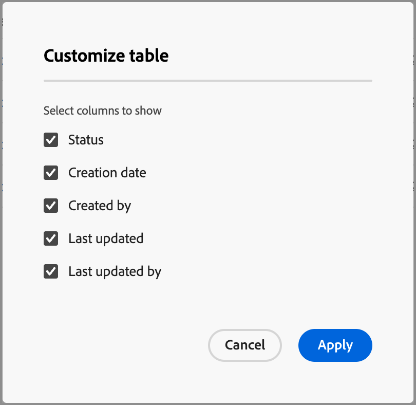
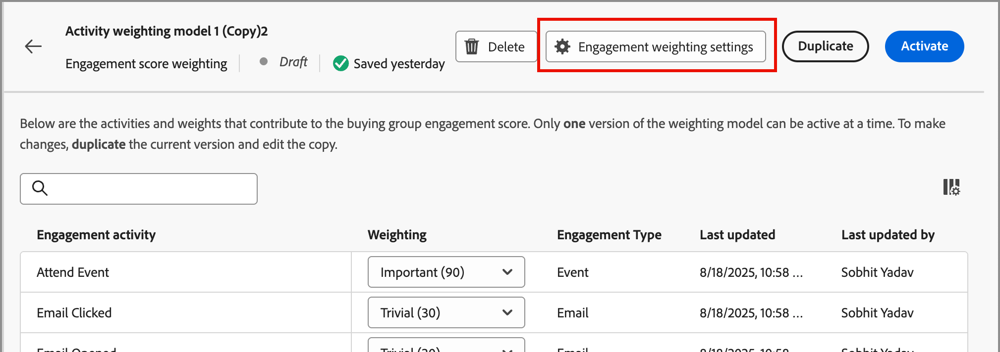
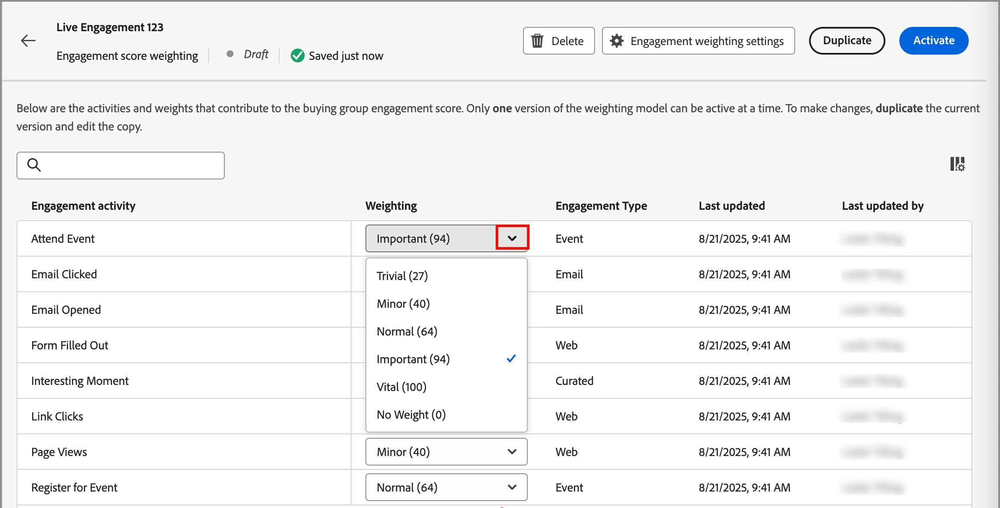

# カスタムエンゲージメントスコアの重み付けを設定

[購買グループのエンゲージメントスコア &#x200B;](../buying-groups/engagement-scores.md)は、購買グループのメンバーに対して記録されたさまざまなアクティビティを評価することで、エンゲージメントのレベルを反映します。 カスタムスコアの重み付けを利用すれば、マーケティングオペレーションチームはアクティビティの重み付けのために独自のモデルを柔軟に定義できます。 カスタムスコアリングモデルでは、セールスプロセスにおける購買意欲を最も正確に示す行動を優先することで、パイプラインをより正確に反映します。

管理者は、組織に対して複数のエンゲージメントスコアモデルを定義できますが、一度にアクティブにできるモデルは1つだけです。 各エンゲージメントスコアリングアクティビティに適用される重みに応じて、スコアモデルを定義します。

>[!PREREQUISITES]
>
>エンゲージメントスコアの重み付けモデルを定義してアクティブ化するには、_[!UICONTROL B2B管理設定の管理]_ [製品権限](./user-management.md#b2b-product-permissions)が必要です。

## エンゲージメントスコアの重み付けモデルへのアクセス

アクティブなモデル、ドラフトおよびアーカイブされたモデルを表示するには、_[!UICONTROL エンゲージメントスコアの重み付け]_ リストを開きます。

1. 左側のナビゲーションで、**[!UICONTROL 管理]** > **[!UICONTROL 設定]**&#x200B;を選択します。

1. 中間パネルの&#x200B;**[!UICONTROL エンゲージメントスコアの重み付け]**&#x200B;をクリックして、スコアリングモデルのリストを表示します。

   このページから、[&#x200B; エンゲージメントスコアモデルを作成（複製） &#x200B;](#create-an-engagement-score-model)、[&#x200B; アクティブ化](#activate-a-score-model)、[編集](#change-the-engagement-weighting-settings)できます。

   {width="800" zoomable="yes"}

   リストには、最近更新されたモデルが上部に表示され（_[!UICONTROL 最終更新日]_&#x200B;で並べ替え）、_[!UICONTROL 名前]_&#x200B;で検索する機能が含まれています。

   右上隅の&#x200B;_列設定_ （）アイコンをクリックして、列のチェックボックスを選択またはクリアすると、表示されるテーブルをカスタマイズできます。

   エンゲージメントスコアの重み付けリストに表示する{width="300"}

1. エンゲージメントスコアモデルの詳細にアクセスするには、名前をクリックします。

### デフォルトのスコアモデル

_アクティビティの重み付けモデル 1_&#x200B;という名前の初期エンゲージメントスコアモデルが作成されます。 エンゲージメントアクティビティは、標準およびカスタムのExperience Platform イベントに基づいています。 すべてのアクティビティの重みは、デフォルトでは0です。

{width="600" zoomable="yes"}

<!-- **Standard architecture (legacy)** - If your environment still uses the standard architecture, the connected [!DNL Marketo Engage] instance is the source for the engagement activity data. The default model is active until you create a custom version and activate it. -->

<!-- {width="600" zoomable="yes"} -->

カスタムモデルをアクティブ化すると、アクティブなモデルは&#x200B;_アーカイブ_ ステータスに変わります。 デフォルトのエンゲージメントスコアモデルに戻す場合は、元のデフォルトモデルを複製してからアクティブにするか、別のカスタムモデルの出発点として使用します。

### ドラフトモデルの削除

今後アクティブ化しない場合は、ドラフトエンゲージメントスコアモデルを削除できます。 リスト内のドラフトスコアモデル名の横にある&#x200B;_詳細メニュー_ （***...***）アイコンをクリックし、**[!UICONTROL 削除]**&#x200B;を選択します。

{width="350"}

確認ダイアログで、「**[!UICONTROL 削除]**」をクリックします。

## カスタムエンゲージメントスコアリングモデルを作成

カスタムエンゲージメントスコアモデルを作成するには、デフォルトモデルまたは作成済みの別のカスタムモデルを複製します。 現在の&#x200B;_アクティブ_ モデル、_ドラフト_ モデル、または&#x200B;_アーカイブ_ モデルを複製できます。 次に、ニーズに応じて複製モデルを編集します。

1. モデル名をクリックしてモデルの詳細ページを開き、右上の「**[!UICONTROL 複製]**」をクリックします。

   {width="600" zoomable="yes"}

   リスト内のスコアモデル名の横にある&#x200B;_詳細メニュー_ （***...***）アイコンをクリックして、**[!UICONTROL 重複]**&#x200B;を選択することもできます。

   {width="325"}

1. _複製_ ダイアログで、複製されたモデルの一意の名前を入力し、**[!UICONTROL 複製]**&#x200B;をクリックします。

   {width="500"}

   複製されたモデルは、_ドラフト_&#x200B;のステータスでリストに表示されます。 名前をクリックしてスコアモデルの詳細を開き、変更を加えます。

### エンゲージメントの重み付けの設定の変更

重み付け設定は、モデル内の各アクティビティに割り当てることができるバンドを定義します。 ブランドは、エンゲージメントを評価するための組織の戦略を反映するように変更できます。 例えば、通常のアクティビティに高い値を割り当てる場合、_標準_&#x200B;の重み付けバンドを65に調整できます。 または、_標準_&#x200B;から&#x200B;_重要_&#x200B;までのアクティビティをキャプチャするように設計された重み付けバンドを追加できます。 この場合、バンドを追加して&#x200B;_Significant_&#x200B;としてラベル付けし、ウェイト バンドの値を75に割り当てることができます。

1. スコアモデルの詳細ページで、上部の「**[!UICONTROL エンゲージメントの重み設定]**」をクリックします。

   {width="600" zoomable="yes"}

1. それぞれのウェイト バンドについて、必要に応じて名前または値を調整します。

   * 「_[!UICONTROL 重み付けバンド]_」フィールドの名前を変更します。
   * 新しい値を入力します。 **&plus;**&#x200B;または&#x200B;**−**&#x200B;をクリックして、値を増減することもできます。

   {width="500"}

1. 必要に応じて、別の重み付けバンドを追加します。

   リストの下部にある「**[!UICONTROL + ウェイト バンドを追加]**」をクリックします。 このアクションは、リストの下部に空白の重み付け帯を挿入します。

   名前を入力し、バンドの値を設定します。 一意の名前と値を使用するようにしてください。

1. 重み付けバンドを削除するには、重み付けバンド行の&#x200B;_削除_ （）アイコンをクリックします。

1. 変更が完了したら、**[!UICONTROL 保存]**&#x200B;をクリックします。

### アクティビティの重み付けの変更

各スコアモデルには、サポートされているエンゲージメントスコアアクティビティの完全なリストが含まれます。

+++Experience Platform イベントのアクティビティ

Experience Platform イベントのデフォルトモデルには、Experience Platformで追跡されるアクティビティが含まれます。 各アクティビティには、ウェイトを割り当てるまで、ウェイトがゼロ（0）になります（使用されません）。 すべてのアクティビティの1日の最大頻度は20で、変更することはできません。

<table style="table-layout: fixed; width: 100%; border: 0;">
<tbody>
<tr style="border: 0;">
<td>
<ul><li>Advertising クリック数 </li><li>Advertising完了数 </li><li>Advertising コンバージョン数 </li><li>連合Advertising </li><li>Advertising第一四分位数 </li><li>Advertising インプレッション </li><li>Advertising Midpoints </li><li>Advertisingを開始 </li><li>Advertising第三四分位数 </li><li>Advertising再生時間 </li><li>アプリケーションを閉じる </li><li>アプリケーション起動 </li><li>エンゲージメントキャンペーンの頻度の変更 </li><li>Commerceバックオフィスのクレジットメモ発行 </li><li>Commerce バックオフィスの注文がキャンセルされました </li><li>Commerceバックオフィス注文 </li><li>Commerceバックオフィス注文商品の発送 </li><li>Commerce バックオフィスの出荷完了 </li><li>Commerce Checkouts </li><li>Commerceの商品リスト（買い物かご）に </li><li>Commerceの商品一覧（買い物かご）が開きます </li><li>Commerceの商品一覧（買い物かご）の削除 </li><li>Commerce製品リスト（カート）が再開します </li><li>Commerceの商品一覧（買い物かご）ビュー </li><li>Commerceの商品ビュー </li><li>Commerce Purchases </li><li>Commerce後で保存 </li><li>決定の提案の却下 </li><li>決定提案の表示 </li><li>意思決定の提案インタラクション </li></ul>
</td>
<td>
<ul><li>決定提案の送信 </li><li>意思決定の提案トリガー </li><li>配信のフィードバック </li><li>ダイレクトマーケティングメールのバウンス </li><li>ダイレクトマーケティングメールのバウンス（ソフト） </li><li>ダイレクトマーケティングメールのクリック数 </li><li>ダイレクトマーケティングメールの配信 </li><li>ダイレクトマーケティングメール開封 </li><li>ダイレクトマーケティングメール送信 </li><li>ダイレクトマーケティングメール登録解除 </li><li>アプリ内メッセージが却下されました </li><li>アプリ内メッセージが表示されました </li><li>アプリ内メッセージが操作されました </li><li>キャンペーンに追加するリード操作 </li><li>リード操作呼び出しWebhook </li><li>リード操作変更キャンペーンストリーム </li><li>リード工程換算リード </li><li>リード運用の注目のアクション </li><li>リード操作リードの結合 </li><li>リード工程新規リード </li><li>リード工程収益ステージが変更されました </li><li>リード操作スコアが変更されました </li><li>キャンペーン進行のリード操作ステータスが変更されました </li></ul>
</td>
<td>
<ul><li>リストに追加するリード操作 </li><li>リード操作リストから削除 </li><li>場所の出口 </li><li>Media adBreakComplete </li><li>Media adBreakStart </li><li>Media adComplete </li><li>Media adSkip </li><li>Media adStart </li><li>Media bitrateChange </li><li>Media bufferStart </li><li>Media chapterComplete </li><li>Media chapterSkip </li><li>Media chapterStart </li><li>メディアカスタムトラッキング </li><li>メディアのダウンロード </li><li>メディアエラー </li><li>Media pauseStart </li><li>メディア ping </li><li>メディア再生 </li><li>Media sessionComplete </li><li>Media sessionEnd </li><li>Media sessionStart </li><li>メディアの状態Update </li><li>メッセージフィードバック </li><li>メッセージ描画データ </li><li>メッセージの追跡 </li><li>商談イベントが商談に追加 </li><li>商談イベント商談が更新されました </li><li>商談イベントの商談からの削除 </li><li>プッシュトラッキングアプリケーションを開きました </li><li>プッシュトラッキングカスタムアクション </li><li>Web フォームの入力 </li><li>Web Web Web インタラクションのリンククリック </li><li>Web Web ページの詳細ページビュー</li></ul>
</td>
</tbody>
</table>

+++

+++標準アーキテクチャのアクティビティ

標準アーキテクチャのデフォルトモデルには、関連付けられたデフォルトの重みを持つ[!DNL Marketo Engage]個のトラッキングされたアクティビティが含まれます。 このモデルを複製すると、ニーズに応じて重み付けを変更できます。 1日の最大頻度は変更できません。

{{engagement-activities-me}}

+++

リスト内の各アクティビティについて、各アクティビティ オカレンスに割り当てる値を設定します。 「**[!UICONTROL 重み付け]**」フィールドの下向き矢印をクリックし、エンゲージメントの重み付け設定で定義されている重み付けバンドを選択します。

{width="600" zoomable="yes"}

エンゲージメントスコアの計算でアクティビティを使用しない場合は、重み付けをゼロ（0）値に設定します。

変更内容は自動的に保存されます。

## スコアモデルの有効化

ドラフトスコアモデルをアクティブ化すると、現在アクティブなモデルが置き換えられます。 現在アクティブなモデルは自動的にアーカイブされます。

1. ドラフトスコアモデルを開いて、詳細ページを表示します。

1. 「**[!UICONTROL アクティベート]**」をクリックします。

1. 確認ダイアログで、**[!UICONTROL アクティベート]**&#x200B;をクリックします。

   {width="400"}
