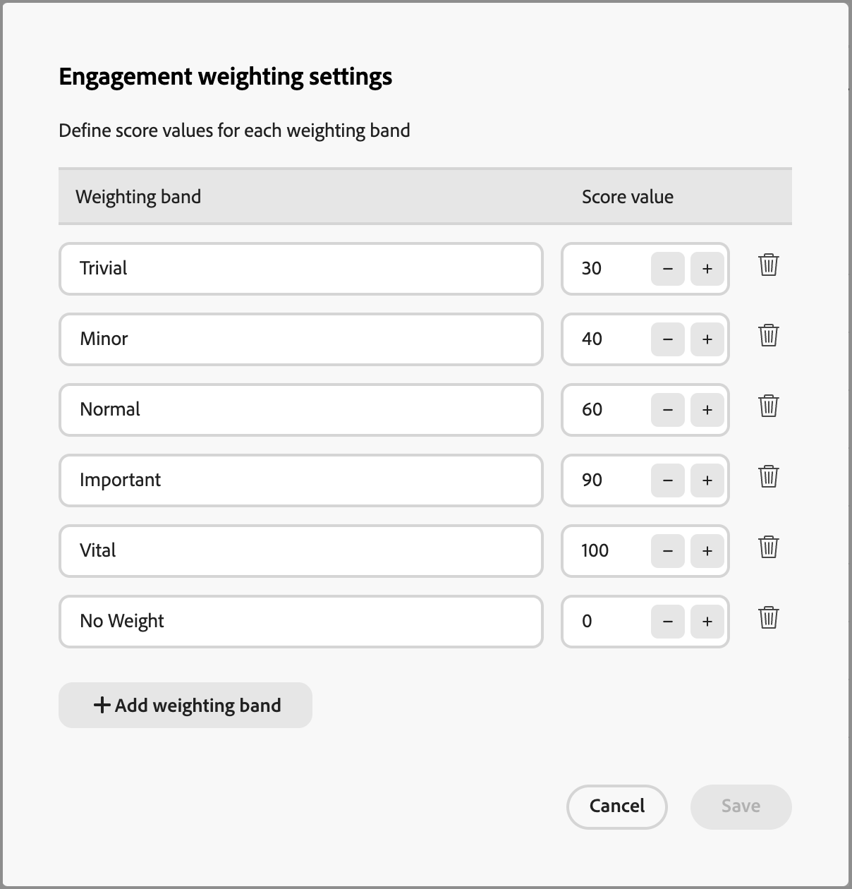

# カスタムエンゲージメントスコアの重み付けの設定

[ 購入グループエンゲージメントスコア ](../buying-groups/engagement-scores.md) は、購入グループのメンバーに対して記録された様々なアクティビティを評価することで、エンゲージメントレベルを反映します。 カスタムスコアの重み付けを使用すると、マーケティングオペレーションチームは、アクティビティの重み付けに使用する独自のモデルを柔軟に定義できます。 カスタムスコアリングモデルは、セールスプロセスにおける購入意図を最も正確に伝える行動を優先することで、パイプラインをより正確に反映させます。

管理者は、組織に対して複数のエンゲージメントスコアモデルを定義できますが、一度にアクティブ化できるモデルは 1 つだけです。 各エンゲージメントスコアリングアクティビティに適用される重み付けに応じて、スコアモデルを定義します。

>[!PREREQUISITES]
>
>エンゲージメントスコアの重み付けモデルを定義してアクティブ化するには、_[!UICONTROL B2B 管理者の設定の管理]_[ 製品権限 ](./user-management.md#b2b-product-permissions) が必要です。

## エンゲージメントスコアの重み付けモデルへのアクセス

_[!UICONTROL エンゲージメントスコアの重み付け]_ リストを開き、アクティブ、ドラフトおよびアーカイブされたモデルを表示します。

1. 左側のナビゲーションで **[!UICONTROL 管理]**/**[!UICONTROL 設定]** を選択します。

1. 中間パネルの **[!UICONTROL エンゲージメントスコアの重み付け]** をクリックして、スコアリングモデルのリストを表示します。

   このページから、エンゲージメントスコアモデルの [ 作成（複製） ](#create-an-engagement-score-model)、[ アクティブ化 ](#activate-a-score-model) および [ 編集 ](#change-the-engagement-weighting-settings) を実行できます。

   {width="800" zoomable="yes"}

   このリストには、最近更新されたモデルが上部に表示され（_[!UICONTROL 最終更新日]_ 順）、_[!UICONTROL 名前]_ で検索する機能が含まれています。

   右上隅の _列設定_ （） アイコンをクリックし、列チェックボックスをオンまたはオフにすることで、表示されたテーブルをカスタマイズできます。

   {width="300"}

1. エンゲージメントスコアモデルの詳細にアクセスするには、名前をクリックします。

### デフォルトスコアモデル

システムは、_アクティビティ重み付けモデル 1_ という名前の初期エンゲージメントスコアモデルを作成します。 モデルのステータスとエンゲージメントアクティビティは、[!DNL Journey Optimizer B2B Edition] 環境のデータアーキテクチャによって異なります。

* **シンプルなアーキテクチャ** （Beta） – お使いの環境で [ シンプルなアーキテクチャ ](../simplified-architecture.md) を使用している場合、エンゲージメントアクティビティは標準およびカスタムのExperience Platform イベントに基づきます。 すべてのアクティビティの重みは、デフォルトで 0 です。

  {width="600" zoomable="yes"}

* **標準アーキテクチャ** – 環境で標準アーキテクチャを使用している場合、接続された [!DNL Marketo Engage] インスタンスがエンゲージメントアクティビティデータのソースになります。 カスタムバージョンを作成してアクティブ化するまで、デフォルトモデルはアクティブです。

  {width="600" zoomable="yes"}

カスタムモデルをアクティブ化すると、アクティブなモデルのステータスが _アーカイブ済み_ に変わります。 デフォルトのエンゲージメントスコアモデルに戻す場合は、元のデフォルトモデルを複製してアクティベートするか、別のカスタムモデルの出発点として使用することができます。

### ドラフトモデルの削除

今後アクティブ化しない場合は、ドラフトエンゲージメントスコアモデルを削除できます。 リストのドラフトスコアモデル名の横にある _その他メニュー_ （***...***）アイコンをクリックし、「**[!UICONTROL 削除]**」を選択します。

{width="350"}

確認ダイアログで、「**[!UICONTROL 削除]**」をクリックします。

## カスタムエンゲージメントスコアリングモデルの作成

カスタムのエンゲージメントスコアモデルを作成するには、デフォルトモデルまたは既に作成されている別のカスタムモデルを複製します。 現在の _アクティブ_ モデル、_ドラフト_ モデル、または _アーカイブ済み_ モデルを複製できます。 次に、必要に応じて複製モデルを編集します。

1. モデル名をクリックしてモデルの詳細ページを開き、右上の「**[!UICONTROL 複製]** をクリックします。

   {width="600" zoomable="yes"}

   また、リスト内のスコアモデル名の横にある _その他メニュー_ （***...***）アイコンをクリックし、「複製 **[!UICONTROL を選択するこ]** もできます。

   {width="325"}

1. _複製_ ダイアログで、複製したモデルに一意の名前を入力し、「**[!UICONTROL 複製]**」をクリックします。

   {width="500"}

   複製されたモデルは、「ドラフト _ステータスでリストに表示さ_ ます。 名前をクリックしてスコアモデルの詳細を開き、変更を加えます。

### エンゲージメントの重み付けの設定を変更する

重み付け設定は、モデル内の各アクティビティに割り当てることができるバンドを定義します。 バンドは、エンゲージメントを評価するための組織の戦略を反映するように変更できます。 例えば、通常のアクティビティに高い値を割り当てる場合、_通常_ の重み付けバンドを 65 の値に調整することができます。 または、_標準_ と _重要_ の間にあるアクティビティを取り込むように設計された重み付けバンドを追加できます。 この場合、帯を追加して _重要_ というラベルを付け、重み帯値に 75 を割り当てることができます。

1. スコアモデルの詳細ページで、上部の **[!UICONTROL エンゲージメントの重み付けの設定]** をクリックします。

   {width="600" zoomable="yes"}

1. 各ウェイト バンドに対して、必要に応じて名前または値を調整します。

   * 「_[!UICONTROL 重み付けバンド]_」フィールドの名前を変更します。
   * 新しい値を入力します。**&amp;plus;** または **−** をクリックして、値を増減することもできます。

   {width="500"}

1. 必要に応じて、別の重み付けバンドを追加します。

   リストの下部にある「**[!UICONTROL +重み付けバンド]** 追加」をクリックします。 この操作を行うと、リストの下部に空白の重み付けバンドが挿入されます。

   名前を入力し、帯の値を設定します。 必ず一意の名前と値を使用してください。

1. 重み付け帯を削除するには、重み付け帯行の _削除_ （） アイコンをクリックします。

1. 変更が完了したら、「**[!UICONTROL 保存]**」をクリックします。

### アクティビティの重み付けの変更

各スコアモデルには、サポートされるエンゲージメントスコアアクティビティの完全なリストが含まれます。

+++アーキテクチャを簡素化するためのアクティビティ

シンプルなアーキテクチャのデフォルトモデルには、Experience Platformで追跡されるアクティビティが含まれます。 重みを割り当てるまで、各アクティビティの重み付けは 0 になります（使用されません）。 また、すべてのアクティビティの 1 日あたりの最大頻度は 20 で、変更することはできません。

<table style="table-layout: fixed; width: 100%; border: 0;">
<tbody>
<tr style="border: 0;">
<td>
<ul><li>Advertising クリック数 </li><li>Advertising完了 </li><li>Advertisingコンバージョン </li><li>Advertising Federated </li><li>Advertising四分位数 </li><li>Advertising インプレッション数 </li><li>Advertisingの中点 </li><li>Advertising開始 </li><li>Advertising四分位数 </li><li>Advertising再生時間 </li><li>アプリケーション終了 </li><li>アプリケーションの起動 </li><li>エンゲージメントキャンペーン頻度を変更 </li><li>Commerce バックオフィス クレジット メモ発行済 </li><li>Commerce Backoffice 注文がキャンセルされました </li><li>Commerce バックオフィス発注 </li><li>Commerceバックオフィスの受注品出荷済 </li><li>Commerce バックオフィスの出荷完了 </li><li>Commerce チェックアウト </li><li>Commerce商品リスト （買い物かご）追加数 </li><li>Commerce商品リスト （買い物かご） オープン数 </li><li>Commerce商品リスト （買い物かご）削除数 </li><li>Commerce商品リスト （買い物かご）再開数 </li><li>Commerce商品リスト（買い物かご）表示数 </li><li>Commerce製品表示回数 </li><li>Commerceの購入 </li><li>Commerceを後のために保存 </li><li>決定の提案を解除 </li><li>決定の提案の表示 </li><li>決定の提案のインタラクション </li></ul>
</td>
<td>
<ul><li>決定の提案を送信 </li><li>決定の提案トリガー </li><li>配信のフィードバック </li><li>ダイレクトマーケティングの電子メールバウンス </li><li>ダイレクトマーケティングの電子メールバウンスソフト </li><li>ダイレクトマーケティングの電子メールのクリック </li><li>ダイレクトマーケティングの電子メール配信済み </li><li>ダイレクトマーケティングの電子メールの開封 </li><li>送信されたダイレクトマーケティング電子メール </li><li>ダイレクトマーケティングの電子メールの購読解除 </li><li>アプリ内メッセージが取り消されました </li><li>アプリ内メッセージが表示されました </li><li>アプリ内メッセージがとインタラクションされました </li><li>キャンペーンに追加するリード操作 </li><li>リード操作呼び出し Web フック </li><li>リード操作の変更キャンペーンストリーム </li><li>リード操作リードを変換 </li><li>リード操作の興味深い瞬間 </li><li>リード操作リードを結合 </li><li>リード工程の新規リード </li><li>リード操作の収益ステージが変更されました </li><li>リード操作スコアが変更されました </li><li>キャンペーン進行のリード操作ステータスが変更されました </li></ul>
</td>
<td>
<ul><li>リード操作リストに追加 </li><li>リード操作リストから削除 </li><li>場所の出口 </li><li>メディア adBreakComplete </li><li>メディア adBreakStart </li><li>メディア adComplete </li><li>メディア adSkip </li><li>メディア adStart </li><li>メディア bitrateChange </li><li>メディア bufferStart </li><li>メディアチャプター完了 </li><li>メディアチャプタースキップ </li><li>メディアチャプター開始 </li><li>メディアカスタムトラッキング </li><li>メディアダウンロードコンテンツ </li><li>メディアエラー </li><li>メディア pauseStart </li><li>メディア ping </li><li>Media play </li><li>メディアセッション完了 </li><li>メディアセッション終了 </li><li>メディアセッション開始 </li><li>メディア statesUpdate </li><li>メッセージフィードバック </li><li>メッセージレンダリングデータ </li><li>メッセージトラッキング </li><li>商談に商談イベントを追加 </li><li>更新された商談イベント </li><li>商談から削除する商談イベント </li><li>プッシュトラッキングアプリケーションが開きました </li><li>プッシュトラッキングカスタムアクション </li><li>Web フォームに入力済み </li><li>Web Webinteraction リンククリック数 </li><li>Web Webpagedetails ページビュー</li></ul>
</td>
</tbody>
</table>

+++

+++標準アーキテクチャのアクティビティ

標準アーキテクチャのデフォルトモデルには、関連付けられたデフォルトの重み付けが設定された、[!DNL Marketo Engage] で追跡されたアクティビティが含まれています。 このモデルを複製すると、必要に応じて重み付けを変更できます。 1 日の最大頻度は変更できません。

{{engagement-activities-me}}

+++

リスト内の各アクティビティに対して、各アクティビティの発生に割り当てる値を設定します。 「**[!UICONTROL 重み付け]**」フィールドの下矢印をクリックし、差込み代の重み付け設定で定義されている重み付けバンドを選択します。

{width="600" zoomable="yes"}

エンゲージメントスコアの計算でアクティビティを使用しない場合は、重みをゼロ（0）値に設定します。

変更内容は自動的に保存されます。

## スコアモデルのアクティベート

ドラフトスコアモデルをアクティブ化すると、現在アクティブなモデルが置き換えられます。 現在アクティブなモデルは自動的にアーカイブされます。

1. ドラフトスコアモデルを開いて詳細ページを表示します。

1. 「**[!UICONTROL アクティベート]**」をクリックします。

1. 確認ダイアログで、「**[!UICONTROL アクティベート]**」をクリックします。

   {width="400"}
