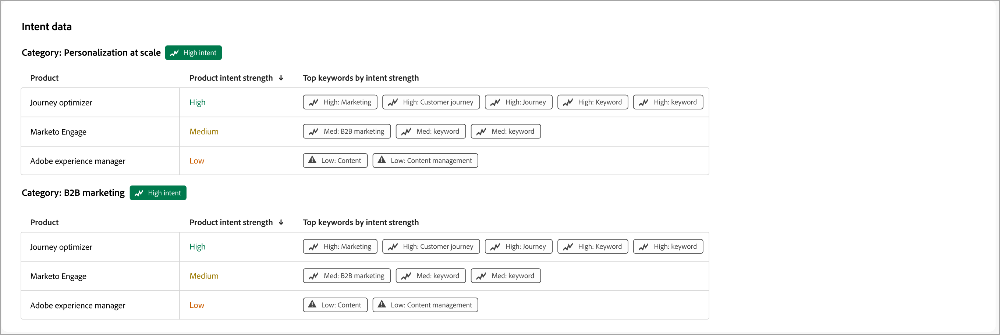
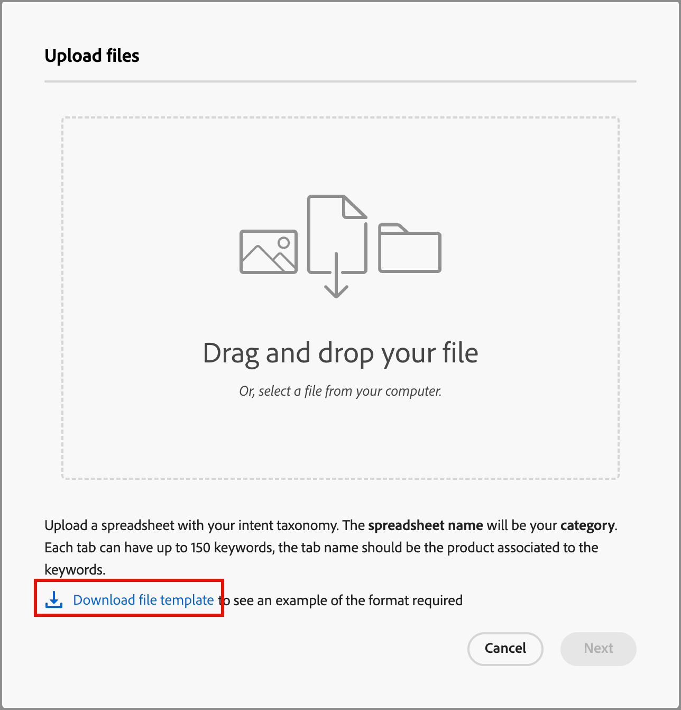
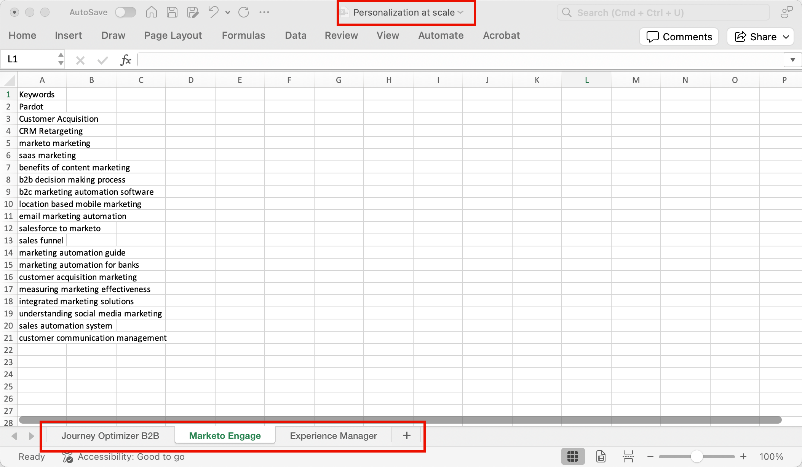
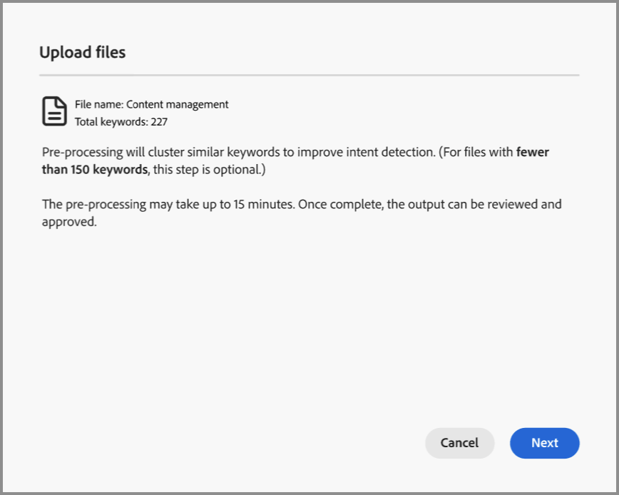
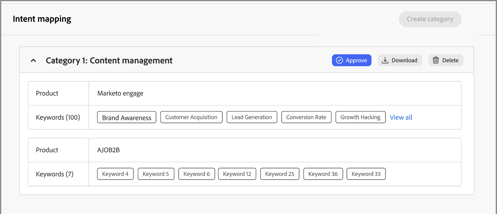
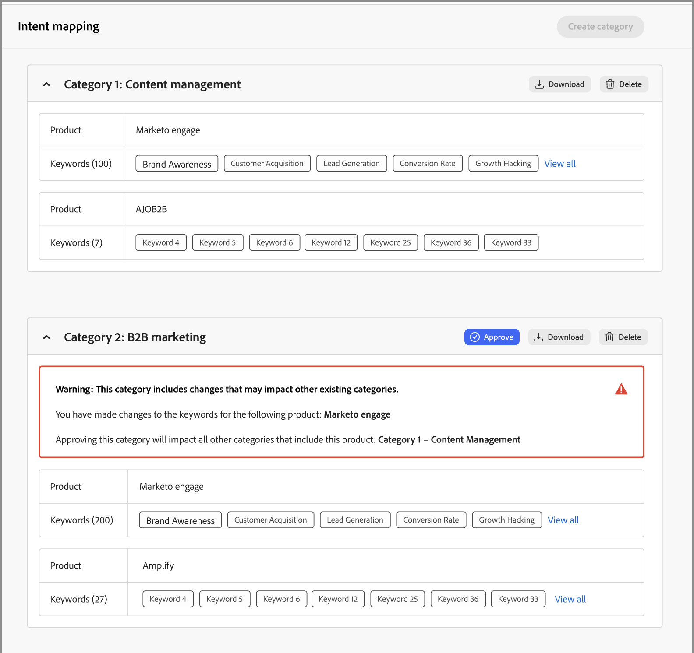

# インテントデータ

Journey Optimizer B2B editionでは、インテント検出モデルにより、リードのアクティビティにもとづいて、十分な信頼性で関心のあるソリューションや製品を予測できます。 また、タグ付けされたコンテンツとともに、他のアカウントの共同メンバーのアクティビティも活用します。 人の意図は、製品に興味を持つ可能性として解釈できます。

* 意図のレベル – 既知のリード、アカウント、購買グループのレベルで利用可能。
* インテントシグナルの種類 – キーワード、製品、ソリューション

インテントデータは、[_インテリジェントダッシュボード_](../dashboards/intelligent-dashboard.md)、[_アカウントの詳細_ ページ ](../accounts/account-details.md)、[_購買グループの詳細_ ページ ](../buying-groups/buying-group-details.md)および&#x200B;[_人物の詳細_ ページ ](../accounts/person-details.md)で使用されます。

{width="700" zoomable="yes"}

## インテントマッピングデータの準備

この機能を有効にするには、Microsoft Excel ファイルなどのスプレッドシートを作成し、タブを使用してインテント分類法を定義します。 スプレッドシート全体が、複数の製品を持つ1つのカテゴリとしてアップロードされ、各製品に複数のキーワードを持つことができます。 定義する各カテゴリのインテントマッピングスプレッドシートには、次の定義を使用します。

* スプレッドシートの名前= _カテゴリ名_
* 各タブ =製品名
* 各タブには、1つの列=商品キーワード（最大150）が含まれます

マッピングデータを準備するためのテンプレートとして使用するExcel ファイルをダウンロードできます。 テンプレートをダウンロードするには：

1. 左側のナビゲーションで **[!UICONTROL 管理]**/**[!UICONTROL 設定]** を選択します。

1. 中間パネルで「**[!UICONTROL インテントマッピング]**」をクリックします。

1. 「**[!UICONTROL カテゴリを作成]**」をクリックします。

1. ダイアログで、**[!UICONTROL ファイルテンプレートをダウンロード]** リンクをクリックします。

   {width="500"}

1. 「**[!UICONTROL キャンセル]**」をクリックします。

   準備したファイルが完成したら、再度アップロードできます。

1. テンプレートを使用して、インテントマッピングデータを定義します。

   * _Personalization at scale_&#x200B;など、カテゴリ名を反映するようにファイル名を変更します。
   * _Journey Optimizer B2B_、_Marketo Engage_、_Experience Manager_&#x200B;など、製品名に従って各タブの名前を変更します。
   * _B2B Marketing_、_ブランド認知度_、_リードエンゲージメント_&#x200B;など、各タブの製品キーワードを追加します。

   {width="600" zoomable="yes"}

## カテゴリファイルのアップロード

スプレッドシートの準備ができたら、_[!UICONTROL インテント マッピング]_&#x200B;設定ページに戻り、ファイルをアップロードします。

1. 「**[!UICONTROL カテゴリを作成]**」をクリックします。

1. ファイルを&#x200B;_[!UICONTROL ファイルをアップロード]_ ダイアログにドラッグ&amp;ドロップするか、**[!UICONTROL ファイルを選択]**&#x200B;して、システム上のファイルを探して選択します。

1. 「**[!UICONTROL 次へ]**」をクリックします。

   前処理を実行して類似のキーワードをクラスタリングすることで、意図の検出を向上させ、キーワードの希薄化を回避します。 この前処理が完了するとすぐにパルス通知が表示されます（データに応じて最大15分）。

   {width="500"}

   結果は、_インテント マッピング_ ページに表示されます。

   {width="600" zoomable="yes"}

## カテゴリの承認または却下

カテゴリのリストを確認し、**[!UICONTROL 承認]**&#x200B;をクリックして、インテリジェントダッシュボード、アカウントの詳細ページ、購買グループの詳細ページ、人物の詳細ページで使用するキーワードをアクティベートします。 **[!UICONTROL すべて表示]**&#x200B;をクリックして各製品の完全なリストを表示するか、**[!UICONTROL ダウンロード]**&#x200B;をクリックして完全なリストをExcel ファイルとしてレビューします。

リストに満足しない場合は、**[!UICONTROL 削除]**&#x200B;をクリックしてカテゴリを削除できます。 その後、アップロードプロセスを再度開始してカテゴリを定義する前に、スプレッドシートファイルを調整できます。

>[!IMPORTANT]
>
>別のカテゴリを追加したり、カテゴリを編集したりするには、新しいカテゴリを承認または却下（削除）する必要があります。

別のカテゴリを追加し、その分類が既存のカテゴリに影響を与える場合は、警告が表示されます。 この影響は、カテゴリを承認または却下する場合に考慮してください。 製品が複数のカテゴリで使用されている場合、製品とキーワードのマッピングは、すべてのカテゴリで同じである必要があります。

{width="600" zoomable="yes"}
