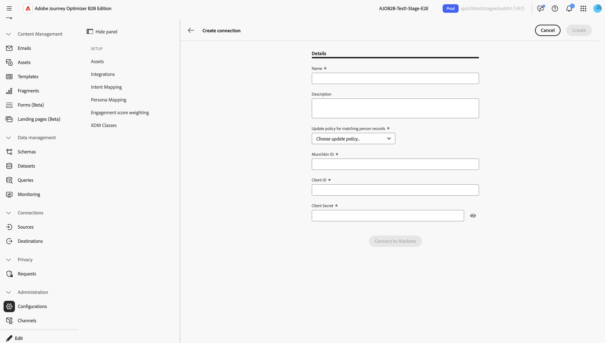
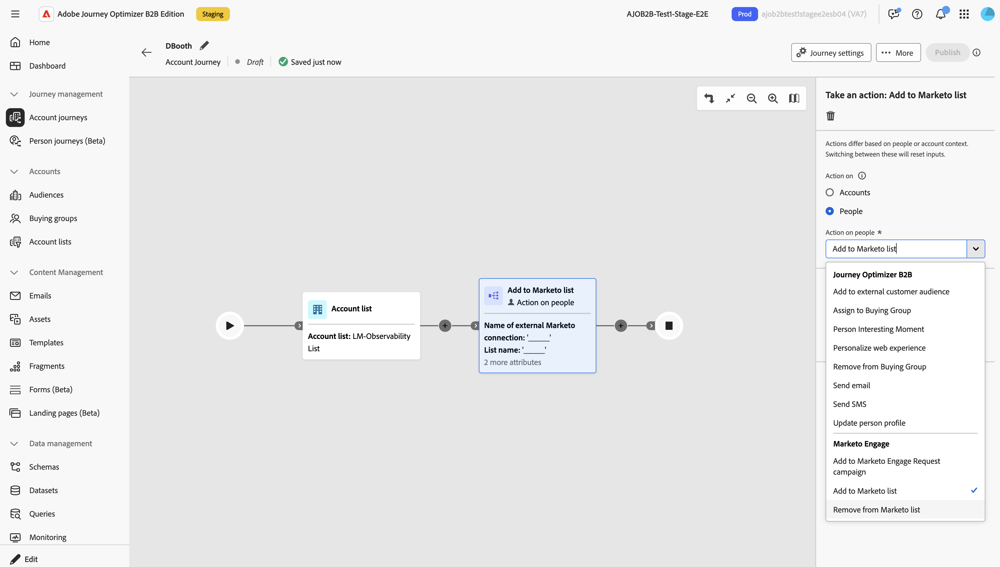

# アクションをサポートするための Marketo Engage 接続のアクティブ化

Marketo Engage アクションは _人物ベース_ のアクションであり、Journey Optimizer B2B editionとMarketo Engageの _リードベース_ マーケティング活動の間で _アカウントベース_ のマーケティングオーケストレーションを調整できます。 これらのアクションを使用して、静的なリストメンバーシップを調整し、キャンペーンにユーザーを配置します。

Marketo Engageのジャーニーアクションを使用するには、管理者はまず、認証に必要な資格情報を提供する [&#x200B; カスタムサービス &#x200B;](https://experienceleague.adobe.com/ja/docs/marketo-developer/marketo/rest/custom-services){target="_blank"} をMarketo Engageで作成します。 次に、Journey Optimizer B2B Edition の製品管理者が、その資格情報を使用して Marketo Engage への接続を作成します。 その後、Journey Optimizer B2B Edition ユーザーは接続を参照して、Marketo Engageのアクションを対面およびアカウントジャーニーで設定できます。

* [!UICONTROL Marketo リストに追加 &#x200B;]
* [!UICONTROL Marketoリストから削除 &#x200B;]
* [!UICONTROL Marketo リクエストキャンペーンに追加 &#x200B;]

## Marketo Engage 接続の設定 {#external-marketo-configure}

>[!CONTEXTUALHELP]
>id="ajo-b2b_marketo-configure-connections"
>title="外部 Marketo Engage 接続"
>abstract="製品管理者は、ジャーニーアクションで使用できるよう、外部 Marketo Engage インスタンスへの接続を設定できます。"

ジャーニーアクションで使用する外部Marketo Engage インスタンスを設定するには、次のタスクを実行します。

### Marketo Engage カスタムサービスの作成

1. Marketo Engageに管理者としてログインし、「カスタムサービスを作成 [&#x200B; し &#x200B;](https://experienceleague.adobe.com/ja/docs/marketo/using/product-docs/administration/additional-integrations/create-a-custom-service-for-use-with-rest-api){target="_blank"} す。
1. Journey Optimizer B2B edition接続に使用する値を以下のようにコピーします。

   * Munchkin ID
   * クライアント ID
   * クライアント秘密鍵

カスタムサービスで割り当てられた[役割の権限](https://experienceleague.adobe.com/ja/docs/marketo-developer/marketo/rest/custom-services#permission-list){target="_blank"}は、リストやキャンペーンなどのアセットに対するMarketo Engage Workspaceの表示を管理します。 マーケターは、ジャーニー内で同じ接続を複数回使用し、同じジャーニー内で異なるMarketo Engage接続を使用できます。

### 統合の追加

{width="800" zoomable="yes"}

1. Journey Optimizer B2B editionで、**[!UICONTROL 管理]**/**[!UICONTROL 設定]** に移動します。
1. 「**[!UICONTROL 統合]**」タブを選択します。
1. **[!UICONTROL 接続を作成]** をクリックします。
1. **[!UICONTROL 名前]** （必須）と **[!UICONTROL 説明]** （オプション）を入力します。
1. 一致する人物レコードにアクションを適用するために使用される更新ポリシーを選択します。

   接続されたMarketo Engage インスタンスに対してアクションが実行されると、選択された _更新ポリシー_ によって、Marketo Engageの人物レコードが決定され、統合された人物プロファイルに複数の識別子が存在するかどうかが選択されます。

   * **[!UICONTROL 一致するすべてのレコードを更新]**
   * **[!UICONTROL 最も古い一致するレコードのみを更新]**
   * **[!UICONTROL 最新の一致するレコードのみを更新]**

   >[!NOTE]
   >
   >ユーザー/リードは、一致しても、エラーが発生した場合を除き、ジャーニーを進み続けます。 一致するレコードが存在しない場合、ジャーニーアクションでは、Marketo Engageに新しい人物レコードは作成されません。

1. 外部 Marketo Engage インスタンスで作成したサービスの Munchkin ID、クライアント ID およびクライアントシークレットを入力します。
1. **[!UICONTROL Marketoに接続]** をクリックします。
1. 「**[!UICONTROL 作成]**」をクリックします。

## ジャーニーアクションでの接続の使用

マーケターがジャーニーでMarketo Engage アクションを使用する場合、接続名を使用してノードを設定します。

>[!NOTE]
>
>ジャーニーから実行されたMarketo Engage アクションは、接続されたMarketo Engage インスタンスのREST API制限には適用されません。

統合が完了すると、Marketo Engage アクションは、:_&#x200B;**の**&#x200B;_Actionsからノードプロパティで利用できるようになります。

{width="800" zoomable="yes"}
