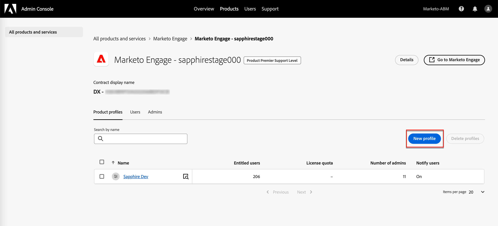

# ユーザー管理

プロビジョニングが完了し、サンドボックスがバインドされたら、次の手順を実行して、チームとユーザーにAdobe Journey Optimizer B2B editionへのアクセスを提供します。

1. Admin Consoleで [Marketo Engage製品プロファイルを作成 ](#marketo-engage-profile) （新しいMarketo Engage インスタンスのみ）。
1. Admin Consoleで [ ユーザーグループを作成 ](#create-user-group) します。
1. Journey Optimizer B2B editionの権限を使用して、[ 組み込みの役割を編集 ](#edit-roles) または [ カスタムの役割を作成 ](#create-a-custom-role) します。
1. 役割への [ ユーザー ](#add-users) または [ グループ ](#add-user-groups-to-a-role) の追加

管理者は、Adobeの製品ライセンスとユーザーを一元的に管理する場所であるAdobe Admin Consoleで、これらのタスクを実行できます。 Admin Consoleでは、様々な個別のソリューション内ではなく、1 か所でユーザーを作成および管理できます。 機能と性能について詳しくは、[Admin Consoleの概要 ](https://helpx.adobe.com/jp/enterprise/using/admin-console.html) を参照してください。

## Admin Console へのアクセス

Admin Consoleを使用してチーム内のユーザーを管理する前に、Admin Consoleにアクセスでき、適切な権限を持っていることを確認する必要があります。

1. システム管理者は、オンボーディングプロセスの一環としてAdobeから複数のメールを受信する必要があります。

   アクセス権が付与された組織名に関する情報を記載したお知らせメールを探します。

1. お知らせメールの **[!UICONTROL 使用を開始]** リンクをクリックして、Admin Consoleに移動します。

   メールが見つからない場合は、ブラウザーを開いてAdmin Console（[https://adminconsole.adobe.com](https://adminconsole.adobe.com)）に直接アクセスします。

1. Adobe IDを使用してログインします。

   ログインに成功すると、Adobe Admin Consoleの _概要_ ページが表示されます。

1. 複数の組織にアクセスできる場合は、正しい組織にログインしていることを確認します。

   組織を変更するには、右上隅の組織名をクリックし、アクセスが必要な組織を選択します。

1. **[!UICONTROL ユーザー]** カードから _[!UICONTROL 管理者]_ を選択して、自分がシステム管理者であることを確認します。

   {width="700" zoomable="yes"}

1. Adobe IDのメールアドレス、ユーザー名、名、姓を入力して検索します。

   * アクセス権が正しく設定されている場合、検索はレコードを返します。

   * **[!UICONTROL 管理者の役割]** 列の値に `System` が表示されている場合、自分（または表示されているユーザー）がシステム管理者であることがわかります。

## Marketo Engage製品プロファイルの作成 {#marketo-engage-profile}

Adobe ソリューションに対するアクセス権をユーザーに付与する場合、必ずしも完全なアクセス権を付与する必要はありません。 製品プロファイルを使用すると、ソリューションごとに独自のユーザー権限を設定できます。 Admin Consoleを使用して製品プロファイルを割り当てます。

ユーザーの使用権限に製品プロファイルを使用する方法について詳しくは、Admin Console ドキュメントの [ エンタープライズユーザーの製品プロファイルの管理 ](https://helpx.adobe.com/jp/enterprise/using/manage-product-profiles.html){target="_blank"} を参照してください。

>[!BEGINSHADEBOX]

ユーザーをMarketo Engage製品プロファイルに追加すると、その後、Marketo Engage サブスクリプションのデフォルトワークスペース内の _標準ユーザー_ ロールに追加されます。 このロールは、そのワークスペース内のMarketo Engageに対するすべての _標準ユーザー_ 権限を付与します。 現在、すべてのJourney Optimizer B2B edition ユーザーは、Marketo Engage ユーザーである必要があります。 Marketo Engage管理者は、_標準ユーザー_ ロールの権限をアップデートするか、より制限の厳しい権限を持つ別のMarketo Engage ユーザーロールにユーザーを移動することで、アクセスを制限できます。

Marketo Engage内のこれらの権限の管理について詳しくは、Marketo Engage ドキュメントの [ ユーザーの役割と権限の管理 ](https://experienceleague.adobe.com/ja/docs/marketo/using/product-docs/administration/users-and-roles/managing-user-roles-and-permissions){target="_blank"} を参照してください。

>[!ENDSHADEBOX]

{width="30"} システム管理者またはMarketo Engageの製品管理者は、次の手順を実行できます。

1. [https://adminconsole.adobe.com](https://adminconsole.adobe.com) にログインします。

1. 「**[!UICONTROL 製品]**」タブを選択します。

1. プロファイルを追加するMarketo Engage インスタンスを開き、「**[!UICONTROL 新規プロファイル]**」をクリックします。

   {width="700" zoomable="yes"}

1. 「_標準ユーザー_」などの製品プロファイル名を入力します。

1. **次へ** をクリックしてから **保存** をクリックします。

## ユーザーグループの作成 {#create-user-group}

ユーザーグループは、一連の共有権限が付与されるユーザーの集まりです。 ユーザーグループのユーザーを追加または削除できます。 グループの権限は、グループ内のユーザーが変更されても、同じままです。

ユーザーグループを使用して権限を管理する方法について詳しくは、Admin Console ドキュメントの [ ユーザーグループの管理 ](https://helpx.adobe.com/jp/enterprise/using/user-groups.html){target="_blank"} を参照してください。

{width="30"} システム管理者は、次の手順を実行できます。

1. [https://adminconsole.adobe.com](https://adminconsole.adobe.com) にログインします。

1. 「**[!UICONTROL ユーザー]**」タブを選択します。

1. 左側のナビゲーションで **[!UICONTROL ユーザーグループ]** を選択します。

1. 右上で **[!UICONTROL 新規ユーザーグループ]** をクリックします。

1. _標準ユーザー_ のようにユーザーグループの名前を入力し、「**[!UICONTROL 保存]**」をクリックします。

1. 作成したユーザーグループをクリックします。

1. 「**[!UICONTROL 割り当てられた製品プロファイル]**」タブを選択し、「**[!UICONTROL プロファイルを割り当て]**」をクリックします。

1. 「**+**」をクリックして、次の製品の各インスタンスを追加します。

   * [!UICONTROL Marketo Engage]
   * [!UICONTROL Adobe Experience Platform - AEP-Default-All-Users]
   * [!UICONTROL Adobe Experience Platform のデータ収集]
   * [!UICONTROL &#x200B; データ収集のすべてのアクセス &#x200B;]

   {width="700" zoomable="yes"}

1. 「**[!UICONTROL 保存]**」をクリックします。

## グループへのユーザーの追加

User Management について詳しくは、Admin Console ドキュメントの [Admin Console ユーザー ](https://helpx.adobe.com/jp/enterprise/using/user-groups.html) を参照してください。

{width="30"} システム管理者または製品管理者は、次の手順を実行できます。 製品管理者は、組織に既に存在するユーザーのみを追加できます。

1. [https://adminconsole.adobe.com](https://adminconsole.adobe.com) に移動します。

1. _[!UICONTROL クイック リンク]_ の下の [**[!UICONTROL ユーザーの追加]**] をクリックします。

1. 各ユーザーを追加します。

   * ユーザーのメールアドレス、名、姓を入力します。

     {width="600" zoomable="yes"}

   * **[!UICONTROL ユーザーグループ]** の場合は、「**+**」をクリックします。

   * 前に作成したユーザーグループを選択します。

   * 「**[!UICONTROL 適用]**」をクリックします。

1. 「**[!UICONTROL 保存]**」をクリックします。

## 製品権限の役割の編集 {#edit-roles}

権限は、製品プロファイルに割り当てる許可を定義できる単一の権利です。 各権限は、Journey Optimizer B2B editionのさまざまな機能やオブジェクトに相当する、ジャーニーや購入グループなどの機能の下に収集されます。

Adobe Experience Platformの _権限_ 領域では、管理者は、ユーザーの役割とアクセスポリシーを定義して、製品アプリケーション内の機能とオブジェクトのアクセス権限を管理できます。 このアプリでは、役割を作成および管理すると共に、それらの役割に対して必要なリソース権限を割り当てることができます。 また、権限では、特定の役割に関連付けられたサンドボックスとユーザーを管理することもできます。

Experience Platformのロール権限について詳しくは、Experience Platform ドキュメントの [ ロールの権限の管理 ](https://experienceleague.adobe.com/ja/docs/experience-platform/access-control/abac/permissions-ui/permissions){target="_blank"} を参照してください。

### B2B 製品の権限

Journey Optimizer B2B editionの機能へのアクセスには、次の権限が適用されます。

| カテゴリ | 説明 | 権限 |
| -------- | ----------- | ---------- |
| B2B アカウントリスト | B2B アカウントリストの権限を設定、管理、表示および公開します。 これらの権限には、アカウントリストに対するアカウントの追加、削除、インポート、削除などのアクションが含まれます。 | <li>B2B アカウントリストの管理 |
| B2B 管理設定 | B2B 管理設定の権限を設定、管理、表示します。 これらの権限には、デジタルアセット管理接続、アセットリポジトリー、イベントが含まれます。 | <li>B2B 管理設定の管理 |
| B2B Assets | B2B アセットの権限を設定、管理、表示します。 これらの権限には、メール、SMS、ランディングページ、フラグメント、テンプレート、画像が含まれます。 | <li>B2B Assetsの管理 <li>B2B テンプレートの管理 <li>B2B フラグメントの管理 |
| B2B 購入グループ | B2B 購入グループの権限を設定、管理および表示します。 これらの権限には、ソリューションの関心、役割テンプレート、購入グループステータスが含まれます。 | <li>B2B 購入グループの管理 |
| B2B チャネル設定 | B2B チャネル設定の権限を設定、管理、表示します。 これらの権限には、通信制限、API 資格情報、セキュリティ設定の設定が含まれます。 | <li>B2B チャネル設定の管理 |
| B2B ダッシュボード | B2B ダッシュボードの権限の設定と表示。 これらの権限には、アカウントエンゲージメント、購入グループステージ、急増するアカウント、連絡先の対象範囲が含まれます。 | <li>B2B ダッシュボードの管理 |
| B2B ジャーニー | B2B ジャーニーの管理、表示、公開権限を設定します。 これらの権限には、アカウントとユーザーのアクション、イベントリスナー、分割パスが含まれます | <li>B2B ジャーニーの管理 |

### B2B の組み込みの役割

組織がJourney Optimizer B2B edition製品をプロビジョニングしている場合、Experience Platformには、製品の機能へのアクセスを管理するために使用できる、組み込みの（デフォルトの）一連の役割が含まれています。

| 役割 | 権限 |
| ---- | ----------- |
| B2B ジャーニーマネージャー | <li>B2B ジャーニーの管理 <li>B2B 購入グループの管理 <li>B2B アカウントリストの管理 <li>B2B エンゲージメントダッシュボードの表示 <li>B2B インサイトダッシュボードの表示 |
| B2B チャネルマネージャー | <li>B2B Assetsの管理 <li>B2B テンプレートの管理 <li>B2B フラグメントの管理 |
| B2B システム管理者 | <li>B2B チャネル設定の管理 <li>B2B 管理設定の管理 |
| B2B セールスユーザー | <li>B2B エンゲージメントダッシュボードの表示 |

### 役割の権限の編集

組み込みの役割またはカスタムの役割の場合は、いつでも権限を追加または削除できます。 デフォルトまたはカスタムの役割を変更すると、その役割に割り当てられたすべてのユーザーに影響します。

次の例では、B2B チャネルマネージャーのロールに割り当てられたユーザーに対して、B2B ジャーニーリソースに関連する権限を追加します。 この変更により、その役割のユーザーはアカウントジャーニーも管理できます。

>[!NOTE]
>
>Admin Consoleのシステム管理者は、これらの手順を実行できます。

役割のアクセス許可を変更するには（_T） :_

1. [experience.adobe.com](https://experienceleague.adobe.com/ja) に移動します。

1. _[!UICONTROL クイックアクセス]_ パネルで、「**[!UICONTROL 権限]**」を選択します。

   >[!NOTE]
   >
   >_[!UICONTROL 権限]_ が表示されない場合は、「**[!UICONTROL すべて表示]**」をクリックし、使用可能なアプリケーションから選択する必要がある場合があります。

   {width="700" zoomable="yes"}

1. 左側のナビゲーションで「**[!UICONTROL 役割]**」を選択します。

1. **_B2B チャネルマネージャー_** の役割名をクリックします。

1. 詳細ページで、右上の **[!UICONTROL 編集]** をクリックします。

   {width="700" zoomable="yes"}

   ロールエディターの _[!UICONTROL リソース]_ メニューには、Experience Cloud - Platform を利用したアプリケーション製品に適用されるリソースのリストが表示されます。

   検索ツールに _B2B_ と入力して、B2B 製品の権限のリストをフィルタリングできます。

1. 「B2B ジャーニー」リソースの _追加_ アイコン（**+**）をクリックします。

   {width="700" zoomable="yes"}

1. _[!UICONTROL B2B ジャーニー]_ 権限カードで、「**[!UICONTROL B2B アカウントのジャーニーを管理]**」を選択します。

1. 「**[!UICONTROL 保存]**」をクリックします。

   {width="700" zoomable="yes"}

1. 「**[!UICONTROL 閉じる]**」をクリックして詳細ページに戻ります。

### 役割にユーザーを追加

{width="30"} システム管理者またはAEPの製品管理者は、次の手順を実行できます。

1. 役割の詳細を開き、「**[!UICONTROL ユーザー]**」タブを選択します。

   このタブには、役割に割り当てられたすべてのユーザーのリストが表示されます。

1. **[!UICONTROL ユーザーを追加]** をクリックします。

   {width="700" zoomable="yes"}

1. _[!UICONTROL ユーザーを追加]_ ダイアログで、役割に追加するユーザーを見つけて選択します。

   * 検索ツールを使用して、ユーザーのリストをフィルタリングできます。

   * 各ユーザーのチェックボックスを選択します。

   {width="600" zoomable="yes"}

1. 追加するすべてのユーザーを選択したら、「**[!UICONTROL 保存]**」をクリックします。

### 役割へのユーザーグループの追加

User Management について詳しくは、Admin Console ドキュメントの [Admin Console ユーザー ](https://helpx.adobe.com/jp/enterprise/using/user-groups.html) を参照してください。

{width="30"} システム管理者またはAEPの製品管理者は、次の手順を実行できます。

1. 役割の詳細を開き、「**[!UICONTROL ユーザーグループ]**」タブを選択します。

   このタブには、役割に割り当てられたすべてのユーザーグループのリストが表示されます。

1. **[!UICONTROL グループを追加]** をクリックします。

   {width="700" zoomable="yes"}

1. _[!UICONTROL グループを追加]_ ダイアログで、役割に追加するグループを見つけて選択します。

   * 検索ツールを使用して、ユーザーグループのリストをフィルタリングできます。

   * 各ユーザーグループのチェックボックスを選択します。

   {width="600" zoomable="yes"}

1. 追加するすべてのユーザーを選択したら、「**[!UICONTROL 保存]**」をクリックします。

## カスタムの役割の作成

{width="30"} システム管理者またはAEPの製品管理者は、次の手順を実行できます。

1. 左側のナビゲーションで「**[!UICONTROL 役割]**」を選択し、「**[!UICONTROL 役割を作成]**」を選択します。

1. _[!UICONTROL 新しい役割の作成]_ ダイアログで、「_B2B マーケター_」などの役割の名前と説明（オプション）を入力します。

1. 「**[!UICONTROL 確認]**」をクリックします。

1. サンドボックスを選択します

   {width="700" zoomable="yes"}

1. プロファイル権限を追加します。

   * 左側の _[!UICONTROL リソース]_ リストで「**[!UICONTROL プロファイル管理]**」項目を見つけ、「_追加_ （**+**）」アイコンをクリックして属性を追加します。

   * 属性に次の権限を追加します。
      * [!UICONTROL &#x200B; セグメントの表示 &#x200B;]
      * [!UICONTROL &#x200B; セグメントの管理 &#x200B;]
      * [!UICONTROL &#x200B; プロファイルの表示 &#x200B;]
      * [!UICONTROL &#x200B; プロファイルの管理 &#x200B;]
      * [!UICONTROL B2B プロファイルの表示 &#x200B;]
      * [!UICONTROL B2B プロファイルの管理 &#x200B;]

   {width="700" zoomable="yes"}

1. B2B 製品の権限を追加します。

   役割に必要な製品機能を決定するには [&#128279;](#b2b-product-permissions)B2B 製品の権限のリストを参照してください。

   左側の _[!UICONTROL リソース]_ リストで、**[!UICONTROL B2B]** 項目を見つけ、_追加_ （**+**）アイコンをクリックして、役割に対して有効にする各属性を追加します。

   検索ツールに _B2B_ と入力して、B2B 製品の権限のリストをフィルタリングできます。

1. 右上の **[!UICONTROL 保存]** をクリックします。

1. 役割の詳細に移動し、「**[!UICONTROL ユーザーグループ]**」タブを選択します。

1. **[!UICONTROL グループを追加]** をクリックします。

   {width="700" zoomable="yes"}

1. Admin Consoleで以前に作成したユーザーグループの横にあるチェックボックスをオンにします。

1. 「**[!UICONTROL 保存]**」をクリックします。
