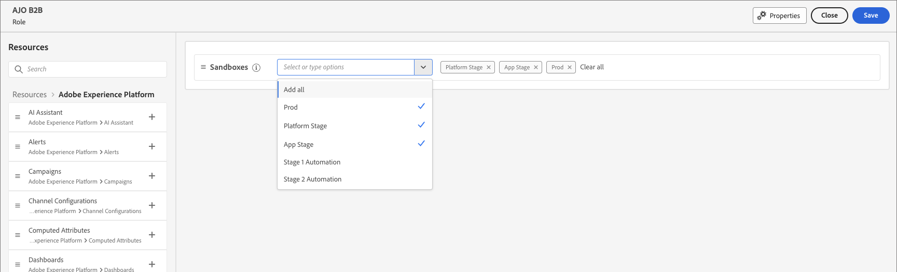

# ユーザー管理

プロビジョニングが完了し、サンドボックスがバインドされたら、次の手順を実行して、チームとユーザーにAdobe Journey Optimizer B2B editionへのアクセスを提供します。

1. Admin Consoleで [Marketo Engage製品プロファイルを作成 ](#marketo-engage-profile) （新しいMarketo Engage インスタンスのみ）。
1. Admin Consoleで [ ユーザーグループを作成 ](#create-user-group) します。
<!-- 1. [Edit built-in roles](#edit-roles) or [create a custom role](#create-a-custom-role) with Journey Optimizer B2B Edition permissions. 
1. [Add users](#add-users) or [groups](#add-user-groups-to-a-role) to roles. -->

管理者は、Adobeの製品ライセンスとユーザーを一元的に管理する場所であるAdobe Admin Consoleで、これらのタスクを実行できます。 Admin Consoleでは、様々な個別のソリューション内ではなく、1 か所でユーザーを作成および管理できます。 機能と性能について詳しくは、[Admin Consoleの概要 ](https://helpx.adobe.com/jp/enterprise/using/admin-console.html) を参照してください。

## Admin Console へのアクセス

Admin Consoleを使用してチーム内のユーザーを管理する前に、Admin Consoleにアクセスでき、適切な権限を持っていることを確認する必要があります。

1. システム管理者は、オンボーディングプロセスの一環としてAdobeから複数のメールを受信する必要があります。

   アクセス権が付与された組織名に関する情報を記載したお知らせメールを探します。

1. お知らせメールの **[!UICONTROL 使用を開始]** リンクをクリックして、Admin Consoleに移動します。

   メールが見つからない場合は、ブラウザーを開いてAdmin Console（[https://adminconsole.adobe.com](https://adminconsole.adobe.com)）に直接アクセスします。

1. Adobe IDを使用してログインします。

   ログインに成功すると、Adobe Admin Consoleの _概要_ ページが表示されます。

1. 複数の組織にアクセスできる場合は、正しい組織にログインしていることを確認します。

   組織を変更するには、右上隅の組織名をクリックし、アクセスが必要な組織を選択します。

1. **[!UICONTROL ユーザー]** カードから _[!UICONTROL 管理者]_ を選択して、自分がシステム管理者であることを確認します。

   {width="700" zoomable="yes"}

1. Adobe IDのメールアドレス、ユーザー名、名、姓を入力して検索します。

   * アクセス権が正しく設定されている場合、検索はレコードを返します。

   * **[!UICONTROL 管理者の役割]** 列の値に `System` が表示されている場合、自分（または表示されているユーザー）がシステム管理者であることがわかります。

## Marketo Engage製品プロファイルの作成 {#marketo-engage-profile}

Adobe ソリューションに対するアクセス権をユーザーに付与する場合、必ずしも完全なアクセス権を付与する必要はありません。 製品プロファイルを使用すると、ソリューションごとに独自のユーザー権限を設定できます。 Admin Consoleを使用して製品プロファイルを割り当てます。

ユーザーの使用権限に製品プロファイルを使用する方法について詳しくは、Admin Console ドキュメントの [ エンタープライズユーザーの製品プロファイルの管理 ](https://helpx.adobe.com/jp/enterprise/using/manage-product-profiles.html){target="_blank"} を参照してください。
<!--
>[!BEGINSHADEBOX]

When you add a user to the Marketo Engage product profile, they are subsequently added to the _Standard User_ role within the Default workspace of the Marketo Engage subscription. This role grants them all _Standard User_ permissions for Marketo Engage in that workspace. Currently, all Journey Optimizer B2B Edition users are required to be Marketo Engage users. A Marketo Engage administrator can restrict access by updating the permissions for the _Standard User_ role or by moving the user to a different Marketo Engage user role with more restrictive permissions.

For more information about managing these permissions within Marketo Engage, see [Managing User Roles and Permissions](https://experienceleague.adobe.com/ja/docs/marketo/using/product-docs/administration/users-and-roles/managing-user-roles-and-permissions){target="_blank"} in the Marketo Engage documentation.

>[!ENDSHADEBOX]-->

{width="30"} システム管理者またはMarketo Engageの製品管理者は、次の手順を実行できます。

1. [https://adminconsole.adobe.com](https://adminconsole.adobe.com) にログインします。

1. 「**[!UICONTROL 製品]**」タブを選択します。

1. プロファイルを追加するMarketo Engage インスタンスを開き、「**[!UICONTROL 新規プロファイル]**」をクリックします。

   {width="700" zoomable="yes"}

1. 「_標準ユーザー_」などの製品プロファイル名を入力します。

1. **次へ** をクリックしてから **保存** をクリックします。

## ユーザーグループの作成 {#create-user-group}

ユーザーグループは、一連の共有権限が付与されるユーザーの集まりです。 ユーザーグループのユーザーを追加または削除できます。 グループの権限は、グループ内のユーザーが変更されても、同じままです。

ユーザーグループを使用して権限を管理する方法について詳しくは、Admin Console ドキュメントの [ ユーザーグループの管理 ](https://helpx.adobe.com/jp/enterprise/using/user-groups.html){target="_blank"} を参照してください。

{width="30"} システム管理者は、次の手順を実行できます。

1. [https://adminconsole.adobe.com](https://adminconsole.adobe.com) にログインします。

1. 「**[!UICONTROL ユーザー]**」タブを選択します。

1. 左側のナビゲーションで **[!UICONTROL ユーザーグループ]** を選択します。

1. 右上で **[!UICONTROL 新規ユーザーグループ]** をクリックします。

1. _標準ユーザー_ のようにユーザーグループの名前を入力し、「**[!UICONTROL 保存]**」をクリックします。

1. 作成したユーザーグループをクリックします。

1. 「**[!UICONTROL 割り当てられた製品プロファイル]**」タブを選択し、「**[!UICONTROL プロファイルを割り当て]**」をクリックします。

1. 「**+**」をクリックして、次の製品の各インスタンスを追加します。

   * [!UICONTROL Marketo Engage]
   * [!UICONTROL Adobe Experience Platform - AEP-Default-All-Users]
   * [!UICONTROL Adobe Experience Platform のデータ収集]
   * [!UICONTROL &#x200B; データ収集のすべてのアクセス &#x200B;]

   {width="700" zoomable="yes"}

1. 「**[!UICONTROL 保存]**」をクリックします。

## グループへのユーザーの追加

User Management について詳しくは、Admin Console ドキュメントの [Admin Console ユーザー ](https://helpx.adobe.com/jp/enterprise/using/user-groups.html) を参照してください。

{width="30"} システム管理者または製品管理者は、次の手順を実行できます。 製品管理者は、組織に既に存在するユーザーのみを追加できます。

1. [https://adminconsole.adobe.com](https://adminconsole.adobe.com) に移動します。

1. _[!UICONTROL クイック リンク]_ の下の [**[!UICONTROL ユーザーの追加]**] をクリックします。

1. 各ユーザーを追加します。

   * ユーザーのメールアドレス、名、姓を入力します。

     {width="600" zoomable="yes"}

   * **[!UICONTROL ユーザーグループ]** の場合は、「**+**」をクリックします。

   * 前に作成したユーザーグループを選択します。

   * 「**[!UICONTROL 適用]**」をクリックします。

1. 「**[!UICONTROL 保存]**」をクリックします。

<!-- ## Edit roles for product permissions {#edit-roles}

Permissions are unitary rights that allow you to define the authorizations assigned to a product profile. Each permission is gathered under a capability, such as journeys or buying groups, which represents the different functionalities or objects in Journey Optimizer B2B Edition.

The _Permissions_ area of Adobe Experience Platform is where administrators can define user roles and access policies to manage access permissions for features and objects within a product application. In this app, you can create and manage roles, as well as assign the desired resource permissions for these roles. Permissions also allow you to manage the sandboxes and users associated with a specific role.

For more information about role permissions in Experience Platform, see [Manage permissions for a role](https://experienceleague.adobe.com/ja/docs/experience-platform/access-control/abac/permissions-ui/permissions){target="_blank"} in the Experience Platform documentation.

### B2B product permissions

The following permissions govern access to Journey Optimizer B2B Edition capabilities:

| Category | Description | Permissions |
| -------- | ----------- | ---------- |
| B2B Account Lists | Configure, manage, view, and publish permissions for B2B account lists. These permissions include actions such as add, remove, import, and delete accounts from account lists. | <li>Manage B2B Account Lists |
| B2B Admin Configurations | Configure, manage, and view permissions for B2B administrative configurations. These permissions include digital asset management connections, asset repositories, and events. | <li>Manage B2B Admin Configurations |
| B2B Assets | Configure, manage, and view permissions for B2B assets. These permissions include emails, SMS, landing pages, fragments, templates, and images. | <li>Manage B2B Assets <li>Manage B2B Templates <li>Manage B2B Fragments|
| B2B Buying Groups | Configure, manage, and view permissions for B2B buying groups. These permissions include solution interests, roles templates, and buying group status. | <li>Manage B2B Buying Groups |
| B2B Channel Configurations | Configure, manage, and view permissions for B2B channel configurations. These permissions include settings for communication limits, API credentials, and security settings. | <li>Manage B2B Channels Configurations |
| B2B Dashboards |Configure and view permissions for B2B dashboards. These permissions include account engagement, buying group stages, surging accounts, and contact coverage. | <li>Manage B2B Dashboards |
| B2B Journeys | Configure manage, view, and publish permissions for B2B journeys. These permissions include account and person actions, event listeners, and split paths | <li>Manage B2B Journeys |

### B2B built-in roles

When your organization has the Journey Optimizer B2B Edition product provisioned, Experience Platform includes a set of built-in (default) roles that you can use to manage access to the product capabilities:

| Role | Permissions |
| ---- | ----------- |
| B2B Journey Manager | <li>Manage B2B Journeys <li>Manage B2B Buying Groups <li>Manage B2B Account Lists <li>View B2B Engagement Dashboard <li>View B2B Insights Dashboard |
| B2B Channel Manager | <li>Manage B2B Assets <li>Manage B2B Templates <li>Manage B2B Fragments |
| B2B System Administrator | <li>Manage B2B Channels Configurations <li>Manage B2B Admin Configurations |
| B2B Sales User | <li>View B2B Engagement Dashboard |

### Edit role permissions

For built-in or custom roles, you can decide at any time to add or delete permissions. If you modify a default or custom role, it impacts every user assigned to the role.

In the following example, you want to add permissions related to the B2B Journeys resource for users assigned to the B2B Channel Manager role. This change enables users for that role to manage account journeys also.

>[!NOTE]
>
>An Admin Console system administrator can perform these steps.

_To change the permissions for a role:_

1. Go to [experience.adobe.com](https://experience.adobe.com/).

1. In the _[!UICONTROL Quick access]_ panel, select **[!UICONTROL Permissions]**.

   >[!NOTE]
   >
   >If you don't see _[!UICONTROL Permissions]_, you may need to click **[!UICONTROL View all]** and select it from the available applications.

   {width="700" zoomable="yes"}

1. Select **[!UICONTROL Roles]** in the left navigation.

1. Click the **_B2B Channel Manager_** role name.

1. In the details page, click **[!UICONTROL Edit]** at the top right.

   {width="700" zoomable="yes"}

   In the role editor, the _[!UICONTROL Resources]_ menu displays the list of resources that apply to the Experience Cloud - Platform powered applications products.

   You can enter _B2B_ in the search tool to filter the list for the B2B product permissions. 
   
1. Click the _Add_ icon (**+**) for the B2B Journeys resource.

   {width="700" zoomable="yes"}

1. In the _[!UICONTROL B2B Journeys]_ permissions card, select **[!UICONTROL Manage B2B Account Journeys]**.

1. Click **[!UICONTROL Save]**.

   {width="700" zoomable="yes"}

1. Click **[!UICONTROL Close]** to return to the details page.

### Add users to a role

{width="30"} A system administrator or AEP product administrator can perform the following steps. 

1. Open the role details and select the **[!UICONTROL Users]** tab.

   This tab displays a list of all users assigned to the role.

1. Click **[!UICONTROL Add users]**.

   {width="700" zoomable="yes"}

1. In the _[!UICONTROL Add users]_ dialog, locate and select the users that you want to add to the role.

   * You can use the Search tool to filter the list of users. 

   * Select the checkbox for each user.

   {width="600" zoomable="yes"}

1. Click **[!UICONTROL Save]** when you have selected all the users that you want to add.

### Add user groups to a role

For information about user management, see [Admin Console users](https://helpx.adobe.com/jp/enterprise/using/user-groups.html) in the Admin Console documentation.

{width="30"} A system administrator or AEP product administrator can perform the following steps. 

1. Open the role details and select the **[!UICONTROL User groups]** tab.

   This tab displays a list of all user groups assigned to the role. 

1. Click **[!UICONTROL Add Groups]**.

   {width="700" zoomable="yes"}

1. In the _[!UICONTROL Add groups]_ dialog, locate and select the groups that you want to add to the role.

   * You can use the Search tool to filter the list of user groups. 

   * Select the checkbox for each user group.

   {width="600" zoomable="yes"}

1. Click **[!UICONTROL Save]** when you have selected all the users that you want to add.

## Create a custom role

{width="30"} A system administrator or AEP product administrator can perform the following steps. 

1. Select **[!UICONTROL Roles]** in the left navigation and select **[!UICONTROL Create role]**.

1. In the _[!UICONTROL Create new role]_ dialog, enter a name for the role, such as _B2B Marketers_, and a description (optional).

1. Click **[!UICONTROL Confirm]**.

1. Select your sandboxes.

   {width="700" zoomable="yes"}

1. Add the profile permissions:

   * In the _[!UICONTROL Resources]_ list on the left, locate the **[!UICONTROL Profile Management]** item and click the _Add_ (**+**) icon to add the attribute.

   * For the attribute, add the following permissions:
      * [!UICONTROL View segments]
      * [!UICONTROL Manage segments]
      * [!UICONTROL View profiles]
      * [!UICONTROL Manage profiles]
      * [!UICONTROL View B2B profile]
      * [!UICONTROL Manage B2B profile]

   {width="700" zoomable="yes"}

1. Add B2B product permissions:

   Refer to the list of [B2B product permissions](#b2b-product-permissions) to determine which product capabilities that you want for the role.

   In the _[!UICONTROL Resources]_ list on the left, locate the **[!UICONTROL B2B]** items and click the _Add_ (**+**) icon to add each attribute that you want to enable for the role.

   You can enter _B2B_ in the search tool to filter the list for the B2B product permissions.

1. Click **[!UICONTROL Save]** at the top right.

1. Go to the role details and select the **[!UICONTROL User groups]** tab.

1. Click **[!UICONTROL Add Groups]**.

   {width="700" zoomable="yes"}

1. Select the checkbox next to the user group that you created previously in the Admin Console.

1. Click **[!UICONTROL Save]**.
-->